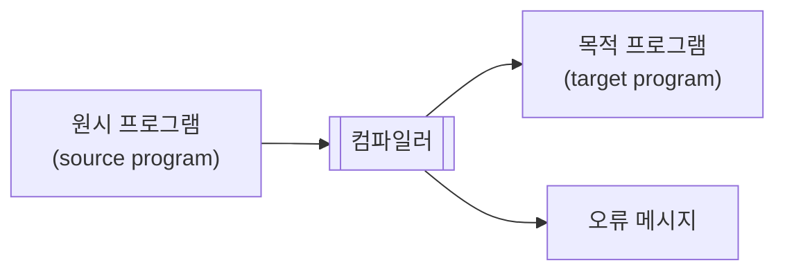
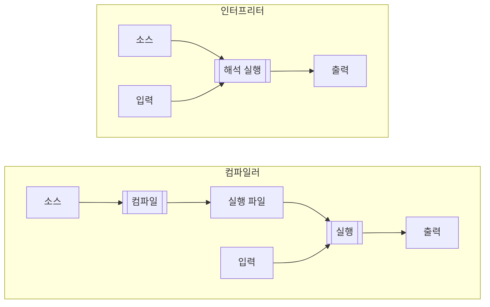
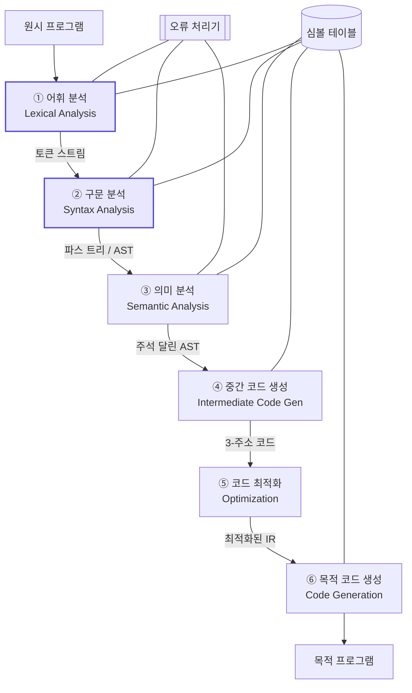
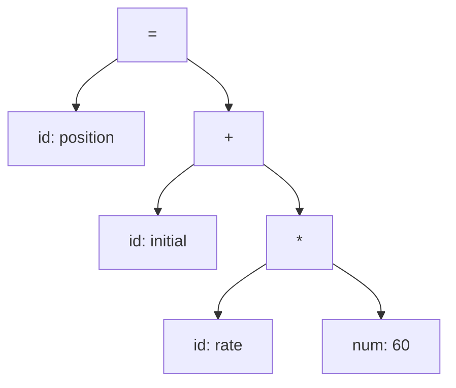
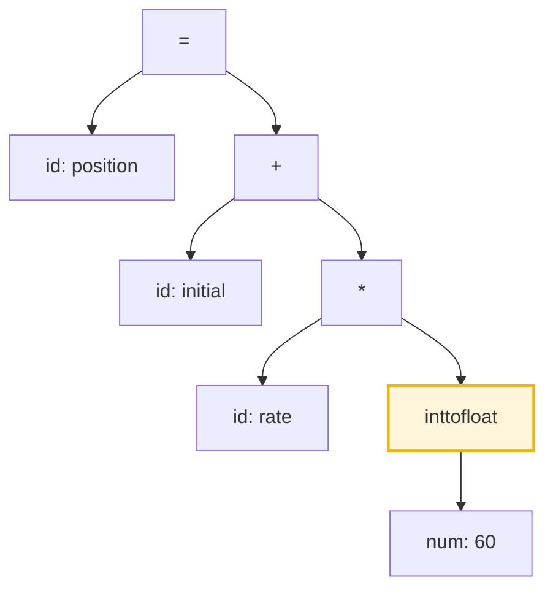
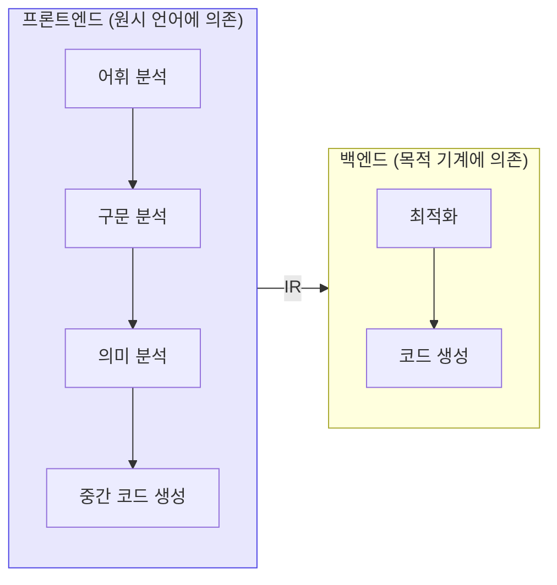
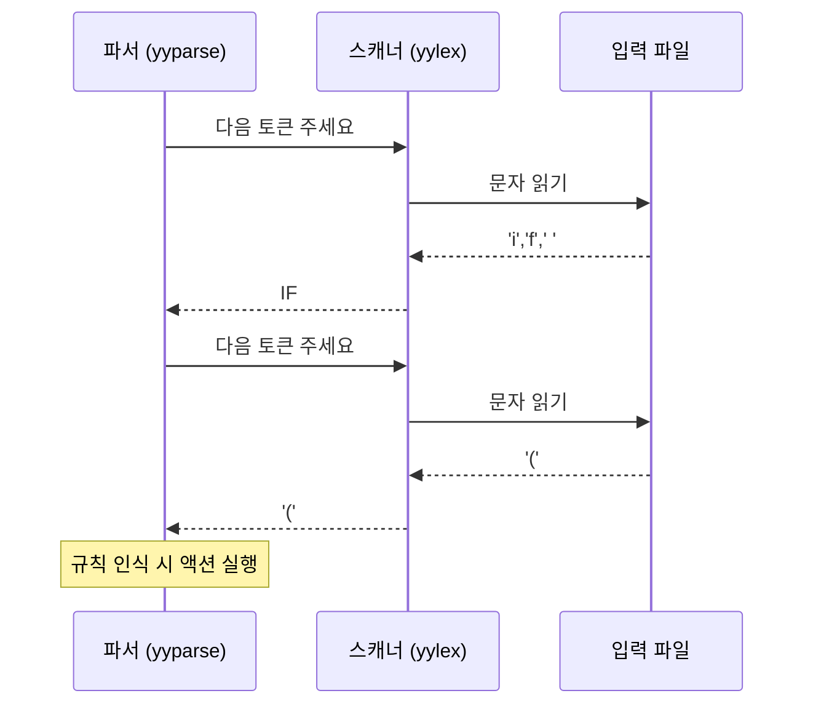
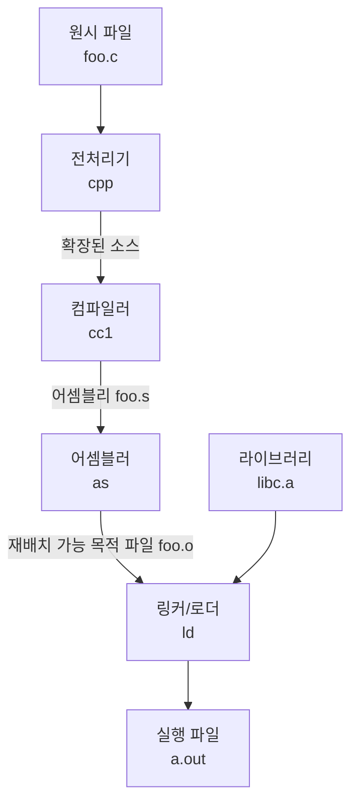

# 1. 컴파일러 개요

## 1.1 컴파일러란 무엇인가

**컴파일러(compiler)** 는 어떤 언어로 쓰인 프로그램을 읽어서
의미가 같은 다른 언어의 프로그램으로 바꿔 주는 프로그램이다.



우리가 다루는 전형적인 경우는 **고급 언어 → 어셈블리어/기계어** 번역이다.
하지만 "언어를 언어로 바꾼다"는 정의는 훨씬 넓다.

| 종류 | 입력 | 출력 | 예 |
|---|---|---|---|
| 전통적 컴파일러 | C, Fortran | 기계어 | GCC, Clang |
| 크로스 컴파일러 | C | 다른 CPU의 기계어 | ARM 타깃 GCC |
| 트랜스파일러 | TypeScript | JavaScript | `tsc` |
| 바이트코드 컴파일러 | Java | JVM 바이트코드 | `javac` |
| JIT 컴파일러 | 바이트코드 | 기계어 (실행 중) | HotSpot, V8 |
| 전처리기 | 매크로 포함 소스 | 순수 소스 | `cpp` |

(**JIT** = Just-In-Time. 프로그램을 **실행하는 도중에** 필요한 부분만 기계어로 번역하는 방식이다.)

이 중 무엇이든 **입력 텍스트의 구조를 파악한다**는 첫 단계는 동일하다.
이 교안이 집중하는 곳이 바로 거기다.

### 인터프리터와의 차이

**인터프리터(interpreter)** 는 목적 프로그램을 만들지 않고
원시 프로그램을 직접 실행한다.



- 컴파일러는 **번역을 한 번**, 실행은 여러 번 → 실행이 빠르다.
- 인터프리터는 **매 실행마다 해석** → 시작이 빠르고 오류 진단이 구체적이다.

실제 시스템은 대개 둘을 섞는다. Java는 `javac`로 바이트코드까지
컴파일한 뒤 JVM이 해석하다가, 뜨거운(hot) 코드만 JIT로 기계어 컴파일한다.

:::info[어휘·구문 분석은 어느 쪽이든 필요하다]
인터프리터도 소스를 읽어 구조를 파악해야 한다.
따라서 이 교안에서 배우는 어휘 분석과 구문 분석은
컴파일러만이 아니라 인터프리터, 린터, 포매터, 정적 분석기,
에디터의 문법 하이라이터, SQL 엔진, 설정 파일 파서 —
**텍스트 형식을 읽는 모든 소프트웨어**의 공통 기반이다.
:::

---

## 1.2 컴파일러의 단계

컴파일 과정은 전통적으로 여섯 단계로 나뉜다.
각 단계는 앞 단계의 출력을 입력으로 받는다.



강조된 ①과 ②가 이 교안의 본체다. 나머지는 전체 그림을 위해 개괄만 한다.

### 하나의 문장을 끝까지 따라가기

다음 한 줄이 각 단계를 통과하며 어떻게 변하는지 보자.

```c
position = initial + rate * 60;
```

#### ① 어휘 분석 (Lexical Analysis)

문자의 나열을 의미 있는 최소 단위인 **토큰(token)** 으로 자른다.
공백과 주석은 여기서 버려진다.

```
⟨id, 1⟩  ⟨=⟩  ⟨id, 2⟩  ⟨+⟩  ⟨id, 3⟩  ⟨*⟩  ⟨num, 60⟩  ⟨;⟩
```

숫자 `1, 2, 3`은 심볼 테이블의 항목을 가리키는 인덱스다.

:::info[심볼 테이블(symbol table)이란]
프로그램에 나오는 **이름**(변수, 함수, 타입 …)과 그 이름에 대해
컴파일러가 알아낸 **정보**를 짝지어 보관하는 자료 구조다.

| 인덱스 | 이름 | 저장하는 정보의 예 |
|---|---|---|
| 1 | `position` | 타입 `float`, 선언 위치 3행, 메모리 오프셋 0 |
| 2 | `initial` | 타입 `float`, 선언 위치 3행, 오프셋 8 |
| 3 | `rate` | 타입 `float`, 선언 위치 3행, 오프셋 16 |

**왜 필요한가.** 토큰 `⟨id, 1⟩` 만 보면 이름이 `position` 이라는 것도,
타입이 `float` 이라는 것도 알 수 없다.
그 정보를 한곳에 모아 두고 **여러 단계가 함께 참조**한다.

| 단계 | 심볼 테이블에 하는 일 |
|---|---|
| 어휘 분석 | 이름을 등록하고 인덱스를 얻는다 |
| 구문 분석 | (선언 구조를 파악해 전달) |
| 의미 분석 | **타입을 기록**하고, 미선언·중복 선언을 잡는다 |
| 코드 생성 | 메모리 위치·레지스터를 배정한다 |

위 그림에서 심볼 테이블이 여섯 단계 전체와 선으로 이어져 있는 이유가 이것이다.

실제 구현은 [19장](/docs/yacc/yacc-grammar-and-actions#194-심볼-테이블)에서
직접 만들어 본다. 지금은 "이름 → 정보 사전" 정도로 알면 충분하다.
:::

이 단계를 수행하는 프로그램을 **어휘 분석기(lexical analyzer)**,
**스캐너(scanner)**, 또는 **토크나이저(tokenizer)** 라 부른다.
[3부의 lex](/docs/lex/lex-overview)가 이것을 자동 생성해 준다.

#### ② 구문 분석 (Syntax Analysis)

토큰 스트림이 언어의 문법에 맞는지 검사하고,
문법 구조를 나타내는 **파스 트리(parse tree)** 또는
**추상 구문 트리(AST, Abstract Syntax Tree)** 를 만든다.



이 트리가 `rate * 60`을 먼저 계산한다는 사실을 담고 있다는 데 주목하자.
연산자 우선순위는 **트리의 모양**으로 표현된다.
이 단계를 수행하는 프로그램이 **파서(parser)** 이고,
[4·5부](/docs/parsing/syntax-analysis)의 주제다.

#### ③ 의미 분석 (Semantic Analysis)

문법적으로 옳아도 의미가 틀릴 수 있다. `x = "hello" + 1;` 은
문법에는 맞지만 타입이 맞지 않는다. 이 단계에서는

- **타입 검사** — 연산자의 피연산자 타입이 적법한가
- **선언 검사** — 사용된 이름이 선언되었는가, 중복 선언은 없는가
- **범위(scope) 해석** — 이 `x`는 어느 `x`인가
- **암묵적 변환 삽입** — 필요하면 형 변환 노드를 끼워 넣는다

를 수행한다. 위 예에서 `position`, `initial`, `rate`가 `float`이고
`60`이 정수라면, 컴파일러는 `inttofloat` 노드를 삽입한다.



#### ④ 중간 코드 생성

기계에 독립적인 중간 표현(IR, Intermediate Representation)을 만든다.
대표적인 형태가 **3-주소 코드(three-address code)** 로,
한 명령에 연산자 하나와 피연산자 최대 셋만 등장한다.

```
t1 = inttofloat(60)
t2 = id3 * t1
t3 = id2 + t2
id1 = t3
```

IR을 두는 이유는 **$m$개 언어 × $n$개 기계 문제**를 풀기 위해서다.
IR이 없으면 $m \times n$개의 번역기가 필요하지만,
IR이 있으면 프론트엔드 $m$개와 백엔드 $n$개, 즉 $m + n$개만 있으면 된다.

#### ⑤ 코드 최적화

의미를 바꾸지 않으면서 더 빠르거나 짧은 코드로 바꾼다.
위 코드에서 `inttofloat(60)`은 컴파일 시점에 계산할 수 있다
(**상수 접기, constant folding**). `t3`는 한 번만 쓰이므로 없앨 수 있다
(**복사 전파 + 죽은 코드 제거**).

```
t1 = id3 * 60.0
id1 = id2 + t1
```

#### ⑥ 목적 코드 생성

IR을 실제 기계 명령으로 바꾸고, 변수에 **레지스터를 할당**한다.

```asm
    LDF   R2, id3
    MULF  R2, R2, #60.0
    LDF   R1, id2
    ADDF  R1, R1, R2
    STF   id1, R1
```

---

## 1.3 프론트엔드와 백엔드

여섯 단계는 관례적으로 둘로 나뉜다.



- **프론트엔드**는 *어떤 언어를 읽는가*에만 의존한다.
- **백엔드**는 *어떤 기계를 위한 코드를 뽑는가*에만 의존한다.

이 분리 덕분에 LLVM 같은 인프라가 가능해진다.
Clang(C/C++), Rust, Swift는 서로 다른 프론트엔드지만
모두 LLVM IR을 뱉고, 하나의 백엔드 집합이 x86·ARM·RISC-V를 감당한다.

:::note[MLIR — 여러 층의 IR]
최근에는 IR을 한 층이 아니라 **여러 추상화 수준의 층**으로 두는 접근이
자리 잡았다. LLVM 프로젝트의 MLIR이 대표적으로,
도메인별 **dialect(방언)** 를 정의하고 dialect 사이의 표준 변환을 거쳐
점진적으로 LLVM IR까지 내려간다(lowering).
자세한 내용은 6부에서 다룬다.
:::

### 패스(pass)와 단계(phase)

**단계(phase)** 는 논리적 구분이고, **패스(pass)** 는 실제로 입력을
처음부터 끝까지 훑는 횟수다. 여러 단계를 한 패스에 몰아넣을 수 있다.

- **1-패스 컴파일러** — 파서가 토큰을 요청하면 스캐너가 그때그때 하나씩
  건네주고, 파서는 규칙을 인식할 때마다 즉시 코드를 뱉는다.
  Pascal이 이렇게 설계되었다. 빠르지만 최적화가 거의 불가능하다.
- **다중 패스 컴파일러** — AST 전체를 만든 뒤 여러 번 순회한다.
  최적화가 가능하고 전방 참조(forward reference)를 자연스럽게 처리한다.

우리가 만들 lex + yacc 조합은 **파서가 주도권을 쥐는 1-패스 구조**다.
`yyparse()`가 토큰이 필요할 때마다 `yylex()`를 호출한다.



---

## 1.4 컴파일러를 둘러싼 도구들

컴파일러 혼자 실행 파일을 만드는 것은 아니다.



| 도구 | 역할 |
|---|---|
| 전처리기 | 매크로 확장, `#include` 삽입, 조건부 컴파일 |
| 컴파일러 | 고급 언어 → 어셈블리 |
| 어셈블러 | 어셈블리 → 재배치 가능 기계어 |
| 링커 | 여러 목적 파일과 라이브러리를 하나로 결합, 주소 해결 |
| 로더 | 실행 시점에 메모리에 적재하고 최종 주소 확정 |

`gcc`는 이 전부를 순서대로 호출해 주는 **드라이버**다.
`gcc -E`, `-S`, `-c` 옵션으로 중간에서 멈출 수 있으니 직접 확인해 보자.

```bash
gcc -E hello.c -o hello.i   # 전처리까지
gcc -S hello.c -o hello.s   # 컴파일까지 (어셈블리 확인)
gcc -c hello.c -o hello.o   # 어셈블까지
gcc    hello.c -o hello     # 링크까지
```

---

## 1.5 컴파일러는 무엇으로 만드나 — 부트스트랩

여기서 자연스러운 의문 하나가 생긴다.

> C 컴파일러는 C로 짜여 있다.
> 그러면 **그 C 컴파일러는 무엇으로 컴파일했나?**

닭이 먼저냐 달걀이 먼저냐처럼 들리지만, 답은 명확하다.
**맨 처음 한 번만 다른 방법으로 만들고, 그다음부터는 자기 자신을 쓴다.**
이것을 **부트스트랩(bootstrapping)** 이라 한다.

### T-다이어그램

컴파일러를 이야기할 때는 **세 가지 언어**가 동시에 등장한다.

| | 뜻 | 예 |
|---|---|---|
| **원시 언어** (source) | 무엇을 읽는가 | C |
| **목적 언어** (target) | 무엇을 뱉는가 | x86 기계어 |
| **구현 언어** (implementation) | 컴파일러 자신이 무슨 언어로 쓰였나 | C |

셋이 헷갈리기 쉬워서, 1960년대부터 **T-다이어그램**이라는 그림을 쓴다.
T자 모양에 세 언어를 배치한 것이다.

```
        원시 언어 │ 목적 언어
        ─────────┼──────────
             구현 언어
```

`C → x86` 컴파일러를 C로 쓴 것은 이렇게 그린다.

```
           C │ x86
        ─────┼──────
             C
```

:::note[읽는 법]
**위 칸의 왼쪽을 읽어서 오른쪽으로 바꾸는 프로그램**이고,
**아래 칸의 언어로 쓰여 있다**는 뜻이다.

아래 칸이 중요한 이유는 간단하다.
아래 칸의 언어를 실행할 수단이 없으면 **이 컴파일러 자체를 돌릴 수 없다.**
:::

### 세 걸음으로 자기 자신에 도달하기

새 언어 **L** 을 만들고, L 컴파일러를 L 로 쓰고 싶다고 하자.

**1단계 — 최소한의 컴파일러를 다른 언어로 쓴다.**

L 의 아주 작은 부분집합 $L_0$ 만 처리하는 컴파일러를 C로 짠다.
느리고 최적화도 없지만 상관없다. 한 번만 쓸 것이다.

```
          L₀ │ x86
        ─────┼──────          ← C 컴파일러로 컴파일해서 실행 파일을 얻는다
              C
```

**2단계 — L 컴파일러를 $L_0$ 로 쓴다.**

이제 $L_0$ 를 돌릴 수 있으므로, L 전체를 처리하는 컴파일러를
$L_0$ 의 문법만 써서 작성한다. 1단계 컴파일러로 이것을 컴파일한다.

```
          L │ x86
        ────┼──────
            L₀
```

결과물은 **L 전체를 읽는 x86 실행 파일**이다.

**3단계 — L 컴파일러를 L 로 다시 쓴다.**

이제 L 전체를 쓸 수 있으므로, 컴파일러를 L 의 좋은 기능을 다 써서 다시 짠다.
2단계에서 얻은 실행 파일로 컴파일한다.

```
          L │ x86
        ────┼──────          ← 여기서부터 자기 자신으로 컴파일된다
             L
```

**이후로는 1단계와 2단계가 필요 없다.**
새 버전의 컴파일러는 항상 이전 버전으로 컴파일하면 된다.

:::tip[실제 사례]
- **GCC** — 처음에는 C로 짜였고, 2012년 이후 C++로 옮겼다.
  그래서 GCC를 빌드하려면 **먼저 C++ 컴파일러가 필요하다.**
- **Rust** — 최초 컴파일러(`rustboot`)는 OCaml로 짜였다.
  자기 자신을 컴파일할 수 있게 되자 OCaml 버전은 버려졌다.
- **Go** — 1.4까지 C로, 1.5부터 Go로 쓰였다.
  그래서 지금도 Go를 소스에서 빌드하려면 Go 1.4 바이너리가 필요할 수 있다.
:::

### 3단계 컴파일 — 자기 자신을 검증하는 방법

컴파일러 프로젝트에는 재미있는 자체 검사가 있다.

| 단계 | 무엇으로 컴파일 | 결과물 |
|---|---|---|
| **stage1** | 시스템에 이미 있는 컴파일러 | 컴파일러 A |
| **stage2** | 컴파일러 A | 컴파일러 B |
| **stage3** | 컴파일러 B | 컴파일러 C |

**B와 C는 바이트 단위로 같아야 한다.**

같은 소스를, 같은 동작을 하는 컴파일러 둘(A로 만든 B, B로 만든 C)이
컴파일했으므로 결과가 달라질 이유가 없다.
다르다면 컴파일러 어딘가에 버그가 있다는 뜻이다.

GCC의 `make bootstrap` 이 하는 일이 정확히 이것이다.

### 크로스 컴파일 — 그 기계에서 돌릴 수 없을 때

새 CPU가 나왔다고 하자. 그 CPU에는 아직 컴파일러가 없다.
그 위에서 컴파일러를 컴파일할 수도 없다.

그래서 **x86에서 실행되면서 ARM 기계어를 뱉는** 컴파일러를 만든다.
이것이 **크로스 컴파일러**다.

```
        C │ ARM
        ──┼──────          ← x86에서 실행된다 (구현 언어가 x86용으로 컴파일됨)
          C
```

이 컴파일러로 "ARM에서 실행되면서 ARM 기계어를 뱉는" 컴파일러를 만들면,
그때부터는 ARM 기계 위에서 자립할 수 있다.
이 넘어가는 순간을 **셀프 호스팅(self-hosting)** 이라고 한다.

:::caution[신뢰의 문제 — Thompson의 경고]
1984년 Ken Thompson은 튜링상 수상 강연
"Reflections on Trusting Trust"에서 섬뜩한 지적을 했다.

컴파일러에 **"로그인 프로그램을 컴파일할 때는 백도어를 심어라"** 는 코드와
**"컴파일러 자신을 컴파일할 때는 이 두 규칙을 다시 심어라"** 는 코드를 넣고,
한 번 부트스트랩한 뒤 **소스에서 그 코드를 지운다.**

소스는 깨끗하다. 그런데 컴파일러 바이너리는 계속 백도어를 심는다.
소스를 아무리 읽어도 찾을 수 없다.

이것이 부트스트랩의 그늘이다.
오늘날 **재현 가능한 빌드(reproducible build)** 와
[검증된 컴파일러](/docs/modern/trends)가 연구되는 이유이기도 하다.
:::

---

## 1.6 우리가 만들 것의 위치

이 교안에서 만들 프론트엔드는 다음 범위를 차지한다.


즉 **소스 텍스트에서 3-주소 코드까지** 온전히 만든다.
그 뒤 레지스터 할당과 명령 선택은 다루지 않는다.

---

## 1.7 왜 어휘 분석과 구문 분석을 나누는가

이론적으로는 하나로 합칠 수 있다. 실제로 나누는 이유는 셋이다.

**1. 설계가 단순해진다.**
공백과 주석 처리를 스캐너가 흡수해 주면,
파서의 문법에서 "여기에 공백이 올 수 있다"를 쓰지 않아도 된다.
문법이 극적으로 짧아진다.

**2. 효율이 좋다.**
어휘 분석은 입력 문자의 대부분을 처리하는 단계다.
정규 표현 → DFA라는 단순하고 빠른 기계로 처리할 수 있으므로,
여기에 특화된 최적화(버퍼링, 테이블 압축)를 몰아넣을 수 있다.

**3. 이식성이 올라간다.**
문자 집합, 개행 문자, 인코딩 같은 플랫폼 차이를
스캐너 한 곳에 가둘 수 있다.

**핵심적인 이론적 이유**도 있다.
토큰의 구조는 대부분 **정규언어**로 충분히 표현되지만
(식별자, 정수, 문자열 리터럴...),
프로그램의 중첩 구조는 정규언어로 표현할 수 **없다**.
괄호의 짝을 맞추려면 세는 능력이 필요한데 유한 오토마타에는
유한한 상태밖에 없기 때문이다. 이 사실은
[2부 정규언어](/docs/regular/regular-languages)에서 펌핑 보조정리로 증명한다.

> **표현력이 딱 필요한 만큼인 도구를 각 단계에 배치한다** —
> 이것이 컴파일러 프론트엔드 설계의 핵심 원리다.

---

## 요약

- 컴파일러는 원시 프로그램을 의미가 같은 목적 프로그램으로 번역한다.
- 여섯 단계: 어휘 분석 → 구문 분석 → 의미 분석 → 중간 코드 생성 →
  최적화 → 목적 코드 생성.
- 프론트엔드(언어 의존)와 백엔드(기계 의존)를 IR로 분리하면
  $m \times n$ 문제가 $m + n$ 문제가 된다.
- 심볼 테이블과 오류 처리기는 모든 단계를 가로지른다.
- 어휘 분석과 구문 분석을 나누는 이유는 단순함·효율·이식성이며,
  근본적으로는 **정규언어와 문맥 자유 언어의 표현력 차이** 때문이다.

## 확인 문제

1. 트랜스파일러(TypeScript → JavaScript)는 컴파일러의 여섯 단계 중
   어디까지 수행한다고 볼 수 있는가?

<details>
<summary>풀이</summary>

**①~⑤ 를 하고, ⑥ 대신 "고급 언어 출력"을 한다.**

| 단계 | 트랜스파일러가 하는가 |
|---|---|
| ① 어휘 분석 | ✅ TypeScript 토큰으로 자른다 |
| ② 구문 분석 | ✅ AST를 만든다 |
| ③ 의미 분석 | ✅ **타입 검사가 핵심 기능**이다 |
| ④ 중간 코드 생성 | ✅ 내부 IR을 만든다 |
| ⑤ 최적화 | 일부 (죽은 코드 제거 등) |
| ⑥ 목적 코드 생성 | ❌ 기계어 대신 **JavaScript 텍스트**를 뱉는다 |

핵심은 ⑥의 "목적 언어"가 기계어일 필요가 없다는 것이다.
[1.1절의 정의](#11-컴파일러란-무엇인가)가
"언어를 언어로 바꾼다"였음을 떠올리자.

덧붙여 `tsc`는 타입을 **지우기만** 하고 최적화는 거의 하지 않는다.
"타입 검사기 + 타입 지우개"에 가깝다.

</details>

2. `gcc -S`로 간단한 C 프로그램의 어셈블리를 뽑아 보고,
   `-O0`과 `-O2`의 결과를 비교해 보라. 어떤 최적화가 적용되었는가?

<details>
<summary>풀이</summary>

```c title="t.c"
int f(void) { int a = 2, b = 3; return a * b + a; }
```

```bash
gcc -O0 -S t.c -o -   # 최적화 없음
gcc -O2 -S t.c -o -   # 최적화
```

**`-O0`** — 변수를 전부 스택에 두고, 소스에 적힌 순서대로 계산한다.
`a`, `b` 를 메모리에 저장했다가 다시 읽는 명령이 그대로 나온다.

**`-O2`** — 함수 전체가 `movl $8, %eax` **한 줄**로 줄어든다.

적용된 최적화:

| 최적화 | 하는 일 |
|---|---|
| **상수 전파** | `a` → `2`, `b` → `3` 으로 치환 |
| **상수 접기** | `2 * 3 + 2` 를 컴파일 시점에 `8` 로 계산 |
| **죽은 코드 제거** | `a`, `b` 대입이 쓰이지 않으므로 삭제 |
| **레지스터 할당** | 스택 대신 `%eax` 사용 |

`-O0` 이 느린 코드를 내는 이유는 게을러서가 아니라
**디버거가 각 변수를 메모리에서 찾을 수 있게** 하기 위해서다.
최적화하면 변수가 사라지거나 레지스터로 옮겨져 디버깅이 어려워진다.

</details>

3. 아래 문장에서 어휘 분석이 만들어 낼 토큰 스트림을 적어 보라.
   ```c
   while (i <= n) sum += a[i++];  /* 누적 */
   ```

<details>
<summary>풀이</summary>

```
⟨while⟩ ⟨(⟩ ⟨id, i⟩ ⟨<=⟩ ⟨id, n⟩ ⟨)⟩
⟨id, sum⟩ ⟨+=⟩ ⟨id, a⟩ ⟨[⟩ ⟨id, i⟩ ⟨++⟩ ⟨]⟩ ⟨;⟩
```

토큰 **15개**다. 확인할 점 셋:

1. **주석 `/* 누적 */` 은 토큰이 아니다.** 어휘 분석 단계에서 버려진다.
   공백도 마찬가지다.
2. **`<=` 는 토큰 하나**다. `<` 와 `=` 둘이 아니다.
   [8장의 최장 일치](/docs/lex/lex-input-and-parsing#최장-일치) 때문이다.
   `+=`, `++` 도 같다.
3. **`while` 은 `id` 가 아니라 예약어 토큰**이다.
   패턴상 식별자에도 맞지만 예약어 규칙이 이긴다
   ([8장 규칙 우선순위](/docs/lex/lex-input-and-parsing#규칙-우선순위)).

실제로 확인해 보려면:

```bash
cd examples/02-lex-tokenizer && make
echo 'while (i <= n) sum += a[i++];  /* 누적 */' | ./tokenizer
```

</details>

4. 어휘 분석과 구문 분석을 하나로 합친다면 문법이 어떻게 지저분해지는지,
   `if (x) y = 1;` 을 예로 들어 설명해 보라.

<details>
<summary>풀이</summary>

**지금(분리했을 때)의 문법**

```
stmt : IF '(' expr ')' stmt
     | ID '=' expr ';'
     ;
```

읽으면 바로 의미가 보인다.

**합쳤을 때** — 문법의 터미널이 **토큰이 아니라 문자**가 된다.
그러면 두 가지를 문법이 직접 감당해야 한다.

**① 토큰을 문자로 풀어써야 한다**

```
stmt : 'i' 'f' ws '(' ws expr ws ')' ws stmt
     | id ws '=' ws expr ws ';'
     ;
id   : letter | id letter | id digit ;
letter : 'a' | 'b' | 'c' | … | 'z' | 'A' | … ;   ← 52개 대안
digit  : '0' | '1' | … | '9' ;
```

**② 공백이 올 수 있는 모든 자리에 `ws` 를 끼워야 한다**

```
ws : /* 없음 */ | ws ' ' | ws '\t' | ws '\n' | ws comment ;
comment : '/' '*' anychars '*' '/' ;
```

토큰 사이마다 `ws` 가 붙으므로 규칙의 우변이 **두 배 이상** 길어진다.

**세 가지 구체적 피해**

| 문제 | 설명 |
|---|---|
| 문법 크기 | 규칙 수십 개 → 수백 개 |
| 파싱 표 크기 | 터미널이 토큰 ~50개 → 문자 128개. 상태도 폭증 |
| **모호성** | `ws` 를 여러 자리에 넣을 수 있어 파스 트리가 여럿 생긴다 |

세 번째가 특히 치명적이다. `if (x)` 의 공백 하나를
"`if` 뒤의 `ws`"로 볼 수도, "`(` 앞의 `ws`"로 볼 수도 있어
문법이 **모호해진다**.

이것이 [1.7절](#17-왜-어휘-분석과-구문-분석을-나누는가)에서 말한
"설계가 단순해진다"의 실체다.

</details>

8. 어떤 팀이 새 언어 **Zig-like** 의 컴파일러를 파이썬으로 짰다.
   이제 이 컴파일러를 그 언어 자신으로 다시 쓰려고 한다.
   필요한 단계를 T-다이어그램으로 그리고, 파이썬 버전을 언제 버릴 수 있는지 설명하라.

<details>
<summary>풀이</summary>

**1단계 — 지금 가진 것**

```
       Z │ x86
       ──┼──────
        Python
```

파이썬으로 쓰였으므로 **파이썬 인터프리터가 있어야 돌아간다.**
느리지만 Z 소스를 x86 실행 파일로 바꿔 주기는 한다.

**2단계 — 컴파일러를 Z 로 다시 쓴다**

Z 로 작성한 컴파일러 소스 `zc.z` 를 1단계 컴파일러에 먹인다.

```
   zc.z  ──[1단계 컴파일러]──▶  zc (x86 실행 파일)
```

결과물의 T-다이어그램은 이렇다.

```
       Z │ x86
       ──┼──────
         x86
```

**아래 칸이 `x86` 으로 바뀐 것이 핵심이다.**
이제 파이썬 없이 그냥 실행할 수 있다.

**3단계 — 검증**

같은 `zc.z` 를 2단계에서 얻은 `zc` 로 다시 컴파일한다.

```
   zc.z  ──[zc]──▶  zc'
```

`zc` 와 `zc'` 는 **바이트 단위로 같아야 한다.**
둘 다 같은 소스를 같은 의미로 번역했기 때문이다.
다르면 컴파일러에 버그가 있다.

**파이썬 버전을 버릴 수 있는 시점**

2단계가 끝나고 `zc` 가 자기 자신을 컴파일할 수 있음을
3단계로 확인한 뒤다.

다만 실무에서는 **한동안 남겨 둔다.** 이유는 두 가지다.

- 새 플랫폼으로 옮길 때(크로스 컴파일이 안 되는 상황) 다시 필요할 수 있다
- `zc` 바이너리를 잃어버리면 소스만으로는 복구할 방법이 없다

이 "바이너리 없이는 못 만든다"는 성질이
[Thompson의 신뢰 문제](#15-컴파일러는-무엇으로-만드나--부트스트랩)의 뿌리이기도 하다.

</details>

---

다음 문서에서는 이 모든 것의 형식적 토대인 **언어와 문법**을 정의한다.
