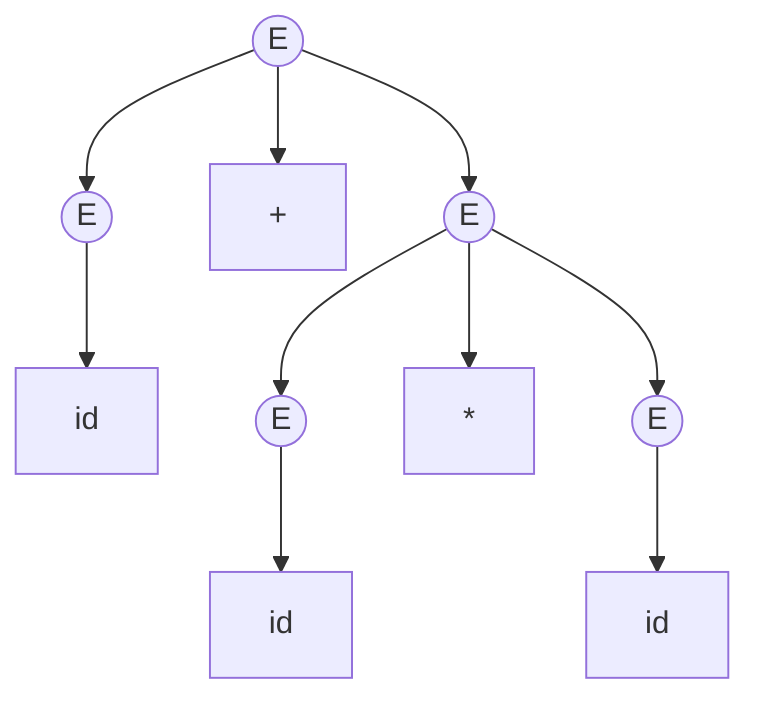
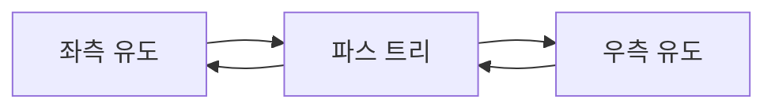
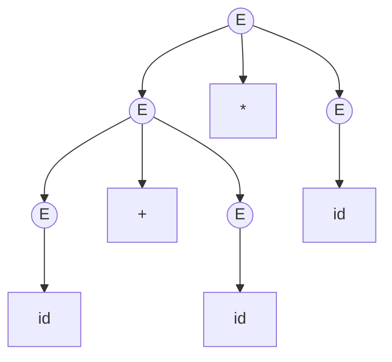
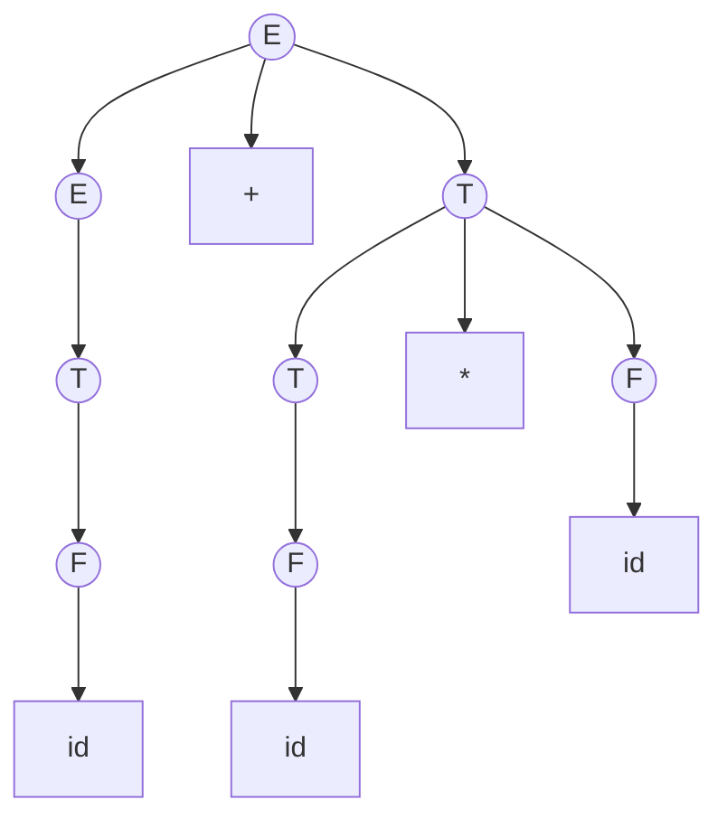
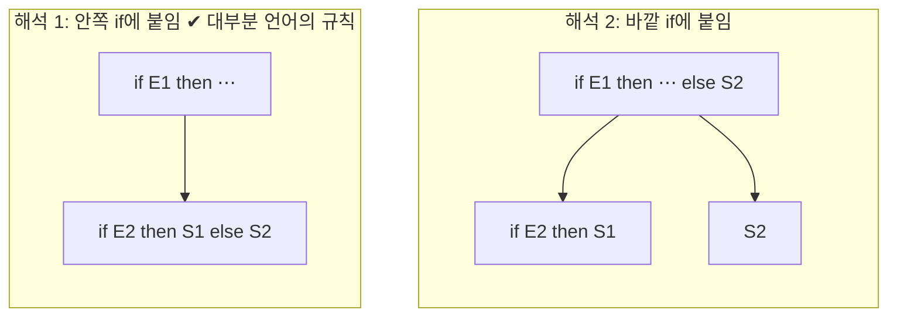
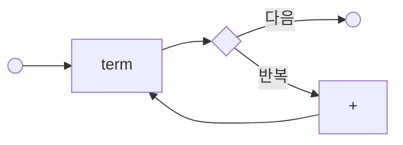
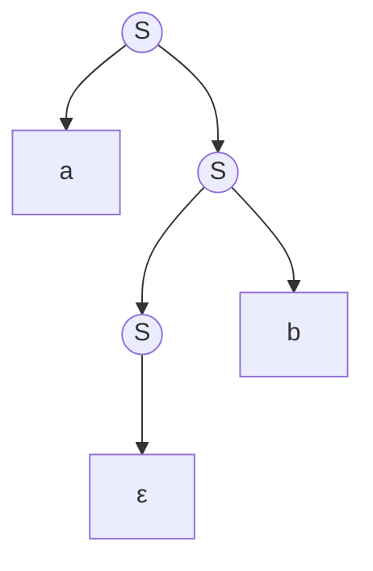
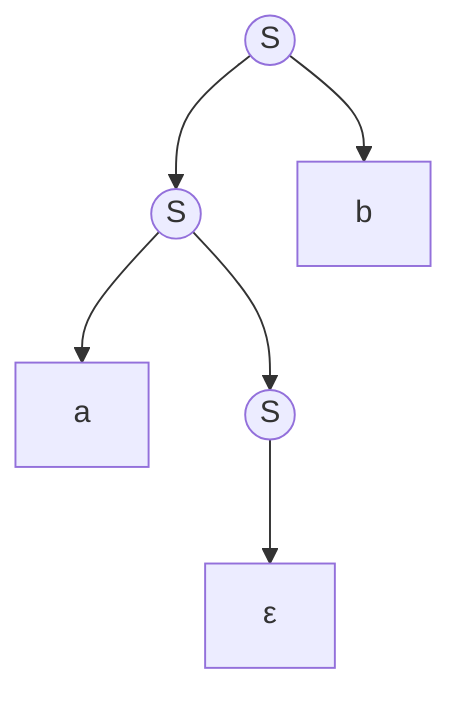
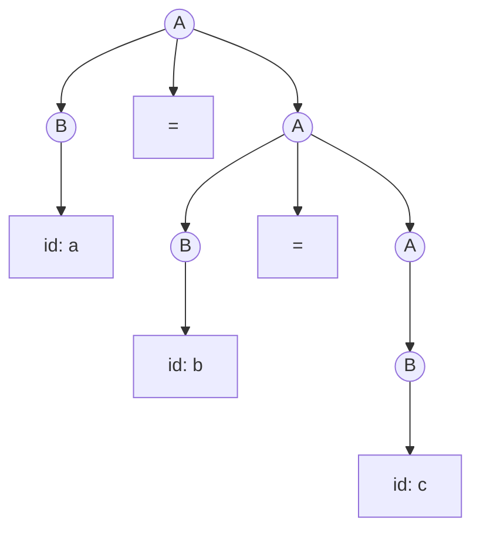

# 2. 언어와 문법

컴파일러는 결국 "이 문자열이 이 언어에 속하는가"를 판정하고,
속한다면 그 구조를 밝히는 프로그램이다.
그러려면 **언어**와 **문법**을 수학적으로 정의해야 한다.
이 장에서 세우는 도구는 교안 끝까지 계속 쓰인다.

---

## 2.1 알파벳, 스트링, 언어

### 알파벳

**알파벳(alphabet)** $\Sigma$ 는 공집합이 아닌 **유한한 기호(symbol)의 집합**이다.

$$
\Sigma_1 = \{0, 1\} \qquad
\Sigma_2 = \{a, b, c\} \qquad
\Sigma_3 = \text{ASCII 문자 128개}
$$

컴파일러에서 알파벳은 문맥에 따라 두 가지다.

- **어휘 분석기**에게 알파벳은 **문자**의 집합 (`a`, `b`, `0`, `+`, ...)
- **구문 분석기**에게 알파벳은 **토큰**의 집합 (`ID`, `NUM`, `IF`, `+`, ...)

같은 이론을 두 층위에 각각 적용하는 것이다.

### 스트링

**스트링(string)** 또는 **문장(sentence)** 은 알파벳의 기호를 유한 번
나열한 것이다. $\Sigma = \{a, b\}$ 일 때 `a`, `ab`, `bba` 는 모두 스트링이다.

- **길이** $|w|$ — $w$ 안의 기호 개수. $|bba| = 3$.
- **공 스트링** $\varepsilon$ — 길이가 0인 스트링. $|\varepsilon| = 0$.

:::note[이 교안의 표기 약속 — 스트링과 문자열]
둘 다 나오는데 가리키는 것이 조금 다르다.

| 말 | 무엇 |
|---|---|
| **스트링** | 이론에서 다루는 **형식적 대상**. $\Sigma^*$ 의 원소 |
| **문자열** | 프로그램 안의 실제 데이터. C의 `char *`, 소스의 `"hello"` |

`yytext` 가 담고 있는 것은 문자열이고,
그것이 나타내는 이론적 대상이 스트링이다.
같은 것을 두 층에서 부르는 이름이라고 보면 된다.
:::

:::caution[$\varepsilon$ 과 $\{\varepsilon\}$ 과 $\emptyset$ 은 모두 다르다]
- $\varepsilon$ — 하나의 **스트링** (길이 0)
- $\{\varepsilon\}$ — 원소가 하나인 **언어** (그 원소가 공 스트링)
- $\emptyset$ — 원소가 없는 **언어**

$|\{\varepsilon\}| = 1$ 이지만 $|\emptyset| = 0$ 이다.
이 구별을 놓치면 정규 표현의 항등식을 이해할 수 없다.
:::

### 스트링 연산

**접합(concatenation)** — 두 스트링을 이어 붙인다. $x = ab$, $y = ba$ 이면 $xy = abba$.

- 결합법칙 성립: $(xy)z = x(yz)$
- 항등원은 $\varepsilon$: $\varepsilon w = w \varepsilon = w$
- 교환법칙은 **성립하지 않음**: $xy \neq yx$ 일반적으로

**거듭제곱** — $w^0 = \varepsilon$, $w^n = w^{n-1}w$.
$(ab)^3 = ababab$.

**부분 스트링 관련 용어** — $w = xyz$ 일 때

| 이름 | 정의 | `banana`의 예 |
|---|---|---|
| 접두사(prefix) | $x$ | `ε, b, ba, ban, …, banana` |
| 접미사(suffix) | $z$ | `ε, a, na, ana, …, banana` |
| 부분 스트링(substring) | $y$ | `nan`, `ana`, … |
| 진부분(proper) | 자기 자신과 $\varepsilon$ 제외 | `ba`는 진접두사 |
| 부분 열(subsequence) | 순서를 지키며 골라낸 기호들 | `bnn`, `aaa` |

**역(reversal)** $w^R$ — 뒤집은 스트링. $(abc)^R = cba$.

### 언어

**언어(language)** $L$ 은 $\Sigma^*$ 의 **임의의 부분집합**이다.

여기서 $\Sigma^*$ 는 $\Sigma$ 위의 모든 스트링의 집합이다.
$\Sigma = \{a, b\}$ 이면

$$
\Sigma^* = \{\varepsilon,\; a,\; b,\; aa,\; ab,\; ba,\; bb,\; aaa,\; \dots\}
$$

$\Sigma^+ = \Sigma^* - \{\varepsilon\}$ 로 정의한다 (공 스트링 제외).

:::info["언어"의 정의가 이렇게 느슨한 이유]
"의미"에 대해서는 아무 말도 하지 않는다는 데 주목하자.
언어는 그냥 **문자열의 집합**이다.
이 느슨함 덕분에 다음이 모두 "언어"로 취급된다.
- $\emptyset$ — 공언어
- $\{\varepsilon\}$ — 공 스트링만 있는 언어
- 문법적으로 옳은 모든 C 프로그램의 집합
- 십진 정수 리터럴의 집합

컴파일러의 질문 "이 입력이 올바른 프로그램인가?"는
"이 스트링이 이 언어의 원소인가?"라는 **소속 판정 문제(membership problem)** 가 된다.
:::

### 언어 연산

$L$ 과 $M$ 이 언어일 때,

| 연산 | 표기 | 정의 |
|---|---|---|
| 합집합 | $L \cup M$ | $\{w \mid w \in L \text{ 또는 } w \in M\}$ |
| 접합 | $LM$ | $\{xy \mid x \in L,\; y \in M\}$ |
| 거듭제곱 | $L^n$ | $L^0 = \{\varepsilon\}$, $L^n = L^{n-1}L$ |
| 클레이니 클로저 | $L^*$ | $\bigcup_{i=0}^{\infty} L^i$ |
| 양의 클로저 | $L^+$ | $\bigcup_{i=1}^{\infty} L^i$ |

**예제.** $L = \{a, ab\}$, $M = \{b, \varepsilon\}$ 일 때

- $L \cup M = \{a, ab, b, \varepsilon\}$
- $LM = \{ab, a, abb, ab\} = \{a, ab, abb\}$ — 집합이므로 중복은 하나로
- $L^0 = \{\varepsilon\}$, $L^1 = \{a, ab\}$, $L^2 = \{aa, aab, aba, abab\}$
- $L^* = \{\varepsilon, a, ab, aa, aab, aba, abab, \dots\}$

:::tip[클로저의 직관]
$L^*$ 는 "$L$의 원소를 **0개 이상** 이어 붙여 만들 수 있는 모든 것"이다.
0개를 이어 붙이면 $\varepsilon$ 이므로 $\varepsilon \in L^*$ 는 항상 참이다.
심지어 $\emptyset^* = \{\varepsilon\}$ 이다 — 아무것도 안 고르는 방법이 하나 있으니까.
:::

**연습.** $\Sigma = \{a, b\}$ 일 때 다음을 언어 연산으로 표현해 보라.
1. $a$로 시작하는 모든 스트링 → $\{a\}\Sigma^*$
2. 길이가 짝수인 모든 스트링 → $(\Sigma\Sigma)^*$
3. `ab`를 부분 스트링으로 포함하는 스트링 → $\Sigma^*\{ab\}\Sigma^*$

---

## 2.2 문법

언어는 무한 집합인 경우가 대부분이다.
`{모든 올바른 C 프로그램}` 을 원소를 나열해서 정의할 수는 없다.
**유한한 규칙으로 무한한 언어를 기술**하는 장치가 문법이다.

### 형식적 정의

**문법(grammar)** 은 네 쌍 $G = (V_N, V_T, P, S)$ 이다.

| 요소 | 이름 | 설명 |
|---|---|---|
| $V_N$ | 넌터미널(nonterminal) | 문법 변수. 구문 구조의 이름. 대문자로 쓴다 |
| $V_T$ | 터미널(terminal) | 실제 언어의 기호. 소문자·기호로 쓴다 |
| $P$ | 생성 규칙(production) | $\alpha \to \beta$ 형태의 유한 집합 |
| $S$ | 시작 심볼(start symbol) | $S \in V_N$. 유도의 출발점 |

$V_N \cap V_T = \emptyset$ 이고, 둘의 합집합 $V = V_N \cup V_T$ 를
**문법 심볼(grammar symbol)** 이라 한다.

생성 규칙 $\alpha \to \beta$ 는 "$\alpha$ 를 $\beta$ 로 바꿔 쓸 수 있다"로 읽는다.
$\alpha$ 에 넌터미널이 적어도 하나 있어야 한다.

### 첫 예제

$$
G_1: \quad
\begin{aligned}
S &\to aSb \\
S &\to \varepsilon
\end{aligned}
$$

여기서 $V_N = \{S\}$, $V_T = \{a, b\}$, 시작 심볼은 $S$ 다.
같은 좌변의 규칙은 `|` 로 묶어 $S \to aSb \mid \varepsilon$ 로 줄여 쓴다.

이 문법이 만들어 내는 언어는 무엇일까?
$S$ 에서 시작해 규칙을 반복 적용해 보자.

```
S ⇒ aSb ⇒ aaSbb ⇒ aaaSbbb ⇒ aaabbb
```

$a$ 를 $n$ 번 쓰면 $b$ 도 정확히 $n$ 번 나온다. 따라서

$$
L(G_1) = \{a^n b^n \mid n \geq 0\}
$$

:::note[이 언어를 기억해 두자]
$\{a^n b^n\}$ 은 **정규언어가 아니다**.
유한 오토마타는 $a$를 몇 개 봤는지 세어 둘 수 없기 때문이다.
[정규언어](/docs/regular/regular-languages) 장에서 이를 펌핑 보조정리로 증명하고,
[문맥 자유 문법](/docs/parsing/context-free-grammar) 장에서
"괄호 짝 맞추기"가 왜 파서의 일이고 스캐너의 일이 아닌지 설명한다.
:::

### 유도

$\gamma_1 A \gamma_2$ 에서 규칙 $A \to \beta$ 를 적용해
$\gamma_1 \beta \gamma_2$ 를 얻는 것을 **직접 유도**라 하고 $\Rightarrow$ 로 쓴다.

$$
\gamma_1 A \gamma_2 \Rightarrow \gamma_1 \beta \gamma_2
$$

- $\Rightarrow^+$ — 1번 이상의 유도
- $\Rightarrow^*$ — 0번 이상의 유도 (즉 $\alpha \Rightarrow^* \alpha$ 는 항상 참)

**문장 형태(sentential form)** — $S \Rightarrow^* \alpha$ 인 $\alpha$.
터미널과 넌터미널이 섞여 있을 수 있다.
**문장(sentence)** — 터미널만으로 이루어진 문장 형태.

문법 $G$가 생성하는 언어는

$$
L(G) = \{ w \in V_T^* \mid S \Rightarrow^* w \}
$$

### 좌측 유도와 우측 유도

한 문장 형태에 넌터미널이 여러 개면 어느 것을 먼저 전개할지 선택해야 한다.

- **좌측 유도(leftmost derivation)** $\Rightarrow_{lm}$ — 항상 **가장 왼쪽** 넌터미널을 전개
- **우측 유도(rightmost derivation)** $\Rightarrow_{rm}$ — 항상 **가장 오른쪽** 넌터미널을 전개

다음 문법으로 `id + id * id` 를 유도해 보자.

$$
G_2: \quad E \to E + E \mid E * E \mid ( E ) \mid \mathbf{id}
$$

**좌측 유도**

```
E ⇒lm E + E
  ⇒lm id + E
  ⇒lm id + E * E
  ⇒lm id + id * E
  ⇒lm id + id * id
```

**우측 유도**

```
E ⇒rm E + E
  ⇒rm E + E * E
  ⇒rm E + E * id
  ⇒rm E + id * id
  ⇒rm id + id * id
```

두 유도의 **단계 순서는 다르지만 결과 트리는 같다.**

:::info[왜 이 구별이 중요한가]
- **하향식 파서**(LL, 재귀 하강)는 **좌측 유도**를 왼쪽에서 오른쪽으로 재현한다.
- **상향식 파서**(LR)는 **우측 유도를 거꾸로** 재현한다(reverse rightmost derivation).

즉 4부에서 배울 두 파싱 전략은 이 두 유도 방식에 정확히 대응한다.
:::

---

## 2.3 파스 트리

유도 과정에서 "어떤 순서로 전개했는가"를 지우고
"어떤 규칙을 썼는가"만 남긴 것이 **파스 트리(parse tree)** 다.

파스 트리는 다음을 만족하는 트리다.

- 루트는 시작 심볼 $S$
- 내부 노드는 넌터미널
- 잎(leaf)은 터미널 또는 $\varepsilon$
- 노드 $A$ 의 자식이 왼쪽부터 $X_1, X_2, \dots, X_k$ 라면 $A \to X_1X_2\cdots X_k$ 가 $P$ 에 있어야 함

잎을 왼쪽에서 오른쪽으로 읽은 것을 **수확(yield)** 이라 하고,
이것이 유도된 문장이다.

앞의 `id + id * id` 좌측 유도에 대응하는 파스 트리:



### 유도와 파스 트리의 관계



**하나의 파스 트리에는 정확히 하나의 좌측 유도와 하나의 우측 유도가 대응한다.**
따라서 "몇 가지로 파싱되는가"를 셀 때는
유도가 아니라 **파스 트리의 개수**를 세야 한다.

---

## 2.4 모호성

:::danger[정의]
어떤 문장에 대해 **파스 트리가 둘 이상** 존재하면
그 문법은 **모호하다(ambiguous)** 고 한다.
:::

$G_2$ 는 모호하다. `id + id * id` 에 대해 방금 본 트리 말고 다른 트리도 있다.

**트리 A** — `id + (id * id)`, 곱셈 먼저


**트리 B** — `(id + id) * id`, 덧셈 먼저



`id`가 모두 `2`라면 트리 A는 $2 + (2 \times 2) = 6$,
트리 B는 $(2 + 2) \times 2 = 8$ 을 계산한다.
**같은 입력이 다른 값을 낸다** — 프로그래밍 언어로는 재앙이다.

### 모호성 제거 ① — 우선순위와 결합성을 문법에 새기기

넌터미널을 **우선순위 층(precedence level)마다 하나씩** 두면 된다.

$$
\begin{aligned}
E &\to E + T \mid T \qquad &&\text{덧셈 — 가장 낮은 우선순위} \\
T &\to T * F \mid F \qquad &&\text{곱셈 — 중간} \\
F &\to ( E ) \mid \mathbf{id} \qquad &&\text{원자 — 가장 높음}
\end{aligned}
$$

두 가지 장치가 동시에 작동한다.

**우선순위** — `*`는 `E`보다 트리에서 **더 깊은** `T` 층에 있다.
깊은 곳이 먼저 묶이므로 `*`가 먼저 계산된다.

**결합성** — $E \to E + T$ 는 **좌재귀(left recursive)** 다.
재귀가 왼쪽에 있으므로 트리가 왼쪽으로 자라고, `+`는 좌결합이 된다.
`a - b - c` 가 `(a - b) - c` 로 해석되는 이유다.

우결합 연산자(예: 대입 `=`, 거듭제곱 `^`)는 **우재귀**로 쓴다.

$$
A \to B = A \mid B
$$

이제 `id + id * id` 의 파스 트리는 **하나뿐**이다.



:::tip[실무에서는]
yacc/bison은 모호한 문법을 그대로 받고
`%left`, `%right`, `%nonassoc` 선언으로 우선순위를 따로 지정하게 해 준다.
문법이 짧아지고 파스 트리도 얕아져 실용적이다.
자세한 것은 [충돌과 우선순위](/docs/yacc/conflicts-and-precedence) 장에서 다룬다.
:::

### 모호성 제거 ② — dangling else

가장 유명한 모호성 사례다.

$$
S \to \mathbf{if}\ E\ \mathbf{then}\ S
   \mid \mathbf{if}\ E\ \mathbf{then}\ S\ \mathbf{else}\ S
   \mid \mathbf{other}
$$

입력:

```c
if E1 then if E2 then S1 else S2
```

`else`가 어느 `if`에 붙는가?



거의 모든 언어가 **"else는 가장 가까운 짝 없는 then에 붙는다"** 로 정한다.
이를 문법에 새기려면 "짝이 맞은 문장"과 "짝이 안 맞은 문장"을 구별한다.

$$
\begin{aligned}
S &\to M \mid U \\
M &\to \mathbf{if}\ E\ \mathbf{then}\ M\ \mathbf{else}\ M \mid \mathbf{other}
   \qquad &&\text{matched — else 짝이 다 맞음} \\
U &\to \mathbf{if}\ E\ \mathbf{then}\ S
   \mid \mathbf{if}\ E\ \mathbf{then}\ M\ \mathbf{else}\ U
   \qquad &&\text{unmatched}
\end{aligned}
$$

핵심은 $M \to \mathbf{if}\ E\ \mathbf{then}\ M\ \mathbf{else}\ M$ 에서
`then` 다음에 $S$ 가 아니라 $M$ 만 올 수 있게 한 것이다.
그래야 안쪽 `if`가 `else`를 "가로챌" 수 없다.

### 본질적 모호성

:::caution
어떤 문맥 자유 언어는 **어떤 문법으로 써도 모호하다**.
이런 언어를 **본질적으로 모호하다(inherently ambiguous)** 고 한다.
고전적인 예:

$$
L = \{a^n b^n c^m d^m \mid n, m \geq 1\} \cup \{a^n b^m c^m d^n \mid n, m \geq 1\}
$$

$a^n b^n c^n d^n$ 형태의 스트링은 두 부분 어느 쪽으로도 만들어질 수 있고,
이 중복을 없애는 문법은 존재하지 않는다.

또한 **"주어진 문법이 모호한가?"** 라는 판정 문제는
**결정 불가능(undecidable)** 하다. 그래서 yacc는 모호성을 직접 알려 주지 못하고
대신 "shift/reduce 충돌이 있다"는 간접 신호만 준다.
:::

---

## 2.5 문법의 표기법

### BNF (Backus–Naur Form)

넌터미널을 꺾쇠로 감싸고 `::=` 를 쓴다. ALGOL 60 보고서에서 유래했다.

```ebnf
<expr>   ::= <expr> "+" <term> | <term>
<term>   ::= <term> "*" <factor> | <factor>
<factor> ::= "(" <expr> ")" | <id>
```

### EBNF (Extended BNF)

반복과 선택을 위한 축약 기호를 더한 것. 문법이 훨씬 짧아진다.

| 기호 | 의미 |
|---|---|
| `{ X }` | X를 0번 이상 반복 |
| `[ X ]` | X는 선택적 (0번 또는 1번) |
| `( X \| Y )` | 그룹 짓기 |
| `X+` | 1번 이상 반복 |

위 문법을 EBNF로:

```ebnf
expr   = term , { "+" , term } ;
term   = factor , { "*" , factor } ;
factor = "(" , expr , ")" | id ;
```

좌재귀가 반복으로 바뀌었다는 점이 중요하다.
`{ ... }` 는 `while` 루프로 그대로 옮겨진다 —
**재귀 하강 파서를 손으로 쓸 때 EBNF가 편한 이유**다.

### 구문 다이어그램 (Railroad Diagram)

EBNF를 시각화한 것. 왼쪽에서 오른쪽으로 선로를 따라가며
지나갈 수 있는 경로가 곧 올바른 문장이다.



Pascal 보고서와 JSON 명세, SQLite 문서가 이 표기를 쓴다.

---

## 2.6 문법과 언어의 관계

:::note[한 언어에는 여러 문법이 있다]
$L(G_1) = L(G_2)$ 인 서로 다른 문법 $G_1 \neq G_2$ 가 얼마든지 있다.
예를 들어 앞의 모호한 $E \to E+E \mid E*E \mid (E) \mid \mathbf{id}$ 와
계층화된 $E/T/F$ 문법은 **같은 언어**를 생성하지만
**다른 파스 트리**를 만든다.

컴파일러 설계에서 문법을 고르는 기준은 "어떤 언어를 만드는가"만이 아니라
**"어떤 트리를 만드는가"** 이기도 하다. 트리의 모양이 곧 의미이기 때문이다.
:::

이 사실은 실무에서 늘 나타난다.

- 같은 언어를 LL(1)로도 LR(1)로도 쓸 수 있지만, 문법을 다시 써야 할 수 있다.
- 좌재귀는 LR에서는 환영받지만 LL에서는 무한 루프를 일으킨다
  ([LL 구문 분석](/docs/parsing/ll-parsing) 참조).
- 모호한 문법 + 우선순위 선언이 명확한 문법보다 실용적일 때가 많다.

### 문법 검증 체크리스트

문법을 쓴 뒤 다음을 확인하자.

1. **도달 불가능한 넌터미널** — $S$ 에서 $\Rightarrow^*$ 로 닿을 수 없는 $A$
2. **비생성적 넌터미널** — $A \Rightarrow^* w$ ($w$는 터미널 스트링) 가 불가능한 $A$
3. **순환** — $A \Rightarrow^+ A$
4. **모호성** — 우선순위/결합성이 의도대로 표현되었는가

1과 2를 **쓸모없는 심볼(useless symbol)** 이라 하고,
bison은 `-Wother`로 경고해 준다.

---

## 요약

- **알파벳** $\Sigma$ 는 유한한 기호 집합, **스트링**은 그 유한 나열,
  **언어**는 $\Sigma^*$ 의 부분집합이다.
- $\varepsilon$(스트링), $\{\varepsilon\}$(언어), $\emptyset$(언어)은 모두 다르다.
- **문법** $G = (V_N, V_T, P, S)$ 는 유한한 규칙으로 무한한 언어를 기술한다.
- **좌측 유도**는 하향식(LL) 파싱에, **우측 유도의 역**은 상향식(LR) 파싱에 대응한다.
- **파스 트리**는 유도 순서를 지우고 구조만 남긴 것. 트리가 둘 이상이면 **모호**하다.
- 모호성은 **우선순위 층으로 넌터미널을 나누거나**(문법 수정),
  **도구의 우선순위 선언으로**(yacc `%left`) 해소한다.
- 모호성 판정은 결정 불가능하며, 본질적으로 모호한 언어도 존재한다.

## 확인 문제

1. $L = \{a, b\}$, $M = \{\varepsilon, c\}$ 일 때 $LM$, $ML$, $L^2$, $L^*\cap M^*$ 를 구하라.

<details>
<summary>풀이</summary>

**$LM$** — $L$ 의 각 원소 뒤에 $M$ 의 각 원소를 붙인다.

$$LM = \{a\varepsilon,\ ac,\ b\varepsilon,\ bc\} = \{a,\ ac,\ b,\ bc\}$$

$a\varepsilon = a$ 임에 주의. $\varepsilon$ 은 붙여도 아무 일도 하지 않는다.

**$ML$** — 순서를 바꾼다.

$$ML = \{\varepsilon a,\ \varepsilon b,\ ca,\ cb\} = \{a,\ b,\ ca,\ cb\}$$

$LM \neq ML$ 이다. **접합은 교환법칙이 성립하지 않는다.**

**$L^2 = LL$**

$$L^2 = \{aa,\ ab,\ ba,\ bb\}$$

**$L^* \cap M^*$**

- $L^* = \{a, b\}^*$ — `a`, `b` 로만 이루어진 모든 스트링 ($\varepsilon$ 포함)
- $M^* = \{\varepsilon, c\}^* = \{c\}^* = \{\varepsilon, c, cc, ccc, \dots\}$

두 집합의 **공통 원소는 $\varepsilon$ 뿐**이다.
$L^*$ 의 원소에는 `c` 가 없고, $M^*$ 의 원소에는 `a`, `b` 가 없기 때문이다.

$$L^* \cap M^* = \{\varepsilon\}$$

</details>

2. $\emptyset^* $ 와 $\{\varepsilon\}^*$ 를 각각 구하고 왜 그런지 설명하라.

<details>
<summary>풀이</summary>

**둘 다 $\{\varepsilon\}$ 이다.**

정의를 그대로 따라가 보자.

$$L^* = \bigcup_{i=0}^{\infty} L^i, \qquad L^0 = \{\varepsilon\}$$

**$\emptyset^*$**

- $\emptyset^0 = \{\varepsilon\}$ — 정의상 **항상** 그렇다
- $\emptyset^1 = \emptyset$
- $\emptyset^2 = \emptyset\emptyset = \emptyset$ (아무것도 없는 것끼리는 못 붙인다)
- …

합집합하면 $\{\varepsilon\} \cup \emptyset \cup \emptyset \cup \dots = \{\varepsilon\}$

**직관:** $L^*$ 는 "$L$ 의 원소를 **0개 이상** 골라 이어 붙인 것"이다.
$L$ 이 비어 있어도 **0개를 고르는 방법은 하나 있다** — 아무것도 안 고르는 것.
그 결과가 $\varepsilon$ 이다.

**$\{\varepsilon\}^*$**

- $\{\varepsilon\}^0 = \{\varepsilon\}$
- $\{\varepsilon\}^1 = \{\varepsilon\}$
- $\{\varepsilon\}^2 = \{\varepsilon\varepsilon\} = \{\varepsilon\}$
- …

전부 $\{\varepsilon\}$ 이므로 합집합도 $\{\varepsilon\}$.

:::tip[헷갈리지 않는 법]
$\emptyset$ 은 "**불가능**", $\{\varepsilon\}$ 은 "**아무것도 안 함**"이다.

- $\emptyset$ 과 이어 붙이면 → 불가능 ($\emptyset r = \emptyset$)
- $\{\varepsilon\}$ 과 이어 붙이면 → 그대로 ($\varepsilon r = r$)

그런데 `*` 는 "0번도 허용"이므로 **불가능한 것도 0번 쓰면 가능**해진다.
그래서 $\emptyset^*$ 가 비어 있지 않다.
:::

</details>

3. 다음 문법이 생성하는 언어를 기술하라.
   $$S \to aS \mid Sb \mid \varepsilon$$
   이 문법은 모호한가? 모호하다면 `ab`에 대한 파스 트리 두 개를 그려라.

<details>
<summary>풀이</summary>

**생성하는 언어**

$$L = \{a^m b^n \mid m, n \geq 0\} = a^*b^*$$

$S \to aS$ 로 앞에 `a` 를 얼마든지 붙일 수 있고,
$S \to Sb$ 로 뒤에 `b` 를 얼마든지 붙일 수 있다.
개수 사이에 **아무 관계가 없다**는 점이 중요하다
($\{a^nb^n\}$ 과 다르다).

**모호하다.** `ab` 에 파스 트리가 둘이다.

**트리 1** — `a` 를 먼저 붙인다 ($S \Rightarrow aS \Rightarrow aSb \Rightarrow ab$)



**트리 2** — `b` 를 먼저 붙인다 ($S \Rightarrow Sb \Rightarrow aSb \Rightarrow ab$)



같은 문장 `ab` 인데 트리 모양이 다르다 → **모호하다**.

**모호성 제거**

$a$ 부분과 $b$ 부분을 **분리**하면 된다.

$$
S \to A B, \qquad A \to aA \mid \varepsilon, \qquad B \to bB \mid \varepsilon
$$

이제 `a` 는 $A$ 가, `b` 는 $B$ 가 전담하므로 선택의 여지가 없다.

</details>

4. 짝이 맞는 괄호 문자열의 집합을 생성하는 문법을 쓰고, 모호하지 않음을 논증하라.

<details>
<summary>풀이</summary>

**흔히 쓰는 문법(모호하다)**

$$S \to (\,S\,) \mid SS \mid \varepsilon$$

**이 문법은 모호하다.** `()()` 를 보자.
$SS$ 규칙을 적용할 때 $\varepsilon$ 을 어디에 끼울지 자유롭다.

$$S \Rightarrow SS \Rightarrow S\,SS \Rightarrow \dots$$

`()()` 를 $S \cdot SS$ 로도, $SS \cdot S$ 로도 쪼갤 수 있다.

**모호하지 않은 문법**

$$S \to (\,S\,)\,S \mid \varepsilon$$

**논증.** 임의의 짝 맞는 문자열 $w$ 에 대해 유도가 유일함을 보인다.

- $w = \varepsilon$ 이면 $S \to \varepsilon$ 밖에 없다. 유일. ✅
- $w \neq \varepsilon$ 이면 $w$ 는 반드시 `(` 로 시작한다
  (`)` 로 시작하면 짝이 안 맞는다). 따라서 $S \to (S)S$ 를 써야 한다. 유일.

이제 $w = (\,x\,)\,y$ 로 쪼개는 방법이 유일한지 보면 된다.

$w$ 의 **첫 `(` 와 짝을 이루는 `)`** 는 유일하게 결정된다 —
왼쪽부터 `(` 는 +1, `)` 는 -1 로 세었을 때 **처음으로 0이 되는 지점**이다.
그 지점이 닫는 괄호의 위치이고, 그것으로 $x$ 와 $y$ 가 확정된다.

각 단계에서 선택의 여지가 없고 $|x|, |y| < |w|$ 이므로
길이에 대한 귀납법으로 유도가 유일하다. $\blacksquare$

:::tip[왜 $SS$ 가 모호성을 만드는가]
$S \to SS$ 는 "$S$ 를 둘로 나눈다"인데 **어디서 나눌지**를 정하지 않는다.
$S \to (S)S$ 는 "첫 괄호 쌍 + 나머지"로 **자르는 위치를 문법이 고정**한다.

같은 발상이 [좌재귀 제거](/docs/parsing/context-free-grammar#좌재귀-제거)와
연산자 우선순위 계층화에도 쓰인다.
:::

</details>

5. 다음 EBNF를 좌재귀 BNF로 바꿔라.
   ```ebnf
   list = item , { "," , item } ;
   ```

<details>
<summary>풀이</summary>

`{ X }` 는 "X를 0번 이상 반복"이다.
이것을 **좌재귀**로 옮기면:

$$
\begin{aligned}
list &\to list\ ,\ item \\
list &\to item
\end{aligned}
$$

또는 한 줄로 $list \to list \, \texttt{,} \, item \mid item$.

**확인.** `a, b, c` 를 유도해 보자.

```
list ⇒ list , item        (item = c)
     ⇒ list , item , item  (item = b)
     ⇒ item , item , item  (item = a)
     ⇒ a , b , c
```

**왜 좌재귀인가.** 재귀 호출 $list$ 가 우변의 **왼쪽 끝**에 있다.
그래서 파스 트리가 왼쪽으로 자라고, 목록이 **왼쪽부터** 묶인다.

**우재귀로 쓰면**

$$list \to item\ ,\ list \mid item$$

같은 언어를 생성하지만 트리가 오른쪽으로 자란다.

:::caution[어느 쪽을 쓸지는 파서가 정한다]
- **LR(yacc)** → **좌재귀**를 써야 한다. 우재귀는 스택을 $O(n)$ 으로 키운다
- **LL(재귀 하강)** → 좌재귀는 **무한 재귀**다. EBNF의 `{ }` 를 그대로
  `while` 루프로 옮긴다

[18장](/docs/yacc/yacc-overview#반복)과
[13장](/docs/parsing/ll-parsing#131-재귀-하강-파싱)에서 다시 나온다.
:::

</details>

6. `a = b = c` 가 `a = (b = c)` 로 해석되도록 대입 연산자의 문법을 써라.

<details>
<summary>풀이</summary>

**우결합**이 필요하므로 **우재귀**로 쓴다.

$$
\begin{aligned}
A &\to B\ \texttt{=}\ A \\
A &\to B \\
B &\to \mathbf{id}
\end{aligned}
$$

재귀 호출 $A$ 가 우변의 **오른쪽 끝**에 있다.

**확인.** `a = b = c` 의 파스 트리:



트리가 **오른쪽으로** 자란다.
`b = c` 가 하나의 부분 트리를 이루므로 `a = (b = c)` 다.

**만약 좌재귀로 썼다면**

$$A \to A\ \texttt{=}\ B \mid B$$

트리가 왼쪽으로 자라 `(a = b) = c` 가 된다.
`(a = b)` 의 결과에 `c` 를 대입한다는 뜻이 되어 C의 의미와 다르다.

:::note[좌재귀 = 좌결합, 우재귀 = 우결합]
이것이 [2.4절](#모호성-제거---우선순위와-결합성을-문법에-새기기)에서
말한 결합성 규칙이다.

yacc에서는 문법을 고치는 대신 `%right '='` 한 줄로 같은 효과를 낸다
([20장](/docs/yacc/conflicts-and-precedence#203-우선순위와-결합성-선언)).
:::

</details>

---

여기까지가 모든 논의의 공통 토대다.
다음 2부부터는 언어의 계층 중 가장 단순한 **정규언어**에서 시작한다.
