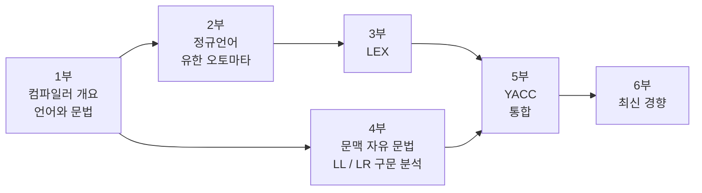

# 들어가며

이 교안의 목표는 하나다.

> **고급 언어 프로그램을 기계어나 어셈블리어로 번역해 주는 소프트웨어**, 즉 컴파일러를
> 구성하는 방법을 배우고 직접 만들어 본다.

그러기 위해 정규 문법, 문맥 자유 문법, 유한 오토마타(Finite Automata),
푸시다운 오토마타(Pushdown Automata) 같은 이론을 세운 다음,
그 이론을 자동화한 도구인 **lex**와 **yacc**의 사용법을 익히고,
이를 활용해 실제로 동작하는 파서를 구현한다.

---

## 이 교안의 특징

**이론과 도구를 짝지어 배운다.**
정규 표현과 유한 오토마타를 배우면 곧바로 lex가 그것을 어떻게 자동화하는지 본다.
문맥 자유 문법과 LR 항목 집합을 배우면 곧바로 yacc가 만들어 낸 표와 대조한다.
"이 이론이 어디에 쓰이는가"라는 질문이 남지 않도록 배치했다.

**손으로 한 번, 도구로 한 번.**
NFA에서 DFA를 만드는 부분집합 구성도, LR(0) 항목 집합을 만드는 절차도
먼저 종이 위에서 돌려 본다. 그 다음 `flex -T`, `bison -v`가 뱉어 낸 실제 표와
비교한다. 도구가 블랙박스로 남지 않게 하려는 것이다.

**모든 예제는 실제로 돌아간다.**
[이 저장소](https://github.com/kokoa-study-room/compiler-study-site)의 `examples/` 아래 코드는 전부 `make`로 빌드되고 테스트가 붙어 있다.
문서에 실린 코드는 그 파일에서 그대로 가져온 것이다.

---

## 무엇을 만들게 되는가

교안을 끝까지 따라가면 다음을 직접 만들게 된다.

| 만드는 것 | 사용 기술 | 해당 실습 |
|---|---|---|
| 단어·줄 수를 세는 스캐너 | flex | [LEX 실습](/docs/labs/lex-labs) |
| C 언어 부분집합의 토크나이저 | flex | [LEX 실습](/docs/labs/lex-labs) |
| DFA를 직접 코딩한 정수·실수 인식기 | C | [LEX 실습](/docs/labs/lex-labs) |
| 재귀 하강 계산기 (LL) | 손코딩 C | [YACC 실습](/docs/labs/yacc-labs) |
| 표 구동 LR 파서 | 손코딩 C | [YACC 실습](/docs/labs/yacc-labs) |
| 변수와 우선순위를 지원하는 계산기 | flex + bison | [YACC 실습](/docs/labs/yacc-labs) |
| AST를 만들고 3-주소 코드를 뽑는 미니 언어 컴파일러 | flex + bison + C | [통합 프로젝트](/docs/labs/mini-compiler) |

---

## 읽는 순서

앞 단계의 결과물이 뒤 단계의 재료가 되도록 배열되어 있다. 순서대로 읽는 것을 권한다.

2부→3부는 "정규 표현 → NFA → DFA → 스캐너"라는 하나의 흐름이고,
4부→5부는 "CFG → 항목 집합 → LR 표 → 파서"라는 하나의 흐름이다.
두 흐름은 5부에서 만난다.

:::note[낯선 약어가 보여도 괜찮다]
NFA, DFA, CFG 같은 말은 각각 해당 장에서 처음부터 정의한다.
지금은 "두 갈래의 흐름이 있고 나중에 만난다" 정도만 보면 된다.

- **NFA / DFA** — 유한 오토마타. [5장](/docs/regular/finite-automata)에서 정의한다
- **CFG** — 문맥 자유 문법. [10장](/docs/parsing/context-free-grammar)에서 정의한다
- **AST** — 추상 구문 트리. [1장](/docs/foundations/compiler-overview#-구문-분석-syntax-analysis)에서 정의한다

읽다가 막히는 용어가 있으면 [용어 사전](/docs/reference/glossary)에
한국어·영어·정의·해당 장이 정리되어 있다.
필요한 배경지식은 [시작하기 전에](/docs/prerequisites)에 있다.
:::

:::tip[이론이 지루하다면]
2부와 4부의 증명 부분은 처음 읽을 때 건너뛰어도 좋다.
다만 **부분집합 구성**(2부)과 **FIRST/FOLLOW 계산**(4부)만은 건너뛰지 말 것.
이 둘은 lex와 yacc가 내부에서 실제로 수행하는 계산이고,
도구가 뱉는 오류 메시지를 이해하려면 반드시 필요하다.
:::

---

## 표기 규약

교안 전체에서 다음 표기를 일관되게 사용한다.

| 기호 | 의미 |
|---|---|
| $\Sigma$ | 알파벳 — 기호(symbol)들의 유한 집합 |
| $\varepsilon$ | 공 스트링(empty string), 길이 0 |
| $\Sigma^*$ | $\Sigma$ 위의 모든 스트링의 집합 (클레이니 클로저) |
| $\lvert w \rvert$ | 스트링 $w$의 길이 |
| $L$ | 언어 — $\Sigma^*$의 부분집합 |
| $G = (V_N, V_T, P, S)$ | 문법 — 넌터미널, 터미널, 생성 규칙, 시작 심볼 |
| $A, B, C \dots$ | 넌터미널 (대문자) |
| $a, b, c \dots$ | 터미널 (소문자 앞부분) |
| $\alpha, \beta, \gamma$ | 문법 심볼의 스트링 (터미널 + 넌터미널 섞임) |
| $\Rightarrow$ | 한 번의 유도(derivation) |
| $\Rightarrow^*$ | 0번 이상의 유도 |
| $\to$ | 생성 규칙 |

코드 블록에서 파일 이름은 다음 관례를 따른다.

- `*.l` — lex(flex) 입력 파일
- `*.y` — yacc(bison) 입력 파일
- `*.c`, `*.h` — 손으로 쓴 C 코드

---

## 참고 문헌

교안을 쓰면서 기준으로 삼은 자료들이다.

- Aho, Lam, Sethi, Ullman, ***Compilers: Principles, Techniques, and Tools*** (2nd ed.)
  — 이른바 "용책(Dragon Book)". 4장(구문 분석)과 3장(어휘 분석)이 이 교안의 뼈대다.
- Hopcroft, Motwani, Ullman, ***Introduction to Automata Theory, Languages, and Computation***
  — 오토마타 이론의 정의와 증명은 이 책을 따랐다.
- Levine, ***flex & bison*** (O'''Reilly)
  — 도구 사용법의 실무적 세부는 이 책을 참고했다.
- [flex 매뉴얼](https://westes.github.io/flex/manual/),
  [GNU Bison 매뉴얼](https://www.gnu.org/software/bison/manual/)
  — 실제 동작은 항상 매뉴얼을 최종 근거로 삼았다.

원논문까지 포함한 전체 목록은 [참고 문헌](/docs/reference/bibliography) 페이지에 있다.
장별로 "더 파고 싶으면 무엇을 읽어야 하나"를 정리해 두었다.

---

다음 문서에서 컴파일러의 전체 구조부터 살펴본다.
