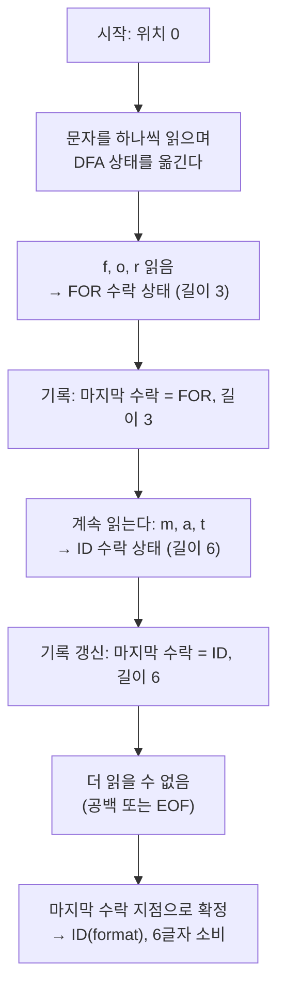
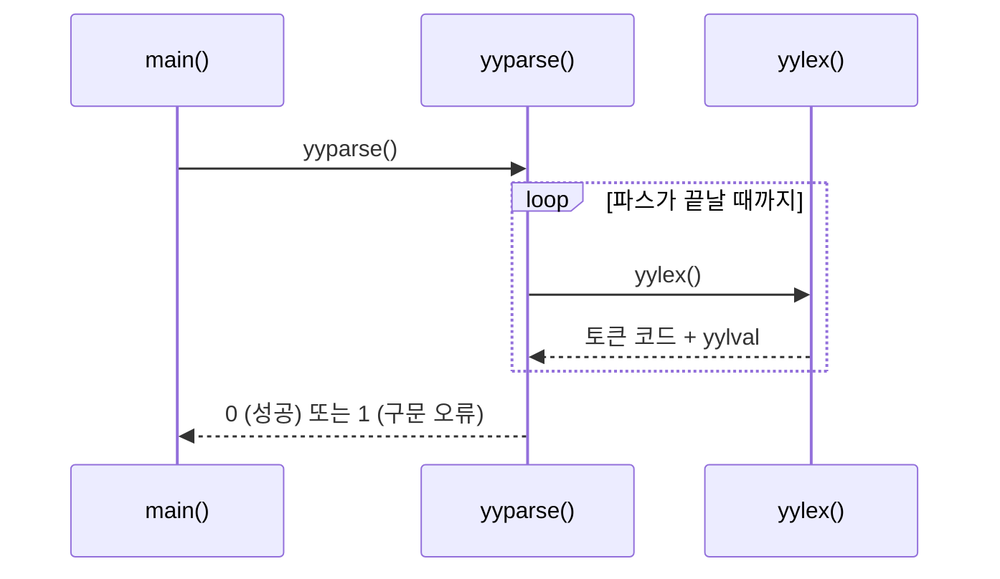
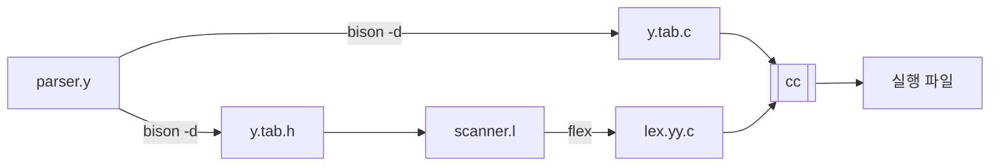

# 8. LEX 입력 및 파싱

lex 입력 파일에는 보통 수십 개의 규칙이 들어간다.
입력의 어느 지점에서 **여러 규칙이 동시에 매치될 수 있다**.

```c
"if"                    { return IF; }
[A-Za-z_][A-Za-z0-9_]*  { return ID; }
```

입력이 `if`일 때 두 규칙 모두 매치된다. lex는 어느 쪽을 고를까?
입력이 `iffy`라면?

이 장의 주제가 그 결정 규칙이다.
**실무에서 만나는 어휘 분석 버그의 대부분이 여기서 나온다.**

---

## 8.1 두 가지 명확화 규칙

:::danger[lex의 매치 규칙]
1. **최장 일치(longest match)** — 가장 **긴** 문자열을 매치하는 규칙을 택한다.
2. **규칙 우선순위(rule priority)** — 길이가 **같으면**,
   파일에서 **먼저 쓰인** 규칙을 택한다.

이 순서가 중요하다. 길이가 먼저이고, 순서는 동점일 때의 결정법이다.
:::

두 규칙을 각각 확인해 보자.

### 최장 일치

```c
"<"     { return LT; }
"<="    { return LE; }
```

입력이 `<=`일 때, `"<"` 규칙이 먼저 쓰였지만 **`"<="` 가 이긴다**.
길이가 2로 더 길기 때문이다.

즉 **긴 연산자를 먼저 쓸 필요가 없다.**
`02-lex-tokenizer` 예제의 `tests/longest-match.in` 으로 확인할 수 있다.

```
입력:  a==b
출력:  ID(a)  RELOP(==)  ID(b)      ← "=" 두 개가 아니다

입력:  a= =b
출력:  ID(a)  ASSIGN(=)  ASSIGN(=)  ID(b)   ← 공백이 있으면 쪼개진다
```

`i++ + ++j` 도 보자.

```
ID(i)  INCDEC(++)  ARITHOP(+)  INCDEC(++)  ID(j)
```

C의 유명한 함정이 여기서 나온다. `a+++b` 는 최장 일치에 따라
`a ++ + b` 로 잘리지 `a + ++ b` 로 잘리지 않는다.
"maximal munch"라 부르는 이 규칙은 lex의 것이 아니라
**C 언어 표준이 그렇게 정한 것**이고, lex가 자연스럽게 그것을 구현한다.

### 규칙 우선순위

```c
"if"                    { return IF; }
[A-Za-z_][A-Za-z0-9_]*  { return ID; }
```

입력 `if` — 두 규칙 모두 길이 2로 매치된다. 동점이므로 **먼저 쓴 `"if"`** 가 이긴다.

순서를 뒤집으면 어떻게 될까?

```c
[A-Za-z_][A-Za-z0-9_]*  { return ID; }
"if"                    { return IF; }      /* ❌ 절대 도달하지 않는다 */
```

`if`가 `ID`로 분류된다. 파서는 `if`문을 인식하지 못한다.

:::tip[flex가 경고해 준다]
```bash
flex tokenizer.l
```
```
tokenizer.l:12: warning, rule cannot be matched
```
이 경고를 무시하지 말자. 거의 항상 규칙 순서가 잘못된 것이다.
:::

### 두 규칙이 함께 작동하는 예

입력 `iffy` 는?

- `"if"` 규칙 → 길이 2
- `{id}` 규칙 → 길이 4 ← **최장 일치로 승리**

결과는 `ID(iffy)`. 예약어 규칙을 먼저 썼다고 해서
`if` + `fy` 로 쪼개지지 않는다. 최장 일치가 먼저 적용되기 때문이다.

이것이 **예약어를 정규 표현으로 나열해도 안전한 이유**다.

---

## 8.2 매치 과정의 실제

lex가 한 토큰을 잘라내는 과정을 단계별로 보자.
간단한 규칙 집합을 예로 든다.

```c
"for"   { return FOR; }
[a-z]+  { return ID; }
```

입력: `format`



핵심은 **"수락 상태를 만나도 멈추지 않는다"** 는 것이다.
더 긴 매치가 있을지 모르므로 계속 읽어 나가면서
**마지막으로 지나간 수락 상태**를 기억해 둔다.

### 되감기(backtracking)

더 이상 진행할 수 없게 되면, 마지막 수락 지점까지 **되돌아간다**.
그 사이에 읽었던 문자들은 입력으로 되돌려진다.

입력 `fore` 에 대해 규칙이 `"for"` 와 `"form"` 뿐이라면:

```
f o r e
      ↑ 여기서 막힘 ('e'로는 "form"이 될 수 없다)
    ↑ 마지막 수락은 여기 (FOR, 길이 3)
→ FOR 반환, 'e'는 입력으로 되돌린다
```

:::caution[되감기는 성능 비용이다]
`flex -b` 로 되감기가 일어나는 지점을 보고서로 뽑을 수 있다.

```bash
flex -b tokenizer.l
cat lex.backup
```

되감기가 없는 스캐너는 **입력 문자를 정확히 한 번씩만** 읽는다.
성능이 중요하다면 되감기를 유발하는 규칙을 손봐야 하는데,
보통 "실패로 끝나는 접두사"를 명시적인 오류 규칙으로 잡아 주면 된다.

교육용/일반적 용도에서는 신경 쓰지 않아도 된다.
:::

### 아무 규칙도 매치되지 않으면

입력의 현재 위치에서 **한 글자도** 매치되지 않으면,
lex는 **기본 규칙**을 적용한다. 즉 그 한 글자를 `yyout`에 출력하고 넘어간다.

[7장에서 경고했듯이](/docs/lex/lex-overview#72-lex-입력-파일의-구조)
이것은 조용한 버그의 원인이다.
`02-lex-tokenizer` 예제는 마지막에 catch-all을 두어 막았다.

```c
.   {
      nerrors++;
      fflush(stdout);
      fprintf(stderr, "%4d  오류: 인식할 수 없는 문자 '%s'\n", yylineno, yytext);
    }
```

실행하면 이렇게 나온다.

```
$ ./tokenizer < tests/errors.in
   1  KEYWORD    int
   1  ID         x
   1  ASSIGN     =
   1  INT        1
   1  PUNCT      ;
   2  오류: 인식할 수 없는 문자 '@'
   2  오류: 인식할 수 없는 문자 '#'
   2  오류: 인식할 수 없는 문자 '$'
   3  KEYWORD    char
   3  ARITHOP    *
   3  ID         s
   3  ASSIGN     =
   3  오류: 인식할 수 없는 문자 '"'
   3  ID         unterminated
   3  PUNCT      ;
```

3행이 흥미롭다. 입력이 `char *s = "unterminated;` 였는데,
문자열 패턴이 닫는 따옴표를 못 찾아 매치에 실패했다.
그래서 `"` 한 글자가 오류가 되고, 그 뒤의 `unterminated` 가
평범한 식별자로 잘렸다.

:::note[어휘 오류 복구의 어려움]
스캐너는 "무엇이 잘못됐는지"를 알기 어렵다.
위 경우 사람은 "문자열이 안 닫혔다"고 바로 알지만,
스캐너 입장에서는 그냥 `"` 가 어떤 패턴에도 안 맞은 것일 뿐이다.

더 나은 진단을 주려면 **시작 조건**과 `<<EOF>>` 규칙을 써야 한다.
[다음 장](/docs/lex/writing-lex-files)의 `04-lex-states` 예제가 그렇게 한다.

```
$ ./states < tests/errors.in
   2  오류: 문자열 안에 개행
```
:::

---

## 8.3 입력 버퍼링

지금까지 스캐너가 "문자를 하나씩 읽는다"고 말했다.
실제로 `getchar()` 를 문자마다 부르면 어떻게 될까?

**어휘 분석은 컴파일러에서 입력 문자를 가장 많이 만지는 단계다.**
1MB짜리 소스 파일이면 100만 번의 함수 호출이 된다.
그래서 실제 스캐너는 **버퍼**를 쓴다.

### 왜 버퍼 하나로는 부족한가

버퍼에 한 번에 $N$ 바이트를 읽어 두고 그 안에서 훑으면 된다.
그런데 문제가 있다.

```
버퍼:  [ … i n t   c o u n ]    ← 버퍼 끝
                        ↑ 여기서 버퍼가 끊겼다
다음 버퍼: [ t e r   =   0 ; … ]
```

`count` 라는 식별자가 **버퍼 경계에 걸쳐 있다**.
버퍼를 새로 읽어 오면 앞부분 `coun` 이 사라져 `yytext` 를 만들 수 없다.

[8.2절에서 본](#82-매치-과정의-실제) **되감기**도 문제다.
마지막 수락 지점으로 되돌아가야 하는데, 그 지점이 이미 덮어써진 버퍼에 있을 수 있다.

### 이중 버퍼 (two-buffer scheme)

버퍼를 **두 개 붙여** 쓰고 번갈아 채운다.

```
┌──────────────── 버퍼 1 ───────────────┬──────────────── 버퍼 2 ───────────────┐
│ … i n t   c o u n                     │ t e r   =   0 ;  …                    │
└───────────────────────────────────────┴───────────────────────────────────────┘
        ↑ lexemeBegin              ↑ forward
```

두 개의 포인터를 둔다.

| 포인터 | 역할 |
|---|---|
| `lexemeBegin` | 지금 만들고 있는 렉심의 **시작** |
| `forward` | 현재 읽고 있는 위치. 앞으로 훑어 나간다 |

`forward` 가 **버퍼 1의 끝**에 닿으면 버퍼 2를 새로 채운다.
`lexemeBegin` 은 버퍼 1에 그대로 남아 있으므로 렉심이 온전하다.

렉심 하나를 확정하면 `lexemeBegin := forward` 로 옮기고 다음으로 간다.

:::caution[렉심이 버퍼 크기보다 길면?]
`forward` 가 버퍼 2의 끝까지 갔는데도 `lexemeBegin` 이 버퍼 1에 있다면,
버퍼 1을 덮어쓸 수 없다 — 렉심이 잘리기 때문이다.

이때는 **버퍼를 키우는** 수밖에 없다.
flex는 이 경우 버퍼를 두 배로 재할당한다
(`YY_BUF_SIZE` 는 초기 크기일 뿐이다).

아주 긴 문자열 리터럴이나 주석이 이 경로를 탄다.
:::

### 보초 기법 (sentinel)

이중 버퍼에는 아직 비효율이 남아 있다.
문자를 읽을 때마다 **두 가지**를 검사해야 한다.

```c
for (;;) {
    if (forward == end_of_buffer_1) { 버퍼2 채우기; forward = 버퍼2 시작; }
    else if (forward == end_of_buffer_2) { 버퍼1 채우기; forward = 버퍼1 시작; }
    else forward++;

    switch (*forward) { /* 실제 스캔 */ }
}
```

문자당 비교가 **두 번** 추가된다. 이것이 전체 스캔의 상당 부분을 차지한다.

**보초(sentinel)** 는 이 비교를 하나로 줄이는 기법이다.

> 각 버퍼의 **끝에 절대 입력에 나오지 않는 문자**를 하나 넣어 둔다.
> 전통적으로 `EOF` 또는 `\0` 을 쓴다.

```
┌──────────── 버퍼 1 ──────────┬─┬──────────── 버퍼 2 ──────────┬─┐
│ … i n t   c o u n            │⊣│ t e r   =   0 ;  …           │⊣│
└──────────────────────────────┴─┴──────────────────────────────┴─┘
                                ↑ 보초                            ↑ 보초
```

그러면 루프가 이렇게 바뀐다.

```c
forward++;
if (*forward == EOF) {              /* ← 비교 한 번 */
    if (forward == end_of_buffer_1) { 버퍼2 채우기; forward = 버퍼2 시작; }
    else if (forward == end_of_buffer_2) { 버퍼1 채우기; forward = 버퍼1 시작; }
    else { /* 진짜 입력 끝 */ break; }
}
```

**핵심:** 대부분의 문자에 대해 `*forward == EOF` 비교 **한 번**만 실패하고 지나간다.
버퍼 경계 검사는 그 비교가 성공했을 때 — 즉 버퍼당 한 번 — 만 수행된다.

:::info[보초가 필요한 이유를 한 줄로]
"경계에 도달했는가?"라는 **위치 검사**를,
"이 문자가 특별한 문자인가?"라는 **값 검사**로 바꾼 것이다.

값 검사는 어차피 스캔 과정에서 해야 하는 일(`switch (*forward)`)에
자연스럽게 합쳐진다. 그래서 사실상 공짜가 된다.
:::

### flex는 어떻게 하는가

flex도 같은 발상을 쓴다. 생성된 코드에서 확인할 수 있다.

```bash
cd examples/02-lex-tokenizer
flex -o tokenizer.c tokenizer.l
grep -n "YY_BUF_SIZE\lvert yy_n_chars \rvertYY_END_OF_BUFFER_CHAR\|yy_buffer_stack" tokenizer.c | head
```

| 이름 | 역할 |
|---|---|
| `YY_BUF_SIZE` | 버퍼 크기 (기본 16KB) |
| `YY_END_OF_BUFFER_CHAR` | **보초 문자** (`\0`) |
| `yy_n_chars` | 현재 버퍼에 실제로 들어 있는 문자 수 |
| `yy_c_buf_p` | `forward` 에 해당하는 포인터 |
| `yytext_ptr` | `lexemeBegin` 에 해당 |
| `YY_INPUT` | 버퍼를 채우는 매크로 — 재정의해서 입력원을 바꿀 수 있다 |

flex는 버퍼를 두 개 두는 대신 **하나의 버퍼에 보초를 두 개** 넣고,
필요하면 버퍼를 재할당하며 렉심을 앞으로 당겨 온다.
아이디어는 같다.

:::tip[`YY_INPUT` 을 재정의하면 어디서든 읽을 수 있다]
```c
%{
#define YY_INPUT(buf, result, max_size) \
    { result = my_read_from_network(buf, max_size); }
%}
```
파일이 아니라 네트워크·메모리·압축 스트림에서 읽게 만들 수 있다.
[9장의 `yy_scan_string()`](/docs/lex/writing-lex-files#버퍼-상태--include-구현)도
이 계층 위에 구현되어 있다.
:::

:::note[이 절을 왜 넣었는가]
이론(정규 표현 → DFA)만 보면 어휘 분석은 "상태 전이"가 전부다.
그런데 **실제 성능을 결정하는 것은 상당 부분 버퍼링**이다.

DFA 전이는 배열 접근 한 번이라 이미 아주 싸다.
그 옆에서 문자마다 경계 검사를 두 번 하면 그쪽이 더 비싸진다.
"상수가 작다"는 말의 실체가 여기에 있다.
:::

---

## 8.4 매치를 제어하는 도구들

기본 규칙만으로 안 될 때 쓰는 장치들이다.

### `yyless(n)` — 일부만 소비하기

매치된 것 중 앞 `n`글자만 소비하고 나머지를 입력으로 되돌린다.

```c
/* "=-" 를 "=" 와 "-" 로 나누고 싶다 */
"=-"    { yyless(1); return ASSIGN; }   /* '-' 는 되돌린다 */
```

`yyless(0)` 은 **아무것도 소비하지 않는다**.
시작 조건을 바꾸면서 같은 텍스트를 다시 스캔할 때 유용하다.

:::danger[`yyless(0)`에 시작 조건 변경이 없으면 무한 루프다]
```c
"foo"   { yyless(0); }        /* ❌ 영원히 "foo"를 다시 본다 */
"foo"   { yyless(0); BEGIN(OTHER); }   /* ✅ 다음엔 다른 규칙이 적용된다 */
```
:::

### `yymore()` — 이어 붙이기

다음 매치를 `yytext` 뒤에 **이어 붙인다**.
조각조각 매치되는 것을 하나로 모을 때 쓴다.

```c
\"[^"]*     { yymore(); }         /* 닫는 따옴표를 못 찾으면 계속 모은다 */
\"[^"]*\"   { return STRING; }    /* yytext 에 전체가 들어 있다 */
```

### `unput(c)` — 입력에 밀어 넣기

문자 하나를 입력 스트림 앞에 되돌려 넣는다.

:::caution[`unput()`은 `yytext`를 파괴한다]
`unput()`을 부르면 `yytext`의 내용이 보장되지 않는다.
`yytext`가 필요하면 먼저 복사해 두자.
:::

### `REJECT` — 차선책으로 넘어가기

이번 매치를 취소하고, **그 다음으로 좋은** 규칙을 시도한다.
겹치는 패턴을 모두 세고 싶을 때 쓴다.

```c
/* 입력에서 "she"와 "he"를 각각 센다. "she" 안의 "he"도 센다 */
she     { s_count++; REJECT; }
he      { h_count++; REJECT; }
.|\n    { /* 무시 */ }
```

:::danger[`REJECT`는 스캐너 전체를 느리게 만든다]
`REJECT`가 한 번이라도 나타나면 flex는
**모든 규칙에 대해 되감기 정보를 유지**하도록 코드를 생성한다.
스캐너 크기와 실행 시간이 크게 늘어난다.

`flex -v` 로 확인해 보면 차이가 보인다.
대안(시작 조건, `yyless`, 후처리)이 있다면 그쪽을 택하자.
:::

---

## 8.5 예약어 처리 — 두 가지 방법

예약어가 30개쯤 되면 규칙을 30줄 쓰는 것이 부담스러워진다.

### 방법 1 — 규칙으로 나열

```c
"if"        { return IF; }
"else"      { return ELSE; }
"while"     { return WHILE; }
/* ... 30줄 ... */
{id}        { return ID; }
```

**장점** — 명확하고, 순서 규칙만 지키면 안전하다.
**단점** — DFA가 커진다. 예약어마다 별도의 상태 경로가 생긴다.

`02-lex-tokenizer`는 이 방법을 쓴다.
`flex -v` 결과 NFA 273상태 중 상당수가 예약어 때문이다.

### 방법 2 — 심볼 테이블 조회

```c
%{
static const struct { const char *name; int token; } keywords[] = {
    {"if", IF}, {"else", ELSE}, {"while", WHILE}, /* ... */
};

static int lookup_keyword(const char *s)
{
    for (size_t i = 0; i < sizeof keywords / sizeof keywords[0]; i++)
        if (strcmp(keywords[i].name, s) == 0)
            return keywords[i].token;
    return ID;      /* 예약어가 아니면 식별자 */
}
%}

%%
{id}    { return lookup_keyword(yytext); }
```

**장점** — DFA가 작다. 예약어 추가가 배열 한 줄이다.
**단점** — 조회 비용이 든다 (해시 테이블을 쓰면 무시할 만하다).

:::tip[실무에서는 방법 2가 더 흔하다]
GCC, Clang을 포함해 손으로 쓴 스캐너는 거의 모두 방법 2를 쓴다.
"식별자를 하나 잘라낸 뒤 예약어인지 조회한다"는 구조다.

`gperf` 같은 완전 해시 생성기를 쓰면 조회가 **충돌 없는 상수 시간**이 된다.
GCC가 실제로 gperf를 쓴다.
:::

---

## 8.6 파서와 결합하기

lex가 만든 스캐너를 파서와 어떻게 연결하는지 미리 보아 두자.
자세한 것은 [5부 YACC](/docs/yacc/yacc-overview)에서 다룬다.

### 제어 흐름

**파서가 주도한다.** 스캐너는 요청받을 때마다 토큰 하나를 만들어 준다.



### 세 가지 계약

**① 토큰 코드** — `yylex()`의 반환값.
yacc가 `%token` 선언에서 정수 상수를 만들어 `y.tab.h`에 넣어 준다.

```c
/* y.tab.h — bison -d 가 생성 */
#define IF   258
#define ELSE 259
#define ID   260
```

lex 파일은 이 헤더를 include 한다.

```c
%{
#include "y.tab.h"
%}
```

:::caution[토큰 코드는 258부터 시작한다]
0~255는 **문자 하나짜리 토큰**을 위해 비워 둔다.
`return '+';` 처럼 문자를 그대로 반환할 수 있다.
256, 257은 yacc가 내부적으로(`$end`, `error`) 쓴다.
:::

**② 의미 값** — `yylval` 전역 변수.
토큰의 "값"(식별자 이름, 숫자 값)을 파서에 전달한다.

```c
{num}   { yylval.num = atoi(yytext);  return NUM; }
{id}    { yylval.str = strdup(yytext); return ID; }
```

`yylval`의 타입은 yacc 파일의 `%union` 선언이 정한다.

**③ 입력 끝** — `yylex()`가 **0을 반환**하면 파서는 입력이 끝난 것으로 본다.
`%option noyywrap` 을 쓰면 EOF에서 자동으로 0이 반환된다.

### 빌드 순서

`y.tab.h`가 먼저 있어야 lex 파일이 컴파일된다.



Makefile에서 의존 관계를 잘못 쓰면
`y.tab.h: No such file or directory` 로 실패한다.
흔한 실수다.

---

## 8.7 실습 — 매치 규칙 확인하기

`02-lex-tokenizer` 예제로 직접 확인해 보자.

```bash
cd examples/02-lex-tokenizer
make
```

### 최장 일치

```bash
printf 'a==b\na= =b\ni++ + ++j\nx<=y<z\n' | ./tokenizer
```

`a==b` 는 `==` 하나로, `a= =b` 는 `=` 두 개로 잘린다.

### 규칙 순서 깨뜨려 보기

`tokenizer.l` 에서 `{id}` 규칙을 예약어 규칙들보다 **위로** 옮기고 다시 만들어 보자.

```bash
flex -o /dev/null tokenizer.l
```

```
tokenizer.l:NN: warning, rule cannot be matched
```

경고가 여러 줄 뜬다. 되돌려 놓자.

### 어떤 규칙이 매치되는지 추적

```bash
flex -d -o tokenizer_debug.c tokenizer.l
cc -o tokenizer_debug tokenizer_debug.c
echo 'if (x <= 10) return;' | ./tokenizer_debug
```

`-d` 로 만든 스캐너는 매치할 때마다
`--accepting rule at line NN ("텍스트")` 를 출력한다.
어느 규칙이 실제로 이겼는지 눈으로 볼 수 있다.

---

## 요약

- lex의 매치 규칙은 두 가지이고 **순서가 있다**.
  1. **최장 일치** — 더 긴 것을 택한다
  2. **규칙 우선순위** — 길이가 같으면 먼저 쓴 것을 택한다
- 이 순서 때문에 **긴 연산자를 먼저 쓸 필요는 없지만**,
  **예약어는 식별자보다 먼저 써야 한다**.
- `iffy` 가 `if`+`fy` 로 쪼개지지 않는 이유는 최장 일치가 먼저이기 때문이다.
- 스캐너는 수락 상태를 만나도 멈추지 않고 계속 읽으며
  **마지막 수락 지점**을 기억한다. 막히면 거기까지 **되감는다**.
- 아무 규칙도 안 맞으면 **기본 규칙**이 조용히 문자를 출력한다.
  반드시 catch-all을 두거나 `flex -s`를 쓴다.
- `yyless`, `yymore`, `unput`, `REJECT` 로 매치를 제어할 수 있으나
  `REJECT`는 스캐너 전체를 느리게 만든다.
- 예약어는 규칙으로 나열하거나 **심볼 테이블 조회**로 처리한다.
  후자가 DFA를 작게 유지한다.
- 파서와의 계약은 셋 — **토큰 코드**(반환값), **의미 값**(`yylval`),
  **입력 끝**(0 반환).

## 확인 문제

1. 다음 규칙 집합에서 입력 `abcd` 는 어떻게 잘리는가?
   ```c
   "ab"    { printf("1"); }
   "abc"   { printf("2"); }
   [a-z]+  { printf("3"); }
   ```

<details>
<summary>풀이</summary>

**출력은 `3` 하나다.** `abcd` 전체가 한 토큰이 된다.

| 후보 규칙 | 매치 길이 |
|---|---|
| `"ab"` | 2 |
| `"abc"` | 3 |
| `[a-z]+` | **4** ← 최장 일치로 승리 |

**최장 일치가 규칙 순서보다 먼저** 적용되므로,
`"ab"` 가 파일 맨 위에 있어도 소용없다.

입력이 `abcd ef` 라면 `3` 이 두 번 출력된다 (`abcd` 와 `ef`).
공백은 어떤 규칙에도 안 맞으므로 **기본 규칙**으로 그대로 출력된다.

</details>

2. 위에서 규칙 순서를 바꾸면 결과가 달라지는가? 왜인가?

<details>
<summary>풀이</summary>

**달라지지 않는다.**

세 규칙의 매치 길이가 **각각 다르므로**(2, 3, 4)
길이 비교만으로 승자가 정해진다. 순서는 볼 필요조차 없다.

$$
\text{최장 일치} \;\longrightarrow\; \text{동점이면 규칙 순서}
$$

규칙 순서는 **동점일 때만** 개입한다.

**순서가 중요해지는 경우**

```c
"if"                    { return IF; }
[A-Za-z_][A-Za-z0-9_]*  { return ID; }
```

입력 `if` 에서 두 규칙 모두 **길이 2**로 동점이다.
이때 비로소 순서가 결정한다.

순서를 뒤집으면 `if` 가 `ID` 가 되고, flex가 경고한다.

```
warning, rule cannot be matched
```

:::tip[한 줄 정리]
- **길이가 다르면** → 긴 쪽. 순서 무관
- **길이가 같으면** → 먼저 쓴 쪽
:::

</details>

3. `a+++++b` 는 C에서 어떻게 토큰화되는가?
   그 결과가 문법적으로 올바른 C 식인가?

<details>
<summary>풀이</summary>

**토큰화 (최장 일치, maximal munch)**

```
a  ++  ++  +  b
```

왼쪽부터 매번 가장 긴 것을 문다.

| 위치 | 남은 입력 | 가장 긴 매치 |
|---|---|---|
| 0 | `a+++++b` | `a` (식별자) |
| 1 | `+++++b` | `++` |
| 3 | `+++b` | `++` |
| 5 | `+b` | `+` |
| 6 | `b` | `b` |

**문법적으로 올바른가 — 아니다.**

토큰 열 `a ++ ++ + b` 를 파싱하면 `((a++)++) + b` 가 된다.

문제는 `(a++)++` 다.
- `a++` 는 **rvalue**(값)를 낸다
- 후위 `++` 는 **lvalue**(대입 가능한 자리)를 요구한다

따라서 컴파일 오류다.

```
error: lvalue required as increment operand
```

**토큰화는 성공했지만 파싱/의미 검사에서 실패한다.**

:::info[maximal munch는 C 표준의 규칙이다]
lex가 임의로 정한 것이 아니다. C11 §6.4p4:

> 입력을 전처리 토큰으로 나눌 때, **다음 전처리 토큰은
> 유효한 전처리 토큰을 이루는 가장 긴 문자열**이다.

그래서 `a+++b` 는 사람이 `a + (++b)` 를 의도했더라도
**반드시** `(a++) + b` 로 해석된다.

의도를 표현하려면 공백이나 괄호를 써야 한다.

```c
a + ++b      /* 명확 */
a++ + b      /* 명확 */
```

이것이 컴파일러 이론이 코딩 스타일 규칙("연산자 주위에 공백")의
근거가 되는 사례다.
:::

</details>

4. 다음 규칙이 왜 무한 루프를 일으키는지 설명하라.
   ```c
   [0-9]*  { return NUM; }
   ```

<details>
<summary>풀이</summary>

`*` 는 **0회 이상**이므로 이 패턴은 **빈 문자열에도 매치된다**.

입력이 `abc` 라고 하자.

| 단계 | 위치 | 매치 | 소비한 문자 수 |
|---|---|---|---|
| 1 | `a` 앞 | `[0-9]*` 가 **빈 문자열**로 매치 | **0** |
| 2 | `a` 앞 (그대로) | 또 빈 문자열 매치 | **0** |
| 3 | `a` 앞 (그대로) | … | **0** |

**입력 위치가 전진하지 않는다.** 영원히 같은 자리에서 같은 매치를 반복한다.

`return NUM;` 이 있으므로 파서는 `NUM` 토큰을 무한히 받게 되고,
`return` 이 없다면 `yylex()` 안에서 무한 루프가 된다.

**해결**

```c
[0-9]+  { return NUM; }      /* + 는 1회 이상 */
```

:::caution[flex가 경고해 주긴 한다]
```
warning, rule cannot be matched
```
가 아니라
```
scanner rule cannot match empty string
```
비슷한 경고가 나오는 구현도 있지만, **모든 경우를 잡아 주지는 않는다.**

특히 정규 정의를 조합하다 보면 실수하기 쉽다.

```c
digits   [0-9]*
sign     [+-]?
number   {sign}{digits}      /* ❌ 둘 다 비어 있을 수 있다 */
```

`number` 전체가 빈 문자열에 매치된다.
**"이 패턴이 빈 문자열에 매치될 수 있는가"** 를 항상 자문하자.
:::

</details>

5. `REJECT` 없이 `she`/`he` 세기를 구현하라.
   (힌트: `yyless` 또는 후행 문맥)

<details>
<summary>풀이</summary>

**방법 A — `yyless`**

```c
%option noyywrap
%{
#include <stdio.h>
static int s_count = 0, h_count = 0;
%}

%%
she     { s_count++; yyless(1); }   /* 's' 만 소비하고 "he" 를 되돌린다 */
he      { h_count++; }
.|\n    { /* 무시 */ }
%%

int main(void) {
    yylex();
    printf("she=%d he=%d\n", s_count, h_count);
    return 0;
}
```

**동작.** 입력 `she` 에서
1. `she` 규칙이 매치 → `s_count++`
2. `yyless(1)` — 앞 1글자(`s`)만 소비하고 `he` 를 입력으로 되돌린다
3. 다음 스캔에서 `he` 규칙이 매치 → `h_count++`

```bash
echo "she sells" | ./count
```
```
she=1 he=1
```

**방법 B — 후행 문맥**

```c
s/he    { s_count++; }      /* "he" 가 뒤따를 때만 's' 를 소비 */
he      { h_count++; }
.|\n    ;
```

`s/he` 는 "`he` 가 뒤따르는 `s`"를 매치하되 **`s` 만 소비**한다.
`yyless(1)` 과 사실상 같은 효과다.

**왜 `REJECT` 보다 나은가**

| | `REJECT` | `yyless` / 후행 문맥 |
|---|---|---|
| 스캐너 크기 | **전체가 커진다** | 그대로 |
| 속도 | 전체가 느려진다 | 그대로 |
| 적용 범위 | 파일 전체에 영향 | 해당 규칙만 |

`REJECT` 가 한 번이라도 나타나면 flex는 **모든 규칙에 대해**
되감기 정보를 유지하는 코드를 생성한다
([8.4절](#84-매치를-제어하는-도구들)).

`flex -v` 로 두 버전의 크기를 비교해 보면 차이가 보인다.

</details>

6. 예약어 50개를 방법 1과 방법 2로 각각 구현하고
   `flex -v` 로 DFA 상태 수를 비교하라.

<details>
<summary>풀이</summary>

**방법 1 — 규칙으로 나열**

```c
"if"      { return IF; }
"else"    { return ELSE; }
/* … 48줄 더 … */
{id}      { return ID; }
```

**방법 2 — 심볼 테이블 조회**

```c
%{
static const struct { const char *name; int tok; } kw[] = {
    {"if", IF}, {"else", ELSE}, /* … */
};
static int lookup(const char *s) {
    for (size_t i = 0; i < sizeof kw / sizeof kw[0]; i++)
        if (strcmp(kw[i].name, s) == 0) return kw[i].tok;
    return ID;
}
%}
%%
{id}      { return lookup(yytext); }
```

**결과 (대략적인 경향)**

| | 방법 1 | 방법 2 |
|---|---|---|
| NFA 상태 | 수백 개 | 수십 개 |
| **DFA 상태** | **수백 개** | **10개 안팎** |
| 생성 코드 크기 | 크다 | 작다 |
| 실행 시간 | 표 접근만 | 표 접근 + 조회 |

**왜 이렇게 차이가 나는가.**

방법 1은 예약어마다 **DFA 경로가 따로** 생긴다.
`if`, `int`, `inline` 은 `i` 를 공유하지만 그 뒤로 갈라지므로
분기마다 상태가 필요하다. 50개면 트라이(trie) 하나가 통째로 DFA에 박힌다.

방법 2는 DFA가 **`{id}` 패턴 하나**만 인식하면 된다.
"글자로 시작해 글자·숫자가 이어진다" — 상태 두세 개면 끝이다.
예약어 구별은 **DFA 밖에서** 문자열 비교로 한다.

**실제로 확인하려면**

```bash
flex -v -o /dev/null method1.l 2>&1 | grep "DFA states"
flex -v -o /dev/null method2.l 2>&1 | grep "DFA states"
```

`examples/02-lex-tokenizer` 는 방법 1을 쓰며 DFA 92상태다.
예약어를 조회로 바꾸면 크게 줄어든다.

:::tip[실무는 방법 2 + 완전 해시]
GCC는 [gperf](https://www.gnu.org/software/gperf/)로 예약어의
**완전 해시 함수**를 생성한다. 충돌이 없으므로 조회가 진짜 $O(1)$ 이다.

방법 2의 단점(조회 비용)마저 없애는 셈이다.
:::

</details>

---

다음 장에서는 실제로 쓸 만한 lex 입력 파일을 작성하는 법 —
시작 조건, 파일 처리, 오류 진단 — 을 다룬다.
