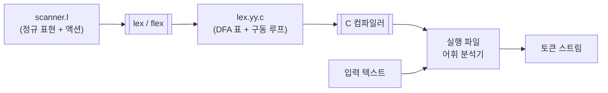
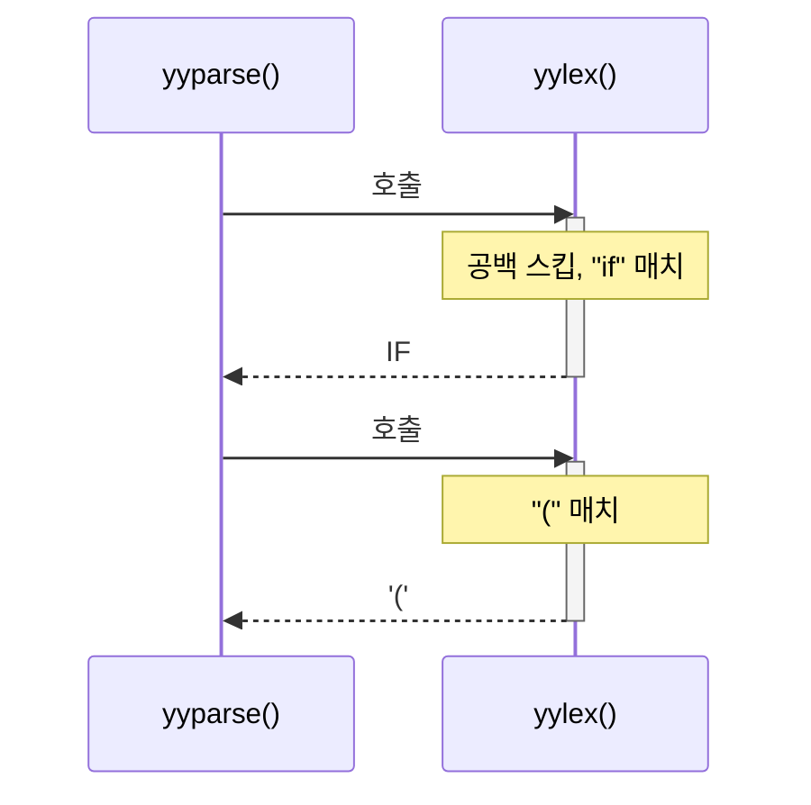

# 7. LEX

2부에서 세운 이론은 이렇게 요약된다.

> 정규 표현을 쓰면, 그것을 인식하는 DFA를 **기계적으로** 만들 수 있다.

**lex**는 그 "기계적으로"를 실제로 해 주는 프로그램이다.
정규 표현과 그에 대응하는 C 코드를 적어 주면,
어휘 분석기 소스 코드를 뽑아 준다.

---

## 7.1 lex란 무엇인가



### 계보

| 이름 | 유래 |
|---|---|
| **lex** | 1975년 Bell Labs의 Mike Lesk와 Eric Schmidt. Unix 표준 도구 |
| **flex** | *Fast Lexical analyzer generator*. 1987년 Vern Paxson. GNU/BSD 시스템의 사실상 표준 |
| **lex 규격** | POSIX가 표준화. flex는 POSIX lex의 상위 호환 |

이 교안에서 "lex"는 도구 일반을, "flex"는 실제 구현을 가리킨다.
예제는 모두 flex에서 검증했다.

### 토큰, 패턴, 렉심

셋을 구별해야 이후 논의가 정확해진다.

:::info[정의]
| 용어 | 뜻 | 예 |
|---|---|---|
| **토큰(token)** | 문법이 다루는 **종류**. 파서에 넘기는 이름 | `ID`, `NUM`, `IF` |
| **패턴(pattern)** | 그 종류에 속하는 문자열의 **규칙** | `[A-Za-z_][A-Za-z0-9_]*` |
| **렉심(lexeme)** | 입력에 **실제로 나타난 문자열** | `count`, `x9`, `sum` |
:::

`int count = 0;` 를 예로 들면:

| 렉심 | 매치된 패턴 | 만들어지는 토큰 |
|---|---|---|
| `int` | `"int"` | `KEYWORD` |
| `count` | `[A-Za-z_][A-Za-z0-9_]*` | `ID` |
| `=` | `"="` | `ASSIGN` |
| `0` | `[0-9]+` | `NUM` |
| `;` | `";"` | `PUNCT` |

**하나의 토큰에 무한히 많은 렉심이 대응할 수 있다.**
`ID` 토큰의 렉심은 `a`, `count`, `myVeryLongName` … 끝이 없다.

:::tip[파서는 토큰만, 액션은 렉심도 본다]
파서는 "여기 `ID` 가 왔다"만 알면 문법 검사를 할 수 있다.
그 `ID` 의 이름이 `count` 인지 `sum` 인지는 **문법과 무관**하다.

그러나 심볼 테이블에 등록하려면 실제 이름이 필요하다.
그래서 렉심은 `yytext` 로, 그로부터 만든 값은 `yylval` 로 따로 전달한다.
이 분리가 [8장의 파서 결합](/docs/lex/lex-input-and-parsing#86-파서와-결합하기)에서
"토큰 코드"와 "의미 값"이라는 두 계약으로 나타난다.
:::

### lex가 대신해 주는 일

lex 없이 어휘 분석기를 쓴다면 다음을 전부 손으로 해야 한다.

1. 각 토큰의 정규 표현을 NFA로 변환 (Thompson 구성)
2. 여러 NFA를 하나로 합치기
3. 부분집합 구성으로 DFA 변환
4. DFA 최소화
5. 전이표를 압축해 C 배열로 출력
6. 최장 일치와 규칙 우선순위를 처리하는 구동 루프 작성
7. 입력 버퍼링, 되감기(backtracking) 처리

lex는 1~7을 전부 해 준다.
우리는 **"어떤 패턴을 어떤 토큰으로 볼 것인가"** 만 적으면 된다.

:::note[3장 03-dfa-by-hand 예제를 먼저 보면 좋다]
저장소의 [`examples/03-dfa-by-hand`](/docs/labs/lex-labs)는
lex 없이 5·6단계를 손으로 한 코드다.
수 하나를 인식하는 데도 전이표가 8×5짜리로 나온다.
토큰이 50종인 실제 언어라면 손으로 관리할 수 없다는 것이 곧 와닿는다.
:::

---

## 7.2 lex 입력 파일의 구조

lex 입력 파일(`.l`)은 `%%` 로 나뉘는 **세 부분**으로 이루어진다.

```
정의부 (definition section)
%%
규칙부 (rules section)
%%
사용자 코드부 (user code section)
```

두 번째 `%%` 와 사용자 코드부는 생략할 수 있다.
첫 번째 `%%` 는 **생략할 수 없다** — 규칙부의 시작을 알려야 하기 때문이다.

### 가장 작은 완전한 예

```c title="minimal.l"
%%
.|\n    ECHO;
%%
```

이것은 입력을 그대로 출력하는 `cat`이다.
`ECHO`는 "매치된 텍스트를 출력하라"는 뜻의 lex 매크로다.

사실 규칙 자체도 생략할 수 있다.

```c title="even-more-minimal.l"
%%
```

lex의 **기본 규칙(default rule)** 이 "어떤 규칙에도 안 맞으면 그 문자를 출력한다"
이기 때문에, 규칙이 하나도 없어도 `cat`처럼 동작한다.

:::caution[기본 규칙은 조용한 버그의 원인이다]
어떤 패턴에도 안 맞는 입력이 **경고 없이 그대로 출력된다**.
토크나이저를 만들 때 이것은 거의 항상 버그다.

두 가지 방어책이 있다.

1. 마지막에 catch-all 규칙을 두고 오류로 처리한다.
   ```c
   .   { fprintf(stderr, "인식할 수 없는 문자 '%s'\n", yytext); }
   ```
2. `flex -s` 로 컴파일한다. 기본 규칙이 실제로 쓰이면 flex가 경고해 준다.
:::

---

## 7.3 첫 번째 스캐너 — 단어 세기

세 부분이 실제로 어떻게 쓰이는지, `wc(1)`을 흉내 내는 예제로 보자.

```c title="examples/01-lex-wordcount/wordcount.l"
%option noyywrap
%option noinput nounput

%{
#include <stdio.h>

static long chars = 0;
static long words = 0;
static long lines = 0;
%}

/* 정규 정의 — 규칙부에서 {word} 로 참조한다 */
word    [^ \t\n]+

%%

{word}      { words++; chars += yyleng; }
\n          { lines++; chars++; }
[ \t]       { chars++; }

%%

int main(void)
{
    yylex();
    printf("lines=%ld words=%ld chars=%ld\n", lines, words, chars);
    return 0;
}
```

빌드하고 실행한다.

```bash
flex -o wordcount.c wordcount.l
cc -std=c11 -Wall -o wordcount wordcount.c
printf 'hello world\nthe quick brown fox\n' | ./wordcount
```

```
lines=2 words=6 chars=32
```

### 각 부분 뜯어보기

#### 정의부

세 종류가 들어간다.

**① `%option` 지시자** — flex의 동작을 바꾼다.

| 옵션 | 하는 일 |
|---|---|
| `noyywrap` | 입력 끝에서 `yywrap()`을 호출하지 않는다. 파일 하나만 읽을 때 |
| `yylineno` | `yylineno` 변수에 현재 줄 번호를 자동 유지 |
| `noinput` `nounput` | 안 쓰는 함수를 생성하지 않아 컴파일 경고를 줄인다 |
| `case-insensitive` | 패턴을 대소문자 구분 없이 매치 |
| `stack` | 시작 조건 스택 사용 |

**② `%{ ... %}` 블록** — 안의 내용이 **생성된 C 파일 맨 위에 그대로 복사**된다.
`#include`, 전역 변수, 함수 선언을 여기 둔다.

:::caution[`%{` 와 `%}` 는 반드시 줄 맨 앞에 있어야 한다]
들여쓰기하면 flex가 인식하지 못한다.
:::

**③ 정규 정의** — `이름  패턴` 형식. 규칙부에서 `{이름}`으로 참조한다.
[4장의 정규 정의](/docs/regular/regular-expressions#44-정규-정의)가 바로 이것이다.

```c
letter  [A-Za-z_]
digit   [0-9]
id      {letter}({letter}|{digit})*
```

#### 규칙부

`패턴  { 액션 }` 의 나열이다.

:::danger[패턴은 반드시 줄의 1열에서 시작해야 한다]
lex는 **들여쓰기된 줄을 C 코드로 간주**한다.
```c
%%
    /* 이 줄은 C 코드로 복사된다 */
{id}    { return ID; }
```
반대로, 규칙부에 주석을 쓰려면 **한 칸 이상 들여써야** 한다.
1열에 `/*`를 쓰면 lex가 그것을 패턴으로 해석하려 든다.
:::

액션을 생략하면 그 패턴에 매치된 텍스트는 **아무 일도 하지 않고 버려진다**.
`;` 하나만 써도 같다.

```c
[ \t\n]+    ;           /* 공백을 버린다 */
```

#### 사용자 코드부

두 번째 `%%` 이후는 **생성된 C 파일 맨 끝에 그대로 복사**된다.
`main()`과 헬퍼 함수를 여기 둔다.

---

## 7.4 생성되는 코드

`flex -o wordcount.c wordcount.l` 이 만들어 낸 파일을 들여다보자.

```bash
wc -l wordcount.c              # 1700줄 안팎
grep -n "yy_nxt\|yy_accept" wordcount.c | head
```

핵심은 두 가지다.

**① DFA 전이표** — `yy_nxt`, `yy_base`, `yy_def`, `yy_chk` 등의 정적 배열.
[03-dfa-by-hand 예제](/docs/labs/lex-labs)의 `DELTA[][]`와 같은 역할이지만,
희소 행렬 압축이 적용되어 있어 그대로 읽기는 어렵다.

**② `yylex()` 구동 루프** — 표를 보며 상태를 옮기고,
수락 상태를 만나면 해당 규칙의 액션을 실행한다.

### 규모 확인하기

`flex -v`가 통계를 보여 준다.

```bash
flex -v -o /dev/null wordcount.l
```

```
  15/2000 NFA states
  7/1000 DFA states (19 words)
  11 epsilon states, 5 double epsilon states
```

[6장](/docs/regular/representations)에서 배운 NFA→DFA 변환이
실제로 일어났음을 이 숫자가 보여 준다.
NFA 15상태가 DFA 7상태로 줄었고, ε 상태 11개는
Thompson 구성이 만들어 낸 바로 그 ε-전이들이다.

규칙이 늘어나면 어떻게 되는지 [02-lex-tokenizer](/docs/labs/lex-labs)로 비교해 보자.

```
  273/2000 NFA states
  92/1000 DFA states (493 words)
```

토큰 종류가 30가지 남짓인데 NFA는 273상태다.
이것을 손으로 관리할 수 없다는 것이 lex의 존재 이유다.

:::tip[`flex -T`로 변환 과정 전체를 볼 수 있다]
```bash
flex -T wordcount.l 2>&1 | head -60
```
Thompson 구성으로 만든 NFA의 각 상태와 전이,
그리고 부분집합 구성으로 만들어진 각 DFA 상태가
**어떤 NFA 상태 집합인지**까지 전부 덤프된다.

[6.3절의 부분집합 구성 시뮬레이터](/docs/regular/representations#63-nfa--dfa-부분집합-구성)에서
손으로 돌려 본 그 계산을 flex가 실제로 하고 있음을 확인할 수 있다.
:::

---

## 7.5 lex가 제공하는 변수와 함수

액션 안에서 쓸 수 있는 것들이다.

### 변수

| 이름 | 타입 | 의미 |
|---|---|---|
| `yytext` | `char *` | 방금 매치된 문자열 |
| `yyleng` | `int` | `yytext`의 길이 |
| `yylineno` | `int` | 현재 줄 번호 (`%option yylineno` 필요) |
| `yyin` | `FILE *` | 입력 스트림 (기본 `stdin`) |
| `yyout` | `FILE *` | `ECHO`의 출력 대상 (기본 `stdout`) |

:::caution[`yytext`는 다음 매치 때 덮어쓰인다]
`yytext`는 flex 내부 버퍼를 가리키는 포인터다.
값을 오래 보관하려면 **반드시 복사**해야 한다.

```c
{id}    { yylval.str = strdup(yytext); return ID; }   /* ✅ */
{id}    { yylval.str = yytext;         return ID; }   /* ❌ 나중에 깨진다 */
```

`strdup`으로 복사했다면 해제 책임도 생긴다는 점을 잊지 말자.
:::

### 함수와 매크로

| 이름 | 하는 일 |
|---|---|
| `yylex()` | 스캐너 본체. 토큰 하나를 찾을 때까지 돈다 |
| `ECHO` | `fwrite(yytext, yyleng, 1, yyout)` |
| `REJECT` | 이번 매치를 취소하고 **차선의 규칙**을 시도 |
| `yymore()` | 다음 매치를 `yytext` 뒤에 **이어 붙인다** |
| `yyless(n)` | 매치된 것 중 앞 `n`글자만 소비하고 나머지는 되돌린다 |
| `unput(c)` | 문자 `c`를 입력 스트림에 되돌려 넣는다 |
| `input()` | 입력에서 문자 하나를 직접 읽는다 |
| `BEGIN(sc)` | 시작 조건을 `sc`로 바꾼다 |
| `yyterminate()` | `yylex()`를 즉시 종료 |
| `yyrestart(f)` | 입력을 `f`로 바꾸고 스캐너 상태를 초기화 |

:::caution[`REJECT`는 비싸다]
`REJECT`를 한 번이라도 쓰면 flex는 **되감기(backtracking) 정보를 전부 유지**하도록
전체 스캐너를 다르게 생성한다. 스캐너가 훨씬 커지고 느려진다.
`yyless()`나 시작 조건으로 해결할 수 있는지 먼저 검토하자.
:::

### `yylex()`의 반환

`yylex()`는 액션 안에서 `return`을 만나면 그 값을 돌려주고 멈춘다.
다음에 다시 호출하면 **멈췄던 자리에서 이어서** 스캔한다.

```c
{id}    { return ID; }      /* 여기서 yylex() 가 반환한다 */
{num}   { return NUM; }
[ \t]+  { /* return 이 없으므로 계속 스캔한다 */ }
```

파서와 결합할 때 이 성질이 결정적이다.
`yyparse()`가 토큰이 필요할 때마다 `yylex()`를 호출하면,
스캐너가 딱 하나의 토큰만 만들어 돌려준다.



액션 안에서 `return`을 하지 않으면 `yylex()`는
**입력 끝까지 돌다가 0을 반환**한다.
`wordcount.l`이 그런 경우다 — 모든 액션이 카운터만 올리고 반환하지 않으므로
`yylex()` 한 번 호출로 파일 전체가 처리된다.

---

## 7.6 lex 없이 쓸 것인가

lex가 항상 정답은 아니다. 실제 프로덕션 컴파일러 상당수가
어휘 분석기를 **손으로 쓴다** — GCC, Clang, Rust, Go 모두 그렇다.

| | lex 생성 | 손으로 작성 |
|---|---|---|
| 작성 속도 | 빠르다 | 느리다 |
| 명세의 가독성 | 정규 표현이 곧 문서 | 코드를 읽어야 안다 |
| 오류 메시지 품질 | 제어하기 번거롭다 | 자유롭다 |
| 성능 | 충분히 빠르다 | 더 최적화할 여지가 있다 |
| 유니코드 | flex는 약하다 | 직접 처리 |
| 특수 규칙(들여쓰기, lexer hack) | 액션 코드로 우회 | 자연스럽다 |
| 디버깅 | 생성 코드라 어렵다 | 그냥 C 코드 |

:::note[그래도 lex를 배우는 이유]
1. **이론이 코드가 되는 지점을 직접 본다.** 정규 표현 → DFA → 표 라는
   변환이 `flex -v`, `flex -T`로 눈에 보인다.
2. **작은 도구에는 여전히 최적이다.** 설정 파일 파서, 로그 분석기,
   DSL(Domain-Specific Language — 특정 용도에 특화된 작은 언어.
   빌드 스크립트, 질의어, 설정 형식 같은 것) 프로토타입에
   lex+yacc 조합은 몇 시간이면 끝난다.
3. **손으로 쓸 때도 같은 구조를 쓰게 된다.** 손으로 쓴 스캐너도 결국
   "최장 일치 + 규칙 우선순위 + 상태"라는 lex의 모델을 따른다.

현대적 대안들(re2c, RE-flex, tree-sitter)은
[도구 지형도](/docs/modern/toolchain-map)에서 비교한다.
:::

---

## 요약

- **lex**는 정규 표현 명세에서 어휘 분석기 C 코드를 생성한다.
  2부에서 배운 Thompson 구성 → 부분집합 구성 → 최소화 → 표 압축을 전부 대신 해 준다.
- 입력 파일은 **정의부 `%%` 규칙부 `%%` 사용자 코드부** 세 부분이다.
- 정의부에는 `%option`, `%{ ... %}` C 블록, 정규 정의가 들어간다.
- 규칙부의 **패턴은 반드시 1열에서 시작**해야 한다. 들여쓰기된 줄은 C 코드다.
- **기본 규칙**이 안 맞는 입력을 조용히 출력하므로,
  catch-all 규칙을 두거나 `flex -s`를 쓴다.
- `yytext`는 **다음 매치 때 덮어쓰인다.** 보관하려면 복사한다.
- `yylex()`는 `return`을 만나면 멈추고, 다음 호출에서 이어서 스캔한다.
  이 성질이 파서와의 결합을 가능하게 한다.

## 확인 문제

1. 다음 lex 프로그램은 무엇을 하는가?
   ```c
   %%
   [0-9]+   printf("<%s>", yytext);
   ```
   입력이 `ab12cd34`일 때 출력은?
   (힌트: 기본 규칙을 잊지 말 것)

<details>
<summary>풀이</summary>

**출력: `ab<12>cd<34>`**

규칙이 하나뿐이지만 **기본 규칙**이 조용히 작동한다.

| 입력 위치 | 매치되는 규칙 | 동작 |
|---|---|---|
| `a` | 없음 → **기본 규칙** | `a` 를 그대로 출력 |
| `b` | 없음 → 기본 규칙 | `b` 출력 |
| `12` | `[0-9]+` | `<12>` 출력 |
| `c`, `d` | 기본 규칙 | `cd` 출력 |
| `34` | `[0-9]+` | `<34>` 출력 |

**이 프로그램의 정체:** "숫자를 꺾쇠로 감싸는 필터".
숫자가 아닌 문자는 손대지 않고 통과시킨다.

:::caution[의도한 것이 아니라면 버그다]
"숫자만 뽑아 출력하고 싶었다"면 이 결과는 틀렸다.
`ab`, `cd` 가 딸려 나왔기 때문이다.

고치려면 catch-all 규칙을 추가한다.

```c
%%
[0-9]+   printf("<%s>", yytext);
.|\n     ;                        /* 나머지는 버린다 */
```

기본 규칙이 **아무 경고 없이** 개입한다는 것이
[7.2절](#72-lex-입력-파일의-구조)에서 경고한 문제다.
`flex -s` 로 컴파일하면 기본 규칙이 쓰일 때 경고해 준다.
:::

</details>

2. `%{ ... %}` 안의 코드와 두 번째 `%%` 이후의 코드는 각각
   생성 파일의 어디로 복사되는가? 왜 그 위치여야 하는가?

<details>
<summary>풀이</summary>

| 구역 | 복사되는 위치 | 이유 |
|---|---|---|
| `%{ … %}` | 생성 파일 **맨 위** (`yylex()` 앞) | `#include`, 전역 변수, 함수 **선언**이 액션 코드보다 먼저 나와야 컴파일된다 |
| 둘째 `%%` 이후 | 생성 파일 **맨 끝** (`yylex()` 뒤) | `main()` 과 헬퍼 함수 **정의**. `yylex()` 를 호출하려면 그것이 이미 정의되어 있어야 한다 |

생성 파일의 구조를 그려 보면 명확하다.

```c
/* ── %{ … %} 의 내용이 여기 ── */
#include <stdio.h>
static long words = 0;
static void emit(const char *, const char *);   /* 선언 */

/* ── flex가 생성하는 부분 ── */
static const short yy_nxt[][...] = { … };       /* DFA 표 */

int yylex(void)
{
    …
    case 3:
        { words++; chars += yyleng; }           /* ← 규칙부의 액션이 여기 */
        …
}

/* ── 둘째 %% 이후의 내용이 여기 ── */
int main(void) { yylex(); … }                   /* 정의 */
```

**만약 위치가 바뀐다면:**

- 전역 변수를 아래에 두면 → 액션 코드에서 `words` 를 못 찾아 컴파일 오류
- `main()` 을 위에 두면 → `yylex()` 가 아직 선언되지 않아 오류
  (C99 이후로는 암묵적 선언도 안 된다)

:::tip[헷갈리면 이렇게 기억하자]
- `%{ %}` = "액션이 쓸 것들" → **먼저**
- 둘째 `%%` 이후 = "스캐너를 쓰는 것들" → **나중**
:::

</details>

3. `yytext`를 복사하지 않고 심볼 테이블에 저장하면 어떤 일이 벌어지는지
   구체적인 시나리오로 설명하라.

<details>
<summary>풀이</summary>

**시나리오.** 입력이 `int count; int sum;` 이라고 하자.

```c
{id}   { symtab_add(yytext); return ID; }   /* ❌ 복사하지 않았다 */
```

`symtab_add` 가 포인터만 저장한다면:

| 시점 | `yytext` 가 가리키는 내용 | 심볼 테이블 |
|---|---|---|
| `count` 매치 직후 | `"count"` | `[0] → yytext` |
| `sum` 매치 직후 | **`"sum"`** ← 같은 버퍼를 덮어썼다 | `[0] → yytext`, `[1] → yytext` |

두 항목이 **같은 주소**를 가리키고, 그 내용은 마지막 매치인 `"sum"` 이다.

```c
printf("%s %s\n", symtab[0], symtab[1]);   /* "sum sum" 출력 */
```

**왜 이런가.** `yytext` 는 새 배열이 아니라
**flex 내부 입력 버퍼 안을 가리키는 포인터**다.
매치할 때마다 flex는 `yytext` 를 새 위치로 옮기고,
매치 끝에 `\0` 을 임시로 넣었다가 되돌린다.

더 나쁜 경우: [8장의 입력 버퍼링](/docs/lex/lex-input-and-parsing#83-입력-버퍼링)에서
본 대로 버퍼가 **재할당**되면 옛 포인터는 **해제된 메모리**를 가리킨다.
그러면 값이 뒤섞이는 정도가 아니라 **use-after-free** 다.
이런 버그는 입력이 작을 때는 재현되지 않다가 큰 파일에서만 터진다.

**해결**

```c
{id}   { symtab_add(strdup(yytext)); return ID; }   /* ✅ */
```

`strdup` 은 `malloc` 하므로 **해제 책임**이 생긴다.
`examples/07-yacc-calc` 에서 `free($1)` 을 하는 이유가 이것이다.

</details>

4. `01-lex-wordcount` 예제를 고쳐, 가장 긴 단어와 그 길이도 출력하게 하라.

<details>
<summary>풀이</summary>

```c title="wordcount.l (수정)"
%option noyywrap
%option noinput nounput

%{
#include <stdio.h>
#include <string.h>

static long chars = 0, words = 0, lines = 0;

/* 가장 긴 단어를 보관한다. yytext 는 덮어써지므로 반드시 복사해야 한다. */
static char longest[256] = "";
static int  longest_len = 0;
%}

word    [^ \t\n]+

%%

{word}      {
              words++;
              chars += yyleng;
              if (yyleng > longest_len) {
                  longest_len = yyleng;
                  snprintf(longest, sizeof longest, "%s", yytext);  /* ← 복사 */
              }
            }
\n          { lines++; chars++; }
[ \t]       { chars++; }

%%

int main(void)
{
    yylex();
    printf("lines=%ld words=%ld chars=%ld\n", lines, words, chars);
    if (longest_len > 0)
        printf("longest=\"%s\" (%d글자)\n", longest, longest_len);
    return 0;
}
```

**핵심은 `snprintf` 로 복사한 것이다.**
`longest = yytext;` 로 포인터만 저장하면 3번 문제의 버그가 그대로 재현된다.

```bash
printf 'a bb ccc dddd ee\n' | ./wordcount
```
```
lines=1 words=5 chars=17
longest="dddd" (4글자)
```

**확장:** 같은 길이의 단어가 여럿일 때 첫 번째를 남기려면 `>` 를,
마지막을 남기려면 `>=` 를 쓴다.

</details>

5. `flex -v`로 예제의 NFA/DFA 상태 수를 확인하고,
   규칙을 하나 추가했을 때 어떻게 변하는지 관찰하라.

<details>
<summary>풀이</summary>

**원본**

```bash
cd examples/01-lex-wordcount
flex -v -o /dev/null wordcount.l
```
```
  15/2000 NFA states
  7/1000 DFA states (19 words)
  11 epsilon states, 5 double epsilon states
```

**규칙 하나 추가** — 예를 들어 숫자를 따로 세는 규칙:

```c
[0-9]+      { numbers++; chars += yyleng; }
```

다시 돌리면 NFA 상태가 몇 개 늘고 DFA 상태도 늘어난다.

**관찰 포인트 셋**

**① 규칙 하나가 NFA 상태를 여러 개 늘린다.**
Thompson 구성은 기호 하나마다 상태 2개를 쓴다
([6장](/docs/regular/representations#62-정규-표현--nfa-thompson-구성)).
`[0-9]+` 는 문자 클래스 하나 + `+` 이므로 4개쯤 늘어난다.

**② DFA 상태는 훨씬 적게 는다.**
새 규칙의 패턴이 기존 패턴과 **겹치는 부분**이 있으면
부분집합 구성에서 같은 상태로 합쳐지기 때문이다.

여기서는 `[0-9]+` 가 기존 `{word}` = `[^ \t\n]+` 에 **완전히 포함**된다.
그래서 DFA가 크게 늘지 않는다.

**③ 겹치지 않는 패턴을 넣으면 크게 는다.**

```c
"aaaaaaaaaa"   { ... }    /* 10글자 리터럴 */
```

기존 패턴과 접두사를 공유하지 않으므로 상태가 그만큼 그대로 늘어난다.

**비교해 볼 것**

```bash
cd ../02-lex-tokenizer
flex -v -o /dev/null tokenizer.l
```
```
  273/2000 NFA states
  92/1000 DFA states (493 words)
```

토큰 규칙이 30개쯤인데 NFA가 273상태다.
**규칙 하나당 평균 9상태.** 이것이 [7.1절](#71-lex란-무엇인가)에서
"손으로 관리할 수 없다"고 한 근거다.

:::tip[상태 폭발을 조심할 패턴]
```bash
flex -v scanner.l 2>&1 | grep "DFA states"
```
DFA 상태가 수천 개로 나오면 재설계 신호다.
`.*XYZ` 나 `.{10}$` 같은 "끝에서 몇 번째" 패턴이 주범이다
([6장](/docs/regular/representations#상태-폭발은-언제-일어나는가)).
:::

</details>

---

다음 장에서는 lex가 **여러 규칙 중 어느 것을 고르는지**,
그 결정 규칙을 정확히 다룬다. 실무 버그의 대부분이 여기서 나온다.
