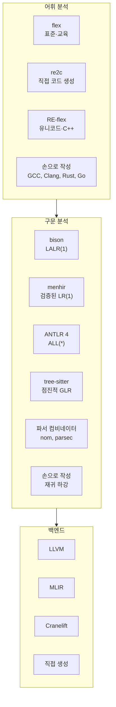
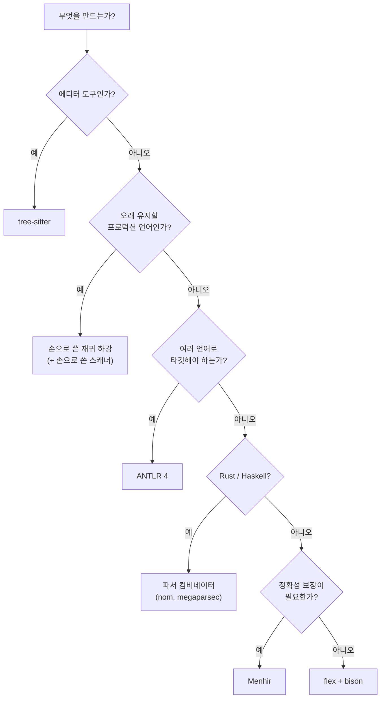

# 22. 도구 지형도

이 교안은 lex와 yacc로 배웠다.
**이론이 코드가 되는 과정이 가장 잘 드러나기 때문**이다.
정규 표현 → DFA → 표, CFG → 항목 집합 → LALR 표라는 변환이
`flex -v`, `bison -v` 로 눈에 보인다.

그러나 새 프로젝트를 시작한다면 다른 선택지가 있다.
이 문서는 그 지도다.

---

## 22.1 한눈에 보기



---

## 22.2 어휘 분석기 생성기

### flex

이 교안의 기준. **POSIX lex의 상위 호환**이고 어디에나 있다.

| | |
|---|---|
| 장점 | 표준, 어디서나 동작, 자료가 많다, 이론이 그대로 보인다 |
| 단점 | C 중심, 유니코드가 약하다, 생성 코드가 읽기 어렵다 |
| 쓸 때 | 학습, 작은 도구, 기존 코드베이스 |

### re2c

표 대신 **직접 코드(direct-coded DFA)** 를 생성한다.
[5장에서 손으로 써 본](/docs/regular/finite-automata#방법-2--직접-코딩-direct-coded)
`goto` 기반 코드가 바로 이 방식이다.[^re2c]

[^re2c]: [re2c 벤치마크](https://re2c.org/benchmarks/benchmarks.html).
비교 대상은 ragel과 re2c다 — flex는 submatch 추출을 지원하지 않아 제외되어 있다.

| | |
|---|---|
| 장점 | 표 접근이 없어 캐시 효율이 좋다, **submatch 추출**(TDFA) 지원, 생성 코드를 읽을 수 있다 |
| 단점 | 입력 버퍼 관리를 직접 해야 한다 |
| 쓸 때 | 성능이 정말 중요한 스캐너, 기존 코드에 스캐너만 끼워 넣기 |

### RE/flex

Flex++의 현대적 상위 호환.[^reflex]

[^reflex]: [RE-flex (GitHub)](https://github.com/Genivia/RE-flex) ·
[Genivia 문서](https://www.genivia.com/reflex.html)

| | |
|---|---|
| 장점 | **유니코드 패턴**, indent/nodent/dedent 앵커, lazy quantifier, word boundary. Bison과 그대로 연동 |
| 단점 | flex보다 자료가 적다 |
| 쓸 때 | C++ 프로젝트, 유니코드가 필요한 언어, Python처럼 들여쓰기 기반 문법 |

**indent/dedent 앵커**가 특히 흥미롭다.
[3장에서 "정규언어가 아니다"라고 한](/docs/regular/regular-languages#정규언어로-안-되는-것들)
Python식 블록 구조를, 도구가 내장 기능으로 지원한다.

최근 릴리스도 활발하다 — 6.0.0(2025-06)에서 `Matcher::find()` 의
예측 매칭 방식을 개선했고, 6.1.0(2026-03)이 최신이다.

### 손으로 쓰기

**GCC, Clang, Rust, Go, TypeScript, V8 — 모두 손으로 쓴 스캐너다.**

| | |
|---|---|
| 장점 | 오류 메시지 완전 제어, 유니코드 자유, lexer hack 같은 예외 처리가 자연스럽다 |
| 단점 | 명세가 코드에 흩어진다, 작성이 느리다 |
| 쓸 때 | 프로덕션 컴파일러, 진단 품질이 중요한 경우 |

---

## 22.3 파서 생성기

### bison

| | |
|---|---|
| 알고리즘 | LALR(1) 기본, LR(1)·GLR 옵션 |
| 장점 | 표준, 빠르다, `.output` 으로 내부가 보인다, 성숙하다 |
| 단점 | 오류 메시지가 약하다, C 중심, 문법을 LALR에 맞춰야 한다 |
| 쓸 때 | 학습, 문법이 이미 LALR에 맞는 경우, 기존 코드베이스 |

### Menhir (OCaml)

**검증된 LR(1) 파서 생성기**다. Coq 증명을 함께 생성할 수 있다.

CompCert가 파서에 이것을 쓴다 —
[21장에서 언급한](/docs/modern/trends#216-검증된-컴파일러)
"파서는 CompCert의 검증 대상이 아니다"의 이유가 여기 있다.
Menhir가 이미 검증된 파서를 만들어 주기 때문이다.

| | |
|---|---|
| 장점 | 완전한 LR(1)(LALR 병합 문제 없음), 훌륭한 오류 메시지, 형식 검증 |
| 단점 | OCaml 전용 |
| 쓸 때 | OCaml 프로젝트, 정확성 보장이 필요한 경우 |

### ANTLR 4

| | |
|---|---|
| 알고리즘 | [ALL(\*)](/docs/modern/trends#213-all--런타임으로-미룬-문법-분석) |
| 타깃 | Java, C#, Python, JavaScript, Go, C++, Swift, PHP, Dart |
| 장점 | **좌재귀 직접 지원**, 생성 코드가 읽힌다, 자동 visitor/listener, 도구가 좋다 |
| 단점 | 런타임 라이브러리 필요, bison보다 느리다, 모호성을 조용히 해소 |
| 쓸 때 | 다중 언어 타깃, 문법 프로토타이핑, DSL |

문법을 손보지 않고 쓸 수 있다는 점이 실무에서 큰 이득이다.

### tree-sitter

| | |
|---|---|
| 알고리즘 | 점진적 GLR |
| 문법 | JavaScript DSL |
| 출력 | C 또는 WebAssembly |
| 장점 | **점진적**, **오류 내성**, CST 생성, 에디터 생태계 |
| 단점 | 의미 동작을 붙이기 어렵다 — 트리를 만드는 데 특화 |
| 쓸 때 | 에디터 도구, 문법 하이라이팅, 코드 탐색·분석, 리팩터링 도구 |

**컴파일러 프론트엔드로는 적합하지 않다.**
액션에서 코드를 뱉는 방식이 아니라 "일단 트리를 만든다"는 설계이기 때문이다.
반대로 에디터 도구에는 이것이 정확히 필요한 성질이다.

### 파서 컴비네이터

생성기가 아니라 **라이브러리**다. 파서를 값으로 다루고 조합한다.

```rust
// nom (Rust) 스타일
fn expr(i: &str) -> IResult<&str, Expr> {
    let (i, first) = term(i)?;
    fold_many0(pair(one_of("+-"), term), first, |acc, (op, t)| {
        Expr::Bin(op, Box::new(acc), Box::new(t))
    })(i)
}
```

| 라이브러리 | 언어 |
|---|---|
| nom, chumsky, winnow | Rust |
| parsec, megaparsec | Haskell |
| FParsec | F# |
| Parsimmon | JavaScript |

| | |
|---|---|
| 장점 | 별도 빌드 단계 없음, 타입 안전, 디버깅이 쉽다, 동적으로 조합 가능 |
| 단점 | 좌재귀 불가(수동 변환), 성능 예측이 어렵다, 문법이 코드에 묻힌다 |
| 쓸 때 | Rust/Haskell 프로젝트, 작은 형식, 빌드 단계를 늘리기 싫을 때 |

### 손으로 쓴 재귀 하강

**프로덕션 컴파일러의 지배적 선택이다.**
GCC, Clang, Rust, Go, TypeScript, C# 모두 그렇다.

| | |
|---|---|
| 장점 | **최고의 오류 메시지**, 완전한 제어, 디버깅이 쉽다, 문법 밖 처리가 자연스럽다 |
| 단점 | 작성이 느리다, 좌재귀 수동 처리, 문법 명세가 코드에 흩어진다 |
| 쓸 때 | 오래 유지할 언어, 사용자 경험이 중요한 경우 |

:::note[왜 프로덕션은 손으로 쓰는가]
성능 때문이 아니다. **진단 품질과 제어권** 때문이다.

- "여기서 `,` 를 기대했는데 `;` 가 왔습니다. **struct 리터럴을 파싱하는 중입니다.**"
  같은 메시지는 함수 호출 스택이 곧 문맥이어야 나온다.
- C의 lexer hack, C++의 템플릿 모호성, JavaScript의 ASI(자동 세미콜론 삽입)처럼
  **문법 밖의 규칙**을 넣기가 쉽다.
- 부분 파싱, 취소, 재개 같은 LSP 요구를 맞추기 쉽다.

교안에서 [05-recursive-descent](/docs/labs/yacc-labs#실습-6--재귀-하강-계산기-ll)를
만들어 본 것이 그래서 의미가 있다.
:::

---

## 22.4 선택 가이드



### 상황별 정리

| 상황 | 어휘 | 구문 |
|---|---|---|
| **컴파일러 수업 과제** | flex | bison |
| 설정 파일 파서 | flex 또는 손코딩 | bison 또는 손코딩 |
| 사내 DSL | flex | ANTLR 또는 bison |
| VS Code 확장 | — | tree-sitter |
| 새 프로그래밍 언어 (진지하게) | 손코딩 | 손코딩 재귀 하강 |
| 로그·데이터 형식 | re2c 또는 flex | 손코딩 |
| Rust 프로젝트 | logos | nom / chumsky |
| 정확성이 최우선 | — | Menhir |
| 성능이 최우선 | re2c | bison + `-Cf` 스캐너 |

---

## 22.5 백엔드

프론트엔드를 만들었다면 그다음은 무엇인가.

### 직접 코드 생성

[통합 프로젝트](/docs/labs/mini-compiler)에서 한 것처럼
3-주소 코드나 어셈블리를 직접 뱉는다.

- 배우기에는 최고
- 최적화·레지스터 할당·명령 선택을 전부 직접 해야 한다
- 타깃 아키텍처마다 다시 써야 한다

### LLVM

**가장 실용적인 다음 단계다.** LLVM IR을 뱉으면
최적화와 코드 생성을 전부 얻는다.

```
프론트엔드 (당신이 만든 것) → LLVM IR → 최적화 → x86 / ARM / RISC-V / WASM
```

Clang, Rust, Swift, Julia, Zig가 이렇게 한다.
LLVM 공식 튜토리얼 *Kaleidoscope* 가 좋은 출발점이다.

### MLIR

[21장에서 다룬](/docs/modern/trends#214-mlir--여러-층의-ir) 다층 IR.
도메인 특화 최적화가 필요할 때 — 텐서 연산, 하드웨어 가속기 —
LLVM IR로 내려가기 전에 할 일이 있을 때 쓴다.

### Cranelift

WebAssembly 런타임(Wasmtime)의 백엔드.
**컴파일 속도**가 중요할 때 LLVM의 대안이다.
JIT에 적합하다.

### 인터프리터 / 바이트코드 VM

기계어를 아예 안 만드는 선택도 있다.
Python, Ruby, Lua, JVM이 그렇게 한다.

- 이식성이 최고
- 구현이 훨씬 간단하다
- 필요하면 나중에 JIT를 붙인다

---

## 22.6 이 교안 이후

### 바로 해 볼 수 있는 것

1. **[통합 프로젝트의 확장 과제](/docs/labs/mini-compiler#5-확장-과제)** —
   `for` 문, 상수 접기, 단축 평가, 스코프, 함수
2. **3-주소 코드 인터프리터** — 만든 컴파일러가 진짜로 동작하는지 확인한다
3. **같은 언어를 다른 도구로** — ANTLR이나 tree-sitter로 다시 만들어 비교

### 다음 단계 주제

| 주제 | 왜 |
|---|---|
| **기본 블록과 흐름 그래프** | 모든 최적화의 전제 |
| **데이터 흐름 분석** | 도달 정의, 활성 변수 — [12장의 고정점 계산](/docs/parsing/syntax-analysis#123-first-집합)과 같은 패턴이다 |
| **SSA 형식** | 현대 최적화의 표준 표현 |
| **레지스터 할당** | 그래프 색칠, 선형 스캔 |
| **가비지 컬렉션** | 관리형 언어를 만든다면 |
| **타입 추론** | Hindley–Milner |

### 추천 자료

**책**
- Aho, Lam, Sethi, Ullman, *Compilers: Principles, Techniques, and Tools* — 용책. 백엔드 부분
- Cooper & Torczon, *Engineering a Compiler* — 최적화가 더 자세하다
- Appel, *Modern Compiler Implementation* — ML/Java/C 세 판본
- Nystrom, *Crafting Interpreters* — [온라인 무료](https://craftinginterpreters.com/).
  손으로 쓴 재귀 하강 + 바이트코드 VM. 이 교안 다음에 읽기 좋다

**온라인**
- [LLVM Kaleidoscope 튜토리얼](https://llvm.org/docs/tutorial/)
- [MLIR 튜토리얼(Toy 언어)](https://mlir.llvm.org/docs/Tutorials/Toy/)
- [tree-sitter 문법 작성](https://tree-sitter.github.io/tree-sitter/creating-parsers)

---

## 요약

- lex/yacc는 **이론이 코드가 되는 과정이 가장 잘 보이는** 도구라서 교육에 쓴다.
  새 프로젝트에서는 다른 선택이 나을 수 있다.
- **어휘 분석** — flex(표준) / re2c(직접 코드·submatch) /
  RE-flex(유니코드·indent 앵커) / 손코딩(프로덕션).
- **구문 분석** — bison(LALR) / Menhir(검증된 LR(1)) / ANTLR 4(ALL(\*), 다중 타깃) /
  tree-sitter(점진적·오류 내성, 에디터용) / 파서 컴비네이터 /
  **손코딩 재귀 하강(프로덕션 지배적)**.
- **프로덕션이 손으로 쓰는 이유는 성능이 아니라 진단 품질과 제어권**이다.
- tree-sitter는 **컴파일러 프론트엔드로는 부적합**하다. 에디터 도구용이다.
- **백엔드** — 직접 생성(학습) / LLVM(실용적 다음 단계) /
  MLIR(도메인 특화) / Cranelift(컴파일 속도) / 바이트코드 VM(간단·이식성).
- 이 교안 다음으로는 **기본 블록 → 데이터 흐름 분석 → SSA → 레지스터 할당**.
  데이터 흐름 분석은 12장의 FIRST/FOLLOW와 **같은 고정점 계산 패턴**이다.

## 마지막 생각

컴파일러를 배우는 가치는 컴파일러를 만들게 되는 것만이 아니다.

- **"텍스트에 구조를 부여한다"** 는 문제가 어디에나 있다 —
  설정 파일, 쿼리 언어, 템플릿 엔진, 프로토콜, 마크업, 로그
- **"이 문제에 딱 필요한 표현력은 얼마인가"** 라는 질문은
  형식 언어 이론이 준 가장 실용적인 도구다.
  정규 표현으로 될 일에 파서를 쓰지 않고, 파서가 필요한 일에
  정규식을 우겨넣지 않는 판단이 여기서 나온다
- **"기계적으로 변환 가능한 명세"** 라는 발상 —
  정규 표현에서 DFA가, 문법에서 파서가 나온다는 것 — 은
  코드 생성 전반의 원형이다

`flex -v` 로 상태 수를 세어 보고, `bison -v` 로 `.output` 을 열어 보는 습관은
그 이후에도 오래 남는다.
