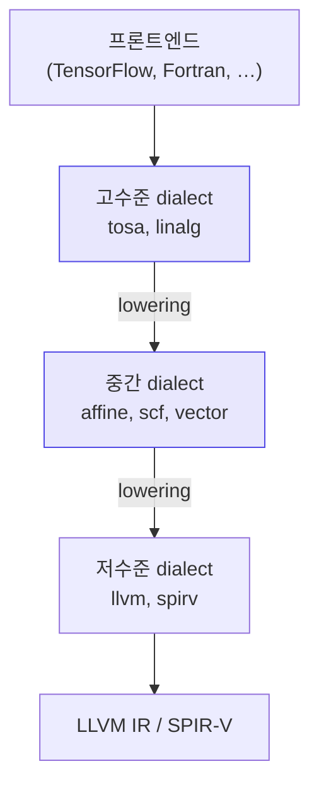

# 21. 최신 경향과 연구

여기까지 배운 것 — 정규 표현, 유한 오토마타, LALR(1) 표 — 은
1960~70년대에 확립된 이론이다.

**그것이 아직도 표준인 이유는 문제가 그때 사실상 풀렸기 때문이다.**
Knuth가 1965년에 LR을 발표했고, DeRemer가 1969년에 LALR로 실용화했다.
결정적 문맥 자유 언어를 선형 시간에 파싱하는 문제에 관한 한, 이론은 완성되어 있다.

그렇다면 지금 컴파일러 연구는 무엇을 하고 있을까?
답은 **문제가 바뀌었다**는 것이다.

| 1970년대의 문제 | 지금의 문제 |
|---|---|
| 파일 하나를 한 번 컴파일 | **에디터에서 타이핑할 때마다** 재파싱 |
| 문법에 맞는지 판정 | **틀린 코드에서도** 쓸 만한 트리 |
| 메모리가 부족하다 | **컴파일이 느리다** |
| 하나의 CPU | CPU + GPU + NPU + FPGA |
| 컴파일러를 믿는다 | 컴파일러가 **옳음을 증명**하라 |
| 사람이 최적화 휴리스틱 작성 | **자동 탐색** |

이 장은 그 변화의 지도다.

:::note[출처에 관하여]
이 장의 주장은 모두 각주의 원자료에 근거한다.
조사 시점은 2026년 8월이고, 1차 자료는 저장소의
`research/RESEARCH-NOTES.md` 에 링크와 함께 정리해 두었다.
:::

---

## 21.1 점진적 파싱

### 문제

에디터에서 글자 하나를 칠 때마다 파일 전체를 다시 파싱하면 느리다.
10,000줄짜리 파일에 문자 하나를 넣었을 뿐인데
전체를 다시 읽는 것은 낭비다.

**필요한 것:** 편집이 들어오면 **바뀐 부분만** 다시 파싱하고,
나머지 트리는 재사용하기.

### tree-sitter — GLR 기반 점진적 파싱

지금 에디터 도구의 사실상 표준이다. VS Code, Emacs, Neovim,
GitHub의 코드 탐색이 모두 쓴다.[^ts]

[^ts]: [tree-sitter 공식 문서](https://tree-sitter.github.io/tree-sitter/),
[Incremental Parsing Using Tree-sitter (Strumenta)](https://tomassetti.me/incremental-parsing-using-tree-sitter/)

**구조**

| 요소 | 내용 |
|---|---|
| 문법 작성 | JavaScript DSL |
| 생성기 | Rust |
| 생성 결과 | C 또는 WebAssembly |
| 알고리즘 | **GLR** (Generalized LR) |

**핵심 아이디어 둘**

**① 서브트리 재사용**
편집을 기존 트리에 적용하고, **변경되지 않은 서브트리는 그대로 재사용**한다.
변경된 영역만 국소적으로 재파싱하므로, 필요한 부분만 다시 계산된다.

**② GLR로 오류를 견딘다**
[16장에서 본](/docs/parsing/lr-parser-implementation#168-glr--충돌을-포기하지-않기)
GLR은 충돌 지점에서 스택을 갈라 모든 가능성을 탐색한다.

이 성질이 두 가지를 준다.

- 실제 프로그래밍 언어의 **모호성**을 문법을 고치지 않고 처리할 수 있다
- 입력이 문법적으로 깨져 있어도, **ERROR 노드를 올바른 위치에 넣은
  유효한 구문 트리**를 만들 수 있다

두 번째가 결정적이다. **에디터에서 타이핑 중인 코드는 항상 문법적으로 틀려 있다.**

```c
if (x > 0 {      ← 아직 ')' 를 안 쳤다
```

전통적 파서는 여기서 실패하고 끝난다.
tree-sitter는 ERROR 노드를 하나 넣고 나머지를 정상적으로 파싱해서,
문법 하이라이팅과 코드 접기가 계속 작동하게 한다.

:::tip[이것이 CST를 만드는 이유이기도 하다]
[12장에서 구분한](/docs/parsing/syntax-analysis#파스-트리-vs-ast)
파스 트리(CST)와 AST 중, tree-sitter는 **CST** 를 만든다.
공백과 괄호까지 전부 담아야 원본 텍스트를 정확히 복원할 수 있고,
문법 하이라이팅은 그 정보가 필요하다.
:::

### 점진적 PEG — 로그 시간 재파싱

더 나아간 연구도 있다.
Yedidia와 Chong의 **gpeg** 는 packrat 파싱의 메모이제이션 테이블을
**interval tree** 로 구현하고 구간 이동(shift)을 지원하게 만들었다.[^gpeg]

[^gpeg]: Zachary Yedidia, Stephen Chong, "Fast Incremental PEG Parsing",
SLE 2021. [PDF](https://people.seas.harvard.edu/~chong/pubs/gpeg_sle21.pdf) ·
[ACM DL](https://dl.acm.org/doi/10.1145/3486608.3486900)

결과: 일반적인 편집에 대해 재파싱이 **입력 크기의 로그 시간**이 된다.
기존 Incremental Packrat Parsing이 선형이었던 것과 비교하면 큰 개선이고,
다양한 입력 크기와 문법에서 **5ms 미만**의 재파싱 성능을 보고한다.

---

## 21.2 PEG — 순서 있는 선택

**PEG(Parsing Expression Grammar)** 는 CFG의 `|`(합집합) 대신
**순서 있는 선택(ordered choice)** `/` 를 쓴다.

$$
A \leftarrow \alpha\ /\ \beta
$$

앞의 것이 성공하면 뒤는 **아예 시도하지 않는다**.

| | CFG | PEG |
|---|---|---|
| 선택 | 집합적 (`\|`) | 순서적 (`/`) |
| 모호성 | 존재할 수 있다 | **정의상 없다** |
| lookahead | 유한 ($k$) | 무제한 (백트래킹) |
| 시간 | LR은 $O(n)$ | packrat 메모이제이션으로 $O(n)$ |

### 실무 사례 — DuckDB의 런타임 확장 가능 SQL 파서

DuckDB는 SQL 파서를 PEG 기반으로 다시 만들었다.
동기는 **런타임에 문법을 확장**하기 위해서다 —
확장(extension)이 로드될 때 새로운 SQL 구문을 동적으로 추가할 수 있다.[^duckdb]

[^duckdb]: [Runtime-Extensible SQL Parsers Using PEG (DuckDB, 2024-11)](https://duckdb.org/2024/11/22/runtime-extensible-parsers).
CIDR 2025 발표 채택.

전통적인 bison 문법으로는 불가능하다.
문법이 컴파일 시점에 표로 굳어지기 때문이다.

### PEG의 약점과 최근 연구

:::danger[PEG는 모호성을 없애는 것이 아니라 숨긴다]
"항상 앞의 것이 이긴다"는 규칙은 편리하지만,
**의도와 다른 대안이 선택되어도 아무 경고가 없다**.

yacc라면 "shift/reduce 충돌 1개"라고 알려 줄 상황에서
PEG는 조용히 첫 번째를 고른다.
:::

또 하나의 약점은 **오류 메시지**다.
ordered choice 때문에 "어디서 진짜로 실패했는지"를 잃어버린다.
`a / b / c` 가 전부 실패하면 마지막 실패 지점만 남는데,
그것이 의미 있는 위치라는 보장이 없다.

이를 개선하는 것이 **labeled failure** 연구다.[^peg1][^peg2]
PEG의 보수적 확장으로, 실패 지점에 **레이블**을 붙이고
레이블마다 **복구 표현식(recovery expression)** 을 연결한다.
PEG의 표현력을 그대로 써서 구문 오류에서 복구할 수 있다.

[^peg1]: Medeiros, Mascarenhas, "Syntax error recovery in parsing expression grammars",
ACM SAC 2018. [DOI](https://dl.acm.org/doi/10.1145/3167132.3167261)

[^peg2]: "Error recovery in PEGs through labeled failures and its implementation
based on a parsing machine", *Journal of Computer Languages*.
[ScienceDirect](https://www.sciencedirect.com/science/article/abs/pii/S1045926X18301897)

---

## 21.3 ALL(\*) — 런타임으로 미룬 문법 분석

[13장에서 소개한](/docs/parsing/ll-parsing#예측-ll--all) ANTLR 4의 알고리즘이다.
핵심 아이디어를 다시 강조할 만하다.

> **문법 분석을 정적 생성 시점이 아니라 런타임으로 미룬다.**

yacc는 빌드 시점에 LALR 표를 전부 계산해 둔다.
ALL(\*)은 각 결정 지점에서 **필요한 만큼** 앞을 보고,
그 결과로 만들어진 예측 DFA를 캐시한다.
파서는 JIT처럼 "예열"되며 실행할수록 빨라진다.[^allstar]

[^allstar]: Parr, Harwell, Fisher, "Adaptive LL(*) Parsing: The Power of Dynamic Analysis",
OOPSLA 2014. [기술 보고서 PDF](https://www.antlr.org/papers/allstar-techreport.pdf) ·
[ACM DL](https://dl.acm.org/doi/10.1145/2714064.2660202)

**성능**

- 이론적으로는 $O(n^4)$
- 실무 문법에서는 일관되게 **선형**
- GLL/GLR보다 **수 자릿수** 빠르다
- Java 컴파일러의 손으로 쓴 파서보다 약 **20%** 느린 수준

**실용적 이득**

문법을 손대지 않고 쓸 수 있다는 것이다.
ALL(\*)은 **좌재귀를 직접 처리해 준다**(내부적으로 변환).
[10장에서 본](/docs/parsing/context-free-grammar#좌재귀-제거)
좌재귀 제거와 그로 인한 결합성 문제를 사용자가 신경 쓰지 않아도 된다.

또한 생성 코드가 **테이블이 아니라 제어 흐름**에 인코딩되므로
디버깅과 읽기가 쉽다 — LALR 테이블 파서의 오랜 약점이었다.

---

## 21.4 MLIR — 여러 층의 IR

### 문제

[1장에서 본](/docs/foundations/compiler-overview#13-프론트엔드와-백엔드)
프론트엔드/백엔드 분리는 $m \times n$ 문제를 $m + n$ 으로 줄였다.
LLVM IR이 그 중간 표현이다.

그런데 LLVM IR은 **너무 낮은 수준**이다.
텐서 연산, 루프 중첩, 도메인 특화 구조 같은 고수준 정보가
LLVM IR로 내려가는 순간 사라진다. 한번 잃으면 복구할 수 없다.

### 해결 — dialect

**MLIR**은 IR을 한 층이 아니라 **여러 추상화 수준의 층**으로 둔다.
Google이 2019년에 오픈소스로 공개했고 현재 LLVM 프로젝트의 일부다.[^mlir]

[^mlir]: [MLIR 관련 논문 목록](https://mlir.llvm.org/pubs/)

각 **dialect(방언)** 는 도메인별 연산·타입·변환을 정의한다.
프론트엔드는 고수준 dialect로 번역하고,
dialect 사이의 표준 변환을 거쳐 점진적으로 LLVM IR까지 **낮춘다(lowering)**.



**핵심은 "정보를 잃기 전에 최적화한다"** 는 것이다.
루프 타일링은 `affine` dialect에서, 텐서 융합은 `linalg` dialect에서 —
그 정보가 살아 있는 층에서 한다.

### 최근 성과

- **Transform Dialect** — "The MLIR Transform Dialect: Your Compiler Is More
  Powerful Than You Think", CGO 2025 (2025-03).
  변환 자체를 IR로 표현해 최적화 전략을 프로그래밍할 수 있게 한다.
- **Qualcomm Hexagon NPU** — MLIR 기반 AI 컴파일러.
  Triton 커널(flash attention, softmax, argmax, matmul) 매핑에 성공하고
  손으로 쓴 커널 성능의 **최대 80%** 를 달성했다.[^hexagon]
- 확장 분야: WebAssembly 컴파일(WAMI), RISC-V 벡터 코드 생성,
  Fortran intrinsic의 AMD AI Engine 가속, 양자 컴퓨팅용 SSA IR(QSSA).

[^hexagon]: [Accelerating ML on Hexagon: A Glimpse into Qualcomm's MLIR-based Compiler](https://llvm.org/devmtg/2025-10/slides/quick_talks/baskaran_slama.pdf),
LLVM Dev Meeting 2025.

:::tip[교안과의 연결]
MLIR의 dialect 개념은 [11장의 촘스키 계층](/docs/parsing/grammar-hierarchy)과
같은 발상이다 — **각 층에 딱 필요한 만큼의 표현력을 배정한다.**

어휘 분석에 정규언어를, 구문 분석에 CFG를 쓰듯,
텐서 최적화에는 텐서를 아는 IR을, 레지스터 할당에는 레지스터를 아는 IR을 쓴다.
:::

---

## 21.5 WebAssembly와 다단계 컴파일

WebAssembly 런타임은 **컴파일 속도와 실행 속도의 트레이드오프**를
정면으로 다룬다. 웹에서는 시작 지연이 곧 사용자 이탈이기 때문이다.

Wasmtime의 두 백엔드를 보자.[^wasmtime]

[^wasmtime]: [Wasmtime baseline compilation RFC](https://github.com/bytecodealliance/rfcs/blob/main/accepted/wasmtime-baseline-compilation.md) ·
[Cranelift](https://github.com/bytecodealliance/wasmtime/tree/main/cranelift)

| | Cranelift | Winch |
|---|---|---|
| 성격 | 최적화 백엔드 | **baseline** 컴파일러 |
| 방식 | 다단계 최적화 패스 | Wasm → 기계어 **단일 패스** 직역 |
| 컴파일 속도 | 기준 | **15~20배 빠름** |
| 실행 속도 | 기준 | **1.1~1.5배 느림** |

**"15~20배 빠른 컴파일, 1.1~1.5배 느린 코드"** 라는 이 수치가
baseline 컴파일러의 존재 이유를 정확히 설명한다.
시작이 빨라야 하는 상황에서 이 교환은 압도적으로 유리하다.

:::caution[아직 tiering은 아니다]
Winch로 시작해 뜨거운 코드만 Cranelift로 자동 재컴파일하는
**진짜 tiering** 은 현재 Wasmtime이 지원하지 않는다.
모듈 단위로 둘 중 하나를 고른다.

JVM이나 V8이 하는 인터프리터 → baseline JIT → 최적화 JIT 식의
다단계 전환은 여전히 구현이 까다로운 문제다.
:::

---

## 21.6 검증된 컴파일러

### 문제

컴파일러에 버그가 있으면 **올바른 소스가 잘못된 실행 파일이 된다**.
소스를 아무리 검증해도 소용이 없다.
항공, 의료, 원자력 소프트웨어에서 이것은 실재하는 위험이다.

### CompCert

기계 검증(Coq)된 **유일한 프로덕션 C 컴파일러**다.
생성된 어셈블리가 소스 C 프로그램의 의미론대로 동작함을
형식적으로 보장한다 — 즉 **miscompilation이 없음이 증명되어 있다**.[^compcert]

[^compcert]: [CompCert (AbsInt)](https://www.absint.com/compcert/index.htm) ·
[GitHub](https://github.com/AbsInt/CompCert) ·
Xavier Leroy, "Formal Verification of a Realistic Compiler",
[CACM](https://cacm.acm.org/research/formal-verification-of-a-realistic-compiler/)

| 항목 | 값 |
|---|---|
| 타깃 | ARM, PowerPC, RISC-V, x86 |
| 증명 규모 | 약 **42,000줄**의 Coq 코드 |
| 개발 비용 | 약 **3 person-year** |

**증명의 모듈성**이 실용적 가치를 만든다.
개별 구성 요소(특히 Clight를 생성하는 `clightgen` 프론트엔드)를
따로 떼어 다른 응용에 쓰거나 확장할 수 있다.

### 그 위에 쌓인 것들

- **2025** — Cornell 연구진이 `clightgen` 으로
  Bitcoin이 쓰는 libsecp256k1의 modular-inverse 구현(safegcd)의
  정확성을 형식 검증했다.[^safegcd]
- 세계 각지의 연구 그룹이 **검증된 최적화**를 추가해 왔다 —
  루프 최적화, peephole 최적화 등.
- CompCert 백엔드를 **형식 검증된 JIT** 로 전환하는 연구도 있다.[^jit]

[^safegcd]: [Formal Verification of the Safegcd Implementation](https://arxiv.org/pdf/2507.17956), arXiv:2507.17956

[^jit]: [Formally Verified Native Code Generation in an Effectful JIT](https://arxiv.org/pdf/2212.03129), arXiv:2212.03129

:::note[교안과의 연결]
CompCert의 검증 대상에 **파서는 포함되지 않는다**.
파서는 별도로 검증된 Menhir(검증된 LR(1) 파서 생성기)가 담당한다.

이유가 흥미롭다 — LR 파싱의 정확성은
[15장에서 본](/docs/parsing/lr-parsing) 이론으로 이미 증명되어 있고,
생성기가 그 이론을 올바르게 구현했는지만 확인하면 된다.
**이론이 확립되어 있다는 것의 실용적 가치**를 보여 주는 사례다.
:::

---

## 21.7 LLM과 컴파일러

가장 활발하고, 가장 오해가 많은 영역이다.

### 무엇이 실제로 되고 있는가

**LLM Compiler** (CC 2025, 컴파일러 구성 분야 최고 학회)가 대표적이다.
Code Llama를 **어셈블리와 컴파일러 IR의 대규모 코퍼스**로 추가 사전학습한 뒤,
컴파일러 에뮬레이션 데이터셋으로 instruction fine-tuning 했다.[^llmc]

[^llmc]: "LLM Compiler: Foundation Language Models for Compiler Optimization",
CC 2025 (34th ACM SIGPLAN Int'l Conference on Compiler Construction, 2025-03).
[ACM DL](https://dl.acm.org/doi/10.1145/3708493.3712691)

관련 자원과 연구:

| 이름 | 내용 |
|---|---|
| **ComPile** | 프로덕션 소스에서 수집한 대규모 LLVM IR 데이터셋[^compile] |
| **Compiler-R1** | 강화학습 기반 컴파일러 auto-tuning (2025) |
| **Magellan** | AlphaEvolve로 **새로운 최적화 휴리스틱을 자동 발견**[^magellan] |
| **PassNet** | 그래프 컴파일러의 패스 생성[^passnet] |
| **CoLo** | LLM이 생성한 IR의 오류 위치 정밀 교정 (ICS 2026) |

[^compile]: [ComPile: A Large IR Dataset from Production Sources](https://arxiv.org/pdf/2309.15432), arXiv:2309.15432

[^magellan]: [Magellan: Autonomous Discovery of Novel Compiler Optimization Heuristics with AlphaEvolve](https://arxiv.org/pdf/2601.21096), arXiv:2601.21096

[^passnet]: [PassNet: Scaling Large Language Models for Graph Compiler Pass Generation](https://arxiv.org/pdf/2605.29357), arXiv:2605.29357

전반적인 지형은 서베이 논문이 잘 정리하고 있다.[^survey]

[^survey]: [Language Models for Code Optimization: Survey, Challenges and Future Directions](https://arxiv.org/pdf/2501.01277), arXiv:2501.01277

### 성과가 몰린 곳과 몰리지 않은 곳

:::danger[두 영역을 구분해서 보자]

**LLM이 성과를 내는 곳 — 탐색 문제**

- 최적화 **휴리스틱** 탐색 (어떤 패스를 어떤 순서로?)
- auto-tuning (타일 크기, 언롤 횟수를 얼마로?)
- 커널 생성 (CUDA, Triton)

이 문제들의 공통점: **정답이 여럿이고, 어느 것이 좋은지는 실행해 봐야 안다.**
탐색 공간이 거대하고 사람이 만든 휴리스틱이 최적이라는 보장이 없다.
LLM이 잘하는 종류의 문제다.

**LLM이 대체하지 못한 곳 — 결정론적 정확성**

- 어휘 분석
- 구문 분석
- 타입 검사

이 문제들의 공통점: **정답이 하나이고, 틀리면 안 된다.**
`int x = 1;` 을 파싱하는 데 확률적 모델을 쓸 이유가 없다.
DFA는 확실하고, 빠르고, 증명 가능하다.

**이 구분이 이 장에서 가장 중요한 내용이다.**
:::

바꿔 말하면, 4부까지 배운 이론은 LLM 시대에도 **대체되지 않는다**.
오히려 LLM 기반 도구가 생성한 IR이 올바른지 **검증하는 쪽**에서
형식적 방법의 중요성이 커지고 있다 (위의 CoLo 연구가 그 예다).

---

## 21.8 파싱 이론은 끝났는가

"LR로 다 풀렸는데 왜 아직 연구하는가"에 대한 답을 정리하자.

| 남은 문제 | 접근 |
|---|---|
| **오류가 있는 입력**에서 유용한 트리 | GLR (tree-sitter), labeled failure (PEG) |
| **점진적** 재파싱 | tree-sitter, gpeg (로그 시간) |
| **좋은 오류 메시지** | 오류 생성 규칙, 반례 생성(`-Wcounterexamples`) |
| **문법의 조합·확장** | PEG (DuckDB), 모듈러 문법 |
| **문법 자체의 검증** | Menhir + Coq |
| 언어 서버 프로토콜(LSP)의 요구 | 부분 파싱, 취소 가능한 파싱 |

(**LSP** = Language Server Protocol. 에디터와 언어 분석기가 주고받는 표준 규약이다. VS Code의 자동완성·정의로 이동·오류 표시가 이 위에서 동작한다.)

공통점이 보인다. **1970년대의 배치 컴파일 모델이 전제하지 않았던 요구들**이다.

- 그때 파서는 하루에 몇 번 돌았다. 지금은 **키 입력마다** 돈다.
- 그때 입력은 완성된 파일이었다. 지금은 **작성 중인 텍스트**다.
- 그때 출력은 성공/실패였다. 지금은 **구조·타입·자동완성 후보**다.

---

## 요약

- **점진적 파싱** — tree-sitter는 GLR로 서브트리를 재사용하고,
  깨진 입력에도 ERROR 노드를 넣은 유효한 트리를 만든다.
  gpeg는 packrat 메모 테이블을 interval tree로 만들어
  **로그 시간 재파싱**을 달성했다.
- **PEG** — ordered choice로 모호성을 정의상 제거한다.
  DuckDB가 **런타임 문법 확장**을 위해 채택했다.
  대가는 나쁜 오류 메시지이고, **labeled failure** 연구가 이를 개선한다.
  "모호성을 없애는 것이 아니라 숨긴다"는 점을 기억하자.
- **ALL(\*)** — 문법 분석을 런타임으로 미뤄 좌재귀까지 직접 처리한다.
  이론상 $O(n^4)$ 이나 실무에서는 선형.
- **MLIR** — IR을 여러 dialect 층으로 두고 점진적으로 낮춘다.
  **정보를 잃기 전에 최적화한다**는 원리.
  촘스키 계층과 같은 발상이다.
- **WebAssembly** — baseline 컴파일러(Winch)는
  **15~20배 빠른 컴파일 / 1.1~1.5배 느린 코드**.
  진짜 tiering은 아직 미해결.
- **CompCert** — 기계 검증된 유일한 프로덕션 C 컴파일러.
  42,000줄 Coq, 3 person-year. **파서는 검증 대상이 아니다** —
  이론이 이미 확립되어 있기 때문이다.
- **LLM** — 성과는 **최적화 휴리스틱 탐색과 auto-tuning** 에 몰려 있다.
  **어휘·구문 분석처럼 결정론적 정확성이 필요한 영역은 여전히
  형식 문법 + 생성기의 것이다.** 이 구분이 핵심이다.
- 파싱 이론이 아직 연구되는 이유는, **1970년대가 전제하지 않은 요구**
  (에디터 통합, 오류 내성, 점진성)가 생겼기 때문이다.

## 더 읽을거리

**논문**
- Parr et al., *Adaptive LL(\*) Parsing* (OOPSLA 2014) — ANTLR 4의 이론
- Yedidia & Chong, *Fast Incremental PEG Parsing* (SLE 2021)
- Leroy, *Formal Verification of a Realistic Compiler* (CACM) — CompCert
- *LLM Compiler* (CC 2025)
- *Language Models for Code Optimization: Survey* (arXiv:2501.01277)

**문서**
- [MLIR 논문 목록](https://mlir.llvm.org/pubs/)
- [tree-sitter 문서](https://tree-sitter.github.io/tree-sitter/)
- [DuckDB PEG 파서](https://duckdb.org/2024/11/22/runtime-extensible-parsers)

**학회**
- **PLDI** — 프로그래밍 언어 설계·구현
- **CC** — 컴파일러 구성 (LLM Compiler가 여기 발표되었다)
- **CGO** — 코드 생성과 최적화 (MLIR Transform Dialect)
- **SLE** — 소프트웨어 언어 공학 (파싱 연구가 많다)
- **POPL** — 프로그래밍 언어 원리 (형식 검증)

---

다음 문서에서는 이 기술들이 **실제 도구 지형에서 어디에 있는지** 정리한다.
