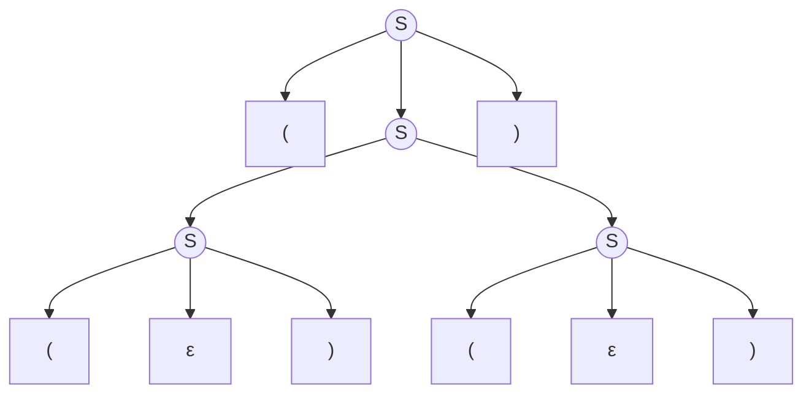
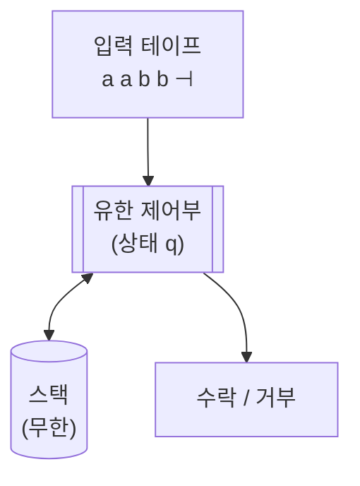
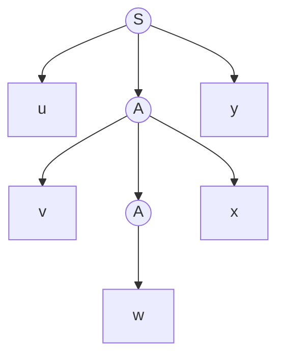
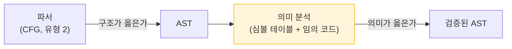

# 10. 문맥 자유 문법

3부까지 우리는 소스 텍스트를 토큰 스트림으로 바꿀 수 있게 되었다.
그러나 아직 못 하는 일이 있다.

```c
if (x > 0 { y = 1; }      /* 괄호가 안 맞는다 */
```

토큰 하나하나는 전부 올바르다. `if`, `(`, `x`, `>`, `0`, `{`, ... 문제는
**구조**다. 그리고 [3장에서 증명했듯이](/docs/regular/regular-languages#34-정규언어의-한계)
정규언어는 짝 맞추기를 표현할 수 없다.

더 강한 도구가 필요하다. 그것이 **문맥 자유 문법**이다.

---

## 10.1 정의

:::info[정의 — 문맥 자유 문법 (CFG, Context-Free Grammar)]

문법 $G = (V_N, V_T, P, S)$ 에서 **모든 생성 규칙이 다음 형태**이면
$G$ 를 문맥 자유 문법이라 한다.

$$
A \to \alpha \qquad (A \in V_N,\ \alpha \in (V_N \cup V_T)^*)
$$

즉 **좌변은 넌터미널 하나**여야 하고, 우변은 아무 심볼 열이나 될 수 있다.
:::

[3장의 정규 문법](/docs/regular/regular-languages#32-정규-문법)과 비교해 보자.

| | 좌변 | 우변 |
|---|---|---|
| 정규 문법 | 넌터미널 하나 | `aB`, `a`, `ε` (넌터미널은 한쪽 끝에 최대 하나) |
| **문맥 자유 문법** | 넌터미널 하나 | **제한 없음** |

우변의 제한이 사라진 것이 전부다. 그런데 그 하나로 표현력이 크게 늘어난다.

### "문맥 자유"라는 이름의 뜻

$A \to \alpha$ 는 "$A$ 를 $\alpha$ 로 바꿔도 된다"인데,
**주변에 무엇이 있든 상관없이** 그렇다.
$A$ 의 왼쪽에 무엇이 오든, 오른쪽에 무엇이 오든 규칙 적용은 똑같다.

**문맥 의존 문법(context-sensitive grammar)** 은 이렇게 쓴다.

$$
\alpha A \beta \to \alpha \gamma \beta
$$

"$\alpha$ 와 $\beta$ 사이에 있을 때만 $A$ 를 $\gamma$ 로 바꿔라."
문맥에 의존하는 것이다. [다음 장](/docs/parsing/grammar-hierarchy)에서 계층을 정리한다.

---

## 10.2 CFG로 표현되는 것

### 짝 맞추기

$$
S \to (\,S\,) \mid SS \mid \varepsilon
$$

짝이 맞는 모든 괄호 문자열을 생성한다.
`()`, `(())`, `()()`, `(()())` 등.



정규 표현으로는 **불가능**한 일이다.
왜 CFG로는 가능할까? **재귀** 때문이다.
$S$ 의 우변에 다시 $S$ 가 나타나면서, 열린 괄호의 개수를
"파스 트리의 깊이"라는 무한한 자원에 기록할 수 있다.

### 산술식

$$
\begin{aligned}
E &\to E + T \mid T \\
T &\to T * F \mid F \\
F &\to (\,E\,) \mid \mathbf{id}
\end{aligned}
$$

[2장에서 본](/docs/foundations/language-and-grammar#24-모호성)
우선순위와 결합성을 새긴 문법이다. 4부 내내 이 문법을 쓴다.

### 중첩 블록

$$
\begin{aligned}
S &\to \mathbf{if}\ E\ \mathbf{then}\ S\ \mathbf{else}\ S \mid \mathbf{if}\ E\ \mathbf{then}\ S \mid \mathbf{other} \\
S &\to \{\ L\ \} \\
L &\to L\ S \mid \varepsilon
\end{aligned}
$$

### CFG로도 안 되는 것

CFG의 힘도 무한하지는 않다. 다음은 **문맥 자유가 아니다**.

| 언어 | 왜 안 되는가 |
|---|---|
| $\{a^n b^n c^n\}$ | 세 개를 동시에 세야 한다. 스택 하나로는 부족 |
| $\{ww \mid w \in \Sigma^*\}$ | 스택은 LIFO라 앞부분을 순서대로 다시 못 읽는다 |
| **"변수는 사용 전에 선언되어야 한다"** | 선언된 이름 전부를 기억해야 한다 |
| **"함수 호출의 인자 개수가 선언과 맞아야 한다"** | 같은 이유 |

:::danger[마지막 둘이 중요하다]
실제 프로그래밍 언어의 규칙 중 상당수가 **문맥 자유가 아니다**.

```c
int x;
y = 1;      /* y 가 선언되지 않았다 — 문법적으로는 완벽히 옳다 */
```

이것이 컴파일러에 **의미 분석 단계**가 따로 있는 이유다.
파서는 "구조가 옳은가"만 보고, "의미가 옳은가"는 심볼 테이블을 든
별도의 패스가 검사한다.

이 분업은 [1장](/docs/foundations/compiler-overview#12-컴파일러의-단계)에서
본 그대로이고, 이유는 순수하게 **이론적**이다 —
CFG의 표현력이 거기까지이기 때문이다.
:::

---

## 10.3 푸시다운 오토마타

정규언어에 유한 오토마타가 대응했듯이,
문맥 자유 언어에는 **푸시다운 오토마타(PDA, Pushdown Automaton)** 가 대응한다.

:::info[정의 — PDA]
$M = (Q, \Sigma, \Gamma, \delta, q_0, Z_0, F)$

| 요소 | 의미 |
|---|---|
| $Q$ | 상태 집합 (유한) |
| $\Sigma$ | 입력 알파벳 |
| $\Gamma$ | **스택 알파벳** |
| $\delta$ | $Q \times (\Sigma \cup \{\varepsilon\}) \times \Gamma \to 2^{Q \times \Gamma^*}$ |
| $q_0$ | 시작 상태 |
| $Z_0$ | 스택 시작 기호 |
| $F$ | 종결 상태 집합 |
:::

유한 오토마타에 **스택 하나**를 붙인 것이 전부다.



$\delta(q, a, X) \ni (p, \gamma)$ 는 이렇게 읽는다.

> 상태 $q$ 에서 입력 $a$ 를 읽고 스택 맨 위가 $X$ 이면,
> 상태 $p$ 로 가면서 $X$ 를 $\gamma$ 로 바꾼다.

- $\gamma = \varepsilon$ → **팝**
- $\gamma = X$ → 그대로
- $\gamma = YX$ → **푸시**

### 왜 스택 하나면 되는가

$\{a^n b^n\}$ 을 인식해 보자.

```
a 를 읽을 때마다  → 스택에 A 를 푸시
b 를 읽을 때마다  → 스택에서 A 를 팝
입력이 끝났을 때  → 스택이 비어 있으면 수락
```

**세는 일을 스택의 높이가 대신한다.**
스택은 무한하므로 $n$ 에 상한이 없다.

그런데 $\{a^n b^n c^n\}$ 은 안 된다.
$b$ 를 세면서 스택을 비워 버렸으므로 $c$ 를 셀 때 쓸 정보가 남지 않는다.
스택이 **두 개**면 될 텐데, 스택 두 개짜리 기계는
사실 튜링 기계와 같은 힘을 갖는다.

:::info[정리]
언어 $L$ 이 문맥 자유인 것과, $L$ 을 인식하는 PDA가 존재하는 것은 동치다.

- CFG → PDA 변환: 좌측 유도를 스택으로 흉내 낸다 (**하향식**, LL의 원리)
- CFG → PDA 변환: 우측 유도의 역을 스택으로 흉내 낸다 (**상향식**, LR의 원리)
:::

### CFG를 PDA로 바꾸는 법

"흉내 낸다"가 무슨 말인지 실제로 해 보자.
**규칙이 딱 세 가지**다. 상태는 하나($q$)면 충분하다.

:::info[하향식 변환]
문법 $G = (V_N, V_T, P, S)$ 로부터 PDA를 만든다.
스택 알파벳은 $V_N \cup V_T$, 스택 시작 기호는 시작 심볼 $S$ 다.

| # | 전이 | 뜻 |
|---|---|---|
| 1 | $\delta(q,\ \varepsilon,\ A) \ni (q,\ \alpha)$ &nbsp; (규칙 $A \to \alpha$ 마다) | **전개** — 스택 맨 위 넌터미널을 우변으로 바꾼다 |
| 2 | $\delta(q,\ a,\ a) = \{(q,\ \varepsilon)\}$ &nbsp; (터미널 $a$ 마다) | **일치** — 입력과 스택 맨 위가 같으면 둘 다 소비 |
| 3 | 스택이 비면 수락 | 유도가 끝났다는 뜻 |
:::

**스택에는 "아직 만들어야 할 것"이 쌓인다.**
처음에는 $S$ 하나뿐이고, 규칙 1로 잘게 부수다가
터미널이 맨 위로 올라오면 규칙 2로 입력과 대조해 지운다.

**돌려 보기 — 괄호 문법**

$$
S \to (\,S\,) \mid S\,S \mid \varepsilon
$$

입력 `()` 를 넣는다. 스택은 **왼쪽이 맨 위**다.

| # | 남은 입력 | 스택 | 적용 |
|---|---|---|---|
| 1 | `()` | $S$ | 규칙 1: $S \to (S)$ |
| 2 | `()` | $(\,S\,)$ | 규칙 2: `(` 일치 |
| 3 | `)` | $S\,)$ | 규칙 1: $S \to \varepsilon$ |
| 4 | `)` | $)$ | 규칙 2: `)` 일치 |
| 5 | — | (빔) | **수락** ✅ |

**규칙 1을 쓸 때마다 좌측 유도가 한 걸음 나아간다.**
위 추적을 유도로 다시 쓰면 정확히 이것이다.

$$
S \Rightarrow (\,S\,) \Rightarrow (\,)
$$

:::caution[여기서 비결정성이 나온다]
3행에서 스택 맨 위가 $S$ 였다.
$S$ 의 규칙은 셋이므로 **어느 것을 쓸지 정해져 있지 않다.**

- $S \to (S)$ 를 골랐다면? 다음 입력이 `)` 라서 막힌다.
- $S \to SS$ 를 골랐다면? 역시 결국 막힌다.
- $S \to \varepsilon$ 이 정답이다.

PDA는 "모든 갈래를 동시에" 시도할 수 있으므로 문제가 없다.
그런데 **실제 프로그램은 갈래를 하나만 고를 수 있다.**

여기서 두 갈래가 생긴다.

- **다음 토큰을 보고 규칙을 고른다** → 그것이 [13장의 LL(1)](/docs/parsing/ll-parsing#132-표-구동-예측-파싱)이다.
  규칙 1의 선택을 결정적으로 만드는 것이 `LL(1)` 표다.
- **고르지 말고, 다 만들어진 뒤에 되짚는다** → 그것이 [15장의 LR](/docs/parsing/lr-parsing)이다.
:::

**상향식은 이 표를 뒤집으면 된다.** 스택에 "이미 읽은 것"을 쌓고,
우변이 맨 위에 모이면 좌변으로 바꾼다(축약).
[15.1절의 이동-축약 추적표](/docs/parsing/lr-parsing#151-이동-축약-파싱)가
바로 이 PDA의 실행 기록이다.

**이 두 변환이 곧 13장의 LL 파서와 15장의 LR 파서다.**
파서가 스택을 갖는 이유는 취향이 아니라 이론적 필연이다.

### 결정적 PDA

유한 오토마타에서는 NFA와 DFA의 표현력이 같았다.
**PDA에서는 그렇지 않다.**

$$
\text{결정적 문맥 자유 언어 (DCFL)} \subsetneq \text{문맥 자유 언어 (CFL)}
$$

즉 어떤 CFL은 **비결정적 PDA로만** 인식된다.
대표적인 예가 회문 $\{ww^R\}$ 이다 — 어디가 중간인지 미리 알 수 없다.

:::tip[실무적 함의]
- **DCFL**은 선형 시간에 파싱된다. **LR(1) 문법이 인식하는 언어가 정확히 DCFL이다.**
- 일반 CFL은 $O(n^3)$ 이 필요하다 (CYK, Earley).

프로그래밍 언어를 설계할 때 문법을 LR(1)에 맞추려 애쓰는 이유가 여기 있다.
선형 시간을 얻기 위해서다.

C++처럼 문법이 DCFL을 벗어난 언어는 파서가 훨씬 복잡해지고,
악명 높은 "most vexing parse" 같은 모호성이 생긴다.
:::

---

## 10.4 CFG의 펌핑 보조정리

정규언어에 펌핑 보조정리가 있었듯이, CFL에도 있다.
"이 언어는 문맥 자유가 아니다"를 증명하는 도구다.

:::info[정리 — CFL의 펌핑 보조정리]

$L$ 이 문맥 자유 언어이면, 어떤 상수 $p$ 가 존재하여
$|z| \geq p$ 인 모든 $z \in L$ 을 $z = uvwxy$ 로 쪼갤 수 있고

1. $|vwx| \leq p$
2. $|vx| \geq 1$ (즉 $v$ 와 $x$ 가 동시에 비어 있지는 않다)
3. 모든 $i \geq 0$ 에 대해 $uv^iwx^iy \in L$
:::

**직관.** 파스 트리가 충분히 깊으면,
루트에서 어떤 잎으로 가는 경로에 **같은 넌터미널이 두 번** 나타난다
(비둘기집 원리). 그 사이 부분을 통째로 반복하거나 잘라낼 수 있다.



$A$ 를 기준으로 안쪽 서브트리를 잘라내면 $uwy$,
$A$ 부분을 한 번 더 끼워 넣으면 $uv^2wx^2y$ 가 된다.

정규언어의 펌핑이 **한 곳**($y$)을 반복했다면,
CFL의 펌핑은 **두 곳**($v$와 $x$)을 **동시에** 반복한다.
파스 트리가 이분지(二分枝)이기 때문이다.

### 증명 예제 — `{aⁿbⁿcⁿ}` 은 CFL이 아니다 {#proof-anbncn}

$z = a^pb^pc^p$ 를 택한다. $z = uvwxy$ 로 쪼개면 조건 1
$|vwx| \leq p$ 에 의해 $vwx$ 는 **세 종류 문자 중 최대 두 종류**만 포함한다
($a$ 구간과 $c$ 구간은 $p$ 이상 떨어져 있으므로 둘 다 걸칠 수 없다).

$i = 2$ 로 펌프하면, $vwx$ 에 포함된 문자만 개수가 늘어난다.
포함되지 않은 나머지 한 종류는 그대로다.
따라서 세 개수가 같지 않게 되어 $uv^2wx^2y \notin L$. 모순. $\blacksquare$

---

## 10.5 문법 정규화

같은 언어를 생성하는 문법은 여러 개다.
파서를 만들기 좋은 형태로 문법을 고치는 작업을 살펴보자.

### 쓸모없는 심볼 제거

**도달 불가능(unreachable)** — $S$ 에서 $\Rightarrow^*$ 로 닿을 수 없는 넌터미널
**비생성적(non-productive)** — 어떤 터미널 스트링도 유도하지 못하는 넌터미널

$$
\begin{aligned}
S &\to aA \mid b \\
A &\to aA \qquad &&\text{비생성적 — 영원히 } A \text{ 가 남는다} \\
B &\to c \qquad &&\text{도달 불가능 — } S \text{ 에서 못 간다}
\end{aligned}
$$

:::caution[순서가 중요하다]
**비생성적 심볼을 먼저** 제거하고, **그 다음에 도달 불가능 심볼**을 제거해야 한다.
순서를 바꾸면 쓸모없는 심볼이 남을 수 있다.

`bison -Wother` 가 이런 심볼을 경고해 준다.
:::

### ε 생성 규칙 제거

$A \Rightarrow^* \varepsilon$ 인 넌터미널을 **nullable** 이라 한다.
nullable 넌터미널을 포함한 우변마다, 그것을 뺀 규칙을 추가하고
$A \to \varepsilon$ 을 지운다.

$$
S \to aAb, \quad A \to c \mid \varepsilon
\;\Longrightarrow\;
S \to aAb \mid ab, \quad A \to c
$$

:::note[실무에서는 굳이 제거하지 않는다]
ε 생성 규칙 제거는 이론적 정규형(Chomsky 표준형 등)을 위한 것이고,
실제 LL/LR 파서는 ε 규칙을 그대로 다룰 수 있다.
FIRST/FOLLOW 계산에서 nullable 여부를 챙기기만 하면 된다.
:::

### 좌재귀 제거

**LL 파서를 만들려면 반드시 해야 하는 변환**이다.

$$
A \to A\alpha \mid \beta
$$

이런 규칙을 재귀 하강 파서로 옮기면

```c
void A(void) {
    A();            /* ❌ 즉시 무한 재귀 */
    alpha();
}
```

무조건 스택 오버플로다.

**변환 규칙:**

$$
A \to A\alpha_1 \mid \cdots \mid A\alpha_m \mid \beta_1 \mid \cdots \mid \beta_n
$$

를 다음으로 바꾼다.

$$
\begin{aligned}
A &\to \beta_1 A' \mid \cdots \mid \beta_n A' \\
A' &\to \alpha_1 A' \mid \cdots \mid \alpha_m A' \mid \varepsilon
\end{aligned}
$$

**예제.** 산술식 문법에 적용:

$$
\begin{aligned}
E &\to E + T \mid T \\
T &\to T * F \mid F \\
F &\to (\,E\,) \mid \mathbf{id}
\end{aligned}
$$

$\Longrightarrow$

$$
\begin{aligned}
E &\to T\,E' \\
E' &\to +\,T\,E' \mid \varepsilon \\
T &\to F\,T' \\
T' &\to *\,F\,T' \mid \varepsilon \\
F &\to (\,E\,) \mid \mathbf{id}
\end{aligned}
$$

이 문법이 [13장 LL 구문 분석](/docs/parsing/ll-parsing)에서 쓰는 문법이다.

:::caution[좌재귀를 없애면 결합성이 문법에서 사라진다]
$E \to E + T$ 는 좌재귀이므로 트리가 왼쪽으로 자라고, `+`가 자연히 좌결합이 된다.

$E \to T E'$, $E' \to + T E'$ 는 **우재귀**다.
파스 트리만 보면 `a + b + c` 가 오른쪽으로 자란다.
좌결합을 유지하려면 **액션 코드에서 값을 왼쪽으로 접어** 주어야 한다.

이것이 LL 파서의 실질적 부담이고,
LR 파서가 좌재귀를 그대로 받아들이는 것이 큰 장점인 이유다.
:::

**간접 좌재귀**도 있다.

$$
S \to Aa \mid b, \qquad A \to Sc \mid d
$$

$S \Rightarrow Aa \Rightarrow Sca$ 이므로 $S$ 는 좌재귀다.
넌터미널에 순서를 매기고 앞의 것을 뒤의 것에 대입해 나가면
직접 좌재귀로 바꿀 수 있다.

### 좌인수분해

**LL(1)을 만들려면 필요한 두 번째 변환**이다.

$$
A \to \alpha\beta_1 \mid \alpha\beta_2
$$

두 규칙이 같은 접두사 $\alpha$ 로 시작하면,
하향식 파서는 한 토큰만 보고 어느 쪽인지 결정할 수 없다.

**변환:**

$$
A \to \alpha A', \qquad A' \to \beta_1 \mid \beta_2
$$

**예제 — dangling else**

$$
S \to \mathbf{if}\ E\ \mathbf{then}\ S\ \mathbf{else}\ S \mid \mathbf{if}\ E\ \mathbf{then}\ S \mid \mathbf{other}
$$

$\Longrightarrow$

$$
\begin{aligned}
S &\to \mathbf{if}\ E\ \mathbf{then}\ S\ S' \mid \mathbf{other} \\
S' &\to \mathbf{else}\ S \mid \varepsilon
\end{aligned}
$$

:::caution[좌인수분해가 모호성을 없애 주지는 않는다]
변환 후에도 $S' \to \mathbf{else}\ S$ 와 $S' \to \varepsilon$ 중
어느 것을 고를지가 남는다. 문법은 여전히 모호하다.

관례적으로 "`else`를 보면 무조건 shift(가장 가까운 `if`에 붙인다)"로 해결한다.
[16장](/docs/parsing/lr-parser-implementation)과
[YACC 충돌](/docs/yacc/conflicts-and-precedence)에서 다시 다룬다.
:::

### 정규형 (참고)

이론에서 쓰는 두 정규형이다. 실무 파서 생성에는 쓰이지 않는다.

**Chomsky 표준형 (CNF)** — 모든 규칙이 $A \to BC$ 또는 $A \to a$.
CYK 알고리즘이 요구한다.

**Greibach 표준형 (GNF)** — 모든 규칙이 $A \to a\alpha$.
매 단계 터미널을 하나씩 소비하므로 유도 길이가 입력 길이와 같아진다.

---

## 요약

- **CFG**는 좌변이 넌터미널 하나인 문법이다.
  정규 문법에서 **우변의 제한을 없앤 것**이 전부이지만 표현력이 크게 늘어난다.
- 늘어난 힘의 원천은 **재귀**다. 괄호 짝 맞추기, 중첩 블록이 가능해진다.
- 대응하는 기계는 **PDA** — 유한 오토마타 + 스택 하나.
  **파서가 스택을 갖는 것은 이론적 필연**이다.
- FA와 달리 **결정적 PDA가 비결정적 PDA보다 약하다.**
  LR(1)이 인식하는 언어가 정확히 **DCFL**이고, 이것이 선형 시간의 한계선이다.
- CFG로도 안 되는 것: $\{a^nb^nc^n\}$, $\{ww\}$,
  그리고 **"변수는 선언 후 사용"** 같은 실제 언어 규칙.
  → 그래서 **의미 분석 단계가 따로 있다.**
- 문법 정규화
  - **좌재귀 제거** — LL에 필수. 대신 결합성이 액션 코드로 옮겨간다
  - **좌인수분해** — LL(1)에 필요. 공통 접두사를 뽑아낸다
  - LR은 둘 다 필요 없다

## 확인 문제

1. 다음 언어의 CFG를 써라.
   - (a) $\{a^n b^m \mid n \geq m \geq 0\}$
   - (b) $\{a^n b^n c^m d^m\}$
   - (c) 0과 1의 개수가 같은 이진 문자열

<details>
<summary>풀이</summary>

**(a) $\{a^n b^m \mid n \geq m \geq 0\}$** — `a` 가 `b` 보다 많거나 같다

$$
\begin{aligned}
S &\to a\,S \mid A \\
A &\to a\,A\,b \mid \varepsilon
\end{aligned}
$$

**아이디어:** $A$ 가 짝을 맞춰 $a^mb^m$ 을 만들고,
$S \to aS$ 로 **앞에 여분의 `a`** 를 얼마든지 붙인다.

$n = (\text{여분}) + m \geq m$ 이 자동으로 보장된다.

**(b) $\{a^n b^n c^m d^m\}$** — 두 짝을 나란히

$$
\begin{aligned}
S &\to X\,Y \\
X &\to a\,X\,b \mid \varepsilon \\
Y &\to c\,Y\,d \mid \varepsilon
\end{aligned}
$$

$X$ 와 $Y$ 가 **독립적으로** 짝을 맞춘다.
$n$ 과 $m$ 사이에 아무 관계가 없으므로 이렇게 나눌 수 있다.

:::caution[$\{a^nb^nc^nd^n\}$ 이었다면 불가능하다]
네 개를 **동시에** 세려면 스택 하나로는 부족하다.
[10.4절의 펌핑 보조정리](#104-cfg의-펌핑-보조정리)로 증명할 수 있다.
:::

**(c) 0과 1의 개수가 같은 이진 문자열**

$$S \to 0\,S\,1\,S \mid 1\,S\,0\,S \mid \varepsilon$$

**왜 이것이 맞는가.** 빈 문자열이 아닌 $w$ 는 `0` 또는 `1` 로 시작한다.
`0` 으로 시작한다고 하자. 개수가 같으므로 어딘가에서 짝이 되는 `1` 이 있다.

$$w = 0\,x\,1\,y$$

로 쪼갤 수 있고, $x$ 와 $y$ 도 각각 0과 1의 개수가 같다.
(0으로 시작해 처음으로 균형이 맞는 지점을 그 `1` 로 잡으면 된다.)

`1` 로 시작하는 경우가 대칭적으로 둘째 규칙이다.

**확인:** `0011` → $S \Rightarrow 0S1S \Rightarrow 0\,0S1S\,1S \Rightarrow 0011$ ✅

</details>

2. $\{a^n b^n\}$ 을 인식하는 PDA를 형식적으로 정의하라.

<details>
<summary>풀이</summary>

$$
M = (\{q_0, q_1, q_2\},\ \{a, b\},\ \{A, Z_0\},\ \delta,\ q_0,\ Z_0,\ \{q_2\})
$$

| 상태 | 뜻 |
|---|---|
| $q_0$ | `a` 를 읽어 스택에 쌓는 중 |
| $q_1$ | `b` 를 읽어 스택에서 빼는 중 |
| $q_2$ | 수락 |

**전이 함수**

| # | 전이 | 뜻 |
|---|---|---|
| 1 | $\delta(q_0,\ a,\ Z_0) = \{(q_0,\ A Z_0)\}$ | 첫 `a` — $A$ 를 푸시 |
| 2 | $\delta(q_0,\ a,\ A) = \{(q_0,\ A A)\}$ | 이후 `a` — $A$ 를 푸시 |
| 3 | $\delta(q_0,\ b,\ A) = \{(q_1,\ \varepsilon)\}$ | 첫 `b` — $A$ 를 팝하고 $q_1$ 로 |
| 4 | $\delta(q_1,\ b,\ A) = \{(q_1,\ \varepsilon)\}$ | 이후 `b` — $A$ 를 팝 |
| 5 | $\delta(q_1,\ \varepsilon,\ Z_0) = \{(q_2,\ Z_0)\}$ | 스택이 비었으면 수락 |
| 6 | $\delta(q_0,\ \varepsilon,\ Z_0) = \{(q_2,\ Z_0)\}$ | $n = 0$ (빈 입력) 처리 |

**동작 추적 — `aabb`**

| 남은 입력 | 상태 | 스택 (위→아래) | 적용 |
|---|---|---|---|
| `aabb` | $q_0$ | $Z_0$ | 1 |
| `abb` | $q_0$ | $A Z_0$ | 2 |
| `bb` | $q_0$ | $A A Z_0$ | 3 |
| `b` | $q_1$ | $A Z_0$ | 4 |
| — | $q_1$ | $Z_0$ | 5 |
| — | $q_2$ | $Z_0$ | **수락** ✅ |

**핵심:** `a` 의 개수를 **스택의 높이**가 기억한다.
스택은 무한하므로 $n$ 에 상한이 없다.

$q_0$ 과 $q_1$ 을 나눈 이유는 **`b` 뒤에 `a` 가 오지 못하게** 하기 위해서다.
$q_1$ 에는 `a` 전이가 없으므로 `abab` 같은 입력은 거부된다.

</details>

3. CFL의 펌핑 보조정리로 $\{ww \mid w \in \{a,b\}^*\}$ 가
   문맥 자유가 아님을 증명하라.

<details>
<summary>풀이</summary>

**귀류법.** $L = \{ww\}$ 가 문맥 자유라 가정하고 펌핑 길이를 $p$ 라 하자.

$$z = a^p b^p a^p b^p$$

를 택한다. $w = a^pb^p$ 이므로 $z = ww \in L$ 이고 $\lvert z \rvert = 4p \geq p$ 다.

$z = uvwxy$ 로 쪼개면 조건 $\lvert vwx \rvert \leq p$ 가 성립한다.

**$z$ 를 네 구역으로 본다.**

$$
\underbrace{a^p}_{\text{구역 1}}\ \underbrace{b^p}_{\text{구역 2}}\
\underbrace{a^p}_{\text{구역 3}}\ \underbrace{b^p}_{\text{구역 4}}
$$

$\lvert vwx \rvert \leq p$ 이므로 $vwx$ 는 **길이 $p$ 이하의 창(window)** 안에 들어간다.
각 구역의 길이가 $p$ 이므로, 이 창은 **인접한 두 구역까지만** 걸칠 수 있다.
특히 구역 1과 구역 3은 사이에 구역 2($b^p$, 길이 $p$)가 있어
**동시에 걸칠 수 없고**, 구역 2와 구역 4도 마찬가지다.

**이제 $i = 2$ 로 펌프하자.**

$uv^2wx^2y$ 는 $vwx$ 가 걸친 구역(들)의 문자만 늘어난다.
$\lvert vx \rvert \geq 1$ 이므로 최소 한 구역은 반드시 늘어난다.

그런데 결과가 $L$ 에 있으려면 $u'u'$ 꼴, 즉

$$\#_a(\text{앞 절반}) = \#_a(\text{뒤 절반}), \qquad \#_b(\text{앞 절반}) = \#_b(\text{뒤 절반})$$

이어야 하고, 이는 구역 1과 구역 3의 `a` 개수가 같고
구역 2와 구역 4의 `b` 개수가 같아야 함을 뜻한다.

| 늘어난 구역 | 짝이 되는 구역 | 결과 |
|---|---|---|
| 1 ($a$) | 3은 그대로 | `a` 개수가 다르다 ❌ |
| 2 ($b$) | 4는 그대로 | `b` 개수가 다르다 ❌ |
| 3 ($a$) | 1은 그대로 | ❌ |
| 4 ($b$) | 2는 그대로 | ❌ |

어느 경우든 $uv^2wx^2y \notin L$. 모순. $\blacksquare$

:::info[$\{ww\}$ vs $\{ww^R\}$]
| 언어 | 문맥 자유? | 이유 |
|---|---|---|
| $\{ww^R\}$ (회문) | ✅ | 스택에 쌓았다가 **역순으로** 꺼내면 된다 — LIFO가 하는 일 그대로 |
| $\{ww\}$ | ❌ | 앞부분을 **원래 순서대로** 다시 읽어야 하는데 스택으로는 불가능 |

스택의 **LIFO 성질**이 무엇을 할 수 있고 없는지를 정확히 보여 주는 대비다.
:::

</details>

4. 다음 문법의 좌재귀를 제거하라.
   $$A \to A a \mid A b \mid c \mid d$$

<details>
<summary>풀이</summary>

일반 공식을 적용한다.

$$A \to A\alpha_1 \mid A\alpha_2 \mid \beta_1 \mid \beta_2$$

여기서 $\alpha_1 = a$, $\alpha_2 = b$, $\beta_1 = c$, $\beta_2 = d$.

$$
\begin{aligned}
A &\to \beta_1 A' \mid \beta_2 A' \\
A' &\to \alpha_1 A' \mid \alpha_2 A' \mid \varepsilon
\end{aligned}
$$

**결과**

$$
\begin{aligned}
A &\to c\,A' \mid d\,A' \\
A' &\to a\,A' \mid b\,A' \mid \varepsilon
\end{aligned}
$$

**확인.** 원래 문법이 만드는 언어는 $\{c, d\}\{a, b\}^*$ 다
(좌재귀가 뒤에 `a`/`b` 를 계속 붙이고, 맨 안쪽이 `c` 또는 `d`).

새 문법도 같다 — $A$ 가 `c` 나 `d` 로 시작하고 $A'$ 가 `a`/`b` 를 반복한다. ✅

**유도 비교 — `cab`**

| | 유도 |
|---|---|
| 원래 (좌재귀) | $A \Rightarrow Ab \Rightarrow Aab \Rightarrow cab$ |
| 변환 후 (우재귀) | $A \Rightarrow cA' \Rightarrow caA' \Rightarrow cabA' \Rightarrow cab$ |

**트리 모양이 반대다.** 원래는 왼쪽으로, 변환 후는 오른쪽으로 자란다.
연산자였다면 결합성이 바뀌므로 액션 코드에서 되돌려 줘야 한다
([13장](/docs/parsing/ll-parsing#131-재귀-하강-파싱)).

</details>

5. 다음 문법을 좌인수분해하라.
   $$S \to a B c \mid a B d \mid a E$$

<details>
<summary>풀이</summary>

**1단계 — 공통 접두사 `a` 를 뽑는다**

세 대안이 모두 `a` 로 시작한다.

$$
\begin{aligned}
S &\to a\,S' \\
S' &\to B\,c \mid B\,d \mid E
\end{aligned}
$$

**2단계 — $S'$ 에 또 공통 접두사가 있다**

$Bc$ 와 $Bd$ 가 $B$ 로 시작한다.

$$
\begin{aligned}
S &\to a\,S' \\
S' &\to B\,S'' \mid E \\
S'' &\to c \mid d
\end{aligned}
$$

**이제 하향식 파서가 결정할 수 있는가?**

- $S$ — 대안이 하나뿐. 결정 불필요 ✅
- $S''$ — `c` 를 보면 첫째, `d` 를 보면 둘째 ✅
- $S'$ — $\mathrm{FIRST}(B)$ 와 $\mathrm{FIRST}(E)$ 가 겹치지 않으면 결정 가능

마지막이 관건이다. $B$ 와 $E$ 의 정의를 모르므로 **여기까지가 좌인수분해가 할 수 있는 전부**다.

:::caution[좌인수분해가 만능이 아니다]
$\mathrm{FIRST}(B) \cap \mathrm{FIRST}(E) \neq \emptyset$ 이면
여전히 LL(1)이 아니다.

[13장](/docs/parsing/ll-parsing#135-ll1-조건)에서 보듯
좌인수분해는 **명백한 공통 접두사**만 제거한다.
넌터미널을 통해 간접적으로 겹치는 경우는 문법을 더 손봐야 한다.
:::

</details>

6. "변수는 사용 전에 선언되어야 한다"가 왜 문맥 자유가 아닌지,
   $\{ww\}$ 와 연결해 설명하라.

<details>
<summary>풀이</summary>

**핵심: 두 문제가 사실상 같다.**

프로그램을 단순화해 보자.

```c
int count;      /* 선언 */
count = 1;      /* 사용 */
```

여기서 검사해야 할 것은 **선언된 이름과 사용된 이름이 같은가**다.
식별자를 하나의 문자열 $w$ 로 보면, 다음 형태의 언어를 인식하는 문제가 된다.

$$L = \{\ \texttt{int}\ w\ \texttt{;}\ w\ \texttt{= 1;} \mid w \in (\text{식별자})\ \}$$

`int`, `;`, `= 1;` 같은 고정 부분을 지우면 남는 것은

$$\{\ w\,w \mid w \in \Sigma^*\ \}$$

**3번 문제에서 증명한 그 언어다.** 문맥 자유가 아니다.

**왜 스택으로 안 되는가.** 선언부의 이름을 스택에 쌓으면
꺼낼 때 **역순**으로 나온다. 그런데 사용부에서는 **같은 순서**로 비교해야 한다.
스택의 LIFO 성질이 정확히 걸림돌이다.

게다가 실제 프로그램은 훨씬 어렵다.

- 선언이 **여러 개**다 → 이름 **집합**을 기억해야 한다
- 선언과 사용 사이의 거리가 **무한**하다
- 스코프가 중첩된다

**결론과 그 함의**



파서는 `count = 1;` 이 **문장의 모양**을 갖췄는지만 본다.
`count` 가 선언되었는지는 **심볼 테이블**을 든 별도 패스가 검사한다.

이것이 [1장](/docs/foundations/compiler-overview#12-컴파일러의-단계)에서 본
"의미 분석 단계가 따로 있는" 이유이고,
그 이유는 취향이 아니라 **CFG의 표현력이 거기까지**라는 이론적 사실이다.

[19장의 미니 컴파일러](/docs/yacc/yacc-grammar-and-actions#195-타입-검사)가
"선언되지 않은 변수" 오류를 파서가 아니라 `mini.c` 의 순회 함수에서
내는 것도 같은 이유다.

</details>

6. 문법 $S \to a S b \mid \varepsilon$ 을 하향식 변환 규칙으로 PDA로 바꾸고,
   입력 `aabb` 에 대한 스택 변화를 표로 적어라.

<details>
<summary>풀이</summary>

**전이 (상태는 $q$ 하나)**

| # | 전이 | 출처 |
|---|---|---|
| 1 | $\delta(q, \varepsilon, S) \ni (q,\ aSb)$ | 규칙 $S \to aSb$ |
| 2 | $\delta(q, \varepsilon, S) \ni (q,\ \varepsilon)$ | 규칙 $S \to \varepsilon$ |
| 3 | $\delta(q, a, a) = \{(q, \varepsilon)\}$ | 터미널 일치 |
| 4 | $\delta(q, b, b) = \{(q, \varepsilon)\}$ | 터미널 일치 |

**추적** (스택은 왼쪽이 맨 위, 시작 스택은 $S$)

| # | 남은 입력 | 스택 | 적용 |
|---|---|---|---|
| 1 | `aabb` | $S$ | 1 (전개) |
| 2 | `aabb` | $a\,S\,b$ | 3 (`a` 일치) |
| 3 | `abb` | $S\,b$ | 1 (전개) |
| 4 | `abb` | $a\,S\,b\,b$ | 3 (`a` 일치) |
| 5 | `bb` | $S\,b\,b$ | 2 ($S \to \varepsilon$) |
| 6 | `bb` | $b\,b$ | 4 (`b` 일치) |
| 7 | `b` | $b$ | 4 (`b` 일치) |
| 8 | — | (빔) | **수락** ✅ |

**대응하는 좌측 유도**

전개(규칙 1, 2)를 쓴 순서를 그대로 읽으면 된다.

$$
S \Rightarrow aSb \Rightarrow aaSbb \Rightarrow aabb
$$

**5행이 결정적이지 않다는 점에 주목하자.**
스택 맨 위가 $S$ 일 때 전개할 규칙이 둘($aSb$ / $\varepsilon$)이다.
PDA는 둘 다 시도하면 되지만, 실제 파서는 하나를 골라야 한다.

여기서 **다음 입력이 `b` 라는 사실**을 보면 답이 나온다.
$S \to aSb$ 는 `a` 로 시작하므로 불가능하다.

$$
\mathrm{FIRST}(aSb) = \{a\}, \qquad
\mathrm{FOLLOW}(S) = \{b, \$\}
$$

두 집합이 겹치지 않으므로 **LL(1)로 결정할 수 있다.**
[13장](/docs/parsing/ll-parsing#133-ll1-표-만들기)에서 이 판정을 표로 만든다.

</details>

---

다음 장에서는 정규언어와 문맥 자유 언어를 포함한
**언어의 전체 계층**을 정리한다.
