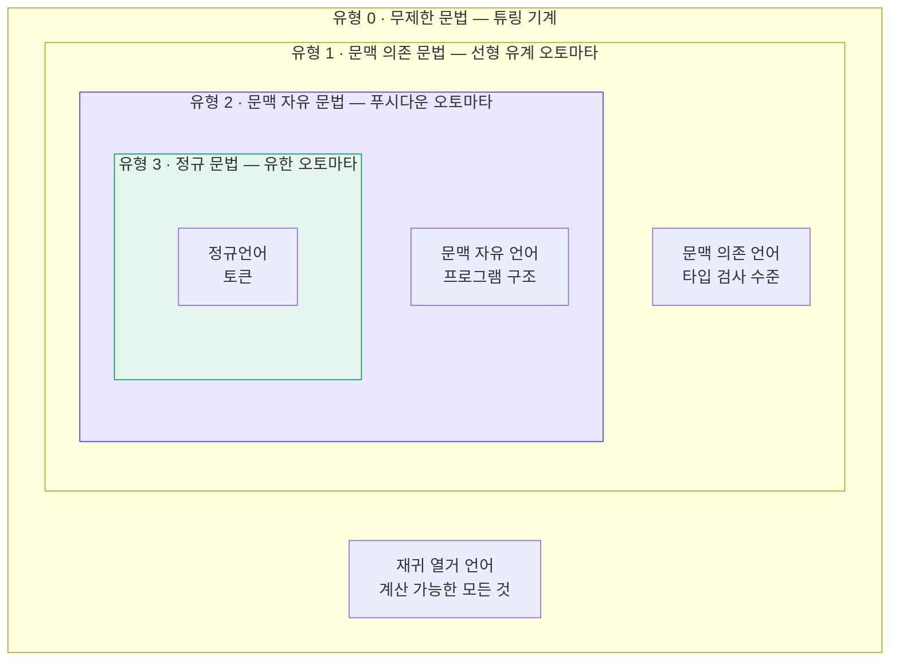
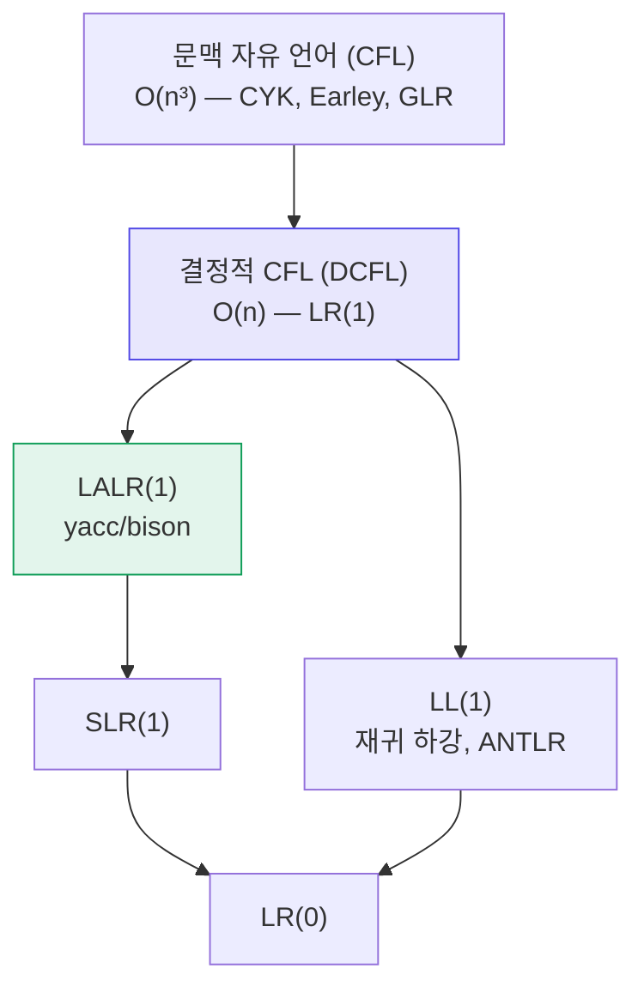

# 11. 문법의 유형

지금까지 두 종류의 문법을 보았다.

- [정규 문법](/docs/regular/regular-languages#32-정규-문법) — 우변에 넌터미널이 한쪽 끝에 최대 하나
- [문맥 자유 문법](/docs/parsing/context-free-grammar) — 좌변이 넌터미널 하나

두 문법의 관계는 **생성 규칙에 건 제약의 강도** 차이였다.
이 관점을 끝까지 밀고 가면 **촘스키 계층(Chomsky hierarchy)** 이 나온다.

Noam Chomsky가 1956년에 제시한 이 분류는
형식 언어 이론 전체의 지도이자, 컴파일러가 왜 지금의 모습인지에 대한 설명이다.

---

## 11.1 계층 전체



포함 관계는 **진부분집합**이다.

$$
\text{정규} \subsetneq \text{문맥 자유} \subsetneq \text{문맥 의존} \subsetneq \text{재귀 열거}
$$

각 단계마다 "이 단계에는 있지만 아래 단계에는 없는" 언어가 존재한다.

| 분리 증거 | 언어 |
|---|---|
| 정규 $\subsetneq$ CF | $\{a^n b^n\}$ |
| CF $\subsetneq$ CS | $\{a^n b^n c^n\}$ |
| CS $\subsetneq$ RE | 정지 문제(halting problem)에 대응하는 언어 |

---

## 11.2 네 유형의 정의

모두 $G = (V_N, V_T, P, S)$ 이고, 차이는 **생성 규칙 $\alpha \to \beta$ 의 형태**뿐이다.

### 유형 0 — 무제한 문법 (Unrestricted Grammar)

$$
\alpha \to \beta \qquad (\alpha \in V^+ \text{ 에 넌터미널이 하나 이상},\ \beta \in V^*)
$$

제약이 사실상 없다. 좌변이 우변보다 길어도 된다(**축약 규칙**).

- 대응 기계: **튜링 기계**
- 생성하는 언어: **재귀 열거 언어(recursively enumerable)**
- 소속 판정: **결정 불가능**. 준결정(semi-decidable)만 가능 —
  $w \in L$ 이면 언젠가 "예"라고 답하지만, $w \notin L$ 이면 영원히 돌 수 있다

### 유형 1 — 문맥 의존 문법 (Context-Sensitive Grammar)

$$
\alpha A \beta \to \alpha \gamma \beta \qquad (\gamma \neq \varepsilon)
$$

동등한 정의: $|\alpha| \leq |\beta|$ 인 모든 규칙 $\alpha \to \beta$.
즉 **유도할수록 문장이 짧아지지 않는다**(비축약, non-contracting).

- 대응 기계: **선형 유계 오토마타(LBA)** — 테이프 길이가 입력 길이에 비례하는 튜링 기계
- 소속 판정: **결정 가능**. 다만 PSPACE-완전이라 실용적이지 않다

**예제** — $\{a^n b^n c^n \mid n \geq 1\}$

$$
\begin{aligned}
S &\to a\,S\,B\,C \mid a\,B\,C \\
C\,B &\to B\,C \qquad &&\text{순서를 바로잡는 규칙} \\
a\,B &\to a\,b \\
b\,B &\to b\,b \\
b\,C &\to b\,c \\
c\,C &\to c\,c
\end{aligned}
$$

$CB \to BC$ 를 보자. 좌변이 심볼 **둘**이다. CFG가 아니다.
그리고 $aB \to ab$ 는 "$B$ 앞에 $a$ 가 있을 때만" 적용된다 —
**문맥에 의존**한다.

### 유형 2 — 문맥 자유 문법

$$
A \to \alpha \qquad (A \in V_N)
$$

- 대응 기계: **푸시다운 오토마타**
- 소속 판정: **결정 가능**, $O(n^3)$ (CYK, Earley).
  결정적 부분집합(DCFL)은 $O(n)$

### 유형 3 — 정규 문법

$$
A \to aB \mid a \mid \varepsilon \qquad \text{(우선형)}
$$

- 대응 기계: **유한 오토마타**
- 소속 판정: **결정 가능**, $O(n)$, 상수 공간

---

## 11.3 한눈에 보는 비교표

| | 유형 3 정규 | 유형 2 문맥 자유 | 유형 1 문맥 의존 | 유형 0 무제한 |
|---|---|---|---|---|
| **규칙 형태** | $A \to aB \mid a$ | $A \to \alpha$ | $\alpha A\beta \to \alpha\gamma\beta$ | $\alpha \to \beta$ |
| **기계** | 유한 오토마타 | 푸시다운 오토마타 | 선형 유계 오토마타 | 튜링 기계 |
| **기억 장치** | 없음 (상태만) | 스택 1개 | 유계 테이프 | 무한 테이프 |
| **소속 판정** | $O(n)$ | $O(n^3)$ | PSPACE-완전 | 결정 불가능 |
| **폐포: 합집합** | ✅ | ✅ | ✅ | ✅ |
| **폐포: 교집합** | ✅ | ❌ | ✅ | ✅ |
| **폐포: 여집합** | ✅ | ❌ | ✅ | ❌ |
| **공허성 판정** | ✅ | ✅ | ❌ | ❌ |
| **동등성 판정** | ✅ | ❌ | ❌ | ❌ |
| **컴파일러에서** | 어휘 분석 | 구문 분석 | (의미 분석) | — |

:::caution[CFL은 교집합과 여집합에 닫혀 있지 않다]
정규언어와 크게 다른 점이다.

$L_1 = \{a^n b^n c^m\}$ 과 $L_2 = \{a^m b^n c^n\}$ 은 각각 CFL이지만

$$
L_1 \cap L_2 = \{a^n b^n c^n\}
$$

은 CFL이 아니다.

실무적 함의: **두 문법을 교집합해서 언어를 정의할 수 없다.**
"식별자이면서 예약어가 아닌 것" 같은 규칙을 정규언어에서는
차집합으로 표현할 수 있었지만([3장 폐포 성질](/docs/regular/regular-languages#33-정규언어의-폐포-성질)),
CFG에서는 그런 방법이 없다.
:::

:::caution[CFG의 동등성 판정은 결정 불가능하다]
"이 두 문법이 같은 언어를 생성하는가?"에 답하는 알고리즘은 **존재하지 않는다**.
"이 문법이 모호한가?"도 마찬가지다
([2장](/docs/foundations/language-and-grammar#24-모호성)에서 언급했다).

이것이 yacc가 "당신의 문법은 모호합니다"라고 말해 주지 못하고
대신 "shift/reduce 충돌 3개"라는 간접 신호만 주는 이유다.
:::

---

## 11.4 컴파일러 각 단계와의 대응

계층은 추상적인 분류가 아니라 **컴파일러 설계의 청사진**이다.


| 검사할 것 | 필요한 계층 | 담당 |
|---|---|---|
| `123abc` 는 올바른 토큰인가 | 유형 3 | 어휘 분석기 |
| 괄호가 짝이 맞는가 | 유형 2 | 파서 |
| `if` 뒤에 조건식이 오는가 | 유형 2 | 파서 |
| 변수가 선언되었는가 | 유형 1 이상 | **의미 분석** |
| 타입이 맞는가 | 유형 1 이상 | **의미 분석** |
| 함수 인자 개수가 맞는가 | 유형 1 이상 | **의미 분석** |
| 프로그램이 종료하는가 | 유형 0 (결정 불가능) | — |

:::danger[핵심 원리]
> **각 단계에 딱 필요한 만큼의 표현력을 배정하고,
> 그 이상은 다음 단계로 미룬다.**

어휘 분석에 CFG를 쓰면 느려진다.
구문 분석에서 타입 검사를 하려 들면 문법이 폭발한다.
계층을 지키는 것이 곧 좋은 설계다.

3부에서 본 lex의 `depth` 카운터, 그리고 C의 "lexer hack"은
이 원칙을 어긴 사례들이고, 그래서 다루기 까다롭다.
:::

### 실제 언어가 계층을 벗어나는 지점

| 언어 | 벗어나는 지점 |
|---|---|
| C | `T * x;` — 타입 이름인지 변수인지 (lexer hack) |
| C++ | 템플릿 `a < b > c` — 파싱에 의미 정보가 필요 |
| Python | INDENT/DEDENT — 스캐너에 스택 필요 |
| Perl | 실행 시점에 문법이 바뀔 수 있다 |
| Rust, Swift | 중첩 주석 — 스캐너에 카운터 필요 |

:::note[Perl의 유명한 결론]
"Perl은 파싱할 수 없다(Perl cannot be parsed)"는 말이 있다.
Perl 프로그램을 파싱하려면 임의의 Perl 코드를 실행해야 할 수 있고,
따라서 정지 문제로 환원된다 — **유형 0**이다.

언어 설계에서 문법을 계층 안에 유지하는 것이 왜 중요한지 보여 주는 반례다.
:::

---

## 11.5 계층 사이의 실용적 세부 구분

컴파일러 실무에서 정말 중요한 것은 유형 2 **안쪽**의 세부 구분이다.



:::note[표에 아직 안 배운 이름이 나온다]
LR(0), SLR(1), LALR(1) 은 [15장](/docs/parsing/lr-parsing)에서,
LL(1) 은 [13장](/docs/parsing/ll-parsing)에서 정의한다.
**GLR**(Generalized LR — 충돌이 나면 여러 가능성을 동시에 탐색하는 파서)과
**ALL(\*)**(ANTLR 4가 쓰는 적응형 LL 파싱)은
각각 [16장](/docs/parsing/lr-parser-implementation#168-glr--충돌을-포기하지-않기)과
[13장](/docs/parsing/ll-parsing#136-llk와-그-너머)에서 다룬다.

지금은 **"오른쪽으로 갈수록 더 많은 문법을 다룰 수 있고, 대신 비싸다"** 는
순서 관계만 보면 된다.
:::

| 부류 | 인식 능력 | 도구 |
|---|---|---|
| LR(0) | 가장 약함 | (교육용) |
| SLR(1) | LR(0) ⊂ SLR(1) | (교육용) |
| **LALR(1)** | SLR(1) ⊂ LALR(1) | **yacc, bison** |
| LR(1) = DCFL | LALR(1) ⊂ LR(1) | menhir, LRSTAR |
| LL(1) | LR(1)에 진포함 | 재귀 하강 |
| LL(k), ALL(*) | LL(1) ⊂ LL(k) ⊂ ALL(*) | **ANTLR 4** |
| CFL 전체 | 가장 강함 | GLR (bison `%glr-parser`), tree-sitter, Earley |

중요한 사실 두 가지:

**① LL(1) ⊊ LR(1)**
모든 LL(1) 문법은 LR(1)이지만 역은 아니다.
LR이 더 많은 문법을 받는다. **좌재귀**가 대표적인 차이다.

**② LALR(1)은 LR(1)보다 약하다**
LALR은 LR(1) 상태를 병합해 표 크기를 줄인 것이다.
그 대가로 원래 없던 **reduce/reduce 충돌**이 생길 수 있다.
[15장](/docs/parsing/lr-parsing)에서 실제 예를 본다.

:::tip[왜 LALR(1)이 사실상의 표준이 되었나]
1965년 Knuth가 LR(1)을 발표했을 때, 실제 언어의 LR(1) 표는
당시 컴퓨터 메모리로 감당할 수 없을 만큼 컸다.

DeRemer가 1969년에 제안한 LALR(1)은 표를 **LR(0) 크기**로 유지하면서
실제 프로그래밍 언어 대부분을 감당한다.
1975년 yacc가 이를 채택하면서 사실상의 표준이 되었다.

메모리가 넘쳐나는 지금은 완전한 LR(1)을 써도 되고,
실제로 menhir 같은 도구가 그렇게 한다.
그럼에도 LALR(1)이 널리 쓰이는 이유는 순전히 **관성과 생태계**다.
:::

---

## 요약

- **촘스키 계층**은 생성 규칙에 건 제약의 강도로 문법을 넷으로 나눈다.
  $\text{정규} \subsetneq \text{CF} \subsetneq \text{CS} \subsetneq \text{RE}$
- 각 유형에 대응하는 기계는
  유한 오토마타 → PDA(스택 1개) → LBA(유계 테이프) → 튜링 기계.
  **늘어나는 것은 기억 장치의 힘**이다.
- CFL은 **교집합·여집합에 닫혀 있지 않고**, **동등성·모호성 판정이 불가능**하다.
  정규언어와 결정적으로 다른 점이며, yacc의 오류 보고 방식이 이 때문이다.
- 컴파일러의 단계 분리는 계층의 직접적 반영이다.
  **어휘 = 유형 3, 구문 = 유형 2, 의미 = 유형 1 이상.**
- 실무에서 정말 중요한 것은 유형 2 안쪽의 세부 구분이다.
  $\text{LR(0)} \subset \text{SLR(1)} \subset \text{LALR(1)} \subset \text{LR(1)} = \text{DCFL} \subset \text{CFL}$
- **LL(1) ⊊ LR(1)** — LR이 더 많은 문법을 받는다. 좌재귀가 대표적 차이다.
- **LALR(1)** 은 LR(1) 상태를 병합해 표를 줄인 것.
  yacc/bison의 기본이며, 그 대가로 reduce/reduce 충돌이 생길 수 있다.

## 확인 문제

1. 다음 문법은 몇 유형인가? 가장 제한적인(숫자가 큰) 유형으로 답하라.
   - (a) $S \to aSb \mid \varepsilon$
   - (b) $S \to aA$, $A \to bA \mid b$
   - (c) $aS \to Sa$, $S \to b$
   - (d) $S \to aSBC \mid abc$, $CB \to BC$, $bB \to bb$

<details>
<summary>풀이</summary>

| | 유형 | 근거 |
|---|---|---|
| (a) | **2 (문맥 자유)** | 좌변이 넌터미널 하나 ✅. 그러나 우변 $aSb$ 에서 넌터미널이 **가운데** 있어 유형 3이 아니다 |
| (b) | **3 (정규)** | 모든 우변이 $aB$ 또는 $a$ 꼴 — **우선형 문법** |
| (c) | **1 (문맥 의존)** | 좌변 $aS$ 가 심볼 **둘** — 유형 2가 아니다. $\lvert aS \rvert = \lvert Sa \rvert = 2$ 이므로 비축약 → 유형 1 |
| (d) | **1 (문맥 의존)** | $CB \to BC$ 의 좌변이 심볼 둘. 모든 규칙이 $\lvert \alpha \rvert \leq \lvert \beta \rvert$ |

**(a) 를 자세히.** $S \to aSb$ 의 우변에서 $S$ 는 **가운데**에 있다.
정규 문법(유형 3)은 넌터미널이 **맨 끝**(우선형)이나 **맨 앞**(좌선형)에만
올 수 있으므로 조건을 어긴다.

이 문법이 생성하는 $\{a^nb^n\}$ 이
[3장에서 증명한](/docs/regular/regular-languages#proof-anbn) 대로
정규언어가 아니라는 사실과 일치한다.

**(c) 가 생성하는 언어.** $S \to b$ 밖에 종료 규칙이 없고
$aS \to Sa$ 는 좌변에 터미널 `a` 가 필요한데 `a` 를 만드는 규칙이 없다.
따라서 $L = \{b\}$ 다. (언어 자체는 유한하므로 정규지만,
**문법의 유형**을 묻는 문제이므로 답은 유형 1이다.)

:::caution[문법의 유형 ≠ 언어의 유형]
유형 1 문법이 정규언어를 생성할 수도 있다.
계층은 **언어**에 대해서는 진부분집합이지만,
개별 문법은 필요 이상으로 강한 형식으로 쓰일 수 있다.

"이 **문법**은 몇 유형인가"와 "이 **언어**는 몇 유형인가"는 다른 질문이다.
:::

**(d)** 는 본문 [11.2절](#112-네-유형의-정의)에서 본 $\{a^nb^nc^n\}$ 문법이다.

</details>

2. CFL이 교집합에 닫혀 있지 않음을 $\{a^nb^nc^m\}$ 과 $\{a^mb^nc^n\}$ 으로 보여라.

<details>
<summary>풀이</summary>

**1단계 — 각각이 CFL임을 보인다**

$L_1 = \{a^nb^nc^m \mid n, m \geq 0\}$

$$S_1 \to X\,C, \qquad X \to a\,X\,b \mid \varepsilon, \qquad C \to c\,C \mid \varepsilon$$

$X$ 가 `a`/`b` 짝을 맞추고, $C$ 는 `c` 를 아무 개수나 붙인다.
**짝 맞추기는 한 곳뿐**이므로 스택 하나로 충분하다. ✅

$L_2 = \{a^mb^nc^n \mid n, m \geq 0\}$

$$S_2 \to A\,Y, \qquad A \to a\,A \mid \varepsilon, \qquad Y \to b\,Y\,c \mid \varepsilon$$

역시 짝 맞추기가 한 곳(`b`/`c`)뿐이다. ✅

**2단계 — 교집합을 구한다**

$w \in L_1 \cap L_2$ 이려면 $w = a^ib^jc^k$ 꼴이면서

- $L_1$ 의 조건: $i = j$
- $L_2$ 의 조건: $j = k$

둘 다 만족해야 하므로 $i = j = k$.

$$L_1 \cap L_2 = \{\,a^n b^n c^n \mid n \geq 0\,\}$$

**3단계 — 이것이 CFL이 아니다**

[10.4절에서 펌핑 보조정리로 증명했다](/docs/parsing/context-free-grammar#proof-anbncn).
$vwx$ 의 길이가 $p$ 이하이므로 세 종류 문자 중 최대 두 종류만 걸칠 수 있고,
펌프하면 걸치지 않은 종류만 개수가 그대로 남아 세 개수가 어긋난다.

**결론.** CFL 두 개의 교집합이 CFL이 아니므로,
**CFL은 교집합에 닫혀 있지 않다**. $\blacksquare$

:::tip[직관적으로]
스택이 **하나**뿐이라 짝 맞추기를 **한 번**만 할 수 있다.
$L_1$ 은 `a`/`b` 를, $L_2$ 는 `b`/`c` 를 맞추는데,
둘을 **동시에** 하려면 스택이 둘 필요하다.

그런데 스택 둘짜리 기계는 튜링 기계와 같은 힘을 갖는다 —
계층을 훌쩍 넘어가 버린다.
:::

**참고:** 정규언어는 교집합에 **닫혀 있다**
([3장 곱 구성](/docs/regular/regular-languages#교집합--곱-구성)).
DFA 둘을 동시에 돌리면 되기 때문이다.
PDA는 스택이 있어 "동시에 돌리기"가 안 된다.

</details>

3. "이 문법이 모호한가?"가 결정 불가능하다는 사실이
   yacc의 사용성에 어떤 영향을 주는가?

<details>
<summary>풀이</summary>

**yacc는 "당신의 문법은 모호합니다"라고 말해 줄 수 없다.**

모호성 판정 알고리즘이 **존재하지 않으므로**, yacc는
자기가 만들 수 있는 **간접 신호**만 준다.

```
conflicts: 3 shift/reduce, 1 reduce/reduce
```

**충돌과 모호성의 관계**

| | 뜻 |
|---|---|
| 모호한 문법 | → **반드시** 충돌이 난다 |
| 충돌이 난 문법 | → 모호할 수도, **아닐 수도** 있다 |

한쪽 방향만 성립한다. 충돌은 "LALR(1)로 결정할 수 없다"는 뜻이지
"모호하다"는 뜻이 아니다.

**실무에 미치는 영향 넷**

**① 진단이 간접적이다.**
"문법의 어느 부분이 모호하다"가 아니라
"상태 71에서 `KW_ELSE` 에 대해 충돌"이라고 알려 준다.
[20장](/docs/yacc/conflicts-and-precedence#202-충돌-읽기)에서 본 대로
`.output` 을 읽고 사람이 해석해야 한다.

**② 충돌이 0이어도 안심할 수 없다.**
`%left` 선언으로 충돌을 **덮어도** 문법의 모호성 자체는 남아 있다.
[18장의 계산기](/docs/yacc/yacc-overview#187-첫-번째-파서--계산기)가 그 예다 —
문법은 모호한데 충돌은 0이다. 우선순위 선언이 "어느 해석을 쓸지"를
정해 주었을 뿐이다.

**③ 문법을 고쳤을 때 나아졌는지 알기 어렵다.**
충돌 수가 줄었다고 모호성이 줄어든 것은 아니다.

**④ 그래서 `%expect` 가 필요하다.**
"이 충돌 N개는 검토했고 의도한 것"이라고 **사람이 선언**해 둔다.
그보다 많아지면 빌드가 실패하므로 회귀를 막을 수 있다.

:::info[bison 3.8의 개선]
`-Wcounterexamples` 는 충돌 지점에서 **실제로 충돌하는 입력 예시**를
생성해 준다. 모호성을 판정하지는 못하지만,
사람이 판단할 재료를 훨씬 잘 준다.

결정 불가능한 문제를 우회하는 실용적 접근의 좋은 예다.
:::

</details>

4. Python의 INDENT/DEDENT 처리가 왜 유형 3을 벗어나는지 설명하고,
   실제 구현이 어떻게 우회하는지 조사하라.

<details>
<summary>풀이</summary>

**왜 유형 3(정규)을 벗어나는가**

```python
if a:
    if b:
        x = 1
    y = 2      # DEDENT 하나
z = 3          # DEDENT 하나 더
```

들여쓰기가 줄어들 때 **몇 단계나 줄었는지** 알아야 `DEDENT` 를 그만큼 내보낸다.
그러려면 **지금까지의 들여쓰기 깊이 목록**을 기억해야 한다.

중첩 깊이에 상한이 없으므로 유한한 상태로는 불가능하다.
[3장](/docs/regular/regular-languages#34-정규언어의-한계)의 괄호 짝 맞추기와 같은 구조다.

사실 이것은 **정규가 아닐 뿐 아니라** 순수한 어휘 분석의 범위를 벗어난다.
토큰 하나(`DEDENT`)를 **여러 개** 내보내야 할 수도 있기 때문이다.

**실제 구현 — 들여쓰기 스택**

CPython의 토크나이저는 **정수 스택**을 유지한다.

```
indents = [0]              # 스택. 바닥은 항상 0

각 논리적 줄의 시작에서:
    col = 그 줄의 들여쓰기 열 수

    if col > indents.top():
        indents.push(col)
        INDENT 토큰 하나 방출

    while col < indents.top():
        indents.pop()
        DEDENT 토큰 하나 방출     ← 여러 개가 나올 수 있다

    if col != indents.top():
        오류: "unindent does not match any outer indentation level"
```

**세 가지 관찰**

**① 스캐너에 스택이 붙었다.**
[9장의 중첩 주석 카운터](/docs/lex/writing-lex-files#93-중첩-블록-주석)와 같은 우회다.
카운터가 스택으로 커진 것뿐이다.

**② 한 위치에서 토큰이 여러 개 나온다.**
`yylex()` 가 토큰 하나만 반환하는 모델과 맞지 않으므로,
**토큰 큐**를 두고 하나씩 꺼내 주는 구조가 된다.

**③ 오류 메시지가 이 계층에서 나온다.**
`IndentationError` 는 파서가 아니라 **토크나이저**가 낸다.
`col` 이 스택의 어느 값과도 맞지 않는 경우다.

:::note[언어 설계의 교훈]
Python은 가독성을 위해 들여쓰기를 문법에 넣었고,
그 대가로 **토크나이저에 스택을 넣어야** 했다.

반대로 C 계열은 `{}` 를 써서 이 문제를 **파서 쪽으로** 넘겼다.
파서는 어차피 스택이 있으므로 추가 비용이 없다.

[11.4절의 원칙](#114-컴파일러-각-단계와의-대응) —
"각 단계에 딱 필요한 만큼의 표현력을" — 을 어기면
그 비용을 어딘가에서 치른다는 사례다.
:::

</details>

5. LL(1)이지만 LR(1)이 아닌 문법이 존재하는가? 근거를 대라.

<details>
<summary>풀이</summary>

**존재하지 않는다. 모든 LL(1) 문법은 LR(1)이다.**

$$\text{LL(1)} \subsetneq \text{LR(1)}$$

**직관적 근거 — 결정 시점**

| | 결정 시점 | 가진 정보 |
|---|---|---|
| LL(1) | 규칙을 **적용하기 전** | 왼쪽 문맥 + lookahead 1개 |
| LR(1) | 우변을 **다 본 뒤** | 왼쪽 문맥 + **우변 전체** + lookahead 1개 |

LR은 LL이 가진 정보를 **전부 가지고 있고, 더 갖는다**.
LL이 결정할 수 있는 상황이라면 LR도 당연히 결정할 수 있다.

더 정확히는, LL(1) 파서가 "지금 $A \to \alpha$ 를 써야겠다"고 판단하는 시점에
LR(1) 파서는 아직 결정을 내리지 않아도 된다.
$\alpha$ 를 전부 읽고 나서 축약하면 되기 때문이다.
**결정을 미룰 수 있다는 것이 곧 더 강하다는 뜻이다.**

**일반화**

$$\text{LL}(k) \subsetneq \text{LR}(k) \qquad \text{모든 } k \geq 0$$

**반대 방향은 성립하지 않는다** — LR(1)이지만 LL(1)이 아닌 문법이 많다.
가장 흔한 예가 **좌재귀**다.

$$E \to E + T \mid T$$

- LR(1) ✅ — 아무 문제 없다
- LL(1) ❌ — $\mathrm{FIRST}(E+T) = \mathrm{FIRST}(T)$ 라 구별 불가

또 하나의 예:

$$S \to a\,S\,b \mid a\,S\,c \mid \varepsilon$$

`a` 를 아무리 많이 봐도 마지막이 `b` 인지 `c` 인지 알 수 없으므로
어떤 $k$ 에 대해서도 LL($k$)가 아니다. 그러나 LR(1)로는 쉽다.

:::caution[언어 부류와 문법 부류를 구별하자]
**문법** 수준에서는 $\text{LL(1)} \subsetneq \text{LR(1)}$ 이다.

**언어** 수준에서도 LL 언어 부류가 LR 언어 부류(= DCFL)의
진부분집합이다. 즉 LR(1)로는 되는데 어떤 LL($k$) 문법으로도
쓸 수 없는 언어가 존재한다.
:::

</details>

6. LALR(1)이 LR(1)보다 약한데도 널리 쓰이는 역사적·실용적 이유를 정리하라.

<details>
<summary>풀이</summary>

**역사적 이유 — 1960~70년대의 메모리**

| 연도 | 사건 |
|---|---|
| 1965 | Knuth가 LR(1) 발표. 이론적으로 완성 |
| — | 그러나 실제 언어의 LR(1) 표가 **당시 컴퓨터 메모리를 넘었다** |
| 1969 | DeRemer가 LALR(1) 제안 — 표를 **LR(0) 크기**로 유지 |
| 1975 | yacc가 LALR(1) 채택 → Unix와 함께 퍼짐 |

전형적인 프로그래밍 언어에서
LR(0)/LALR 상태가 수백 개일 때 LR(1) 상태는 **수천 개**가 된다.
1970년대에는 이 차이가 "실행 가능/불가능"의 차이였다.

**실용적 이유 — 충분히 강하다**

LALR(1)은 실제 프로그래밍 언어 문법을 **거의 다 감당한다**.
C, Pascal, Java 같은 언어의 문법이 LALR(1)로 쓰였다.

LALR이 부족한 경우(reduce/reduce 충돌)는 대개
**문법을 조금 고치면** 해결된다.

**현재의 이유 — 관성과 생태계**

메모리는 더 이상 문제가 아니다. 그런데도 LALR이 표준인 이유는

| 이유 | 설명 |
|---|---|
| **기존 문법 자산** | 수십 년간 축적된 `.y` 파일들이 LALR을 전제한다 |
| **도구 생태계** | 빌드 시스템, 에디터 지원, 교재가 전부 yacc/bison 기준 |
| **표가 작으면 여전히 좋다** | 캐시 효율, 배포 크기 |
| **차이가 드물다** | LALR로 안 되는데 LR(1)로 되는 실제 문법이 흔치 않다 |

**대안은 이미 있다**

```c
%define lr.type canonical-lr    /* bison 3.0+ — 완전한 LR(1) */
```

OCaml의 **Menhir** 는 처음부터 완전한 LR(1)을 쓴다.
[22장](/docs/modern/toolchain-map#menhir-ocaml)에서 다룬 대로
CompCert가 검증된 파서를 얻기 위해 Menhir를 쓴다.

:::tip[LALR의 한 가지 실질적 위험]
LALR 병합은 **reduce/reduce 충돌을 새로 만들 수 있다**
(shift/reduce는 만들지 않는다).

그런데 이 충돌은 **원래 문법에는 없던 것**이므로
"내 문법이 뭐가 잘못됐지?" 하고 헤매기 쉽다.
LR(1)로 바꿔서 사라지면 원인이 LALR 병합이었음을 알 수 있다 —
진단 방법으로 기억해 두자.
:::

</details>

---

계층의 지도를 얻었으니, 이제 유형 2 안에서
**실제로 파스 트리를 만드는 알고리즘**으로 들어간다.
