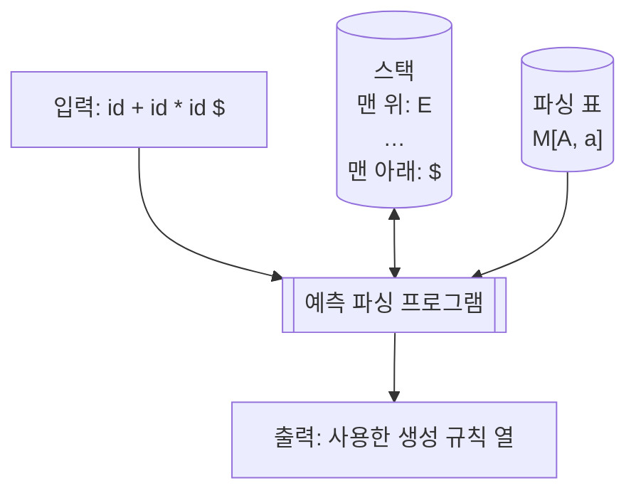

import LLParser from '@site/src/components/parsing/LLParser';
import {exprGrammarLL, exprLLTable} from '@site/src/components/parsing/grammars';

# 13. LL 구문 분석

**LL** 이라는 이름은 두 글자의 뜻이 각각 다르다.

| 글자 | 뜻 |
|---|---|
| 첫 **L** | **L**eft-to-right — 입력을 **왼쪽에서 오른쪽으로** 읽는다 |
| 둘째 **L** | **L**eftmost derivation — **좌측 유도**를 만든다 |
| (k) | 결정을 위해 미리 보는 토큰 수 |

**LL(1)** 은 "한 토큰만 미리 보고 결정하는 하향식 파서"다.
실무에서는 이것으로 충분한 경우가 많고, 무엇보다 **손으로 쓸 수 있다.**

---

## 13.1 재귀 하강 파싱

가장 직관적인 하향식 파서다. **넌터미널마다 함수를 하나씩** 만든다.

### 문법에서 코드로

$$
\begin{aligned}
E &\to T\,E' \\
E' &\to +\,T\,E' \mid \varepsilon \\
T &\to F\,T' \\
T' &\to *\,F\,T' \mid \varepsilon \\
F &\to (\,E\,) \mid \mathbf{id}
\end{aligned}
$$

[10장에서 좌재귀를 제거한](/docs/parsing/context-free-grammar#좌재귀-제거) 그 문법이다.

번역 규칙은 기계적이다.

| 문법 | 코드 |
|---|---|
| 넌터미널 $A$ | 함수 `A()` |
| 우변의 터미널 $a$ | `match(a)` |
| 우변의 넌터미널 $B$ | `B()` 호출 |
| 여러 대안 $A \to \alpha \mid \beta$ | lookahead 로 `if` / `switch` |
| $A \to \varepsilon$ | 아무것도 안 하고 반환 |

```c title="examples/05-recursive-descent/calc.c (발췌)"
/* E → T E' */
static Node *parse_E(void)
{
    Node *left = parse_T();
    return parse_E_prime(left);
}

/* E' → + T E' | ε
 *
 * 좌재귀를 제거하면서 트리가 오른쪽으로 자라게 되었다.
 * 좌결합을 유지하려면 여기서 **왼쪽으로 접어** 주어야 한다.
 * 그래서 지금까지 만든 부분 트리를 인자로 받는다.
 */
static Node *parse_E_prime(Node *left)
{
    while (lookahead == '+' || lookahead == '-') {
        int op = lookahead;
        advance();
        Node *right = parse_T();
        left = make_binop(op, left, right);   /* ← 왼쪽으로 접는다 */
    }
    return left;                               /* ε 인 경우 */
}
```

:::tip[EBNF 반복이 while 루프가 된다]
$E' \to +TE' \mid \varepsilon$ 는 EBNF로 쓰면
$$E \to T\ \{\ +\ T\ \}$$
이고, `{ }` 가 그대로 `while` 루프가 된다.

재귀 대신 반복을 쓰면 스택 깊이도 줄고 좌결합 처리도 자연스럽다.
**실무의 재귀 하강 파서는 대부분 이렇게 쓴다.**
:::

### 장점

- **코드가 문법이다.** 읽으면 문법이 보인다
- 디버깅이 쉽다. 그냥 함수 호출 스택이다
- 오류 메시지에 문맥을 담기 좋다 —
  `parse_if_statement()` 안에서 실패했으면 "if문을 파싱하는 중"이라고 말할 수 있다
- 액션을 아무 데나 끼워 넣을 수 있다
- 문법을 살짝 벗어나는 처리(C의 lexer hack 등)를 자연스럽게 넣을 수 있다

:::note[실제 컴파일러들이 재귀 하강을 쓴다]
GCC(C/C++), Clang, Rust, Go, TypeScript, V8의 JavaScript 파서 —
모두 손으로 쓴 재귀 하강 파서다.

이유는 성능이 아니라 **오류 메시지의 품질과 유지보수성**이다.
표 구동 파서에서는 "지금 무엇을 파싱하는 중인지"를 알기 어렵다.
:::

### 제약

**① 좌재귀 금지**

```c
/* E → E + T 를 그대로 옮기면 */
Node *parse_E(void) {
    Node *l = parse_E();     /* ❌ 즉시 무한 재귀 */
    ...
}
```

**② 공통 접두사 금지**

$$
S \to \mathbf{if}\ E\ \mathbf{then}\ S \mid \mathbf{if}\ E\ \mathbf{then}\ S\ \mathbf{else}\ S
$$

`if`를 봐도 어느 쪽인지 모른다. [좌인수분해](/docs/parsing/context-free-grammar#좌인수분해)가 필요하다.

**③ 예측 가능해야 한다**

한 토큰만 보고 대안을 고를 수 있어야 한다.
아니면 **백트래킹**이 필요한데, 그러면 최악의 경우 지수 시간이 된다.

---

## 13.2 표 구동 예측 파싱

재귀 하강은 **호출 스택**을 썼다.
같은 일을 **명시적 스택 + 파싱 표**로 할 수도 있다.



### 알고리즘

```
스택 ← [$, S]        (S 가 맨 위)
입력 ← 토큰들 + $

반복:
  X ← 스택 맨 위,  a ← 현재 입력

  X = a = $ 이면            → 수락하고 종료
  X 가 터미널이면
      X = a 이면            → 스택 팝, 입력 전진   (매치)
      아니면                → 오류
  X 가 넌터미널이면
      M[X, a] = X → Y₁…Yₖ 이면
          스택 팝
          Yₖ, …, Y₁ 을 **역순으로** 푸시
          (규칙을 출력한다)
      M[X, a] 가 비었으면   → 오류
```

:::caution[왜 역순으로 푸시하는가]
$X \to Y_1Y_2Y_3$ 을 적용하면, 다음에 매치해야 할 것은 **$Y_1$** 이다.
스택은 맨 위부터 꺼내므로 $Y_1$ 이 맨 위에 와야 한다.
따라서 $Y_3, Y_2, Y_1$ 순으로 밀어 넣는다.
:::

### 재귀 하강과의 관계

둘은 **같은 알고리즘**이다.

| 재귀 하강 | 표 구동 |
|---|---|
| 함수 호출 스택 | 명시적 스택 |
| `if (lookahead == ...)` | 파싱 표 $M[A, a]$ |
| 스택 오버플로 | 스택 배열 넘침 |
| 코드가 문법에 특화 | 표만 바꾸면 다른 문법 |

---

## 13.3 LL(1) 표 만들기

[12장에서 계산한](/docs/parsing/syntax-analysis#125-직접-계산해-보기)
FIRST/FOLLOW로부터 표를 만든다.

:::info[표 구성 알고리즘]

각 생성 규칙 $A \to \alpha$ 에 대해:

1. $\mathrm{FIRST}(\alpha)$ 의 각 터미널 $a$ 에 대해
   $M[A, a] \mathrel{{=}} A \to \alpha$
2. $\varepsilon \in \mathrm{FIRST}(\alpha)$ 이면,
   $\mathrm{FOLLOW}(A)$ 의 각 터미널 $b$ 에 대해
   $M[A, b] \mathrel{{=}} A \to \alpha$
   (`$` 가 FOLLOW($A$) 에 있으면 `M[A, $]` 에도)
3. 나머지 칸은 **오류**
:::

규칙 2의 직관: $\alpha$ 가 아무것도 만들지 않을 수 있다면,
$A$ 를 통째로 건너뛰고 그 **뒤**의 것으로 넘어가야 한다.
그러니 $A$ 뒤에 올 수 있는 것을 보고 결정한다.

### 예제 — 식 문법의 LL(1) 표

12장에서 얻은 값들:

| 넌터미널 | FIRST | FOLLOW |
|---|---|---|
| $E$ | `(`, `id` | `)`, `$` |
| $E'$ | `+`, ε | `)`, `$` |
| $T$ | `(`, `id` | `+`, `)`, `$` |
| $T'$ | `*`, ε | `+`, `)`, `$` |
| $F$ | `(`, `id` | `+`, `*`, `)`, `$` |

이로부터 표를 채운다.

| | `id` | `+` | `*` | `(` | `)` | `$` |
|---|---|---|---|---|---|---|
| **E** | `E→TE'` | | | `E→TE'` | | |
| **E'** | | `E'→+TE'` | | | `E'→ε` | `E'→ε` |
| **T** | `T→FT'` | | | `T→FT'` | | |
| **T'** | | `T'→ε` | `T'→*FT'` | | `T'→ε` | `T'→ε` |
| **F** | `F→id` | | | `F→(E)` | | |

**한 칸 한 칸 확인해 보자.**

- $E \to TE'$ : $\mathrm{FIRST}(TE') = \{(, \mathbf{id}\}$ → `id`, `(` 열
- $E' \to +TE'$ : $\mathrm{FIRST}(+TE') = \{+\}$ → `+` 열
- $E' \to \varepsilon$ : $\varepsilon \in \mathrm{FIRST}(\varepsilon)$ 이므로
  $\mathrm{FOLLOW}(E')$ = `{ ), $ }` → `)`, `$` 열
- $T' \to \varepsilon$ : $\mathrm{FOLLOW}(T')$ = `{ +, ), $ }` → `+`, `)`, `$` 열

$T' \to \varepsilon$ 이 `+` 열에 들어간다는 데 주목하자.
`id + ...` 를 파싱할 때 `id` 다음에 `+`를 보면
"곱셈은 끝났다"고 판단하고 $T'$ 을 비워야 한다.

---

## 13.4 직접 돌려 보기

<LLParser
  grammar={exprGrammarLL}
  table={exprLLTable}
  defaultInput="id + id * id"
  samples={['id', 'id + id', 'id + id * id', '( id + id ) * id', 'id +', '( id']}
  title="LL(1) 예측 파서 — 식 문법"
/>

:::tip[확인할 것]
1. **1단계** — 스택 `$ E`, 입력 `id + id * id $`.
   $M[E, \mathbf{id}] = E \to TE'$ 이므로 `E`를 팝하고 `E'`, `T`를 밀어 넣는다.
   스택이 `$ E' T` 가 된다 — `T`가 맨 위(오른쪽)다.

2. **`ε` 규칙이 적용되는 순간** — `id`를 매치한 뒤 `+`를 보면
   $M[T', +] = T' \to \varepsilon$ 이 적용되어 `T'`이 그냥 사라진다.
   FOLLOW 집합이 실제로 쓰이는 지점이다.

3. **오류** — `id +` 를 넣어 보자. `+`를 매치한 뒤 `$`를 보는데
   `M[T, $]` 가 비어 있어 오류가 난다.

4. **출력을 이어 보면 좌측 유도가 된다.** 각 `출력 A → α` 를
   순서대로 적용하면 정확히 좌측 유도 한 줄씩이다.
:::

---

## 13.5 LL(1) 조건

모든 문법이 LL(1)인 것은 아니다.

:::info[정의 — LL(1) 문법]

문법 $G$ 가 LL(1) 인 것은, $A \to \alpha \mid \beta$ 인 모든 규칙 쌍에 대해
다음 셋이 모두 성립하는 것과 동치다.

1. $\mathrm{FIRST}(\alpha) \cap \mathrm{FIRST}(\beta) = \emptyset$
2. $\alpha$ 와 $\beta$ 중 최대 하나만 $\varepsilon$ 을 유도할 수 있다
3. $\beta \Rightarrow^* \varepsilon$ 이면
   $\mathrm{FIRST}(\alpha) \cap \mathrm{FOLLOW}(A) = \emptyset$

동등하게: **파싱 표의 어느 칸에도 규칙이 둘 이상 들어가지 않는다.**
:::

### LL(1)이 아닌 경우 ①  좌재귀

$$
E \to E + T \mid T
$$

$\mathrm{FIRST}(E+T) = \mathrm{FIRST}(T) = \mathrm{FIRST}(E)$ 이므로
조건 1 위반. → [좌재귀 제거](/docs/parsing/context-free-grammar#좌재귀-제거)

### LL(1)이 아닌 경우 ②  공통 접두사

$$
S \to a\,B\,c \mid a\,B\,d
$$

둘 다 FIRST가 $\{a\}$. → [좌인수분해](/docs/parsing/context-free-grammar#좌인수분해)

### LL(1)이 아닌 경우 ③  모호성

모호한 문법은 **절대로** LL(1)이 아니다.
파싱 표에 반드시 충돌이 생긴다.

**dangling else** 를 보자. 좌인수분해 후:

$$
\begin{aligned}
S &\to \mathbf{if}\ E\ \mathbf{then}\ S\ S' \mid \mathbf{other} \\
S' &\to \mathbf{else}\ S \mid \varepsilon
\end{aligned}
$$

- $\mathrm{FIRST}(\mathbf{else}\ S) = \{\mathbf{else}\}$
- $\mathrm{FOLLOW}(S') \ni \mathbf{else}$

따라서 $M[S', \mathbf{else}]$ 에 **두 규칙이 들어간다**. 조건 3 위반.

:::tip[실무적 해결]
충돌이 났을 때 **$S' \to \mathbf{else}\ S$ 를 택한다**고 정하면
"else는 가장 가까운 if에 붙는다"가 된다.

재귀 하강으로 쓰면 이 결정이 코드에 자연스럽게 나타난다.

```c
static Node *parse_stmt(void) {
    if (lookahead == IF) {
        ...
        Node *then_part = parse_stmt();
        if (lookahead == ELSE) {     /* ← else 를 보면 무조건 소비한다 */
            advance();
            Node *else_part = parse_stmt();
            return make_if_else(cond, then_part, else_part);
        }
        return make_if(cond, then_part);
    }
    ...
}
```

`if (lookahead == ELSE)` 한 줄이 곧 "가장 가까운 if에 붙인다"는 규칙이다.
손으로 쓰는 파서의 장점이 드러나는 지점이다.
:::

### LL(1)이 아닌 경우 ④  본질적으로 LL이 아닌 언어

$$
S \to a\,S\,b \mid a\,S\,c \mid \varepsilon
$$

`a`를 아무리 많이 봐도 마지막에 `b`가 올지 `c`가 올지 알 수 없다.
어떤 $k$ 에 대해서도 LL($k$)가 아니다.
**LR(1)로는 쉽게 처리된다.** LL과 LR의 힘의 차이를 보여 주는 예다.

---

## 13.6 LL(k)와 그 너머

### LL(k)

$k$ 개 토큰을 미리 본다. 표의 열이 $|V_T|^k$ 개가 되어 폭발한다.
실무에서는 $k \leq 2$ 정도만 쓴다.

### 예측 LL(*) / ALL(*)

ANTLR 4가 쓰는 방식이다.
**고정된 $k$ 를 두지 않고**, 필요한 만큼 앞을 본다.

핵심 아이디어는 문법 분석을 **정적 생성 시점이 아니라 런타임으로 미루는 것**이다.
파서는 JIT처럼 "예열"되며, 각 결정 지점에서 만들어진 예측 DFA를
캐시해 두므로 실행할수록 빨라진다.

이론적으로는 $O(n^4)$ 이지만 실무 문법에서는 일관되게 **선형**으로 동작하고,
GLL/GLR보다 수 자릿수 빠르다는 것이 논문의 주장이다.[^allstar]

[^allstar]: Parr, Harwell, Fisher, "Adaptive LL(*) Parsing: The Power of Dynamic Analysis", OOPSLA 2014. [PDF](https://www.antlr.org/papers/allstar-techreport.pdf)

이 덕분에 ANTLR 4는 **좌재귀도 직접 처리해 준다**(내부적으로 변환).
문법을 손대지 않고 쓸 수 있어 실용성이 크게 올라갔다.

### 백트래킹과 PEG

**PEG(Parsing Expression Grammar)** 는 대안을 `|` 대신
**순서 있는 선택(ordered choice)** `/` 로 쓴다.
앞의 것이 성공하면 뒤는 시도하지 않는다.

$$
A \leftarrow \alpha\ /\ \beta
$$

- 모호성이 **정의상** 없다 (항상 앞의 것이 이긴다)
- 무제한 lookahead (백트래킹)
- **packrat 파싱**으로 메모이제이션하면 선형 시간

:::caution[PEG의 대가]
"항상 앞의 것이 이긴다"는 **모호성을 없애는 것이 아니라 숨기는 것**이다.
의도와 다른 대안이 선택되어도 아무 경고가 없다.

또한 오류 메시지가 나쁘기로 유명하다. ordered choice 때문에
"어디서 진짜로 실패했는지"를 잃어버린다.
이를 개선하는 **labeled failure** 연구가 있다.[^peglabel]

[^peglabel]: Medeiros & Mascarenhas, "Syntax error recovery in parsing expression grammars", ACM SAC 2018. [DOI](https://dl.acm.org/doi/10.1145/3167132.3167261)
:::

---

## 13.7 실습 — 재귀 하강 계산기

`examples/05-recursive-descent` 에 손으로 쓴 LL(1) 계산기가 있다.

```bash
cd examples/05-recursive-descent
make && make test
echo "1 + 2 * (3 - 1)" | ./calc
```

자세한 안내는 [YACC 실습](/docs/labs/yacc-labs) 페이지에 있다.
같은 언어를 재귀 하강(LL)과 bison(LR)으로 각각 만들어 비교하는 것이
그 실습의 목적이다.

---

## 요약

- **LL(k)** = Left-to-right 스캔 + Leftmost derivation + $k$ 토큰 lookahead.
- **재귀 하강** — 넌터미널마다 함수. 코드가 곧 문법이고,
  오류 메시지와 예외 처리에 유리하다.
  **실제 프로덕션 컴파일러 다수가 이 방식이다.**
- **표 구동 예측 파싱** — 명시적 스택 + 표 $M[A, a]$.
  재귀 하강과 **같은 알고리즘**이고, 호출 스택이 배열로 바뀐 것뿐이다.
- 우변을 스택에 밀 때는 **역순**으로 넣는다.
- **표 구성**: $\mathrm{FIRST}(\alpha)$ 열에 규칙을 넣고,
  $\alpha$ 가 nullable 이면 $\mathrm{FOLLOW}(A)$ 열에도 넣는다.
- **LL(1) 조건** = 표의 어느 칸에도 규칙이 둘 이상 들어가지 않음.
- LL(1)을 깨는 것: **좌재귀**, **공통 접두사**, **모호성**,
  그리고 본질적으로 LL이 아닌 언어.
- 앞의 둘은 문법 변환으로 고칠 수 있지만, **좌재귀를 없애면
  결합성이 문법에서 사라져 액션 코드로 옮겨간다**.
- **ALL(\*)**(ANTLR 4)은 lookahead를 런타임에 동적으로 정해
  좌재귀까지 직접 처리한다.

## 확인 문제

1. 다음 문법의 LL(1) 표를 만들어라. 충돌이 있는가?
   $$S \to A\,B, \quad A \to a \mid \varepsilon, \quad B \to b \mid \varepsilon$$

<details>
<summary>풀이</summary>

[12장 확인 문제 1](/docs/parsing/syntax-analysis#확인-문제)과 비슷하지만
끝의 `c` 가 없다.

**FIRST / FOLLOW**

| 넌터미널 | FIRST | FOLLOW |
|---|---|---|
| $S$ | `{ a, b, ε }` | `{ $ }` |
| $A$ | `{ a, ε }` | `{ b, $ }` |
| $B$ | `{ b, ε }` | `{ $ }` |

$S \to AB$ 에서 $A$, $B$ 가 **둘 다 nullable** 이므로 $S$ 도 nullable —
$\varepsilon$ 이 $\mathrm{FIRST}(S)$ 에 들어간다.

$\mathrm{FOLLOW}(A)$ : $S \to A\,B$ 에서 $\mathrm{FIRST}(B) - \{\varepsilon\} = \{b\}$,
그리고 $B$ 가 nullable 이므로 `FOLLOW(S) = {$}` 도 상속받는다.

**규칙 번호**

| # | 규칙 |
|---|---|
| 0 | $S \to AB$ |
| 1 | $A \to a$ |
| 2 | $A \to \varepsilon$ |
| 3 | $B \to b$ |
| 4 | $B \to \varepsilon$ |

**표 구성**

| | `a` | `b` | `$` |
|---|---|---|---|
| **S** | 0 | 0 | 0 |
| **A** | 1 | 2 | 2 |
| **B** | | 3 | 4 |

- $S \to AB$ : $\mathrm{FIRST}(AB) = \{a, b, \varepsilon\}$ →
  `a`, `b` 열. nullable 이므로 `FOLLOW(S) = {$}` 열에도
- $A \to a$ : `a` 열
- $A \to \varepsilon$ : `FOLLOW(A) = {b, $}` 열
- $B \to b$ : `b` 열
- $B \to \varepsilon$ : `FOLLOW(B) = {$}` 열

**충돌은 없다.** 어느 칸에도 규칙이 둘 이상 들어가지 않았다. **LL(1) 문법이다.** ✅

**왜 충돌이 없는가.** $A$ 를 결정할 때 `a` 를 보면 $A \to a$,
그 밖(`b` 나 `$`)을 보면 $A \to \varepsilon$ 이다.
$\mathrm{FIRST}(a) = \{a\}$ 와 `FOLLOW(A) = {b, $}` 가
**겹치지 않으므로** 결정할 수 있다.

</details>

2. 다음 문법이 LL(1)이 아닌 이유를 세 조건 중 어느 것 위반인지로 답하라.
   $$S \to a\,S\,b \mid a\,b$$
   좌인수분해하면 LL(1)이 되는가?

<details>
<summary>풀이</summary>

**위반한 조건: 1번**

$$\mathrm{FIRST}(aSb) \cap \mathrm{FIRST}(ab) = \{a\} \cap \{a\} = \{a\} \neq \emptyset$$

두 대안이 **같은 터미널로 시작**하므로 한 토큰만 보고는 구별할 수 없다.
공통 접두사 문제다.

**좌인수분해**

공통 접두사 `a` 를 뽑는다.

$$
\begin{aligned}
S &\to a\,S' \\
S' &\to S\,b \mid b
\end{aligned}
$$

**LL(1)이 되었는가 — 확인해 보자.**

$$\mathrm{FIRST}(Sb) = \mathrm{FIRST}(S) = \{a\}, \qquad \mathrm{FIRST}(b) = \{b\}$$

$$\{a\} \cap \{b\} = \emptyset$$ ✅

$S'$ 의 두 대안이 서로 다른 터미널로 시작하므로 **결정할 수 있다.**

두 대안 모두 $\varepsilon$ 을 유도하지 않으므로 조건 2, 3도 자동으로 만족한다.

**따라서 LL(1)이 되었다.** ✅

**표**

| | `a` | `b` | `$` |
|---|---|---|---|
| **S** | $S \to aS'$ | | |
| **S'** | $S' \to Sb$ | $S' \to b$ | |

**생성하는 언어:** $\{a^n b^n \mid n \geq 1\}$

:::tip[좌인수분해가 항상 통하지는 않는다]
여기서는 한 번에 해결됐지만,
[10장에서 본](/docs/parsing/context-free-grammar#좌인수분해) dangling else처럼
좌인수분해 후에도 모호성이 남는 경우가 있다.

**좌인수분해는 "겉으로 드러난 공통 접두사"만 제거한다.**
넌터미널을 통해 간접적으로 겹치면 소용없다.
:::

</details>

3. 위 시뮬레이터에 `( id + id ) * id` 를 넣고,
   출력된 규칙 열이 실제로 좌측 유도인지 손으로 확인하라.

<details>
<summary>풀이</summary>

시뮬레이터가 출력하는 규칙 열(출력 순서):

```
E→TE'  T→FT'  F→(E)  E→TE'  T→FT'  F→id  T'→ε
E'→+TE'  T→FT'  F→id  T'→ε  E'→ε  T'→*FT'  F→id  T'→ε  E'→ε
```

**이것을 순서대로 적용해 보자.** 매번 **가장 왼쪽 넌터미널**을 전개한다.

```
E
⇒ T E'                          E→TE'
⇒ F T' E'                       T→FT'
⇒ ( E ) T' E'                   F→(E)
⇒ ( T E' ) T' E'                E→TE'
⇒ ( F T' E' ) T' E'             T→FT'
⇒ ( id T' E' ) T' E'            F→id
⇒ ( id E' ) T' E'               T'→ε
⇒ ( id + T E' ) T' E'           E'→+TE'
⇒ ( id + F T' E' ) T' E'        T→FT'
⇒ ( id + id T' E' ) T' E'       F→id
⇒ ( id + id E' ) T' E'          T'→ε
⇒ ( id + id ) T' E'             E'→ε
⇒ ( id + id ) * F T' E'         T'→*FT'
⇒ ( id + id ) * id T' E'        F→id
⇒ ( id + id ) * id E'           T'→ε
⇒ ( id + id ) * id              E'→ε
```

**매 단계에서 가장 왼쪽 넌터미널만 전개했다.** ✅ 좌측 유도가 맞다.

**확인 요령.** 각 줄에서 바뀐 심볼이 그 줄에 남아 있는 넌터미널 중
**가장 왼쪽**인지 보면 된다.

예를 들어 8행에서 `( id T' E' ) T' E'` → `( id E' ) T' E'` 는
`T'` 가 세 개 있지만 **첫 번째** `T'` 를 지웠다. ✅

:::info[LL이 좌측 유도를 만드는 이유]
LL 파서의 스택은 "아직 매치해야 할 심볼들"을 담고 있고,
**맨 위가 가장 왼쪽 심볼**이다.

스택 맨 위를 처리한다는 것이 곧 가장 왼쪽 심볼을 처리한다는 뜻이고,
그래서 자연히 좌측 유도가 나온다.
:::

</details>

4. $T' \to \varepsilon$ 이 왜 `+` 열에 들어가는지 설명하라.

<details>
<summary>풀이</summary>

**표 구성 규칙 2번** 때문이다.

> $\varepsilon \in \mathrm{FIRST}(\alpha)$ 이면,
> $\mathrm{FOLLOW}(A)$ 의 각 터미널 $b$ 에 대해 $M[A, b] = A \to \alpha$

$T' \to \varepsilon$ 은 당연히 $\varepsilon$ 을 유도하므로,
$\mathrm{FOLLOW}(T')$ 의 **모든** 열에 들어간다.

$$\mathrm{FOLLOW}(T') = \{+,\ ),\ \$\}$$

`+` 가 여기 있으므로 $M[T', +] = T' \to \varepsilon$ 이 된다.

**왜 `+` 가 $\mathrm{FOLLOW}(T')$ 에 있는가**

$$T \to F\,T', \qquad E' \to +\,T\,E'$$

$T \to FT'$ 에서 $T'$ 은 $T$ 의 **맨 끝**에 있다.
따라서 $T$ 뒤에 올 수 있는 것은 $T'$ 뒤에도 올 수 있다.

$$\mathrm{FOLLOW}(T) \subseteq \mathrm{FOLLOW}(T')$$

그리고 $E \to T\,E'$ 에서 $T$ 뒤에는 $E'$ 이 오고,
$\mathrm{FIRST}(E') \ni +$ 이므로 `+` $\in \mathrm{FOLLOW}(T)$ 다.

**의미로 읽으면**

`id + ...` 를 파싱하는 중이라고 하자.

```
스택: … T' …          입력: + id ...
```

`T'` 는 "곱셈이 더 이어지는가"를 담당한다.
지금 보이는 것이 `+` 이므로 **곱셈은 끝났다**.
따라서 `T'` 를 **비워서** 사라지게 하고, `+` 는 바깥의 `E'` 이 처리한다.

만약 `*` 가 보였다면 $T' \to *FT'$ 로 곱셈을 계속했을 것이다.

:::tip[이것이 FOLLOW 집합의 존재 이유다]
"이 넌터미널을 **비울지** 결정하려면 그 **뒤에 무엇이 오는지** 봐야 한다."

FIRST만으로는 ε 규칙을 언제 쓸지 알 수 없다.
$\mathrm{FIRST}(\varepsilon) = \{\varepsilon\}$ 뿐이라 아무 정보가 없기 때문이다.
:::

</details>

5. 재귀 하강으로 $E \to E + T \mid T$ 를 그대로 옮기면
   왜 무한 재귀가 되는지 호출 스택으로 설명하라.

<details>
<summary>풀이</summary>

**기계적으로 옮기면**

```c
Node *parse_E(void) {
    /* 대안 1: E → E + T */
    Node *left = parse_E();        /* ← 여기 */
    match('+');
    Node *right = parse_T();
    return make_binop('+', left, right);
}
```

**호출 스택 추적**

| 깊이 | 함수 | 소비한 입력 |
|---|---|---|
| 1 | `parse_E()` | 0글자 |
| 2 | `parse_E()` | **0글자** |
| 3 | `parse_E()` | **0글자** |
| … | … | … |
| 수만 | `parse_E()` | **0글자** |
| | **스택 오버플로** | |

**핵심: 입력을 하나도 소비하지 않고 자기 자신을 부른다.**

재귀가 끝나려면 **매 호출마다 문제가 작아져야** 하는데,
`parse_E()` 의 첫 동작이 `parse_E()` 이므로 문제가 전혀 줄지 않는다.
상태가 완전히 같으므로 **같은 일을 영원히 반복**한다.

**대안을 먼저 시도해도 마찬가지다.**

```c
Node *parse_E(void) {
    if (/* E → T 를 택할까? */) return parse_T();
    else { Node *l = parse_E(); … }   /* 여전히 문제 */
}
```

**어느 대안을 택할지 결정할 수가 없다.**
$\mathrm{FIRST}(E+T) = \mathrm{FIRST}(T) = \mathrm{FIRST}(E)$ 이므로
lookahead를 봐도 구별이 안 된다.
"일단 $E \to E+T$ 를 시도하고 실패하면 되돌린다"는 백트래킹뿐인데,
그것도 무한 재귀에 빠진다.

**해결 — 좌재귀 제거**

$$E \to T\,E', \qquad E' \to +\,T\,E' \mid \varepsilon$$

```c
Node *parse_E(void) {
    Node *left = parse_T();       /* ← 먼저 T 를 소비한다 */
    return parse_E_prime(left);
}
```

이제 `parse_E()` 가 `parse_T()` 를 먼저 부르고,
`parse_T()` 는 반드시 **최소 한 토큰을 소비**한다.
따라서 재귀가 진행될수록 남은 입력이 줄어 반드시 끝난다.

:::info[LR은 왜 괜찮은가]
LR은 규칙을 **미리 고르지 않는다**.
토큰을 스택에 쌓다가 $E + T$ 가 다 모이면 그때 축약한다.

"$E$ 를 파싱하려면 먼저 $E$ 를 파싱해야 한다"는 순환이
애초에 생기지 않는다. 이것이
[12장](/docs/parsing/syntax-analysis#121-두-가지-전략)에서 말한
"결정을 늦출수록 강하다"의 구체적 사례다.
:::

</details>

6. dangling else 를 재귀 하강으로 처리할 때
   `if (lookahead == ELSE)` 한 줄이 왜 "가장 가까운 if에 붙인다"가 되는가?

<details>
<summary>풀이</summary>

```c
static Node *parse_stmt(void) {
    if (lookahead == IF) {
        advance();
        Node *cond = parse_expr();
        Node *then_part = parse_stmt();      /* ← 재귀. 안쪽 if 가 여기서 처리된다 */

        if (lookahead == ELSE) {             /* ← 이 한 줄 */
            advance();
            Node *else_part = parse_stmt();
            return make_if_else(cond, then_part, else_part);
        }
        return make_if(cond, then_part);
    }
    ...
}
```

**입력:** `if E1 then if E2 then S1 else S2`

**호출 순서를 따라가자.**

| 깊이 | 하는 일 | 그때의 lookahead |
|---|---|---|
| 1 | 바깥 `if` 를 만나 `parse_stmt()` 재귀 호출 | `if` (안쪽) |
| 2 | 안쪽 `if` 를 처리. `then_part = S1` 을 파싱하고 돌아옴 | **`else`** |
| 2 | **`if (lookahead == ELSE)` 가 참** → `else` 를 **소비**한다 | |
| 2 | `else_part = S2` 파싱. `make_if_else` 반환 | |
| 1 | 안쪽 호출에서 돌아옴. 이제 lookahead 확인 | `else` 가 **이미 없다** |
| 1 | `if (lookahead == ELSE)` 가 거짓 → `make_if` 반환 | |

**핵심: 안쪽 호출이 `else` 를 먼저 가로챈다.**

호출 스택에서 **안쪽 `if` 가 더 나중에 시작했으므로 더 먼저 끝난다**(LIFO).
그 시점에 `else` 가 보이므로 안쪽이 먼저 집어 간다.
바깥이 돌아왔을 때는 이미 소비된 뒤다.

**만약 반대로 하려면?**

"바깥 `if` 에 붙이고 싶다"면, 안쪽 호출이 `else` 를 **소비하지 않도록**
문맥 정보를 넘겨야 한다.

```c
static Node *parse_stmt(bool can_take_else) {
    ...
    if (can_take_else && lookahead == ELSE) { ... }
}
```

이 `can_take_else` 가 바로
[17장의 상속 속성](/docs/parsing/syntax-directed-translation#l-속성-문법)이다 —
부모가 자식에게 내려보내는 정보.

:::tip[손으로 쓴 파서의 장점이 드러나는 지점]
LR에서는 이것이 **shift/reduce 충돌**로 나타나고,
"bison이 기본적으로 shift를 택하므로 안쪽에 붙는다"는
간접적인 설명이 필요하다
([20장](/docs/yacc/conflicts-and-precedence#204-dangling-else)).

재귀 하강에서는 `if (lookahead == ELSE)` **한 줄이 곧 규칙**이다.
코드를 읽으면 동작이 그대로 보인다.

이것이 GCC·Clang·Rust·Go가 여전히 손으로 쓴 재귀 하강을 쓰는
이유 중 하나다.
:::

</details>

---

다음 장에서는 반대 방향, **상향식 LR 파싱**으로 간다.
좌재귀를 그대로 받아들이고, 더 많은 문법을 처리하는 대신
표를 손으로 만드는 것이 훨씬 복잡하다.
