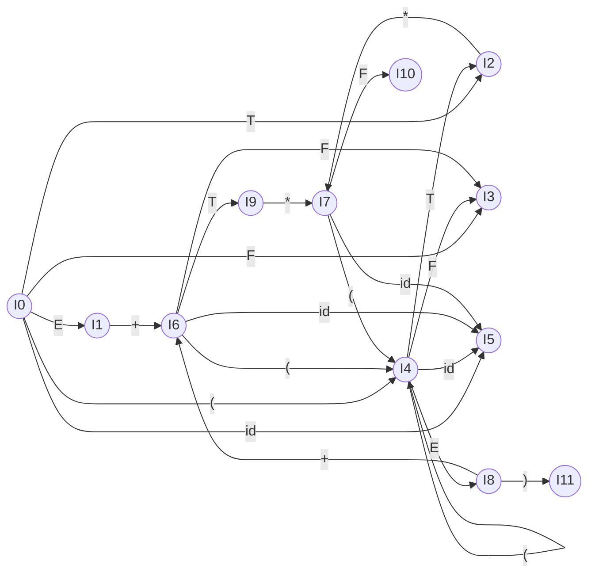
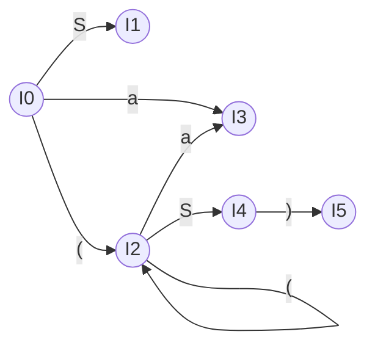

import LRParser from '@site/src/components/parsing/LRParser';
import {exprGrammarLR, exprSLRTable} from '@site/src/components/parsing/grammars';

# 15. LR 구문 분석

**LR** 도 두 글자의 뜻이 다르다.

| 글자 | 뜻 |
|---|---|
| **L** | **L**eft-to-right — 입력을 왼쪽에서 오른쪽으로 읽는다 |
| **R** | **R**ightmost derivation in reverse — 우측 유도를 **거꾸로** 만든다 |
| (k) | lookahead 토큰 수 |

LR 파싱이 LL보다 강한 이유는 하나다.

> **결정을 최대한 늦춘다.**
> 우변 전체가 스택에 쌓일 때까지 기다렸다가 축약한다.

대가는 **표를 손으로 만들기가 훨씬 복잡하다**는 것이다.
그래서 yacc 같은 도구가 존재한다.

:::tip[이 장을 읽기 전에]
이 교안에서 **가장 어려운 장**이다. 다음 셋이 준비되어 있으면 훨씬 수월하다.

| 필요한 것 | 어디서 |
|---|---|
| **스택**의 push/pop | [시작하기 전에](/docs/prerequisites#1-프로그래밍) |
| **부분집합 구성** — 집합을 상태로 삼는 발상 | [6.3절](/docs/regular/representations#63-nfa--dfa-부분집합-구성) |
| **FOLLOW 집합** | [12.4절](/docs/parsing/syntax-analysis#124-follow-집합) |

특히 부분집합 구성을 기억해 두자.
이 장의 **정준 항목 집합 구성은 그것과 완전히 같은 알고리즘**이고,
"집합을 하나의 상태로 삼는다"는 발상만 NFA 상태에서 LR 항목으로 바뀐다.

**막히면 이렇게 읽자.** 15.1절의 추적표에서 **9행 하나만** 이해해도 절반은 온 것이다.
"스택이 `E + T` 인데 `*` 가 보인다. 축약할까 이동할까?" —
이 장의 나머지 전부가 그 질문에 답하는 방법이다.
:::

---

## 15.1 이동-축약 파싱

LR 파서의 동작은 두 가지뿐이다.

| 동작 | 하는 일 |
|---|---|
| **이동(shift)** | 입력 토큰 하나를 스택에 밀어 넣는다 |
| **축약(reduce)** | 스택 맨 위의 $\beta$ 를 $A \to \beta$ 의 $A$ 로 바꾼다 |

여기에 **수락(accept)** 과 **오류(error)** 를 더하면 전부다.

### 손으로 돌려 보기

문법:

$$
\begin{aligned}
(1)\ & E \to E + T \quad &(2)\ & E \to T \\
(3)\ & T \to T * F \quad &(4)\ & T \to F \\
(5)\ & F \to (\,E\,) \quad &(6)\ & F \to \mathbf{id}
\end{aligned}
$$

입력 `id + id * id`:

| 스택 | 입력 | 동작 |
|---|---|---|
| `$` | `id + id * id $` | 이동 |
| `$ id` | `+ id * id $` | 축약 $F \to \mathbf{id}$ |
| `$ F` | `+ id * id $` | 축약 $T \to F$ |
| `$ T` | `+ id * id $` | 축약 $E \to T$ |
| `$ E` | `+ id * id $` | 이동 |
| `$ E +` | `id * id $` | 이동 |
| `$ E + id` | `* id $` | 축약 $F \to \mathbf{id}$ |
| `$ E + F` | `* id $` | 축약 $T \to F$ |
| `$ E + T` | `* id $` | **이동** ← 여기가 핵심 |
| `$ E + T *` | `id $` | 이동 |
| `$ E + T * id` | `$` | 축약 $F \to \mathbf{id}$ |
| `$ E + T * F` | `$` | 축약 $T \to T * F$ |
| `$ E + T` | `$` | 축약 $E \to E + T$ |
| `$ E` | `$` | **수락** |

:::danger[9행이 LR의 전부다]
스택이 `$ E + T` 이고 입력이 `*` 일 때,
$E \to E + T$ 로 **축약할 수도 있고** `*` 를 **이동할 수도 있다**.

- 축약하면 → `(id + id) * id` 로 해석된다
- 이동하면 → `id + (id * id)` 로 해석된다

올바른 것은 **이동**이다. 곱셈이 먼저이기 때문이다.

이 하나의 결정을 자동으로 내리게 하는 것이 LR 표의 존재 이유이고,
이 장의 나머지 전부는 "그 표를 어떻게 만드는가"다.
:::

### 핸들

:::info[정의 — 핸들(handle)]
우측 유도 $S \Rightarrow_{rm}^* \alpha A w \Rightarrow_{rm} \alpha \beta w$ 에서,
문장 형태 $\alpha\beta w$ 의 **핸들**은 위치 $\alpha$ 다음의 $\beta$ 와 규칙 $A \to \beta$ 다.

($w$ 는 터미널만으로 이루어진다는 점이 중요하다.)
:::

**핸들이란 "지금 축약해야 할 바로 그 부분"** 이다.
LR 파싱은 곧 **핸들을 찾아 축약하기를 반복**하는 것이다.

핸들은 **항상 스택의 맨 위에 나타난다.** 이것이 스택으로 파싱이 가능한 이유다.
증명은 우측 유도의 성질에서 나온다 — 오른쪽부터 전개했으므로,
거꾸로 축약할 때는 왼쪽부터, 즉 스택 위쪽부터 처리된다.

---

## 15.2 LR(0) 항목

핸들을 찾으려면 **"지금 어느 규칙의 어디까지 봤는가"** 를 추적해야 한다.
이를 표현하는 것이 **항목(item)** 이다.

:::info[정의 — LR(0) 항목]
생성 규칙의 우변 어딘가에 점 `·` 을 찍은 것.

규칙 $A \to XYZ$ 로부터 네 개의 항목이 나온다.

$$
A \to \cdot XYZ, \quad A \to X \cdot YZ, \quad A \to XY \cdot Z, \quad A \to XYZ \cdot
$$

$A \to \varepsilon$ 로부터는 $A \to \cdot$ 하나만 나온다.
:::

점의 의미:

- 점 **왼쪽** — 이미 스택에 쌓여 있는 부분
- 점 **오른쪽** — 앞으로 입력에서 볼 것으로 기대하는 부분

$A \to XYZ\cdot$ 처럼 점이 맨 끝에 있으면 **완결 항목(complete item)** 이고,
"이제 $A$ 로 축약할 수 있다"는 뜻이다.

### 증강 문법

시작 심볼에 대한 규칙을 하나 추가한다.

$$
(0)\ E' \to E
$$

이렇게 하면 "$E' \to E\cdot$ 에 도달했고 입력이 끝났다"가
**수락 조건**으로 깔끔하게 표현된다.

---

## 15.3 정준 LR(0) 항목 집합

### CLOSURE

:::info[CLOSURE(I)]
```
CLOSURE(I):
    반복:
      I 의 각 항목 A → α · B β 에 대해   (B 는 넌터미널)
        B → γ 인 모든 규칙에 대해
          B → · γ 를 I 에 추가
    더 이상 추가되지 않을 때까지
```
:::

직관: "$B$ 를 볼 차례라면, $B$ 를 만드는 어떤 규칙이든 그 **시작 지점**에
있을 수 있다."

### GOTO

:::info[GOTO(I, X)]
$I$ 의 항목 중 $A \to \alpha \cdot X \beta$ 형태인 것들에 대해
점을 $X$ 너머로 옮긴 항목 $A \to \alpha X \cdot \beta$ 들을 모은 뒤,
그 CLOSURE 를 취한다.
:::

"$X$ 를 하나 읽었을 때 어느 상태로 가는가"다. DFA의 전이 함수와 같다.

### CLOSURE 를 손으로 계산해 보자

정의만 보면 추상적이니 $I_0$ 를 직접 만들어 보자.

**시작점.** 증강 규칙의 시작 항목 하나뿐이다.

$$
I = \{\ E' \to \cdot E\ \}
$$

**1회차.** 점 오른쪽에 $E$ 가 있다. $E$ 는 넌터미널이므로,
$E$ 를 만드는 모든 규칙의 **시작 항목**을 추가한다.

$E \to E + T$ 와 $E \to T$ 가 있으므로:

$$
I = \{\ E' \to \cdot E,\ \ \underline{E \to \cdot E + T},\ \ \underline{E \to \cdot T}\ \}
$$

**2회차.** 새로 들어온 항목들을 다시 본다.

- $E \to \cdot E + T$ — 점 오른쪽이 $E$. 이미 $E$ 규칙을 다 넣었으므로 새것 없음
- $E \to \cdot T$ — 점 오른쪽이 **$T$**. $T$ 규칙을 넣어야 한다

$$
I = \{\ E' \to \cdot E,\ E \to \cdot E + T,\ E \to \cdot T,\ \ \underline{T \to \cdot T * F},\ \ \underline{T \to \cdot F}\ \}
$$

**3회차.** $T \to \cdot F$ 의 점 오른쪽이 **$F$**. $F$ 규칙을 넣는다.

$$
I = \{\ \dots,\ \ \underline{F \to \cdot (\,E\,)},\ \ \underline{F \to \cdot \mathbf{id}}\ \}
$$

**4회차.** 새로 들어온 $F \to \cdot (E)$ 와 $F \to \cdot \mathbf{id}$ 의
점 오른쪽은 각각 터미널 `(` 와 `id` 다. **넌터미널이 아니므로 추가할 것이 없다.**

더 이상 변화가 없으니 종료. 이것이 $I_0$ 다.

```
I0 = CLOSURE({E' → · E})
   = { E' → · E          ← 시작 항목
       E  → · E + T      ← 1회차: E 규칙
       E  → · T          ← 1회차
       T  → · T * F      ← 2회차: T 규칙
       T  → · F          ← 2회차
       F  → · ( E )      ← 3회차: F 규칙
       F  → · id }       ← 3회차
```

:::tip[CLOSURE 의 직관을 다시]
"$E$ 를 볼 차례다"라는 상태에 있다는 것은,
곧 "$E$ 를 만드는 어떤 규칙이든 그 **맨 처음**에 있을 수도 있다"는 뜻이다.

그리고 $E$ 를 만들려면 $T$ 부터 만들어야 하고,
$T$ 를 만들려면 $F$ 부터 만들어야 한다.
**기대가 아래로 번져 나가는 것**이 CLOSURE 다.
:::

### GOTO 를 손으로 계산해 보자

$I_0$ 에서 각 심볼로 한 걸음 옮겨 보자.

**$\mathrm{GOTO}(I_0, E)$**

$I_0$ 에서 **점 오른쪽이 $E$** 인 항목을 모두 찾는다.

$$
E' \to \cdot E, \qquad E \to \cdot E + T
$$

점을 $E$ 너머로 옮긴다.

$$
J = \{\ E' \to E \cdot,\ \ E \to E \cdot + T\ \}
$$

$\mathrm{CLOSURE}(J)$ 를 취한다. 두 항목 모두 점 오른쪽이
각각 아무것도 없거나 터미널 `+` 이므로 **추가할 것이 없다**.

$$
\mathrm{GOTO}(I_0, E) = \{\ E' \to E \cdot,\ E \to E \cdot + T\ \} = I_1
$$

**$\mathrm{GOTO}(I_0, T)$**

점 오른쪽이 $T$ 인 항목: $E \to \cdot T$, $T \to \cdot T * F$.
점을 옮기면

$$
J = \{\ E \to T \cdot,\ \ T \to T \cdot * F\ \}
$$

역시 CLOSURE 로 추가되는 것이 없다. 이것이 $I_2$ 다.

**$\mathrm{GOTO}(I_0,\ \texttt{(}\ )$**

점 오른쪽이 `(` 인 항목: $F \to \cdot (E)$ 하나뿐.

$$
J = \{\ F \to (\cdot E)\ \}
$$

이번엔 **점 오른쪽이 넌터미널 $E$** 다! CLOSURE 가 크게 불어난다.

$$
\mathrm{CLOSURE}(J) = \{\ F \to (\cdot E),\ E \to \cdot E+T,\ E \to \cdot T,\ T \to \cdot T*F,\ T \to \cdot F,\ F \to \cdot (E),\ F \to \cdot \mathbf{id}\ \}
$$

$I_0$ 와 거의 같은 모양이다 — 첫 항목만 다르다. 이것이 $I_4$ 다.

:::note[왜 $I_4$ 가 $I_0$ 를 닮았는가]
`(` 를 읽었다는 것은 **"이제부터 식을 하나 통째로 파싱해야 한다"** 는 뜻이다.
그 상황은 맨 처음 식을 파싱하기 시작할 때와 똑같다.

다른 점은 **끝났을 때 무엇을 기대하는가**뿐이다.
$I_0$ 는 입력 끝을, $I_4$ 는 닫는 `)` 를 기대한다.
그 차이가 첫 항목($E' \to \cdot E$ vs $F \to (\cdot E)$)에 담겨 있다.
:::

**$\mathrm{GOTO}(I_0, \mathbf{id})$**

$F \to \cdot \mathbf{id}$ 의 점을 옮기면 $F \to \mathbf{id} \cdot$.
**완결 항목**이고 추가할 것이 없다. 이것이 $I_5$ 다.

$I_5$ 는 항목이 하나뿐인 아주 작은 상태다.
"방금 `id` 를 읽었으니 이제 $F$ 로 축약할 수 있다"만 뜻한다.

### 정준 집합 만들기

이제 절차 전체를 쓸 수 있다.

:::info[정준 LR(0) 집합 구성]
```
C ← { CLOSURE({S' → · S}) }        (= {I0})
반복:
    C 의 각 항목 집합 I 에 대해
      각 문법 심볼 X 에 대해
        J ← GOTO(I, X)
        J 가 비어 있지 않고 C 에 없으면  C ← C ∪ {J}
더 이상 추가되지 않을 때까지
```
:::

**부분집합 구성과 똑같은 구조다.**
[6.3절](/docs/regular/representations#63-nfa--dfa-부분집합-구성)의
워크리스트 알고리즘과 나란히 놓고 보자.

| | 부분집합 구성 | 정준 집합 구성 |
|---|---|---|
| 상태 = | NFA 상태의 **집합** | LR(0) **항목의 집합** |
| 시작 | $\varepsilon\text{-closure}(\{q_0\})$ | $\mathrm{CLOSURE}(\{S' \to \cdot S\})$ |
| 한 걸음 | $\varepsilon\text{-closure}(\text{move}(T,a))$ | $\mathrm{CLOSURE}(\text{점 옮기기})$ |
| 종료 | 새 부분집합이 없을 때까지 | 새 항목 집합이 없을 때까지 |

`CLOSURE` 가 `ε-closure` 에, 점 옮기기가 `move` 에 대응한다.
**같은 알고리즘을 다른 자료에 적용한 것**이다.

이 절차를 끝까지 돌리면 11개 집합이 나온다.

**식 문법의 정준 LR(0) 집합** (11개):

```
I0: E' → · E          I1: E' → E ·         I2: E → T ·
    E  → · E + T           E  → E · + T        T → T · * F
    E  → · T
    T  → · T * F      I3: T → F ·          I4: F → ( · E )
    T  → · F                                   E → · E + T
    F  → · ( E )      I5: F → id ·             E → · T
    F  → · id                                  T → · T * F
                                               T → · F
I6: E → E + · T       I7: T → T * · F          F → · ( E )
    T → · T * F           F → · ( E )          F → · id
    T → · F               F → · id
    F → · ( E )
    F → · id          I9: E → E + T ·      I10: T → T * F ·
                          T → T · * F
I8: F → ( E · )
    E → E · + T       I11: F → ( E ) ·
```

전이도로 보면 이렇다.



:::tip[이 오토마타의 정체]
이것은 **"실행 가능한 접두사(viable prefix)"를 인식하는 DFA**다.

실행 가능한 접두사란 "올바른 우측 문장 형태의 접두사 중,
핸들의 오른쪽 끝을 넘지 않는 것"이다.
쉽게 말해 **스택에 쌓여 있을 수 있는 심볼 열**이다.

놀라운 사실: **실행 가능한 접두사의 집합은 정규언어다.**
그래서 유한 오토마타로 인식할 수 있고, LR 파서는
"이 DFA + 스택"으로 구현된다.

2부에서 배운 유한 오토마타가 여기서 다시 나온다는 점이 아름답다.
:::

---

## 15.4 SLR(1) 표 만들기

가장 단순한 LR 표 구성법이다.

:::info[SLR(1) 표 구성]

각 상태 $I_i$ 에 대해:

1. $A \to \alpha \cdot a \beta \in I_i$ 이고 $\mathrm{GOTO}(I_i, a) = I_j$ 이면
   $\mathrm{ACTION}[i, a] = \textbf{shift } j$
2. $A \to \alpha \cdot \in I_i$ ($A \neq S'$) 이면,
   **$\mathrm{FOLLOW}(A)$ 의 모든 $a$** 에 대해
   $\mathrm{ACTION}[i, a] = \textbf{reduce } A \to \alpha$
3. $S' \to S \cdot \in I_i$ 이면 `ACTION[i, $]` = **accept**
4. $\mathrm{GOTO}(I_i, A) = I_j$ ($A$ 는 넌터미널) 이면 $\mathrm{GOTO}[i, A] = j$
5. 나머지는 오류
:::

**"S"는 Simple의 약자다.** 축약 결정에
[12장에서 구한](/docs/parsing/syntax-analysis#125-직접-계산해-보기)
FOLLOW 집합을 그대로 쓰기 때문이다.

| 넌터미널 | FOLLOW |
|---|---|
| $E$ | `{ +, ), $ }` |
| $T$ | `{ +, *, ), $ }` |
| $F$ | `{ +, *, ), $ }` |

### 완성된 표

| 상태 | `id` | `+` | `*` | `(` | `)` | `$` | | `E` | `T` | `F` |
|---|---|---|---|---|---|---|---|---|---|---|
| 0 | s5 | | | s4 | | | | 1 | 2 | 3 |
| 1 | | s6 | | | | **acc** | | | | |
| 2 | | r2 | s7 | | r2 | r2 | | | | |
| 3 | | r4 | r4 | | r4 | r4 | | | | |
| 4 | s5 | | | s4 | | | | 8 | 2 | 3 |
| 5 | | r6 | r6 | | r6 | r6 | | | | |
| 6 | s5 | | | s4 | | | | | 9 | 3 |
| 7 | s5 | | | s4 | | | | | | 10 |
| 8 | | s6 | | | s11 | | | | | |
| 9 | | r1 | s7 | | r1 | r1 | | | | |
| 10 | | r3 | r3 | | r3 | r3 | | | | |
| 11 | | r5 | r5 | | r5 | r5 | | | | |

**상태 2를 읽어 보자.** $I_2 = \{E \to T\cdot,\ T \to T\cdot *F\}$

- $E \to T\cdot$ 는 완결 항목 → FOLLOW($E$) = `{ +, ), $ }` 열에 `r2`
- $T \to T\cdot *F$ 는 `*` 를 기대 → `*` 열에 `s7`

`*` 는 $\mathrm{FOLLOW}(E)$ 에 **없으므로** 충돌하지 않는다.
바로 이것이 15.1절 9행의 "이동을 택한다"를 만들어 낸다.

:::tip[연산자 우선순위가 표에 새겨졌다]
상태 9는 $\{E \to E+T\cdot,\ T \to T\cdot *F\}$ 다.
`*` 를 보면 `s7`(이동), `+`나 `)`나 `$`를 보면 `r1`(축약).

문법을 $E/T/F$ 로 계층화한 결과가
**표의 한 행**에 그대로 나타난 것이다.
:::

---

## 15.5 직접 돌려 보기

<LRParser
  grammar={exprGrammarLR}
  table={exprSLRTable}
  defaultInput="id + id * id"
  samples={['id', 'id + id', 'id + id * id', 'id * id + id', '( id + id ) * id', 'id +']}
  title="SLR(1) 파서 — 식 문법"
/>

:::tip[확인할 것]
1. **상태 9에서 `*` 를 만나는 순간** — `id + id * id` 를 끝까지 돌려 보면
   스택이 `0 E 1 + 6 T 9` 이고 입력이 `* id $` 인 지점이 나온다.
   여기서 `s7`(이동)을 택한다. 15.1절 9행이 이것이다.

2. **축약 순서** — `r6 r4 r2 r6 r4 r6 r3 r1`.
   $T \to T*F$(r3)가 $E \to E+T$(r1)보다 **먼저** 나온다.
   곱셈이 먼저 묶인다는 뜻이다.

3. **역순으로 읽으면 우측 유도** — 하단에 표시된 순서가
   $E \Rightarrow_{rm} E+T \Rightarrow_{rm} E+T*F \Rightarrow_{rm} \cdots$ 다.

4. **오류** — `id +` 를 넣으면 상태 6에서 `$` 를 만나
   `ACTION[6, $]` 가 비어 있다는 오류가 난다.
   기대하는 토큰 목록도 함께 나온다 — 좋은 오류 메시지의 재료다.
:::

:::note[이 표는 기계로 검증했다]
위 표가 정확한지는 눈으로만 확인하지 않았다.
`site/src/components/parsing/simulate.test.ts` 에서
올바른 입력 12개가 수락되고 잘못된 입력 8개가 거부되는지,
그리고 `id + id * id` 의 축약 순서가 `[6,4,2,6,4,6,3,1]` 인지를
테스트로 확인한다.

```bash
cd site && bun test
```
:::

---

## 15.6 충돌

표의 한 칸에 액션이 둘 이상 들어가면 **충돌(conflict)** 이다.

### shift/reduce 충돌

같은 칸에 이동과 축약이 모두 들어간다.

**dangling else** 가 대표적이다.

$$
S \to \mathbf{if}\ E\ \mathbf{then}\ S \cdot \mid \mathbf{if}\ E\ \mathbf{then}\ S \cdot \mathbf{else}\ S
$$

`else` 를 보았을 때

- 첫 항목이 완결이므로 **축약** 가능 (else 없는 if로 끝냄)
- 둘째 항목이 `else` 를 기대하므로 **이동** 가능

`else` $\in \mathrm{FOLLOW}(S)$ 이므로 충돌한다.

:::tip[yacc의 기본 해결책]
**충돌 시 이동을 택한다.**
그러면 `else` 가 가장 가까운 `if` 에 붙는다 — 우리가 원하는 결과다.

그래서 dangling else 는 실무에서 **경고 하나로 넘어가는 것이 관례**다.
`%expect 1` 로 "이 충돌 1개는 알고 있다"고 선언해 둘 수 있다.
:::

### reduce/reduce 충돌

같은 칸에 축약이 둘 이상 들어간다. **거의 항상 문법의 진짜 버그**다.

$$
\begin{aligned}
S &\to a\,A\,d \mid b\,B\,d \mid a\,B\,e \mid b\,A\,e \\
A &\to c \\
B &\to c
\end{aligned}
$$

`c` 를 보고 $A \to c$ 인지 $B \to c$ 인지 결정해야 하는데,
그것은 맨 앞이 `a` 였는지 `b` 였는지에 달렸다 —
**LR(0) 상태만으로는 그 정보가 없다.**

yacc는 **먼저 쓰인 규칙**을 택하고 경고한다.
[lex의 규칙 우선순위](/docs/lex/lex-input-and-parsing#81-두-가지-명확화-규칙)와 같은 방식이다.

---

## 15.7 LR(1)과 LALR(1)

:::tip[여기서 한 번 쉬어 가도 된다]
15.1 ~ 15.6 으로 **하나의 완결된 이야기**가 끝났다.
이동-축약 → 항목 → 정준 집합 → SLR(1) 표 → 충돌.
여기까지만 알아도 [16장 구현](/docs/parsing/lr-parser-implementation)과
[18장 yacc](/docs/yacc/yacc-overview)로 넘어갈 수 있다.

이 절은 **두 번째 이야기**다. "SLR로 안 되는 문법은 어떻게 하나"에 답한다.
분량이 앞의 여섯 절을 합친 것과 비슷하므로, 앉은 자리에서 이어 읽기보다
한 번 끊고 오는 편이 낫다.

| | 다루는 것 | 언제 필요한가 |
|---|---|---|
| 15.1 ~ 15.6 | LR의 기본기와 SLR(1) | **항상** |
| 15.7 | LR(1)·LALR(1) | bison이 왜 SLR이 아닌지 알고 싶을 때, 충돌이 났을 때 |
:::

SLR의 약점은 FOLLOW 집합이 **너무 뭉뚱그려져 있다**는 것이다.
"$A$ 뒤에 올 수 있는 것" 전부를 쓰는데,
**지금 이 상태에서** 실제로 뒤따를 수 있는 것은 그보다 좁을 수 있다.

### SLR이 실패하는 예

$$
\begin{aligned}
S' &\to S \\
S &\to L = R \mid R \\
L &\to *\,R \mid \mathbf{id} \\
R &\to L
\end{aligned}
$$

(C의 포인터 대입 `*p = q` 를 모형화한 것이다.
$L$ 은 좌변값(**L**-value), $R$ 은 우변값(**R**-value)이라고 읽으면 된다.)

**먼저 FOLLOW를 계산한다.** [12장의 규칙](/docs/parsing/syntax-analysis#124-follow-집합)
그대로다.

| 근거 | 얻는 것 |
|---|---|
| $S$ 가 시작 심볼 | `$` $\in \mathrm{FOLLOW}(S)$ |
| $S \to L \mathbin{=} R$ 에서 $L$ 뒤에 `=` | `=` $\in \mathrm{FOLLOW}(L)$ |
| $S \to L \mathbin{=} R$ 에서 $R$ 이 맨 끝 | $\mathrm{FOLLOW}(S) \subseteq \mathrm{FOLLOW}(R)$ |
| $L \to *\,R$ 에서 $R$ 이 맨 끝 | $\mathrm{FOLLOW}(L) \subseteq \mathrm{FOLLOW}(R)$ |
| $R \to L$ 에서 $L$ 이 맨 끝 | $\mathrm{FOLLOW}(R) \subseteq \mathrm{FOLLOW}(L)$ |

마지막 두 줄이 서로를 먹여서 **두 집합이 같아진다.**

$$
\mathrm{FOLLOW}(L) = \mathrm{FOLLOW}(R) = \{\,\mathbf{=},\ \$\,\}
$$

여기가 문제의 근원이다. `=` 는 $L$ 의 뒤에 오는 것인데,
$R \to L$ 이라는 규칙 하나 때문에 $R$ 에게까지 번져 버렸다.

이제 상태 $I_2 = \{S \to L\cdot = R,\ R \to L\cdot\}$ 에서 `=` 를 보면

- $S \to L\cdot = R$ 로 **이동** 가능
- $R \to L\cdot$ 는 완결이고 `=` $\in \mathrm{FOLLOW}(R)$ 이므로 **축약** 가능

충돌이다. 그런데 **실제로는 축약이 절대 옳지 않다.**
$R$ 뒤에 `=` 가 오는 우측 문장 형태는 존재하지 않는다.
`x = y` 에서 `x` 는 좌변값이지 우변값이 아니기 때문이다.
FOLLOW가 너무 넓게 잡은 것이다.

### LR(1) 항목

해결책은 항목에 **lookahead 를 붙이는 것**이다.

$$
[A \to \alpha \cdot \beta,\ a]
$$

"이 규칙으로 축약하는 것은 다음 토큰이 $a$ 일 때만"이라는 뜻이다.

CLOSURE 도 바뀐다. $[A \to \alpha \cdot B\beta,\ a]$ 로부터
$B \to \gamma$ 에 대해

$$
[B \to \cdot\gamma,\ b] \quad \text{for each } b \in \mathrm{FIRST}(\beta a)
$$

를 추가한다. **$\beta$ 다음에 $a$ 가 온다**는 문맥을 정확히 반영한다.

:::note[$\mathrm{FIRST}(\beta a)$ 를 읽는 법]
$\beta$ 는 **점 뒤에서 $B$ 다음에 오는 것**, $a$ 는 **바깥 항목의 lookahead** 다.

$B$ 를 다 전개하고 나면 그 뒤에는 $\beta$ 가 오고,
$\beta$ 마저 없어지면($\beta \Rightarrow^* \varepsilon$) 그때는 $a$ 가 온다.
그래서 "$\beta$ 를 먼저 보고, 안 되면 $a$" — 정확히 $\mathrm{FIRST}(\beta a)$ 다.

$\beta = \varepsilon$ 이면 $\mathrm{FIRST}(a) = \{a\}$, 즉 **lookahead가 그대로 물려 내려간다.**
:::

### LR(1) CLOSURE 를 손으로 계산해 보자

같은 문법에 번호를 매긴다.

$$
\begin{aligned}
(0)\ S' &\to S &\quad (3)\ L &\to *\,R \\
(1)\ S &\to L = R &\quad (4)\ L &\to \mathbf{id} \\
(2)\ S &\to R &\quad (5)\ R &\to L
\end{aligned}
$$

시작 항목 하나에서 출발한다. 항목은 `[코어, lookahead]` 로 적는다.

$$
I_0 = \mathrm{CLOSURE}(\{\,[S' \to \cdot S,\ \$]\,\})
$$

**1회차** — 점 뒤가 $S$. 규칙 (1), (2)를 넣는다.
$\beta = \varepsilon$ 이고 바깥 lookahead 가 `$` 이므로,
$\mathrm{FIRST}(\beta a)$ 는 `$` 그대로다.

$$
[S \to \cdot L = R,\ \$], \qquad [S \to \cdot R,\ \$]
$$

**2회차** — 새로 들어온 두 항목을 처리한다.

`[S → ·L = R, $]` 는 점 뒤가 $L$ 이고 **$\beta = \mathbin{=} R$**, 바깥 lookahead 는 `$` 다.

$$
\mathrm{FIRST}(\mathbin{=} R\ \$) = \{\mathbf{=}\}
$$

$\beta$ 의 첫 심볼이 터미널 `=` 이므로 거기서 끝난다.
**바깥 lookahead 는 쓰이지 않는다.**
따라서 규칙 (3), (4)를 lookahead `=` 로 넣는다.

$$
[L \to \cdot *R,\ \mathbf{=}], \qquad [L \to \cdot \mathbf{id},\ \mathbf{=}]
$$

`[S → ·R, $]` 는 점 뒤가 $R$ 이고 $\beta = \varepsilon$ 이다.
$\beta$ 가 비었으므로 바깥 lookahead 가 그대로 내려온다.
규칙 (5)를 lookahead `$` 로 넣는다.

$$
[R \to \cdot L,\ \$]
$$

**3회차** — `[R → ·L, $]` 의 점 뒤가 $L$, $\beta = \varepsilon$ 이다.
규칙 (3), (4)를 **이번에는 lookahead `$` 로** 넣는다.

$$
[L \to \cdot *R,\ \$], \qquad [L \to \cdot \mathbf{id},\ \$]
$$

**4회차** — 새로 넣을 것이 없다. 끝.

같은 코어에 붙은 lookahead 는 하나로 묶어 적는다.

:::info[$I_0$ 완성]
| 항목 | lookahead | 들어온 경로 |
|---|---|---|
| $S' \to \cdot S$ | `$` | 시작 |
| $S \to \cdot L = R$ | `$` | $S$ 전개 |
| $S \to \cdot R$ | `$` | $S$ 전개 |
| $R \to \cdot L$ | `$` | $S \to \cdot R$ 전개 |
| $L \to \cdot *R$ | `=` , `$` | `=` 는 $S \to \cdot L{=}R$ 에서, `$` 는 $R \to \cdot L$ 에서 |
| $L \to \cdot \mathbf{id}$ | `=` , `$` | 위와 같음 |
:::

**$L$ 항목이 왜 lookahead 를 두 개 갖는지**가 핵심이다.
$L$ 이 나오는 자리가 두 군데이기 때문이다.

- $S \to L \mathbin{=} R$ 의 $L$ → 뒤에 `=` 가 온다
- $R \to L$ 의 $L$ → $R$ 뒤에 오는 것, 즉 `$` 가 온다

SLR은 이 둘을 뭉쳐 $\mathrm{FOLLOW}(L)$ 하나로만 봤다.
LR(1)은 **어느 자리에서 온 $L$ 인지**를 항목마다 따로 기억한다.

### GOTO 로 정준 LR(1) 집합 만들기

$\mathrm{GOTO}(I, X)$ 의 계산법은 [15.3절](#153-정준-lr0-항목-집합)과 똑같다 —
점을 $X$ 너머로 옮기고 CLOSURE. **lookahead 는 손대지 않고 따라간다.**

$\mathrm{GOTO}(I_0, L)$ 을 해 보자. $I_0$ 에서 점 뒤가 $L$ 인 항목은 둘이다.

$$
[S \to \cdot L = R,\ \$] \ \longrightarrow\ [S \to L \cdot = R,\ \$]
$$
$$
[R \to \cdot L,\ \$] \ \longrightarrow\ [R \to L \cdot,\ \$]
$$

둘 다 점 뒤가 터미널이거나 완결이므로 CLOSURE가 더할 것이 없다.

$$
I_2 = \{\,[S \to L\cdot = R,\ \$],\ \ [R \to L\cdot,\ \$]\,\}
$$

**여기서 승부가 난다.** $R \to L\cdot$ 의 lookahead 가 `$` 하나뿐이다.
`=` 가 없다. 그러므로

| `=` 열 | `$` 열 |
|---|---|
| shift (규칙 $S \to L\cdot{=}R$) | reduce 5 (규칙 $R \to L\cdot$) |

**두 액션이 서로 다른 열에 들어간다 — 충돌이 없다.**
SLR이 `=` 열에 reduce를 밀어 넣었던 것은 FOLLOW가 뭉뚱그린 결과였을 뿐이다.

나머지도 같은 방식으로 돌리면 $I_0 \sim I_{13}$, 모두 **14개** 상태가 나온다.

:::info[정준 LR(1) 집합 전체]
lookahead 가 다른 것끼리는 **다른 상태**임에 주의하자.

| 상태 | 항목 (lookahead) | 어디서 왔나 |
|---|---|---|
| $I_0$ | 위 표 참조 | 시작 |
| $I_1$ | $S' \to S\cdot$ `$` | $\mathrm{GOTO}(I_0, S)$ |
| $I_2$ | $S \to L\cdot{=}R$ `$` / $R \to L\cdot$ `$` | $\mathrm{GOTO}(I_0, L)$ |
| $I_3$ | $S \to R\cdot$ `$` | $\mathrm{GOTO}(I_0, R)$ |
| $I_4$ | $L \to *\cdot R$ `=`,`$` / $R \to \cdot L$ `=`,`$` / $L \to \cdot *R$ `=`,`$` / $L \to \cdot\mathbf{id}$ `=`,`$` | $\mathrm{GOTO}(I_0, *)$ |
| $I_5$ | $L \to \mathbf{id}\cdot$ `=`,`$` | $\mathrm{GOTO}(I_0, \mathbf{id})$ |
| $I_6$ | $S \to L{=}\cdot R$ `$` / $R \to \cdot L$ `$` / $L \to \cdot *R$ `$` / $L \to \cdot\mathbf{id}$ `$` | $\mathrm{GOTO}(I_2, \mathbf{=})$ |
| $I_7$ | $L \to *R\cdot$ `=`,`$` | $\mathrm{GOTO}(I_4, R)$ |
| $I_8$ | $R \to L\cdot$ `=`,`$` | $\mathrm{GOTO}(I_4, L)$ |
| $I_9$ | $S \to L{=}R\cdot$ `$` | $\mathrm{GOTO}(I_6, R)$ |
| $I_{10}$ | $R \to L\cdot$ `$` | $\mathrm{GOTO}(I_6, L)$ |
| $I_{11}$ | $L \to *\cdot R$ `$` / $R \to \cdot L$ `$` / $L \to \cdot *R$ `$` / $L \to \cdot\mathbf{id}$ `$` | $\mathrm{GOTO}(I_6, *)$ |
| $I_{12}$ | $L \to \mathbf{id}\cdot$ `$` | $\mathrm{GOTO}(I_6, \mathbf{id})$ |
| $I_{13}$ | $L \to *R\cdot$ `$` | $\mathrm{GOTO}(I_{11}, R)$ |
:::

**$I_6$ 이하가 왜 생겼는지** 보자.
$I_6$ 은 `=` 를 이미 지나온 상태다. 대입의 **오른쪽**이므로 그 뒤에 `=` 가 또 올 일이 없다.
그래서 $I_6$ 에서 뻗어 나간 $I_{10} \sim I_{13}$ 은 전부 lookahead 가 `$` 뿐이다.

$I_4$ 계열($I_4, I_5, I_7, I_8$)과 $I_{11}$ 계열($I_{11}, I_{12}, I_{13}, I_{10}$)은
**항목의 모양이 완전히 같고 lookahead 만 다르다.**
LR(1)은 이 둘을 다른 상태로 센다. 여기서 상태가 불어난다.

:::caution[LR(1)의 대가는 상태 수다]
같은 코어(항목 집합의 LR(0) 부분)를 가진 상태가
lookahead 만 달라서 여러 개로 쪼개진다.

전형적인 프로그래밍 언어에서
LR(0)/SLR/LALR 상태가 수백 개일 때 LR(1) 상태는 **수천 개**가 된다.
1965년의 컴퓨터로는 감당할 수 없는 크기였다.
:::

### LALR(1)

DeRemer의 아이디어(1969): **코어가 같은 LR(1) 상태들을 병합한다.**

$$
[A \to \alpha\cdot\beta,\ a] \text{ 와 } [A \to \alpha\cdot\beta,\ b]
\;\longrightarrow\;
[A \to \alpha\cdot\beta,\ \{a, b\}]
$$

**코어(core)** 란 항목 집합에서 lookahead 를 떼어 낸 LR(0) 부분이다.

### 실제로 병합해 보자

바로 위 14개 상태에서 코어가 같은 짝을 찾는다.

| 코어 | LR(1) 상태 | 각자의 lookahead | 병합 후 |
|---|---|---|---|
| $L \to *\cdot R,\ R \to \cdot L,\ L \to \cdot *R,\ L \to \cdot\mathbf{id}$ | $I_4$ / $I_{11}$ | `=`,`$` / `$` | **`=`,`$`** |
| $L \to \mathbf{id}\cdot$ | $I_5$ / $I_{12}$ | `=`,`$` / `$` | **`=`,`$`** |
| $L \to *R\cdot$ | $I_7$ / $I_{13}$ | `=`,`$` / `$` | **`=`,`$`** |
| $R \to L\cdot$ | $I_8$ / $I_{10}$ | `=`,`$` / `$` | **`=`,`$`** |

네 쌍이 합쳐지므로

$$
14 \;-\; 4 \;=\; 10 \text{ 개 상태}
$$

이고, 이 문법의 **LR(0) 상태 수가 정확히 10개**다. 약속대로 표가 늘지 않았다.

**그런데 $I_2$ 는 병합되지 않는다.**
코어 $\{S \to L\cdot{=}R,\ R \to L\cdot\}$ 를 가진 상태가 $I_2$ 하나뿐이기 때문이다.
합칠 상대가 없으니 lookahead 는 `$` 그대로 남고,

$$
\mathrm{ACTION}[I_2,\ \mathbf{=}] = \text{shift} \quad\text{(reduce 없음)}
$$

**충돌이 사라진 채로 유지된다.** LALR이 SLR을 이기는 지점이 바로 여기다.

:::tip[세 방법이 $I_2$ 를 보는 눈]
| | $R \to L\cdot$ 를 축약할 lookahead | `=` 열 |
|---|---|---|
| **SLR(1)** | `FOLLOW(R) = {=, $}` | shift/reduce **충돌** ❌ |
| **LALR(1)** | 이 상태에서 실제로 가능한 `{$}` | shift 만 ✅ |
| **LR(1)** | 이 상태에서 실제로 가능한 `{$}` | shift 만 ✅ |

LALR과 LR(1)의 답이 같다. **병합해도 손해가 없었다** — 대부분의 실제 문법이 그렇다.
:::

:::tip[bison으로 확인해 보자]
```bash
cat > lr.y <<'EOF'
%token ID
%%
S : L '=' R | R ;
L : '*' R | ID ;
R : L ;
%%
EOF
bison -v lr.y      # 경고 없음 = 충돌 0
```

`lr.output` 에서 코어가 $I_2$ 인 상태를 찾으면 이렇게 나온다.

```
state 4

    1 S: L . '=' R
    5 R: L .

    '='  shift, and go to state 9

    $default  reduce using rule 5 (R)
```

`=` 는 **shift 로만** 적혀 있다. 손으로 계산한 것과 같다.

번호가 다른 것은 bison이 $I_2$ 를 4번으로 세기 때문이다.
상태 총수도 bison은 **11개**로 보고하는데,
증강 규칙을 $S' \to S$ 가 아니라 `$accept: S $end` 로 쓰기 때문에
`$end` 를 이동하는 상태가 하나 더 생긴다.
그 한 칸을 빼면 우리가 센 **10개**와 정확히 같다.
:::

정리하면

- 상태 수는 **LR(0)과 같다** (표가 작다)
- lookahead 는 SLR 보다 정확하다
- 위의 `*p = q` 예제도 해결된다

:::danger[LALR 병합의 부작용]
병합으로 **원래 없던 reduce/reduce 충돌이 생길 수 있다.**

두 상태가 각각
$\{[A \to \alpha\cdot, a],\ [B \to \beta\cdot, b]\}$ 와
$\{[A \to \alpha\cdot, b],\ [B \to \beta\cdot, a]\}$ 라면,
각각은 충돌이 없다. 그런데 병합하면
$\{[A \to \alpha\cdot, \{a,b\}],\ [B \to \beta\cdot, \{a,b\}]\}$ 가 되어
`a`, `b` 둘 다에서 축약이 겹친다.

**shift/reduce 충돌은 새로 생기지 않는다.**
이동 액션은 코어만으로 결정되므로 lookahead 병합과 무관하기 때문이다.

또 하나의 성질: LALR 파서는 잘못된 입력에 대해
**LR(1) 파서보다 늦게** 오류를 발견할 수 있다
(몇 번의 불필요한 축약을 더 한다). 다만 **잘못된 토큰을 이동하지는 않는다.**
:::

### 네 가지 비교

| | 상태 수 | lookahead | 처리 가능 문법 |
|---|---|---|---|
| LR(0) | 적음 | 없음 | 아주 좁음 |
| **SLR(1)** | LR(0)과 같음 | FOLLOW(A) | 좁음 |
| **LALR(1)** | LR(0)과 같음 | 상태별 정확한 집합 | 실용적으로 충분 |
| LR(1) | 많음 (수 배) | 완전히 정확 | DCFL 전체 |

$$
\text{LR(0)} \subsetneq \text{SLR(1)} \subsetneq \text{LALR(1)} \subsetneq \text{LR(1)}
$$

**yacc와 bison의 기본은 LALR(1)** 이다.

:::tip[bison으로 직접 확인하기]
```bash
bison -v calc.y      # calc.output 생성
```
`calc.output` 에는 **모든 상태의 항목 집합**과 액션이 그대로 적혀 있다.
이 장에서 손으로 만든 $I_0 \sim I_{11}$ 과 같은 것이다.

```
State 2

    2 E: T .
    3 T: T . '*' F

    '*'  shift, and go to state 7

    $default  reduce using rule 2 (E)
```

`$default` 는 bison 의 표 압축이다.
FOLLOW 집합의 각 열에 같은 축약을 반복해 넣는 대신
"기본값"으로 한 번만 적는다.
:::

---

## 요약

- **LR(k)** = Left-to-right 스캔 + Rightmost derivation **in reverse**.
- 동작은 **이동**과 **축약** 둘뿐. 핵심 질문은 "언제 축약할 것인가".
- **핸들**은 지금 축약해야 할 부분이고, **항상 스택 맨 위**에 나타난다.
- **LR(0) 항목**은 규칙에 점을 찍은 것.
  점 왼쪽 = 스택에 쌓인 것, 점 오른쪽 = 기대하는 것.
- **CLOSURE** 와 **GOTO** 로 정준 항목 집합을 만들면,
  그것이 **실행 가능한 접두사를 인식하는 DFA** 가 된다.
  실행 가능한 접두사의 집합이 **정규언어**라는 것이 LR 파싱의 이론적 기반이다.
- **SLR(1)** — 축약 결정에 FOLLOW 를 쓴다. 단순하지만 너무 넓다.
- **LR(1)** — 항목에 lookahead 를 붙인다. 정확하지만 상태가 폭발한다.
- **LALR(1)** — 코어가 같은 LR(1) 상태를 병합. 표는 LR(0) 크기,
  정확도는 SLR 보다 높다. **yacc/bison의 기본**.
  대가로 **reduce/reduce 충돌이 새로 생길 수 있다**
  (shift/reduce 는 생기지 않는다).
- **shift/reduce 충돌** — yacc 는 이동을 택한다. dangling else 에 딱 맞는다.
  **reduce/reduce 충돌** — 거의 항상 문법의 버그다.

## 확인 문제

1. 다음 문법의 정준 LR(0) 항목 집합을 모두 구하라.
   $$S' \to S, \quad S \to (\,S\,) \mid a$$

<details>
<summary>풀이</summary>

**규칙 번호**

| # | 규칙 |
|---|---|
| 0 | $S' \to S$ |
| 1 | $S \to (\,S\,)$ |
| 2 | $S \to a$ |

**$I_0$ 부터**

$\mathrm{CLOSURE}(\{S' \to \cdot S\})$ 를 계산한다.
점 오른쪽이 넌터미널 $S$ 이므로 $S$ 의 모든 규칙을 시작 항목으로 추가.

```
I0 = { S' → · S
       S  → · ( S )
       S  → · a }
```

$S \to \cdot(S)$ 와 $S \to \cdot a$ 의 점 오른쪽은 터미널이므로 더 추가할 것이 없다.

**GOTO 계산**

| GOTO | 점을 옮긴 항목 | CLOSURE 후 | 이름 |
|---|---|---|---|
| $(I_0, S)$ | $S' \to S\cdot$ | 그대로 | **I1** |
| $(I_0, \texttt{(})$ | $S \to (\cdot S)$ | + $S$ 규칙들 | **I2** |
| $(I_0, a)$ | $S \to a\cdot$ | 그대로 | **I3** |

```
I1 = { S' → S · }
I2 = { S → ( · S )
       S → · ( S )
       S → · a }
I3 = { S → a · }
```

$I_2$ 에서 계속:

| GOTO | 결과 | 이름 |
|---|---|---|
| $(I_2, S)$ | $S \to (S\cdot)$ | **I4** |
| $(I_2, \texttt{(})$ | $I_2$ 와 같다 | (재사용) |
| $(I_2, a)$ | $I_3$ 과 같다 | (재사용) |
| $(I_4, \texttt{)})$ | $S \to (S)\cdot$ | **I5** |

```
I4 = { S → ( S · ) }
I5 = { S → ( S ) · }
```

**총 6개 상태.**



$I_2$ 가 **자기 자신으로** 가는 간선이 있다는 데 주목하자.
`((` 처럼 괄호가 중첩되면 같은 상태에 머문다 —
**깊이는 스택이 기억**한다.

</details>

2. 위 문법의 SLR(1) 표를 만들고, `( ( a ) )` 를 파싱하라.

<details>
<summary>풀이</summary>

**FOLLOW 계산**

`FOLLOW(S) = { ), $ }`

- $S' \to S$ 에서 → `$`
- $S \to (S)$ 에서 $S$ 뒤에 `)` → `)`

**SLR(1) 표**

| 상태 | `(` | `)` | `a` | `$` | | `S` |
|---|---|---|---|---|---|---|
| 0 | s2 | | s3 | | | 1 |
| 1 | | | | **acc** | | |
| 2 | s2 | | s3 | | | 4 |
| 3 | | r2 | | r2 | | |
| 4 | | s5 | | | | |
| 5 | | r1 | | r1 | | |

- 상태 3 ($S \to a\cdot$) — 완결 항목 → `FOLLOW(S) = {), $}` 열에 `r2`
- 상태 5 ($S \to (S)\cdot$) — 완결 항목 → 같은 열에 `r1`

**파싱 `( ( a ) )`**

| # | 스택 | 입력 | ACTION | 동작 |
|---|---|---|---|---|
| 1 | `0` | `( ( a ) ) $` | s2 | 이동 |
| 2 | `0 ( 2` | `( a ) ) $` | s2 | 이동 |
| 3 | `0 ( 2 ( 2` | `a ) ) $` | s3 | 이동 |
| 4 | `0 ( 2 ( 2 a 3` | `) ) $` | r2 | 축약 $S \to a$. 1칸 팝 → 상태 2, GOTO[2,S]=4 |
| 5 | `0 ( 2 ( 2 S 4` | `) ) $` | s5 | 이동 |
| 6 | `0 ( 2 ( 2 S 4 ) 5` | `) $` | r1 | 축약 $S \to (S)$. 3칸 팝 → 상태 2, GOTO[2,S]=4 |
| 7 | `0 ( 2 S 4` | `) $` | s5 | 이동 |
| 8 | `0 ( 2 S 4 ) 5` | `$` | r1 | 축약 $S \to (S)$. 3칸 팝 → 상태 0, GOTO[0,S]=1 |
| 9 | `0 S 1` | `$` | **acc** | **수락** ✅ |

**관찰.** 4행에서 안쪽 `a` 를 $S$ 로 축약한 뒤,
6행과 8행에서 **안쪽 괄호부터** 차례로 축약한다.
스택의 깊이가 괄호 중첩 깊이를 그대로 기억하고 있다 —
[10장의 PDA](/docs/parsing/context-free-grammar#103-푸시다운-오토마타)가 하는 일 그대로다.

</details>

3. 시뮬레이터에 `( id + id ) * id` 를 넣고,
   상태 4와 8이 언제 나타나는지 관찰하라.
   상태 8($F \to (E\cdot)$)의 역할은 무엇인가?

<details>
<summary>풀이</summary>

**상태 4가 나타나는 시점:** `(` 를 이동한 직후.

$$I_4 = \{F \to (\cdot E),\ E \to \cdot E{+}T,\ E \to \cdot T,\ T \to \cdot T{*}F,\ T \to \cdot F,\ F \to \cdot(E),\ F \to \cdot \mathbf{id}\}$$

[15.3절에서 본 대로](#goto-를-손으로-계산해-보자) $I_0$ 와 거의 같은 모양이다.
"이제부터 식을 하나 통째로 파싱한다"는 상태이기 때문이다.

**상태 8이 나타나는 시점:** 괄호 안의 식이 $E$ 로 축약된 직후.

$$I_8 = \{F \to (E\cdot),\ E \to E\cdot{+}T\}$$

**상태 8의 역할 — 두 가지를 동시에 기다린다.**

| 보이는 토큰 | 액션 | 뜻 |
|---|---|---|
| `+` | s6 | 식이 아직 안 끝났다. 덧셈을 더 한다 |
| `)` | s11 | 식이 끝났다. 괄호를 닫는다 |
| 그 밖 | 오류 | |

즉 **"괄호가 아직 안 닫혔다"는 것을 기억하는 상태**다.

`( id + id ) * id` 추적에서:

```
… 0 ( 4 E 8        입력: + id ) * id $     → s6 (덧셈 계속)
… 0 ( 4 E 8        입력: ) * id $          → s11 (괄호 닫기)
```

**왜 이런 상태가 필요한가.** 상태 1($E' \to E\cdot,\ E \to E\cdot{+}T$)과 비교해 보자.

| 상태 | `+` | `)` | `$` |
|---|---|---|---|
| 1 (최상위 식) | s6 | — | **acc** |
| 8 (괄호 안 식) | s6 | **s11** | — |

**둘 다 "식을 하나 봤다"는 상태인데 기대하는 것이 다르다.**
최상위면 입력 끝을, 괄호 안이면 `)` 를 기다린다.

이 차이를 담기 위해 상태를 나눈 것이고,
그것이 곧 **"괄호 안에 있다"는 문맥을 상태가 기억한다**는 뜻이다.

</details>

4. `id * id + id` 와 `id + id * id` 의 축약 순서를 비교하라.
   왜 다른가?

<details>
<summary>풀이</summary>

**`id + id * id`** (본문에서 확인한 것)

```
r6  r4  r2  r6  r4  r6  r3  r1
F→id T→F E→T F→id T→F F→id T→T*F E→E+T
```

**`id * id + id`**

```
r6  r4  r6  r3  r2  r6  r4  r1
F→id T→F F→id T→T*F E→T F→id T→F E→E+T
```

**차이 — `E → T`(r2)의 위치**

| 입력 | r2 가 몇 번째 | 그 시점의 스택 |
|---|---|---|
| `id + id * id` | **3번째** | `T` (첫 id만 축약됨) |
| `id * id + id` | **5번째** | `T` (id*id 가 이미 T로 묶임) |

**왜 다른가.** 첫 `id` 를 $T$ 로 축약한 뒤 lookahead를 본다.

**`id + …` 의 경우** — 스택 `T`, 입력 `+`

상태 2($E \to T\cdot,\ T \to T\cdot{*}F$)에서 `+` 를 보면
$\mathrm{ACTION}[2, +] = \text{r2}$ → **즉시 $E \to T$ 로 축약**한다.
`+` 는 $E$ 를 요구하기 때문이다.

**`id * …` 의 경우** — 스택 `T`, 입력 `*`

같은 상태 2에서 `*` 를 보면 $\mathrm{ACTION}[2, *] = \text{s7}$ → **이동**한다.
곱셈을 먼저 끝내야 하므로 $E$ 로 축약하면 안 된다.

**한 칸의 차이가 결과를 바꾼다.**

| | `+` 열 | `*` 열 |
|---|---|---|
| 상태 2 | **r2** (축약) | **s7** (이동) |

그 칸이 그렇게 채워진 이유는 `*` 가 `FOLLOW(E) = {+, ), $}` 에
**없기** 때문이다 ([15.4절](#154-slr1-표-만들기)).

**결론:** 축약 순서의 차이가 곧 **파스 트리 모양의 차이**이고,
그것이 연산자 우선순위다.

</details>

5. `*p = q` 예제에서 SLR 이 실패하고 LALR 이 성공하는 이유를
   lookahead 집합의 차이로 설명하라.

<details>
<summary>풀이</summary>

문법:

$$S' \to S,\quad S \to L = R \mid R,\quad L \to *\,R \mid \mathbf{id},\quad R \to L$$

문제의 상태:

$$I_2 = \{\ S \to L\cdot = R,\quad R \to L\cdot\ \}$$

**SLR의 판단**

$R \to L\cdot$ 는 완결 항목이다. SLR은 축약 액션을
**$\mathrm{FOLLOW}(R)$ 의 모든 열**에 넣는다.

$$\mathrm{FOLLOW}(R) = \{\ =,\ \$\ \}$$

`=` 가 왜 들어가는가? $S \to L = R$ 에서 $L$ 뒤에 `=` 가 오고,
$R \to L$ 이므로 $\mathrm{FOLLOW}(L) \subseteq$ ... 정확히는
$S \to L = R$ 의 $L$ 위치 때문에 $\mathrm{FOLLOW}(L) \ni =$ 이고,
$R \to L$ 에서 $\mathrm{FOLLOW}(R) \subseteq \mathrm{FOLLOW}(L)$ 이 아니라
반대로 $R \to L$ 은 $\mathrm{FOLLOW}(R) \to \mathrm{FOLLOW}(L)$ 로 흐른다.
그런데 $L \to *R$ 에서 $\mathrm{FOLLOW}(L) \subseteq \mathrm{FOLLOW}(R)$ 이므로
결국 `=` 가 $\mathrm{FOLLOW}(R)$ 에도 들어간다.

따라서 SLR은 $\mathrm{ACTION}[2, =]$ 에

- $S \to L\cdot = R$ 에 의한 **shift**
- $R \to L\cdot$ 에 의한 **reduce**

를 **둘 다** 넣는다 → **충돌** ❌

**LALR의 판단**

LALR은 항목마다 **그 상태에서 실제로 가능한** lookahead를 계산한다.

$$[\,R \to L\cdot,\ \ \$\,]$$

상태 2에서 $R \to L$ 로 축약한 뒤 실제로 올 수 있는 토큰은 **`$` 뿐**이다.
`=` 는 오지 않는다.

**왜인가.** $R \to L$ 로 축약한다는 것은 "이 $L$ 은 $R$ 로 쓰인다"는 뜻이고,
$S \to R$ 경로를 탄다는 말이다. 그 경우 뒤에 오는 것은 입력 끝뿐이다.

`=` 가 뒤따르는 상황은 $S \to L = R$ 경로인데,
그때는 $L$ 을 $R$ 로 축약하지 **않고** 그대로 둔다.

따라서

| | $\mathrm{ACTION}[2, =]$ |
|---|---|
| SLR | shift **와** reduce → 충돌 |
| LALR | **shift 만** → 충돌 없음 ✅ |

**핵심 차이**

$$\mathrm{FOLLOW}(R) = \{=, \$\} \quad \text{vs} \quad \text{상태 2에서의 실제 lookahead} = \{\$\}$$

SLR의 FOLLOW는 **문법 전체**에서 $R$ 뒤에 올 수 있는 것을 모은 것이다.
"어느 상태에서인지"를 구별하지 않으므로 **너무 넓다**.

LALR은 상태별로 계산하므로 정확하다.

:::note[이 예제가 C의 무엇인가]
`*p = q` — 포인터 역참조에 대입하는 C 코드다.
$L$ 은 lvalue(대입 가능한 자리), $R$ 은 rvalue(값)를 모형화한다.

$R \to L$ 은 "lvalue는 rvalue로도 쓸 수 있다"는 규칙이다
(`x = y` 에서 `y` 는 lvalue지만 값으로 읽힌다).

실제 언어 문법에서 SLR이 부족한 전형적 사례이고,
yacc가 LALR을 쓰는 이유이기도 하다.
:::

</details>

6. LALR 병합이 **shift/reduce** 충돌을 새로 만들지 않는 이유를 설명하라.

<details>
<summary>풀이</summary>

**shift 액션은 lookahead와 무관하게 결정되기 때문이다.**

**shift 액션이 생기는 조건**

$$A \to \alpha \cdot a \beta \in I_i \quad \Rightarrow \quad \mathrm{ACTION}[i, a] = \text{shift}$$

이 조건은 **항목의 코어**(점의 위치와 규칙)만 본다.
lookahead는 전혀 쓰이지 않는다.

**LALR 병합이 하는 일**

$$[A \to \alpha\cdot\beta,\ a] \ \text{와}\ [A \to \alpha\cdot\beta,\ b] \ \longrightarrow\ [A \to \alpha\cdot\beta,\ \{a, b\}]$$

**코어가 같은 상태끼리만** 병합한다. 즉 병합해도

- 항목의 **집합(코어)은 그대로**
- **lookahead만 합쳐진다**

**따라서**

| | 병합 전 | 병합 후 |
|---|---|---|
| shift 액션 | 코어로 결정 | 코어가 그대로 → **똑같다** |
| reduce 액션 | 각자의 lookahead | 합쳐진 lookahead → **넓어진다** |

shift 액션 집합이 변하지 않으므로,
"shift와 reduce가 같은 칸에 있다"는 상황이 **새로 생기려면**
reduce 쪽이 넓어져서 기존 shift 칸을 침범해야 한다.

**그런데 그럴 수 없다.** 병합되는 두 상태는 코어가 같으므로,
병합 전에도 **같은 shift 칸**을 갖고 있었다.
그중 하나에서 reduce가 그 칸에 있었다면 **병합 전에 이미 충돌**이었다.

$$\text{병합 후 shift/reduce 충돌} \Rightarrow \text{병합 전에도 충돌}$$

대우를 취하면 "병합 전에 충돌이 없었으면 병합 후에도 없다". $\blacksquare$

**reduce/reduce 는 왜 다른가**

두 상태가 각각

$$I_1 = \{[A \to \alpha\cdot,\ a],\ [B \to \beta\cdot,\ b]\}, \qquad I_2 = \{[A \to \alpha\cdot,\ b],\ [B \to \beta\cdot,\ a]\}$$

라 하자. 각각은 충돌이 없다 ($a$ 와 $b$ 로 구별된다).

병합하면

$$\{[A \to \alpha\cdot,\ \{a,b\}],\ [B \to \beta\cdot,\ \{a,b\}]\}$$

`a` 열과 `b` 열 **둘 다에서** 두 축약이 겹친다 → **새 충돌** ❌

**차이의 본질:** shift는 코어가 결정하고, reduce는 lookahead가 결정한다.
병합은 lookahead만 건드리므로 reduce 쪽만 영향을 받는다.

</details>

7. `bison -v` 로 `.output` 을 뽑아, 이 장에서 손으로 만든
   $I_0 \sim I_{11}$ 과 대조하라.

<details>
<summary>풀이</summary>

```bash
cd examples/07-yacc-calc
bison -d -v -o calc.tab.c calc.y
less calc.output
```

`calc.y` 는 모호한 문법 + 우선순위 선언을 쓰므로 상태 번호가 이 장과 다르다.
**같은 문법으로 비교하려면** 계층화된 문법을 따로 만들어 보자.

```y title="expr.y"
%token NUM
%%
E : E '+' T | T ;
T : T '*' F | F ;
F : '(' E ')' | NUM ;
%%
```

```bash
bison -v -o /dev/null expr.y && less expr.output
```

**`.output` 에서 볼 것**

```
State 0

    0 $accept: . E $end

    NUM  shift, and go to state 1
    '('  shift, and go to state 2

    E  go to state 3
    T  go to state 4
    F  go to state 5
```

이것이 $I_0$ 다. 다만 bison은

- 증강 규칙을 `$accept: E $end` 로 쓴다 (우리는 $E' \to E$)
- **CLOSURE로 추가된 항목을 생략**한다 (커널 항목만 보여 준다)

전체 항목을 보려면

```bash
bison -v --report=all -o /dev/null expr.y
```

`--report=itemset` 을 주면 CLOSURE 결과까지 전부 나온다.

**대조 포인트**

| 이 장 | bison `.output` |
|---|---|
| $I_2 = \{E \to T\cdot,\ T \to T\cdot{*}F\}$ | `E: T .` / `T: T . '*' F` |
| `*` 열에 s7 | `'*' shift, and go to state N` |
| `+`,`)`,`$` 열에 r2 | `$default reduce using rule 2 (E)` |

**`$default` 에 주목하자.** bison은 [16.6절의 표 압축](/docs/parsing/lr-parser-implementation#166-표-압축)을
적용해, FOLLOW 집합의 각 열에 같은 축약을 반복해 넣는 대신
"기본값"으로 한 번만 적는다.

**상태 번호는 다를 수 있다.** 항목 집합을 만드는 순서가
구현에 따라 다르기 때문이다. **내용**이 같은지를 보면 된다.

</details>

---

다음 장에서는 이 표를 **실제 C 코드**로 만들어 본다.
