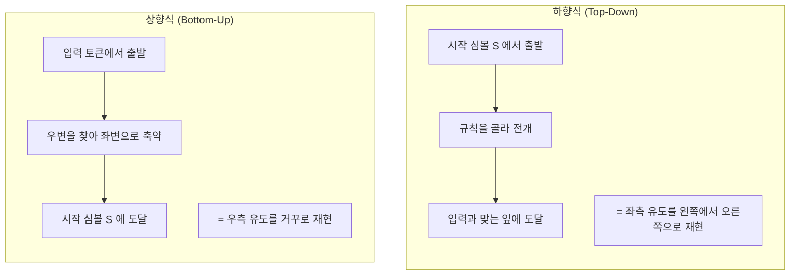
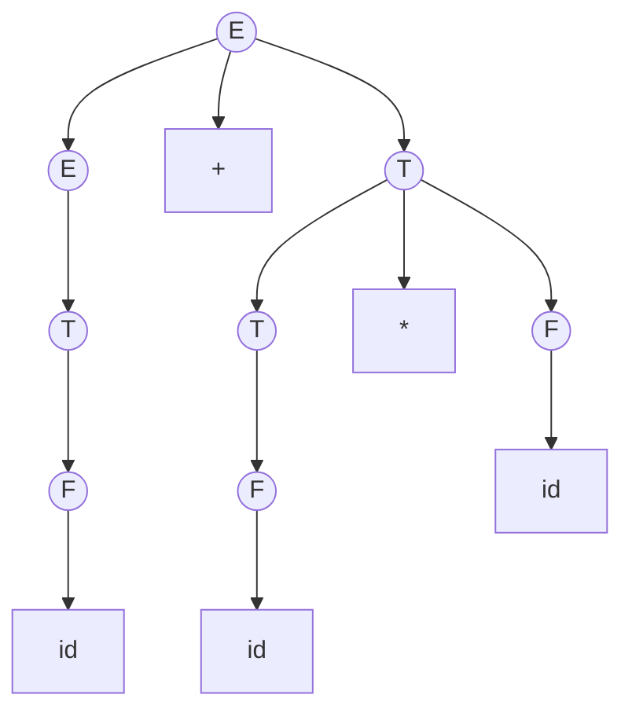
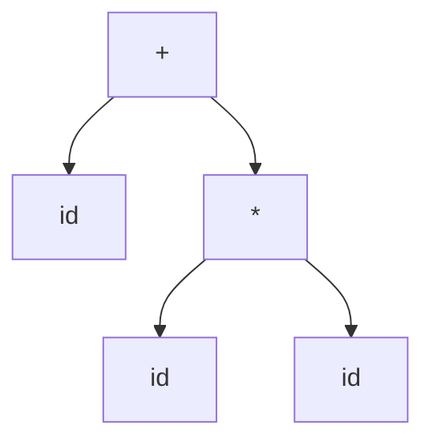

import FirstFollow from '@site/src/components/parsing/FirstFollow';
import {exprGrammar, exprGrammarLL} from '@site/src/components/parsing/grammars';

# 12. 구문 분석

**구문 분석(syntax analysis)**, 즉 **파싱(parsing)** 은
토큰 스트림을 받아 두 가지를 하는 일이다.

1. 이 토큰 열이 문법에 맞는지 **판정**한다
2. 맞다면 그 **구조**(파스 트리 또는 AST)를 만든다

이 장에서는 파싱 전략의 큰 두 갈래를 대비하고,
두 갈래 모두가 쓰는 도구인 **FIRST/FOLLOW 집합**을 세운다.

---

## 12.1 두 가지 전략

[2장](/docs/foundations/language-and-grammar#좌측-유도와-우측-유도)에서
좌측 유도와 우측 유도를 구분했다. 파싱 전략은 그 둘에 정확히 대응한다.



### 같은 문장, 두 방향

문법:

$$
\begin{aligned}
E &\to E + T \mid T, \quad T \to T * F \mid F, \quad F \to (\,E\,) \mid \mathbf{id}
\end{aligned}
$$

입력: `id + id * id`

**하향식** — 트리를 위에서 아래로 그려 나간다

```
E
E + T                  E → E + T 선택
T + T                  E → T
F + T                  T → F
id + T                 F → id ✓ 입력의 id 와 맞음
id + T * F             T → T * F
id + F * F             T → F
id + id * F            F → id ✓
id + id * id           F → id ✓
```

**상향식** — 트리를 아래에서 위로 쌓는다

```
id + id * id
F  + id * id           F → id 축약
T  + id * id           T → F
E  + id * id           E → T
E  + F  * id           F → id
E  + T  * id           T → F
E  + T  * F            F → id
E  + T                 T → T * F
E                      E → E + T  ✓ 시작 심볼 도달
```

:::info[상향식 축약 순서를 뒤집으면 우측 유도가 된다]
위 상향식 축약을 아래에서 위로 읽으면

$$
E \Rightarrow_{rm} E + T \Rightarrow_{rm} E + T * F \Rightarrow_{rm} E + T * \mathbf{id} \Rightarrow_{rm} \cdots
$$

정확히 **우측 유도의 역순**이다.
그래서 LR 파싱을 "reverse rightmost derivation"이라 부른다.
:::

### 두 전략의 성격

| | 하향식 (LL) | 상향식 (LR) |
|---|---|---|
| 유도 | 좌측 유도 | 우측 유도의 역 |
| 진행 | 예측(predict) → 매치 | 이동(shift) → 축약(reduce) |
| 결정 시점 | 규칙을 **미리** 골라야 한다 | 우변을 **다 본 뒤** 결정한다 |
| 좌재귀 | ❌ 무한 루프 | ✅ 문제없음 |
| 문법 부류 | LL(1) ⊊ LR(1) | 더 넓다 |
| 사람이 읽기 | 쉽다 (코드 = 문법) | 어렵다 (표 구동) |
| 오류 메시지 | 좋다 (문맥을 안다) | 상대적으로 나쁘다 |
| 손코딩 | 쉽다 (재귀 하강) | 사실상 불가능 |
| 대표 도구 | ANTLR, 손코딩 | yacc, bison |

:::info[lookahead — 앞을 내다보기]
파서가 **다음에 무엇을 할지 결정하기 위해 미리 들여다보는 입력 토큰**을
**lookahead** 라 한다. 우리말로는 "예견 기호", "선행 토큰"이라 옮기기도 하지만
이 교안에서는 원어를 그대로 쓴다.

- **아직 소비하지 않았다.** 들여다보기만 한 것이고, 소비는 결정을 내린 뒤에 한다
- **개수가 파서의 이름에 들어간다.** LL(**1**), LR(**1**) 의 1이 lookahead 토큰 수다
- 많이 볼수록 강해지지만 표가 커진다.
  LL(2)면 표의 열이 $|V_T|^2$ 개가 된다

코드에서는 보통 변수 하나다.

```c
static int tok;        /* ← 이것이 lookahead */
advance();             /* 다음 토큰을 tok 에 읽어 둔다 */
if (tok == T_PLUS) { … }   /* 소비하기 전에 들여다본다 */
```

[13장의 재귀 하강 파서](/docs/parsing/ll-parsing#131-재귀-하강-파싱)에서
`lookahead` 라는 이름의 변수가 그것이고,
[15장 LR 파서](/docs/parsing/lr-parsing)에서 `ACTION[s, a]` 의 `a` 가 그것이다.
:::

:::tip[결정 시점의 차이가 핵심이다]
하향식은 `E`를 만나 `E → E + T`와 `E → T` 중 하나를 **먼저** 골라야 한다.
아직 아무것도 안 봤는데 말이다. 그래서 lookahead 가 필요하다.

상향식은 우변 전체가 스택에 쌓일 때까지 **기다린다**.
정보가 훨씬 많이 모인 뒤에 결정하므로 더 많은 문법을 다룰 수 있다.

"결정을 늦출수록 강해진다" — LR이 LL보다 강한 이유다.
:::

---

## 12.2 파서가 만드는 것

### 파스 트리 vs AST

**파스 트리(구체 구문 트리, CST)** — 문법의 모든 세부를 담는다



**AST(추상 구문 트리)** — 의미에 필요한 것만 남긴다



| | 파스 트리 | AST |
|---|---|---|
| 노드 | 모든 넌터미널 | 의미 있는 연산만 |
| 괄호 | 노드로 남는다 | 사라진다 (구조에 흡수) |
| 단일 생성 규칙 $T \to F$ | 노드가 생긴다 | 건너뛴다 |
| 크기 | 크다 | 작다 |
| 쓰임 | 리팩터링 도구, 포매터 | 컴파일러 백엔드 |

:::note[tree-sitter는 파스 트리를 만든다]
에디터의 문법 하이라이터나 코드 포매터는 **원본 텍스트를 그대로 복원**해야 하므로
공백과 괄호까지 담은 구체 구문 트리가 필요하다.
컴파일러는 그럴 필요가 없으므로 AST를 쓴다.
:::

실무에서 파서는 **파스 트리를 실제로 만들지 않는 경우가 많다.**
축약할 때마다 액션을 실행해 곧바로 AST를 만들거나,
아예 코드를 뱉어 버린다. 파스 트리는 개념적인 것이다.

---

## 12.3 FIRST 집합

파서가 "다음에 어떤 규칙을 쓸까"를 결정하려면
**각 심볼 열이 어떤 터미널로 시작할 수 있는지**를 알아야 한다.

:::info[정의 — FIRST]

심볼 열 $\alpha$ 에 대해

$$
\mathrm{FIRST}(\alpha) = \{\, a \in V_T \mid \alpha \Rightarrow^* a\beta \,\}
\;\cup\;
\{\varepsilon \mid \alpha \Rightarrow^* \varepsilon\}
$$

즉 $\alpha$ 로부터 유도되는 스트링의 **첫 글자가 될 수 있는 터미널** 전부.
$\alpha$ 가 $\varepsilon$ 을 유도할 수 있으면 $\varepsilon$ 도 포함한다.
:::

### 계산 규칙

```
FIRST(X) 를 모든 문법 심볼 X 에 대해, 변화가 없을 때까지 반복:

  1. X 가 터미널이면            FIRST(X) = {X}
  2. X → ε 규칙이 있으면        FIRST(X) 에 ε 추가
  3. X → Y₁ Y₂ … Yₖ 규칙에 대해:
       FIRST(Y₁) 의 ε 아닌 것을 FIRST(X) 에 추가
       ε ∈ FIRST(Y₁) 이면 FIRST(Y₂) 의 ε 아닌 것도 추가
       …
       ε 가 FIRST(Y₁)…FIRST(Yₖ) 전부에 있으면 ε 도 추가
```

심볼 **열**의 FIRST 도 같은 방식으로 확장한다.

$$
\mathrm{FIRST}(X_1X_2\cdots X_n)
$$

는 $X_1$ 부터 훑되, $\varepsilon$ 을 포함하는 동안만 다음으로 넘어간다.

:::caution[반복이 필요한 이유]
$A \to B c$, $B \to A d \mid e$ 같은 문법을 생각해 보자.
FIRST(A)를 알려면 FIRST(B)가 필요하고, FIRST(B)를 알려면 FIRST(A)가 필요하다.

한 번 훑는 것으로는 부족하고, **더 이상 아무것도 추가되지 않을 때까지**
반복해야 한다. 이런 계산을 **고정점 계산(fixed-point computation)** 이라 한다.
데이터 흐름 분석 등 컴파일러 곳곳에서 같은 패턴이 나온다.
:::

---

## 12.4 FOLLOW 집합

$A \to \varepsilon$ 을 적용할지 결정하려면,
"$A$ **뒤에** 무엇이 올 수 있는가"를 알아야 한다.

:::info[정의 — FOLLOW]

넌터미널 $A$ 에 대해

$$
\mathrm{FOLLOW}(A) = \{\, a \in V_T \mid S \Rightarrow^* \alpha A a \beta \,\}
$$

즉 어떤 문장 형태에서 $A$ 바로 오른쪽에 나타날 수 있는 터미널 전부.
$A$ 가 문장의 맨 끝에 올 수 있으면 입력 끝 표시 `$` 도 포함한다.
:::

### 계산 규칙

```
FOLLOW(S) 에 $ 를 넣고, 변화가 없을 때까지 반복:

  1. A → α B β 규칙에 대해:
       FIRST(β) 의 ε 아닌 것을 FOLLOW(B) 에 추가
  2. A → α B  규칙 (β 가 비었거나 ε ∈ FIRST(β)) 에 대해:
       FOLLOW(A) 전체를 FOLLOW(B) 에 추가
```

규칙 2의 직관: $A$ 뒤에 올 수 있는 것은 곧 $B$ 뒤에도 올 수 있다.
$B$ 가 $A$ 의 마지막 부분이기 때문이다.

:::caution[FOLLOW에는 ε 이 들어가지 않는다]
FIRST와 달리 FOLLOW는 **실제로 뒤따르는 터미널**의 집합이다.
"아무것도 안 온다"는 경우는 $\varepsilon$ 이 아니라 `$` 로 표현한다.
:::

---

## 12.5 직접 계산해 보기

라운드를 하나씩 진행하며 집합이 자라는 것을 보자.

### 좌재귀 문법

<FirstFollow
  grammar={exprGrammar}
  title="FIRST / FOLLOW — 좌재귀 식 문법 (LR용)"
/>

**손으로 확인.**

$\mathrm{FIRST}(F)$ 부터 시작한다. $F \to (\,E\,) \mid \mathbf{id}$ 이므로
$\mathrm{FIRST}(F) = \{\,(\,,\ \mathbf{id}\}$.

$T \to T * F \mid F$ 에서 $T \to F$ 를 통해 $\mathrm{FIRST}(F)$ 가 들어온다.
$T \to T*F$ 는 자기 자신이므로 새로 주는 것이 없다.
따라서 $\mathrm{FIRST}(T) = \{\,(\,,\ \mathbf{id}\}$.

같은 논리로 $\mathrm{FIRST}(E) = \{\,(\,,\ \mathbf{id}\}$.

**세 넌터미널의 FIRST가 모두 같다.** 이것이 좌재귀 문법의 특징이고,
바로 그래서 **하향식으로는 이 문법을 쓸 수 없다** — 첫 토큰만 보고는
$E \to E+T$ 와 $E \to T$ 를 구별할 수 없기 때문이다.

FOLLOW는 이렇게 나온다.

| 넌터미널 | FOLLOW | 근거 |
|---|---|---|
| $E$ | `{ +, ), $ }` | $E' \to E$ 에서 `$`, $F \to (E)$ 에서 `)`, $E \to E+T$ 에서 `+` |
| $T$ | `{ +, *, ), $ }` | $T \to T*F$ 에서 `*` 추가, $E \to E+T$ 로 FOLLOW($E$) 상속 |
| $F$ | `{ +, *, ), $ }` | $T \to F$ 로 FOLLOW($T$) 상속 |

:::tip[이 FOLLOW 집합을 기억해 두자]
[15장 SLR 표 만들기](/docs/parsing/lr-parsing)에서 축약 액션을
**FOLLOW 집합의 열에만** 넣게 된다. 그때 이 값들을 그대로 쓴다.
:::

### 좌재귀를 제거한 문법

<FirstFollow
  grammar={exprGrammarLL}
  title="FIRST / FOLLOW — 좌재귀 제거 후 (LL용)"
/>

핵심 차이는 $E'$ 과 $T'$ 이다.

$$
\mathrm{FIRST}(E') = \{+,\ \varepsilon\}, \qquad \mathrm{FIRST}(T') = \{*,\ \varepsilon\}
$$

$\varepsilon$ 이 들어 있으므로 **FOLLOW가 결정에 관여**하게 된다.
`+`를 보면 $E' \to +TE'$, 그 밖에 FOLLOW($E'$)의 원소를 보면 $E' \to \varepsilon$.

$\mathrm{FOLLOW}(E')$ = `{ ), $ }`

`+` 와 `)`, `$` 가 겹치지 않으므로 **결정이 가능하다**.
이것이 [다음 장](/docs/parsing/ll-parsing)에서 만들 LL(1) 표의 근거다.

:::note["다음 라운드" 버튼을 눌러 보자]
FIRST가 한 번에 확정되지 않는 것을 볼 수 있다.
$\mathrm{FIRST}(E)$ 를 알려면 $\mathrm{FIRST}(T)$ 가, 그것을 알려면
$\mathrm{FIRST}(F)$ 가 필요하다. 규칙을 적는 순서에 따라
두세 라운드가 필요하다.
:::

---

## 12.6 구문 오류 처리

파서는 오류를 만났을 때 그냥 멈추면 안 된다.
**한 번의 컴파일에서 가능한 많은 오류를 보고**해야 실용적이다.

### 오류 복구 전략

**① 패닉 모드(panic mode)**

오류가 나면, 미리 정한 **동기화 토큰(synchronizing token)** 이 나올 때까지
입력을 버린다. C에서는 `;`, `}` 가 전형적이다.

```
error: expected ';' before '}'
     ... 여기부터 ';' 나올 때까지 버림 ...
```

- 장점: 간단하고, 무한 루프가 없음이 보장된다
- 단점: 오류 하나가 넓은 영역을 삼킬 수 있다
- **yacc의 `error` 토큰이 이 방식이다**

**② 구문 수준 복구(phrase-level recovery)**

지역적으로 토큰을 삽입·삭제·교체해 파싱을 이어 간다.

```
error: missing ')' — 여기에 ')' 가 있다고 가정하고 계속
```

- 장점: 오류 하나가 하나로 보고된다
- 단점: 잘못 추측하면 **연쇄 오류(cascading errors)** 가 난다

**③ 오류 생성 규칙(error production)**

흔한 실수를 **문법에 직접 넣어 둔다**.

```
stmt : IF '(' expr ')' stmt
     | IF expr stmt          { yyerror("if 조건에 괄호가 필요합니다"); }
     ;
```

- 장점: 아주 구체적인 메시지를 줄 수 있다
- 단점: 문법이 지저분해지고, 예상한 실수만 잡는다

**④ 전역 정정(global correction)**

최소 편집 거리로 올바른 프로그램을 찾는다. 이론적으로 최적이지만
비용이 커서 실무에서는 거의 쓰이지 않는다.

:::tip[현대 컴파일러의 접근]
Rust와 Elm이 "친절한 컴파일러"로 평가받는 이유는
③ 오류 생성 규칙을 **아주 많이** 넣어 두었기 때문이다.

```
error: expected one of `,`, `:`, or `}`, found `;`
  --> src/main.rs:3:15
   |
 3 |     let x = Foo { a: 1; b: 2 };
   |             ---        ^ expected one of `,`, `:`, or `}`
   |             |
   |             while parsing this struct
help: try using `,` instead of `;`
```

"struct를 파싱하는 중"이라는 문맥까지 보여 준다.
이런 메시지는 문법에서 저절로 나오지 않는다 —
**흔한 실수 하나하나를 사람이 넣은 것**이다.

최근 연구인 PEG의 labeled failure 도 같은 발상이다.
실패 지점에 레이블을 붙이고 레이블마다 복구 표현식을 연결한다.
[최신 경향](/docs/modern/trends)에서 다룬다.
:::

### 오류 위치의 문제

```c
int f() {
    return 1;
        /* 여기서 '}' 를 빠뜨렸다 */

int g() { return 2; }
```

파서는 `int g()` 를 만나서야 이상하다는 것을 안다.
**실제 오류 위치(빠진 `}`)와 발견 위치가 멀다.**

그래서 좋은 컴파일러는 여는 괄호의 위치를 기억해 두었다가
"3행에서 열린 `{` 가 닫히지 않았습니다"처럼 보고한다.
[9장에서 본](/docs/lex/writing-lex-files#95-eof-처리)
`cmt_start` 와 같은 발상이다.

---

## 요약

- 파싱은 **판정**과 **구조 생성** 두 가지를 한다.
- **하향식(LL)** 은 좌측 유도를 재현하고, 규칙을 **미리** 골라야 한다.
  **상향식(LR)** 은 우측 유도의 역을 재현하고, 우변을 **다 본 뒤** 결정한다.
  **결정을 늦출수록 강하다** — LR이 LL보다 넓은 문법을 받는 이유.
- **파스 트리**는 문법의 모든 세부를, **AST**는 의미에 필요한 것만 담는다.
  컴파일러는 보통 파스 트리를 실제로 만들지 않고 축약 시점에 AST를 만든다.
- $\mathrm{FIRST}(\alpha)$ — $\alpha$ 가 유도하는 스트링의 첫 터미널 집합.
  $\alpha \Rightarrow^* \varepsilon$ 이면 $\varepsilon$ 포함.
- $\mathrm{FOLLOW}(A)$ — 어떤 문장 형태에서 $A$ 바로 뒤에 올 수 있는 터미널.
  $\varepsilon$ 은 들어가지 않고, 대신 `$` 가 들어간다.
- 둘 다 **고정점 계산**이다. 한 번 훑어서는 안 된다.
- 좌재귀 식 문법은 $\mathrm{FIRST}(E) = \mathrm{FIRST}(T) = \mathrm{FIRST}(F)$ 라
  하향식으로 결정할 수 없다. 그것이 좌재귀 제거의 이유다.
- 오류 복구는 **패닉 모드**(yacc의 `error`), **구문 수준**,
  **오류 생성 규칙**, 전역 정정 네 가지.
  좋은 진단은 대개 오류 생성 규칙을 많이 넣은 결과다.

## 확인 문제

1. 다음 문법의 FIRST와 FOLLOW를 손으로 계산하고 위 도구와 비교하라.
   $$S \to A B c, \quad A \to a \mid \varepsilon, \quad B \to b \mid \varepsilon$$

<details>
<summary>풀이</summary>

**FIRST 계산**

$A \to a \mid \varepsilon$ 이므로 $\mathrm{FIRST}(A) = \{a, \varepsilon\}$

$B \to b \mid \varepsilon$ 이므로 $\mathrm{FIRST}(B) = \{b, \varepsilon\}$

$S \to ABc$ 는 왼쪽부터 훑는다.

| 단계 | 보는 심볼 | 추가 | nullable? |
|---|---|---|---|
| 1 | $A$ | $\mathrm{FIRST}(A) - \{\varepsilon\} = \{a\}$ | $A$ 가 nullable → 계속 |
| 2 | $B$ | $\mathrm{FIRST}(B) - \{\varepsilon\} = \{b\}$ | $B$ 도 nullable → 계속 |
| 3 | `c` | $\{c\}$ | 터미널 → 여기서 멈춤 |

전부 nullable은 아니므로($c$ 가 있으므로) $\varepsilon$ 은 넣지 않는다.

$$\mathrm{FIRST}(S) = \{a,\ b,\ c\}$$

**FOLLOW 계산**

$\mathrm{FOLLOW}(S)$ = `{ $ }` — 시작 심볼이므로

$\mathrm{FOLLOW}(A)$ : $S \to A\,\underline{Bc}$ 에서 $\beta = Bc$

$$\mathrm{FIRST}(Bc) = \{b\} \cup \{c\} = \{b, c\} \quad (B \text{ 가 nullable이라 } c \text{ 도 포함})$$

$\varepsilon \notin \mathrm{FIRST}(Bc)$ 이므로 $\mathrm{FOLLOW}(S)$ 는 상속되지 않는다.

$$\mathrm{FOLLOW}(A) = \{b,\ c\}$$

$\mathrm{FOLLOW}(B)$ : $S \to AB\,\underline{c}$ 에서 $\beta = c$

$$\mathrm{FOLLOW}(B) = \{c\}$$

**정리**

| 넌터미널 | FIRST | FOLLOW |
|---|---|---|
| $S$ | `{ a, b, c }` | `{ $ }` |
| $A$ | `{ a, ε }` | `{ b, c }` |
| $B$ | `{ b, ε }` | `{ c }` |

:::tip[nullable이 두 개 연속일 때가 함정이다]
$\mathrm{FIRST}(S)$ 에 `c` 가 들어간 이유를 확인하자.
$A$ 와 $B$ 가 **둘 다** 비어질 수 있으므로,
입력이 `c` 로 시작해도 $S$ 를 만들 수 있다 (`ABc` 에서 `A`, `B` 를 모두 ε 로).

nullable 심볼을 만나면 **멈추지 말고 계속 오른쪽을 봐야 한다.**
:::

</details>

2. FOLLOW에 $\varepsilon$ 이 들어가지 않는 이유를 정의로부터 설명하라.

<details>
<summary>풀이</summary>

**정의를 다시 보자.**

$$\mathrm{FOLLOW}(A) = \{\, a \in V_T \mid S \Rightarrow^* \alpha A a \beta \,\}$$

$a \in V_T$ — 즉 **터미널**이라고 명시되어 있다.
$\varepsilon$ 은 터미널이 아니라 **빈 문자열**이므로 애초에 후보가 아니다.

**의미로 보면 더 분명하다.**

| 집합 | 답하는 질문 |
|---|---|
| $\mathrm{FIRST}(\alpha)$ | "$\alpha$ 가 **무엇으로 시작**할 수 있는가?" |
| $\mathrm{FOLLOW}(A)$ | "$A$ **바로 뒤에 무엇이** 올 수 있는가?" |

FIRST에서 $\varepsilon$ 은 "**$\alpha$ 자체가 사라질 수 있다**"는 정보다.
$\alpha$ 에 대한 성질이므로 의미가 있다.

FOLLOW에서는? "$A$ 뒤에 아무것도 안 온다"는 상황은 존재한다 —
$A$ 가 문장의 맨 끝에 오는 경우다.
그런데 그것을 $\varepsilon$ 이 아니라 **`$`(입력 끝 표시)** 로 표현한다.

**왜 `$` 를 쓰는가.** $\varepsilon$ 으로 표현하면 파서가 곤란해진다.

LL(1) 파서는 매 단계 "현재 입력 토큰"을 보고 표를 찾는다.
입력이 끝났을 때도 **무언가를 봐야** 한다.
그래서 입력 끝에 가상의 토큰 `$` 를 붙여 두고,
그것도 다른 터미널처럼 표의 한 열로 다룬다.

```
입력 = t₁ t₂ ⋯ tₙ $
```

이렇게 하면 "입력이 끝났다"가 특별한 경우가 아니라
**평범한 토큰 하나**가 되어 알고리즘이 단순해진다.

[13장의 LL(1) 표](/docs/parsing/ll-parsing#예제--식-문법의-ll1-표)에
`$` 열이 있는 것이 그 결과다.

</details>

3. FIRST 계산에 반복이 필요한 문법의 예를 하나 만들어라.

<details>
<summary>풀이</summary>

**상호 의존하는 문법**

$$
\begin{aligned}
A &\to B\,c \\
B &\to A\,d \mid e
\end{aligned}
$$

$\mathrm{FIRST}(A)$ 를 알려면 $\mathrm{FIRST}(B)$ 가 필요하고,
$\mathrm{FIRST}(B)$ 를 알려면 $\mathrm{FIRST}(A)$ 가 필요하다.

**규칙을 $A$ 부터 훑는다고 하자.**

| 라운드 | $\mathrm{FIRST}(A)$ | $\mathrm{FIRST}(B)$ | 설명 |
|---|---|---|---|
| 초기 | $\emptyset$ | $\emptyset$ | |
| 1 | $\emptyset$ | `{ e }` | $A \to Bc$: FIRST(B)가 아직 비어 있어 아무것도 못 얻음<br/>$B \to e$: `e` 추가 |
| 2 | `{ e }` | `{ e }` | $A \to Bc$: 이제 FIRST(B)=`{e}` 이므로 `e` 추가 |
| 3 | `{ e }` | `{ e }` | 변화 없음 → **종료** |

**한 번만 훑었다면** $\mathrm{FIRST}(A) = \emptyset$ 이라는 틀린 답이 나온다.

**더 극적인 예 — 사슬이 길 때**

$$
A \to B, \quad B \to C, \quad C \to D, \quad D \to x
$$

규칙을 $A, B, C, D$ 순으로 훑으면 한 라운드에 하나씩만 전파되어
**4라운드**가 필요하다. (순서를 뒤집으면 1라운드에 끝난다.)

:::info[이것이 고정점 계산이다]
"더 이상 아무것도 추가되지 않을 때까지 반복"하는 계산을
**고정점 계산(fixed-point computation)** 이라 한다.

**왜 반드시 끝나는가.** 각 집합은 유한한 터미널 집합의 부분집합이고,
반복할 때마다 **줄어들지 않는다**(원소를 추가만 한다).
유한 집합에서 단조 증가하는 수열은 반드시 멈춘다.

같은 패턴이 컴파일러 곳곳에 나온다.

| 계산 | 어디서 |
|---|---|
| FIRST / FOLLOW | 12장 |
| ε-closure | [5장](/docs/regular/finite-automata#53-ε-전이) |
| CLOSURE (LR 항목) | [15장](/docs/parsing/lr-parsing#153-정준-lr0-항목-집합) |
| 도달 정의, 활성 변수 | 데이터 흐름 분석 (이 교안 범위 밖) |

**"변화가 없을 때까지 반복"** 이라는 문구를 보면
고정점 계산이라고 생각하면 된다.
:::

</details>

4. `id + id * id` 의 하향식·상향식 유도를 모두 손으로 적고,
   같은 파스 트리에 도달하는지 확인하라.

<details>
<summary>풀이</summary>

문법: $E \to E+T \mid T$, $T \to T*F \mid F$, $F \to (E) \mid \mathbf{id}$

**하향식 (좌측 유도)** — 항상 **가장 왼쪽** 넌터미널을 전개

```
E
⇒ E + T                E → E + T
⇒ T + T                E → T
⇒ F + T                T → F
⇒ id + T               F → id        ← 첫 id 확정
⇒ id + T * F           T → T * F
⇒ id + F * F           T → F
⇒ id + id * F          F → id        ← 둘째 id 확정
⇒ id + id * id         F → id        ← 셋째 id 확정
```

**상향식 (축약 = 우측 유도의 역)**

```
id + id * id
⇒ F  + id * id         F → id 로 축약
⇒ T  + id * id         T → F
⇒ E  + id * id         E → T
⇒ E  + F  * id         F → id
⇒ E  + T  * id         T → F
⇒ E  + T  * F          F → id
⇒ E  + T               T → T * F
⇒ E                    E → E + T     ← 시작 심볼 도달
```

**같은 파스 트리인가 — 그렇다.**


**사용된 규칙의 집합이 같다.** 순서만 다르다.

| | 순서 |
|---|---|
| 하향식 | 루트 → 잎 (전위 순회에 가깝다) |
| 상향식 | 잎 → 루트 (**후위 순회**) |

**상향식 축약을 거꾸로 읽으면 우측 유도가 된다.**

$$E \Rightarrow_{rm} E+T \Rightarrow_{rm} E+T*F \Rightarrow_{rm} E+T*\mathbf{id} \Rightarrow_{rm} \cdots$$

이것이 [15장](/docs/parsing/lr-parsing)에서 LR을
"reverse rightmost derivation"이라 부르는 이유다.

:::tip[액션 실행 시점의 차이로 이어진다]
상향식이 후위 순회라는 사실이
[17장의 S-속성](/docs/parsing/syntax-directed-translation#175-s-속성과-l-속성)과
[19장의 액션 실행 시점](/docs/yacc/yacc-grammar-and-actions#191-액션이-실행되는-시점)의
근거가 된다. 자식이 먼저 처리되므로 자식의 값으로 부모를 계산할 수 있다.
:::

</details>

5. 다음 코드에서 파서가 오류를 **발견**하는 위치와
   실제 오류 위치가 어떻게 다른지 설명하라.
   ```c
   if (x > 0 {
       y = 1;
   }
   ```

<details>
<summary>풀이</summary>

**실제 오류 위치:** 1행, `0` 과 `{` 사이 — **`)` 가 빠졌다**.

**파서가 발견하는 위치:** 1행의 `{` 를 만나는 순간.

이 경우는 다행히 가깝다. 파서가 `if (` 다음에 `expr` 을 파싱하고
`)` 를 기대하는데 `{` 가 왔으므로 **즉시** 안다.

```
error: expected ')' before '{' token
```

**그런데 항상 이렇게 가깝지는 않다.** 반대 경우를 보자.

```c
int f() {
    return 1;
                    ← 여기서 '}' 를 빠뜨렸다

int g() { return 2; }
```

파서는 `int g()` 를 읽는 동안에도 **아무 이상을 못 느낀다** —
함수 안에 중첩 함수 정의가 올 수 없다는 것을 알아채는 시점은
문법에 따라 훨씬 뒤다. C 문법에서는 `{` 를 만나고서야 오류가 난다.

**즉 실제 오류(2행 뒤)와 발견 위치(4행)가 두 줄 이상 떨어진다.**
파일이 길면 수백 줄 떨어질 수도 있다.

**LR 파서의 성질**

LR 파서는 **잘못된 토큰을 절대 이동하지 않는다**.
즉 "오류가 있는 가장 이른 시점"에 멈춘다.

하지만 그것은 **파서가 판단할 수 있는 가장 이른 시점**이지
**사람이 실수한 시점**이 아니다. 빠진 `}` 는 그 자리에서는
아무 모순도 만들지 않기 때문이다.

**좋은 컴파일러는 어떻게 하는가**

여는 괄호의 **위치를 기억**해 두었다가 함께 보고한다.

```
error: expected '}' at end of input
  --> t.c:5:1
   |
 1 | int f() {
   |         - 여기서 열린 괄호가 닫히지 않았습니다
 ...
 5 | int g() { return 2; }
   | ^ 여기서 발견
```

[9장에서 본](/docs/lex/writing-lex-files#95-eof-처리) `cmt_start` 와 같은 발상이다 —
**여는 지점을 저장해 두는 것**이 좋은 진단의 핵심이다.

</details>

6. 패닉 모드 복구가 무한 루프에 빠지지 않음이 보장되는 이유는?

<details>
<summary>풀이</summary>

**매 복구 시도가 입력을 최소 한 토큰 소비하기 때문이다.**

패닉 모드의 동작을 다시 보자.

```
1. 오류 발생
2. error 를 받아들일 수 있는 상태가 나올 때까지 스택을 걷어 낸다
3. 동기화 토큰이 나올 때까지 입력을 버린다      ← 여기
4. 파싱 재개
```

3단계에서 동기화 토큰(`;` 등)을 찾을 때까지 입력을 **버린다**.
찾으면 그 토큰도 소비하고 재개한다.

- 동기화 토큰을 찾았다 → 최소 1개(그 토큰) 소비
- 못 찾았다 → **입력 끝까지** 버리고 종료

어느 경우든 **입력 위치가 반드시 전진**한다.

입력은 유한하므로, 복구는 최대 (토큰 수)번만 일어날 수 있다.
따라서 **반드시 종료한다**. $\blacksquare$

:::caution[스택 걷어내기도 유한하다]
2단계도 무한할 수 없다. 스택은 유한한 높이이고,
매번 최소 한 칸을 걷어 낸다.

바닥까지 걷어 냈는데도 `error` 를 받는 상태가 없으면
파서는 **복구를 포기하고 종료**한다 (`yyparse()` 가 1을 반환).
:::

**대조: 무한 루프가 나는 경우**

패닉 모드가 아니라 **구문 수준 복구**(토큰 삽입)를 잘못 구현하면
무한 루프가 난다.

```
오류 → "여기에 ')' 가 있다고 가정" → 입력을 소비하지 않음
     → 같은 자리에서 다시 오류 → 또 ')' 삽입 → …
```

**입력을 소비하지 않는 복구**는 반드시 종료 조건을 따로 넣어야 한다.
그래서 실무에서는 단순하지만 종료가 보장되는 패닉 모드를 선호한다.

:::note[bison의 추가 안전장치]
bison은 복구 후 **토큰 3개를 성공적으로 이동할 때까지**
새 오류를 보고하지 않는다.

이것은 무한 루프 방지가 아니라 **연쇄 오류 방지**다.
실수 하나가 오류 수십 개로 번지는 것을 막는다.
[20장](/docs/yacc/conflicts-and-precedence#관련-매크로) 참고.
:::

</details>

---

다음 장부터 두 전략을 각각 자세히 본다. 먼저 하향식이다.
