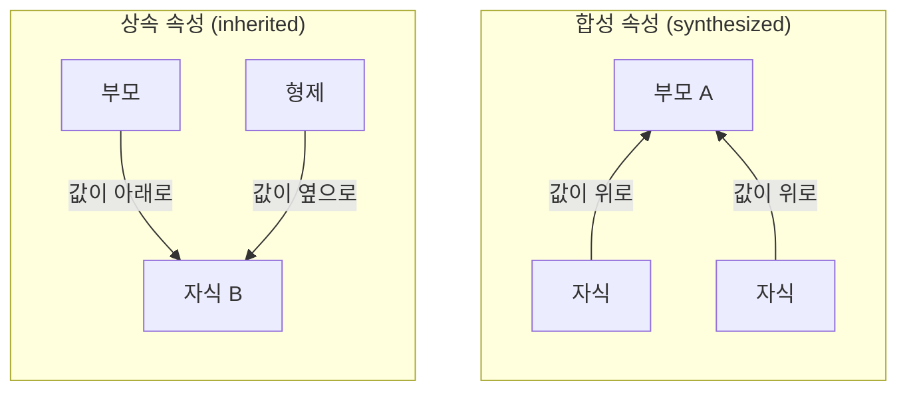
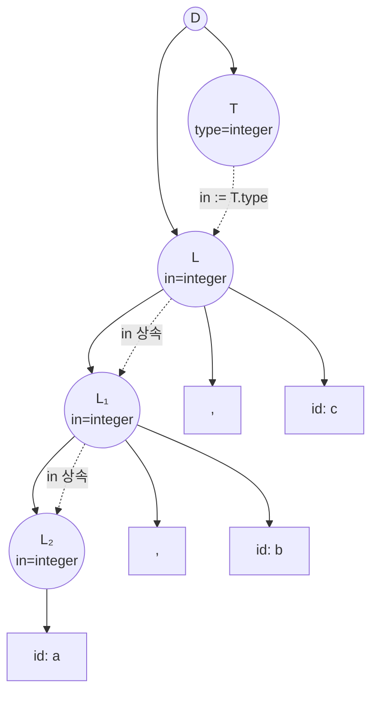
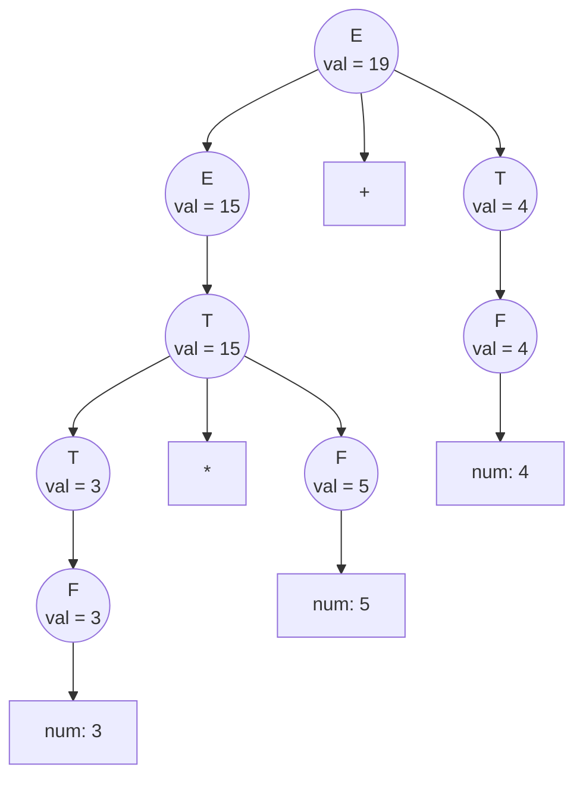
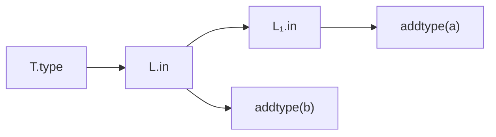
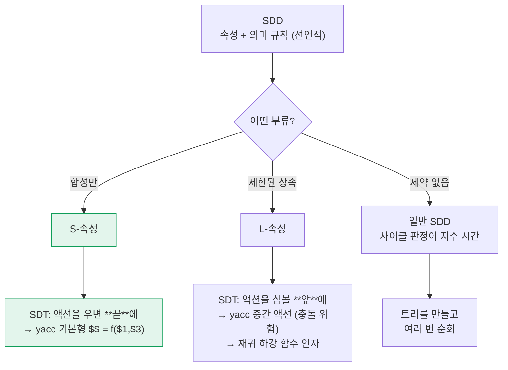

import AttributeEval from '@site/src/components/parsing/AttributeEval';
import {scenarios} from '@site/src/components/parsing/attributes';

# 17. 구문 지향 번역

여기까지 우리는 **파싱**만 했다.
"이 토큰 열이 문법에 맞는가"에 답하고 구조를 밝히는 일이다.

그런데 컴파일러가 실제로 하는 일은 **번역**이다.
파스 트리에서 값을 계산하고, 타입을 붙이고, 코드를 뱉어야 한다.

그 일을 **문법에 붙여서** 하는 방법이 **구문 지향 번역**이다.

:::tip[이 장을 읽기 전에]
파싱 자체는 몰라도 이 장을 읽을 수 있다.
다만 다음 둘을 알고 있으면 "왜 이렇게 되는가"가 훨씬 잘 보인다.

| 필요한 것 | 어디서 |
|---|---|
| **트리의 후위 순회** | [시작하기 전에](/docs/prerequisites#3-그래프와-트리) |
| LR은 **우변을 다 본 뒤** 결정하고, LL은 **미리** 결정한다 | [12.1절](/docs/parsing/syntax-analysis#121-두-가지-전략) |

이 장의 결론을 한 줄로 미리 말하면 이렇다.

> **LR(yacc)은 값을 위로 올리기(합성 속성)에 강하고,
> LL(재귀 하강)은 값을 아래로 내리기(상속 속성)에 강하다.**

왜 그런지가 이 장의 내용이다.
:::

:::info[이 장이 잇는 두 가지]
[16장까지](/docs/parsing/lr-parser-implementation)의 파싱 이론과,
[19장](/docs/yacc/yacc-grammar-and-actions)에서 쓸 yacc 액션 사이의 다리다.

`$$ = $1 + $3` 이 왜 그렇게 생겼는지,
왜 어떤 것은 그렇게 못 쓰고 **중간 액션**이 필요한지를
이 장에서 이론으로 설명한다.
:::

---

## 17.1 속성

**속성(attribute)** 은 문법 심볼에 붙이는 값이다.
심볼 $X$ 의 속성 $a$ 를 $X.a$ 로 쓴다.

| 심볼 | 속성 예 |
|---|---|
| $E$ | `val` (계산된 값), `type` (타입), `code` (생성된 코드), `place` (결과가 담긴 임시변수) |
| $\mathbf{id}$ | `lexeme` (실제 문자열), `entry` (심볼 테이블 항목) |
| $\mathbf{num}$ | `val` |
| $D$ (선언) | `type` (선언된 타입) |

속성은 무엇이든 될 수 있다 — 정수, 문자열, 타입, AST 노드 포인터, 코드 조각.

---

## 17.2 두 종류의 속성

이 장에서 가장 중요한 구분이다.



:::info[정의]

생성 규칙 $A \to X_1 X_2 \cdots X_n$ 에서

**합성 속성(synthesized attribute)** — $A.b$ 의 값을
$A$ 의 **자식들**($X_1 \dots X_n$)의 속성으로 계산한다.
값이 트리를 **위로** 올라간다.

**상속 속성(inherited attribute)** — $X_i.c$ 의 값을
**부모** $A$ 또는 **형제** $X_j$ 의 속성으로 계산한다.
값이 트리를 **아래로** 또는 **옆으로** 흐른다.
:::

:::caution[터미널은 상속 속성을 갖지 않는다]
터미널의 속성은 **어휘 분석기가 정해 준다** (`yylval`).
문법 규칙으로 계산되는 것이 아니므로, 관례상 터미널의 속성은
전부 합성 속성으로 본다.
:::

### 합성 속성의 예 — 계산기

$$
\begin{array}{ll}
\text{생성 규칙} & \text{의미 규칙} \\ \hline
E \to E_1 + T & E.val := E_1.val + T.val \\
E \to T & E.val := T.val \\
T \to T_1 * F & T.val := T_1.val \times F.val \\
T \to F & T.val := F.val \\
F \to (\,E\,) & F.val := E.val \\
F \to \mathbf{num} & F.val := \mathbf{num}.val
\end{array}
$$

전부 **자식의 값으로 부모를 계산**한다. 합성 속성만 쓴 예다.

:::note[표기 관례]
$E \to E_1 + T$ 에서 아래첨자 1은 **같은 이름의 심볼을 구별**하기 위한 것이다.
좌변의 $E$ 와 우변의 $E$ 를 구별해야 규칙을 쓸 수 있다.

yacc에서 `$$`(좌변)와 `$1`(첫째 우변)로 구별하는 것과 같다.
:::

### 상속 속성의 예 — 선언

```c
int a, b, c;
```

문법:

$$
\begin{aligned}
D &\to T\ L \\
T &\to \mathbf{int} \mid \mathbf{float} \\
L &\to L_1 ,\ \mathbf{id} \mid \mathbf{id}
\end{aligned}
$$

타입은 $T$ 에서 나오는데, 등록해야 할 이름은 $L$ 안에 있다.
**타입을 $L$ 로 흘려보내야 한다** — 상속 속성이다.

$$
\begin{array}{ll}
\text{생성 규칙} & \text{의미 규칙} \\ \hline
D \to T\ L & L.in := T.type \\
T \to \mathbf{int} & T.type := \texttt{integer} \\
T \to \mathbf{float} & T.type := \texttt{float} \\
L \to L_1 ,\ \mathbf{id} & L_1.in := L.in;\quad \text{addtype}(\mathbf{id}.entry,\ L.in) \\
L \to \mathbf{id} & \text{addtype}(\mathbf{id}.entry,\ L.in)
\end{array}
$$

$L.in$ 이 부모 $D$ 로부터 받아 자식 $L_1$ 으로 계속 전달된다.
**아래로 흐르는 값**이다.



:::tip[19장에서 이 문제를 어떻게 피했는지 기억하는가]
[19장의 미니 컴파일러](/docs/yacc/yacc-grammar-and-actions#194-심볼-테이블)는
**전역 버퍼에 이름을 모아 두었다가 타입이 확정되면 한꺼번에 등록**했다.

```c
id_list : ID              { pending_add($1, yylineno); }
        | id_list ',' ID  { pending_add($3, yylineno); }
        ;
decl    : type id_list ';' { pending_flush((Type)$1); }
        ;
```

그것이 바로 **상속 속성을 흉내 낸 것**이다.
yacc가 상속 속성을 직접 지원하지 않기 때문에 전역 변수로 우회한 것인데,
왜 지원하지 않는지는 [17.5절](#175-s-속성과-l-속성)에서 밝힌다.
:::

---

## 17.3 SDD와 주석 달린 파스 트리

:::info[정의 — 구문 지향 정의 (SDD, Syntax-Directed Definition)]
문맥 자유 문법의 각 생성 규칙에 **의미 규칙(semantic rule)** 을 붙인 것.

의미 규칙은 "이 규칙이 쓰일 때 속성들이 어떤 관계를 만족해야 하는가"를
**선언적으로** 기술한다. 계산 순서는 명시하지 않는다.
:::

파스 트리의 각 노드에 속성 값을 적어 넣은 것을
**주석 달린 파스 트리(annotated parse tree)** 라 한다.

**예제.** `3 * 5 + 4` 를 위 계산기 SDD로 평가하면:



값이 잎에서 루트로 올라간다. 합성 속성만 쓰므로
**후위 순회 한 번**으로 전부 계산된다.

:::info[이것이 왜 상향식 파싱과 잘 맞는가]
[19장에서 볼](/docs/yacc/yacc-grammar-and-actions#191-액션이-실행되는-시점) 대로,
LR 파서의 액션 실행 순서는 정확히 **후위 순회**다.
자식이 모두 축약된 뒤에 부모가 축약되기 때문이다.

즉 **합성 속성은 LR 파싱 중에 계산이 끝난다.** 트리를 따로 만들 필요도 없다.
:::

### 직접 돌려 보기 — 두 순서를 나란히

같은 화면에서 **합성 속성 예제**와 **상속 속성 예제**를 번갈아 보자.

오른쪽 표의 마지막 열이 **후위 순회 순위**다.
계산기 예제에서는 이 숫자가 계속 커지기만 한다 —
후위 순회 순서와 계산 순서가 같다는 뜻이다.

선언 예제로 바꾸면 숫자가 **커졌다 작아졌다** 한다.
후위 순회로는 그 순서를 만들 수 없다는 신호다.

<AttributeEval scenarios={scenarios} />

:::info[이 컴포넌트가 계산하는 것]
왼쪽 트리의 속성값은 미리 적어 둔 것이 아니라,
의존 그래프를 **위상 정렬**해서 나온 순서대로 채워진다.

"후위 순회로 되는가"도 판정한 것이다 —
모든 의존 대상이 자기 노드의 후손 안에 있는지 확인한다.
알고리즘은 `src/components/parsing/attributes.ts` 에 있고,
`bun test` 가 위 두 결론을 검증한다.
:::

---

## 17.4 의존 그래프

속성 사이의 "무엇을 계산하려면 무엇이 먼저 필요한가"를 그린 것이
**의존 그래프(dependency graph)** 다.

의미 규칙 $A.a := f(B.b, C.c)$ 는 두 개의 간선을 만든다.

$$
B.b \longrightarrow A.a, \qquad C.c \longrightarrow A.a
$$

**선언 예제 `int a, b`의 의존 그래프**



:::danger[계산 순서는 위상 정렬이다]
의존 그래프에 **사이클이 없으면** 위상 정렬(topological sort)로
계산 순서를 정할 수 있다.

사이클이 있으면 **어떤 순서로도 계산할 수 없다** — 잘못된 SDD다.

문제: **임의의 SDD가 사이클을 갖는지 판정하는 것은 지수 시간**이 걸린다.
그래서 실무에서는 처음부터 **사이클이 생길 수 없는 부류**로 제한한다.
그것이 다음 절의 S-속성 문법과 L-속성 문법이다.
:::

---

## 17.5 S-속성과 L-속성

### S-속성 문법

:::info[정의]
**합성 속성만** 쓰는 SDD를 **S-속성(S-attributed) 문법**이라 한다.
:::

의존 간선이 항상 **자식 → 부모** 한 방향이므로 사이클이 생길 수 없다.
**후위 순회 한 번**으로 모든 속성이 계산된다.

$$
\text{S-속성} \iff \text{상향식 파싱 중에 계산 가능}
$$

:::danger[여기가 이 장의 핵심이다]
**yacc의 `$$ = f($1, $2, …)` 는 정확히 S-속성 규칙이다.**

- `$1`, `$2`, … = 우변 심볼(자식)의 속성 — 값 스택에 이미 있다
- `$$` = 좌변 심볼(부모)의 속성 — 축약할 때 계산해 밀어 넣는다

축약 시점에 자식 값이 전부 스택에 준비되어 있으므로 계산이 가능하다.
[16장의 값 스택](/docs/parsing/lr-parser-implementation#163-의미-값-스택)이
바로 이 S-속성 계산을 위한 장치다.

**yacc가 자연스럽게 지원하는 것은 S-속성 문법뿐이다.**
:::

### L-속성 문법

상속 속성이 필요하되, **왼쪽에서 오른쪽으로 한 번 훑어** 계산할 수 있는 부류다.

:::info[정의]
SDD가 **L-속성(L-attributed)** 이라는 것은,
각 생성 규칙 $A \to X_1 X_2 \cdots X_n$ 에서 모든 의미 규칙이

1. **합성 속성**이거나
2. $X_i$ 의 **상속 속성**을 다음만으로 계산하는 경우다:
   - $A$ 의 **상속** 속성
   - $X_1, \dots, X_{i-1}$ — 즉 **자기 왼쪽 형제들**의 속성

임을 뜻한다. (L은 Left-to-right의 L이다.)
:::

**핵심 제약: 오른쪽 형제를 볼 수 없다.**

$$
X_3.\text{in} := f(X_1.\text{val},\ X_2.\text{val}) \quad \text{(허용)}
$$
$$
X_1.\text{in} := f(X_4.\text{val}) \quad \text{(L-속성이 아니다)}
$$

왼쪽에서 오른쪽으로 훑는 동안 $X_4$ 는 아직 처리되지 않았기 때문이다.

**포함 관계**

$$
\text{S-속성} \subsetneq \text{L-속성} \subsetneq \text{모든 SDD}
$$

앞의 선언 예제(`D → T L`, `L.in := T.type`)는 L-속성이다.
$L$ 의 상속 속성을 **왼쪽 형제** $T$ 로부터 계산하기 때문이다.

:::tip[L-속성은 하향식 파싱과 잘 맞는다]
재귀 하강 파서에서 상속 속성은 **함수의 인자**, 합성 속성은 **반환값**이다.

```c
/* L.in 은 인자로 내려가고, 결과는 반환값으로 올라온다 */
void parse_L(Type inherited_type) {
    ...
    parse_L(inherited_type);        /* 상속 속성을 그대로 전달 */
    addtype(id_entry, inherited_type);
}
```

[13장의 재귀 하강](/docs/parsing/ll-parsing#131-재귀-하강-파싱)에서
`parse_E_prime(Node *left)` 가 `left` 를 인자로 받은 것을 기억하는가?
그 `left` 가 바로 **상속 속성**이었다.

좌재귀를 제거하면서 왼쪽으로 접기 위해 필요했던 그 인자가,
이론적으로는 상속 속성이라는 이름을 갖고 있다.
:::

### 표로 정리

| | S-속성 | L-속성 |
|---|---|---|
| 속성 종류 | 합성만 | 합성 + 제한된 상속 |
| 계산 순서 | 후위 순회 | 깊이 우선, 왼쪽에서 오른쪽 |
| 잘 맞는 파싱 | **상향식 (LR)** | **하향식 (LL)** |
| yacc 지원 | **자연스럽게** | 중간 액션으로 흉내 |
| 재귀 하강 지원 | 반환값 | 반환값 + **인자** |

---

## 17.6 SDD와 SDT

지금까지 본 것은 **SDD** — "속성들이 어떤 관계여야 하는가"를 **선언**한 것이다.
계산 순서는 말하지 않는다.

실제로 구현하려면 **언제 무엇을 실행할지**를 정해야 한다.

:::info[정의 — 구문 지향 번역 방식 (SDT, Syntax-Directed Translation scheme)]
생성 규칙의 우변 **특정 위치에** 실행할 코드(액션)를 끼워 넣은 것.

$$
A \to X_1 \ \{\ \text{액션}_1\ \}\ X_2 \ \{\ \text{액션}_2\ \}
$$

액션은 그 위치에 도달했을 때 실행된다.
:::

| | SDD | SDT |
|---|---|---|
| 성격 | 선언적 (무엇) | 절차적 (언제, 무엇을) |
| 액션 위치 | 없음 | 우변의 특정 지점 |
| 구현 | 순서를 따로 정해야 함 | 그대로 실행 가능 |

**yacc 파일은 SDT다.**

```c
expr : expr '+' term    { $$ = $1 + $3; }   /* 우변 끝의 액션 */
     ;
```

### S-속성 SDD → SDT

간단하다. **액션을 우변 맨 끝에** 두면 된다.

$$
E \to E_1 + T \quad \{\ E.val := E_1.val + T.val\ \}
$$

축약 시점에 자식 값이 전부 준비되어 있으므로 항상 옳다.

**이것이 yacc의 기본 형태다.**

### L-속성 SDD → SDT

상속 속성은 **그 심볼이 처리되기 전에** 값이 준비되어야 한다.
따라서 액션을 **그 심볼 앞**에 두어야 한다.

$$
D \to T\ \{\ L.in := T.type\ \}\ L
$$

`L` **앞**에 액션이 있다 — **중간 액션(mid-rule action)** 이다.

:::danger[여기서 yacc의 중간 액션 문제가 나온다]
[18장에서 경고한](/docs/yacc/yacc-overview#중간-액션) 대로,
bison은 중간 액션을 **익명 넌터미널 하나**로 바꾼다.

```c
D : T { $<type>$ = $1; } L ;
```
는 내부적으로
```c
D  : T @1 L ;
@1 : /* 빈 규칙 */ { $<type>$ = $<type>0; } ;
```
가 된다.

그 결과 두 가지 일이 벌어진다.

1. **뒤따르는 `$n` 번호가 하나씩 밀린다** (여기서 `L` 은 `$3`)
2. **없던 충돌이 생길 수 있다** — 빈 규칙 `@1` 을 언제 축약할지
   결정해야 하는데, 그 시점에 파서가 아직 정보가 부족할 수 있다

**즉 "yacc에서 상속 속성이 불편한 것"은 구현의 게으름이 아니라
LR 파싱의 본질적 성질이다.** LR은 우변을 끝까지 본 뒤에 결정하는데,
상속 속성은 우변 중간에 값을 요구하기 때문이다.
:::

:::tip[그래서 실무는 이렇게 한다]
**파싱 중에는 AST만 만들고(S-속성), 상속 속성이 필요한 일은 트리 순회로 미룬다.**

[19장의 미니 컴파일러](/docs/yacc/yacc-grammar-and-actions)가 정확히 그 구조다.

| 단계 | 속성 종류 |
|---|---|
| 파싱 (`mini.y`) | **S-속성** — `$$ = node_binop(...)` 로 AST를 위로 조립 |
| 타입 검사 (`mini.c`) | 트리를 순회하며 자유롭게 상속/합성 |
| 코드 생성 (`mini.c`) | 마찬가지 |

한 번 트리를 만들어 두면 SDD의 제약에서 완전히 벗어난다.
**이것이 다중 패스 컴파일러가 표준이 된 이유 중 하나다.**
:::

---

## 17.7 실전 예제 — 타입 검사를 SDD로

[19장의 미니 컴파일러](/docs/yacc/yacc-grammar-and-actions#195-타입-검사)가
하는 타입 검사를 SDD로 적어 보자.

$$
\begin{array}{ll}
\text{생성 규칙} & \text{의미 규칙} \\ \hline
E \to E_1 + E_2 &
\begin{aligned}
E.type := &\ \textbf{if } E_1.type = \texttt{int} \wedge E_2.type = \texttt{int} \\
          &\ \textbf{then } \texttt{int} \\
          &\ \textbf{else if } E_1.type, E_2.type \in \{\texttt{int}, \texttt{float}\} \\
          &\ \textbf{then } \texttt{float} \\
          &\ \textbf{else } \texttt{type\_error}
\end{aligned} \\[2em]
E \to \mathbf{num} & E.type := \texttt{int} \\
E \to \mathbf{fnum} & E.type := \texttt{float} \\
E \to \mathbf{id} & E.type := \text{lookup}(\mathbf{id}.entry)
\end{array}
$$

**전부 합성 속성이다.** 자식의 타입으로 부모의 타입을 정한다.
따라서 **S-속성이고, yacc 액션으로 그대로 옮길 수 있다**.

```c
expr : expr '+' expr   { $$ = check_binop("+", $1, $3); }
     | INT_LIT         { $$ = node_int($1, yylineno);   }
     | ID              { $$ = node_var($1, yylineno);   }
     ;
```

:::note[그런데 미니 컴파일러는 타입 검사를 파싱 중에 하지 않는다]
S-속성이라 가능한데도 **별도 패스로 미뤘다**. 왜일까?

**전방 참조** 때문이다.

```c
int a;
a = b + 1;   /* b 는 아래에서 선언될 수도 있다 */
int b;
```

파싱 중에 `lookup(b)` 를 하면 아직 선언되지 않았다.
함수를 추가하면 상호 재귀 함수도 같은 문제가 생긴다.

즉 **S-속성이라고 해서 반드시 파싱 중에 계산해야 하는 것은 아니다.**
할 수 있다는 것과 하는 게 좋다는 것은 다르다.
:::

### 중간 코드 생성도 SDD로

$E.place$ (결과가 담긴 임시변수)와 $E.code$ (생성된 코드)를 속성으로 두면:

$$
\begin{array}{ll}
\text{생성 규칙} & \text{의미 규칙} \\ \hline
E \to E_1 + E_2 &
\begin{aligned}
&E.place := \text{newtemp}() \\
&E.code := E_1.code \parallel E_2.code \parallel \\
&\qquad\quad (E.place\ \texttt{=}\ E_1.place\ \texttt{+}\ E_2.place)
\end{aligned} \\[1.2em]
E \to \mathbf{id} & E.place := \mathbf{id}.entry;\quad E.code := \text{""}
\end{array}
$$

($\parallel$ 는 코드 이어붙이기)

역시 **S-속성**이다.
[19장의 `gen_expr()`](/docs/yacc/yacc-grammar-and-actions#196-중간-코드-생성)이
정확히 이 규칙을 C 코드로 옮긴 것이다.

```c
case N_BINOP: {
    const char *a = gen_expr(n->a);      /* E₁.place */
    const char *b = gen_expr(n->b);      /* E₂.place */
    char *t = new_temp();                /* newtemp() */
    emit("%s = %s %s %s", t, a, n->op, b);
    return t;                            /* E.place */
}
```

`E.code` 를 문자열로 들고 다니는 대신 `emit()` 으로 바로 출력하는 것만 다르다.
후위 순회이므로 출력 순서가 저절로 맞는다.

---

## 17.8 실습 — 속성 평가기를 직접 만들기

`examples/11-attribute-eval` 이 이 장 전체를 C로 구현한 것이다.
파스 트리를 만들고, 의존 간선을 달고, 위상 정렬해 계산한다.

```bash
cd examples/11-attribute-eval
make
printf '3 * 5 + 4\nint a, b, c\n' | ./attreval
```

**합성 속성 — 후위 순위가 계속 커진다**

```
입력: 3 * 5 + 4
  후위 순회 한 번으로: 가능 (S-속성)
   # | 속성           | 종류 | 의미 규칙                  | 값           | 후위
   1 | num.val        | 합성 | 어휘 분석기가 준다         | 3            | 0
   2 | F.val          | 합성 | F.val := num.val           | 3            | 1
   ...
  11 | E.val          | 합성 | E.val := E1.val + T.val    | 19           | 12
```

**상속 속성 — 후위 순위가 오르내린다**

```
입력: int a, b, c
  후위 순회 한 번으로: 불가능
    막히는 곳: L.in 는 자기 후손 밖의 값을 필요로 한다
   1 | T.type         | 합성 | T.type := integer          | integer      | 1
   2 | L.in           | 상속 | L.in := T.type             | integer      | 9
   3 | L.in           | 상속 | L1.in := L.in              | integer      | 6
   4 | L.in           | 상속 | L1.in := L.in              | integer      | 3
   5 | L.addtype      | 액션 | addtype(id.entry, L.in)    | a : integer  | 3
```

`1, 9, 6, 3, 3, …` — 이 오르내림이 **후위 순회로는 안 된다는 증거**다.

:::info[프로그램이 하는 판정]
"후위 순회로 되는가"를 이렇게 검사한다.

> 모든 속성에 대해, 그 속성이 의존하는 값이
> **자기 노드의 후손에 있는가?**

하나라도 아니면 불가능하다. 후위 순회는 자식을 먼저 방문하므로,
후손 밖에서 오는 값은 그 시점에 아직 없기 때문이다.

같은 알고리즘이 위의 시각화 컴포넌트에도 들어 있다
(`site/src/components/parsing/attributes.ts`).
C와 TypeScript로 두 번 구현해 결과를 맞춰 보았다.
:::

---

## 17.9 정리 — 이론과 도구의 대응



| 이론 | yacc | 재귀 하강 |
|---|---|---|
| 합성 속성 | `$$` | 반환값 |
| 자식의 속성 | `$1`, `$2`, … | 하위 함수의 반환값 |
| 상속 속성 | 중간 액션 / 전역 변수 | **함수 인자** |
| S-속성 SDD | 그대로 표현 가능 | 그대로 표현 가능 |
| L-속성 SDD | 불편하다 (충돌 위험) | **자연스럽다** |
| 일반 SDD | AST 만들고 순회 | AST 만들고 순회 |

:::info[한 문장 요약]
**LR(yacc)은 S-속성에, LL(재귀 하강)은 L-속성에 강하다.**

LR은 우변을 끝까지 본 뒤 결정하므로 자식 값이 다 모인 뒤에 계산한다(합성).
LL은 위에서 아래로 내려가므로 부모의 정보를 자식에게 넘기기 쉽다(상속).

[12장에서 말한](/docs/parsing/syntax-analysis#121-두-가지-전략)
"결정을 늦출수록 강하다"의 대가가 여기서 드러난다.
LR은 파싱은 강하지만 **정보를 아래로 내려보내기는 불편하다**.
:::

---

## 요약

- **속성**은 문법 심볼에 붙이는 값이다. $X.a$ 로 쓴다.
- **합성 속성** — 자식으로 부모를 계산. 값이 **위로** 올라간다.
  **상속 속성** — 부모나 왼쪽 형제로 자식을 계산. 값이 **아래·옆으로** 흐른다.
- **SDD**는 의미 규칙을 **선언**한 것이고, **SDT**는 액션을 우변의
  **특정 위치**에 끼워 넣어 실행 시점까지 정한 것이다. **yacc 파일은 SDT다.**
- **의존 그래프**에 사이클이 없어야 계산 가능하다.
  일반 SDD의 사이클 판정은 지수 시간이라, 실무는 아래 두 부류로 제한한다.
- **S-속성** = 합성만. **후위 순회 한 번**으로 계산.
  **상향식(LR) 파싱 중에 그대로 계산된다.**
  → `$$ = f($1, $3)` 이 곧 S-속성 규칙이다.
- **L-속성** = 합성 + 상속(단, **왼쪽 형제까지만** 참조).
  **하향식(LL)** 과 잘 맞고, 재귀 하강에서 **함수 인자**가 곧 상속 속성이다.
- $\text{S-속성} \subsetneq \text{L-속성} \subsetneq \text{일반 SDD}$
- **yacc가 상속 속성에 불편한 것은 구현 문제가 아니라 LR의 본질**이다.
  LR은 우변을 끝까지 본 뒤 결정하는데 상속 속성은 중간에 값을 요구한다.
  그래서 중간 액션이 익명 넌터미널이 되고 충돌이 생긴다.
- **실무 해법: 파싱 중에는 S-속성으로 AST만 만들고,
  나머지는 트리 순회로 미룬다.** 다중 패스 컴파일러가 표준인 이유다.

## 확인 문제

1. 다음 각 속성이 합성인지 상속인지 판정하라.
   - (a) 식의 **값**
   - (b) 변수 선언에서 흘러 내려오는 **타입**
   - (c) AST 노드 포인터
   - (d) 문장이 속한 **블록의 중첩 깊이**
   - (e) 식의 결과가 담긴 **임시변수 이름**

<details>
<summary>풀이</summary>

| | 종류 | 이유 |
|---|---|---|
| (a) 식의 값 | **합성** | 부분식(자식)의 값으로 계산한다 |
| (b) 선언의 타입 | **상속** | 부모 $D$ 또는 왼쪽 형제 $T$ 에서 자식 $L$ 로 내려온다 |
| (c) AST 노드 | **합성** | 자식 노드들을 묶어 부모 노드를 만든다 |
| (d) 블록 깊이 | **상속** | 바깥 블록(부모)이 정해 안쪽으로 내려보낸다 |
| (e) 임시변수 이름 | **합성** | 자식의 코드를 생성한 뒤 부모가 새 임시변수를 만든다 |

(a)(c)(e)만 있는 SDD는 S-속성이므로 yacc 액션으로 그대로 옮길 수 있다.
(b)(d)가 있으면 중간 액션이나 별도 패스가 필요하다.

</details>

2. 다음 SDD가 S-속성인지, L-속성인지, 둘 다 아닌지 판정하라.
   $$A \to B\ C \quad\{\ C.i := B.s;\ \ A.s := C.s\ \}$$
   $$A \to B\ C \quad\{\ B.i := C.s;\ \ A.s := B.s\ \}$$

<details>
<summary>풀이</summary>

**첫째: L-속성이다** (S-속성은 아니다).

- $C.i := B.s$ — $C$ 의 **상속** 속성을 **왼쪽 형제** $B$ 로부터 계산한다. L-속성 조건 만족 ✅
- $A.s := C.s$ — 합성 속성 ✅

상속 속성이 있으므로 S-속성은 아니다.

**둘째: 둘 다 아니다.**

$B.i := C.s$ 는 $B$ 의 상속 속성을 **오른쪽 형제** $C$ 로부터 계산한다.
L-속성은 왼쪽 형제까지만 허용하므로 위반이다.

왼쪽에서 오른쪽으로 한 번 훑는 동안 $B$ 를 처리할 시점에
$C$ 는 아직 처리되지 않았으므로 계산할 수 없다.
트리를 만들어 두 번 순회해야 한다.

</details>

3. `int a, b, c;` 의 주석 달린 파스 트리를 그리고,
   `L.in` 이 어떻게 전파되는지 화살표로 표시하라.

<details>
<summary>풀이</summary>

본문 17.2절의 다이어그램과 같다. 핵심은 세 가지다.

1. $T \to \mathbf{int}$ 에서 $T.type = \texttt{integer}$ 가 **합성**으로 정해진다.
2. $D \to T\ L$ 에서 $L.in := T.type$ 으로 **왼쪽 형제에서 오른쪽 형제로** 건너간다.
3. $L \to L_1 ,\ \mathbf{id}$ 에서 $L_1.in := L.in$ 으로 **부모에서 자식으로** 내려간다.

전파 방향을 그림으로:

```
        D
       / \
      T   L     ← T.type ──→ L.in      (형제 간, 왼→오)
          |
          L₁    ← L.in ──→ L₁.in       (부모→자식)
          |
          L₂    ← L₁.in ──→ L₂.in
```

모든 화살표가 "왼쪽 형제" 또는 "부모"에서 출발하므로 **L-속성**이다.

주의: 파스 트리에서 `a`가 가장 깊은 $L_2$ 에 있고 `c`가 가장 얕은 $L$ 에 있다.
$L \to L_1, \mathbf{id}$ 가 좌재귀이기 때문이다. 등록 순서는 `a, b, c` 가 된다.

</details>

4. 왜 yacc에서 `D : T { $<type>$ = $1; } L ;` 이
   `L` 을 `$2` 가 아니라 `$3` 으로 만드는지 설명하라.

<details>
<summary>풀이</summary>

bison은 중간 액션을 **익명 넌터미널로 승격**시킨다.

```c
D : T { 액션 } L ;
```
는 내부적으로 다음 두 규칙이 된다.

```c
D  : T @1 L ;
@1 : /* 빈 우변 */ { 액션 } ;
```

즉 `D` 의 우변은 이제 심볼 **셋**이다: `T`(=`$1`), `@1`(=`$2`), `L`(=`$3`).

중간 액션 자체가 우변의 한 자리를 차지하므로 뒤따르는 심볼의 번호가 밀린다.

이 때문에 중간 액션을 나중에 추가하면 **기존 `$n` 참조가 조용히 어긋난다.**
컴파일 오류가 아니라 잘못된 값을 읽는 형태로 나타나서 찾기 어렵다.

덧붙여, 빈 규칙 `@1` 을 언제 축약할지 파서가 결정해야 하므로
**없던 충돌이 생길 수 있다**. 이것이 중간 액션이 위험한 두 번째 이유다.

</details>

5. 재귀 하강 파서에서 상속 속성이 함수 인자에 대응하는 이유를,
   13장 `parse_E_prime(Node *left)` 를 예로 설명하라.

<details>
<summary>풀이</summary>

좌재귀를 제거한 문법에서

$$E \to T\ E', \qquad E' \to +\ T\ E' \mid \varepsilon$$

$E'$ 은 "지금까지 만들어진 왼쪽 부분"을 알아야 좌결합 트리를 만들 수 있다.
그 정보는 **왼쪽 형제** $T$ 가 갖고 있다.

$$E \to T\ \{\ E'.in := T.node\ \}\ E'$$

$E'.in$ 은 왼쪽 형제로부터 오는 값이므로 **상속 속성**이고, L-속성이다.

재귀 하강에서는 이것이 그냥 함수 인자가 된다.

```c
static Node *parse_E(void) {
    Node *left = parse_T();          /* T 를 먼저 처리 */
    return parse_E_prime(left);      /* 그 결과를 E' 에 인자로 내려보낸다 */
}
```

하향식 파서는 $E'$ 을 호출하기 **전에** $T$ 를 이미 끝냈으므로
값을 넘겨줄 수 있다. 상속 속성이 자연스러운 이유다.

반대로 LR은 $T$ 와 $E'$ 을 모두 스택에 쌓은 **뒤에야** $E$ 로 축약하므로,
$E'$ 을 처리하는 도중에 $T$ 의 값을 "내려보낼" 자리가 없다.
그래서 중간 액션이라는 우회가 필요해진다.

</details>

6. 다음 SDD의 의존 그래프를 그리고 사이클이 있는지 판정하라.
   $$A \to B \quad \{\ A.s := B.i;\ \ B.i := A.s\ \}$$

<details>
<summary>풀이</summary>

의미 규칙 두 개가 만드는 간선:

- $A.s := B.i$ → 간선 $B.i \longrightarrow A.s$
- $B.i := A.s$ → 간선 $A.s \longrightarrow B.i$

```
   B.i ──→ A.s
    ↑        │
    └────────┘
```

**사이클이 있다.**

$A.s$ 를 계산하려면 $B.i$ 가 필요하고, $B.i$ 를 계산하려면 $A.s$ 가 필요하다.
위상 정렬이 불가능하므로 **어떤 순서로도 계산할 수 없다** — 잘못된 SDD다.

이런 SDD는 애초에 쓸 수 없지만, 규칙이 수십 개로 늘어나면
사이클이 눈에 띄지 않게 숨는다. 그리고 일반 SDD의 사이클 판정은
**지수 시간**이 걸린다.

그래서 실무는 정의상 사이클이 생길 수 없는 S-속성/L-속성으로 제한한다.
S-속성은 간선이 항상 자식→부모 한 방향이고,
L-속성은 항상 왼쪽→오른쪽 또는 부모→자식이므로 되돌아오는 간선이 없다.

</details>

10. `examples/11-attribute-eval` 에 `int a, b, c` 를 넣으면
    후위 순회 순위가 `1, 9, 6, 3, 3, 6, 9` 로 나온다.
    (a) 왜 오르내리는지 트리로 설명하고,
    (b) 문법을 `L → id , L₁ | id` 로 바꾸면 어떻게 달라지는지 답하라.

<details>
<summary>풀이</summary>

**(a) 왜 오르내리는가**

`L → L₁ , id` 는 **왼쪽 재귀**다. 그래서 트리가 이렇게 생긴다.

```
D
├── T (후위 1)
└── L  (후위 9)  ── , ── id c
    └── L₁ (후위 6) ── , ── id b
        └── L₂ (후위 3) ── id a
```

가장 왼쪽 이름 `a` 가 **가장 깊은 곳**에 놓인다.
후위 순회는 깊은 것을 먼저 방문하므로 `L₂`(3) → `L₁`(6) → `L`(9) 순이다.

그런데 타입은 반대 방향으로 흐른다.

$$
T.type \longrightarrow L.in \longrightarrow L_1.in \longrightarrow L_2.in
$$

계산은 `L`(9) → `L₁`(6) → `L₂`(3) 순으로 해야 한다.
**후위 순회와 정확히 반대**이므로 순위가 9, 6, 3 으로 줄어든다.

**(b) 오른쪽 재귀로 바꾸면**

`L → id , L₁` 이면 트리가 뒤집힌다.

```
D
├── T
└── L   ── id a ── , ── L₁
                        └── id b ── , ── L₂
                                          └── id c
```

이제 `a` 가 가장 얕고 `c` 가 가장 깊다.
하지만 **여전히 상속 속성이 필요하다.**
`L₂.in` 을 알려면 `L₁.in` 이, 그것을 알려면 `L.in` 이, 그것을 알려면
`T.type` 이 필요하다 — 여전히 위에서 아래로 흐른다.

후위 순위는 이번에도 큰 값에서 작은 값으로 가는 것이 아니라,
**`T`(가장 얕은 형제) 다음에 가장 얕은 `L` 부터** 채워지므로
역시 후위 순회와 어긋난다.

:::tip[그러면 무엇이 달라지나]
**LL(재귀 하강)에서 편해진다.**

오른쪽 재귀면 `parse_L(Type inherited)` 로 인자를 넘기며
자연스럽게 재귀 하강할 수 있다. 왼쪽 재귀는 LL로 아예 파싱이 안 된다
([13.5절](/docs/parsing/ll-parsing#135-ll1-조건)).

**LR에서는 둘 다 상속 속성이 문제로 남는다.**
바꿔야 할 것은 재귀 방향이 아니라 **값을 흘려보내는 방법**이고,
그것이 19장의 `pending_add()` / `pending_flush()` 우회다.
:::

</details>

---

이제 이론이 다 갖춰졌다.
5부에서는 이 SDT를 **yacc로 실제로 쓰는 법**을 다룬다.
