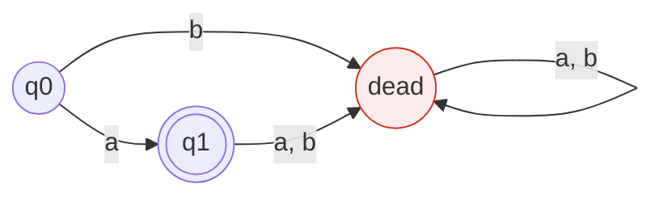
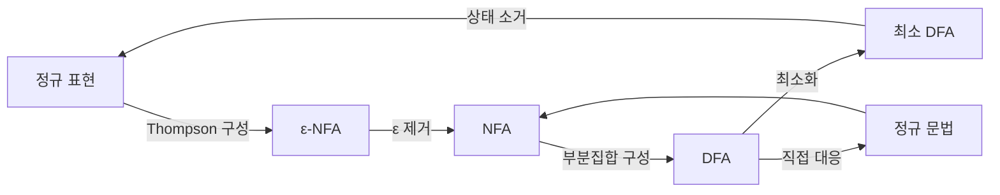
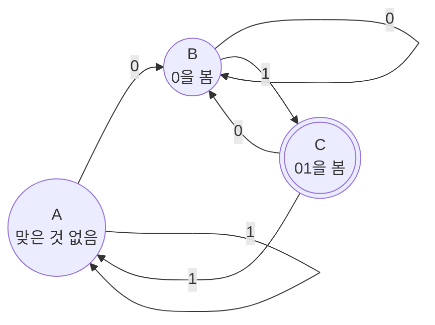
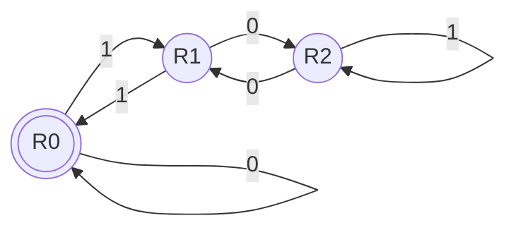
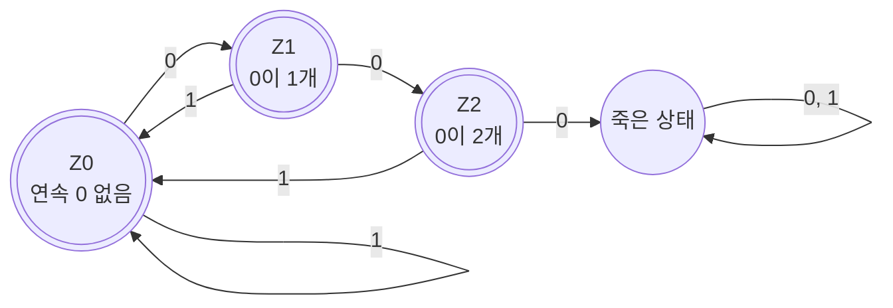

import AutomatonDiagram from '@site/src/components/automata/AutomatonDiagram';
import AutomatonSimulator from '@site/src/components/automata/AutomatonSimulator';

export const dfaAbb = {
  start: 'q0',
  width: 520,
  height: 146,
  states: [
    {id: 'q0', x: 60, y: 80},
    {id: 'q1', x: 190, y: 80},
    {id: 'q2', x: 320, y: 80},
    {id: 'q3', x: 450, y: 80, accepting: true},
  ],
  edges: [
    {from: 'q0', to: 'q0', label: 'b'},
    {from: 'q0', to: 'q1', label: 'a'},
    {from: 'q1', to: 'q1', label: 'a'},
    {from: 'q1', to: 'q2', label: 'b'},
    {from: 'q2', to: 'q1', label: 'a'},
    {from: 'q2', to: 'q3', label: 'b'},
    {from: 'q3', to: 'q1', label: 'a', bend: -58},
    {from: 'q3', to: 'q0', label: 'b', bend: -112},
  ],
};

export const nfaAbb = {
  start: 'n0',
  width: 500,
  height: 108,
  states: [
    {id: 'n0', x: 60, y: 80},
    {id: 'n1', x: 190, y: 80},
    {id: 'n2', x: 320, y: 80},
    {id: 'n3', x: 450, y: 80, accepting: true},
  ],
  edges: [
    {from: 'n0', to: 'n0', label: 'a, b'},
    {from: 'n0', to: 'n1', label: 'a'},
    {from: 'n1', to: 'n2', label: 'b'},
    {from: 'n2', to: 'n3', label: 'b'},
  ],
};

export const epsNfa = {
  start: 's0',
  width: 440,
  height: 250,
  states: [
    {id: 's0', x: 60, y: 130},
    {id: 's1', x: 200, y: 60},
    {id: 's2', x: 340, y: 60, accepting: true},
    {id: 's3', x: 200, y: 200},
    {id: 's4', x: 340, y: 200, accepting: true},
  ],
  edges: [
    {from: 's0', to: 's1', label: 'ε'},
    {from: 's0', to: 's3', label: 'ε'},
    {from: 's1', to: 's2', label: 'a'},
    {from: 's2', to: 's2', label: 'a'},
    {from: 's3', to: 's4', label: 'b'},
    {from: 's4', to: 's4', label: 'b'},
  ],
};

export const dfaEvenA = {
  start: 'even',
  width: 340,
  height: 100,
  states: [
    {id: 'even', label: 'E', x: 70, y: 90, accepting: true},
    {id: 'odd', label: 'O', x: 250, y: 90},
  ],
  edges: [
    {from: 'even', to: 'even', label: 'b'},
    {from: 'odd', to: 'odd', label: 'b'},
    {from: 'even', to: 'odd', label: 'a'},
    {from: 'odd', to: 'even', label: 'a'},
  ],
};

# 5. 유한 오토마타

정규 표현은 **무엇을** 인식할지 적는 표기법이었다.
**유한 오토마타(finite automata)** 는 그것을 **어떻게** 인식할지 나타내는 기계다.

이 장의 목표는 하나다.

> 정규 표현으로 적은 토큰 명세가, 어떻게 입력 문자당 상수 시간에
> 돌아가는 프로그램이 되는가.

---

## 5.1 결정적 유한 오토마타 (DFA)

:::info[정의 — DFA]

**DFA(Deterministic Finite Automaton)** 는 다섯 쌍
$M = (Q, \Sigma, \delta, q_0, F)$ 이다.

| 요소 | 이름 | 설명 |
|---|---|---|
| $Q$ | 상태 집합 | 유한 집합 |
| $\Sigma$ | 입력 알파벳 | 유한 집합 |
| $\delta$ | 전이 함수 | $\delta : Q \times \Sigma \to Q$ |
| $q_0$ | 시작 상태 | $q_0 \in Q$ |
| $F$ | 종결 상태 집합 | $F \subseteq Q$ |
:::

**결정적**이라는 말의 뜻은 $\delta$ 가 **함수**라는 것이다.
어떤 상태에서 어떤 입력 기호를 보든, 갈 곳이 **정확히 하나** 정해진다.
선택의 여지가 없으므로 되돌아갈(backtrack) 필요도 없다.

:::note[수식 읽는 법 — 화살표는 "무엇을 넣으면 무엇이 나온다"]
$$
\delta : Q \times \Sigma \to Q
$$

이 한 줄이 DFA의 전부다. 왼쪽이 **넣는 것**, 오른쪽이 **나오는 것**이다.

| 부분 | 읽는 법 |
|---|---|
| $Q \times \Sigma$ | (상태 하나, 기호 하나) **짝**을 넣는다 |
| $\to$ | "…를 넣으면 …가 나온다" |
| $Q$ | 상태 하나가 나온다 |

그래서 $\delta(q_1, \texttt{a}) = q_2$ 는
**"상태 $q_1$ 에서 `a` 를 읽으면 $q_2$ 로 간다"** 로 읽는다.
상태 전이도의 화살표 하나가 곧 이 식 하나다.

**"함수"라는 말에 두 가지 약속이 들어 있다.**

| 함수의 성질 | DFA 에서의 뜻 |
|---|---|
| 값이 **항상** 있다 | 어떤 (상태, 기호)에도 갈 곳이 있다 → 막히지 않는다 |
| 값이 **하나뿐**이다 | 갈 곳이 유일하다 → 고민할 것이 없다 |

이 둘이 곧 **결정적**이다.
5.2절의 NFA는 화살표 오른쪽이 $Q$ 가 아니라 $2^Q$ 로 바뀌는데,
그 한 글자 차이가 "갈 곳이 여럿일 수 있다"를 뜻한다.
:::

### 확장 전이 함수

$\delta$ 는 기호 하나에 대한 전이다.
스트링 전체에 대한 전이는 $\hat{\delta} : Q \times \Sigma^* \to Q$ 로 확장한다.

$$
\hat{\delta}(q, \varepsilon) = q
$$

$$
\hat{\delta}(q, wa) = \delta(\hat{\delta}(q, w),\ a)
$$

:::note[수식 읽는 법 — 재귀 정의를 뒤에서부터 읽는다]
$\hat{\delta}$ 는 $\delta$ 위의 모자다. 차이는 **두 번째 인자**뿐이다.

| | 넣는 것 | 뜻 |
|---|---|---|
| $\delta(q, a)$ | 기호 **하나** | 한 걸음 |
| $\hat{\delta}(q, w)$ | 스트링 **전체** | 다 읽고 난 뒤의 상태 |

정의가 두 줄인데, **첫 줄이 바닥이고 둘째 줄이 한 겹 벗기는 것**이다.

**첫 줄 — 바닥.** $\hat{\delta}(q, \varepsilon) = q$

아무것도 안 읽으면 제자리다. 재귀가 여기서 멈춘다.

**둘째 줄 — 한 겹 벗기기.** $\hat{\delta}(q, wa) = \delta(\hat{\delta}(q, w),\ a)$

$wa$ 는 "스트링 $w$ 뒤에 기호 $a$ 하나"라는 뜻이다.
**맨 뒤 한 글자를 떼어 낸다.**
그러면 "앞부분 $w$ 를 다 읽고 나서, 마지막 $a$ 한 걸음"이 된다.

**`ab` 를 넣어 직접 펼쳐 보자.**

$$
\begin{aligned}
\hat{\delta}(q_0,\ \texttt{ab})
  &= \delta(\hat{\delta}(q_0,\ \texttt{a}),\ \texttt{b}) && \text{맨 뒤 } \texttt{b} \text{ 를 뗀다} \\
  &= \delta(\delta(\hat{\delta}(q_0,\ \varepsilon),\ \texttt{a}),\ \texttt{b}) && \text{맨 뒤 } \texttt{a} \text{ 를 뗀다} \\
  &= \delta(\delta(q_0,\ \texttt{a}),\ \texttt{b}) && \text{바닥에 닿았다}
\end{aligned}
$$

마지막 줄을 보면 **왼쪽부터 차례로 읽는 것**과 정확히 같다.
정의는 뒤에서부터 벗기지만, 결과는 앞에서부터 한 글자씩 나아간 것이다.

스트링이 유한하므로 벗기다 보면 반드시 $\varepsilon$ 에 닿는다 — 그래서 잘 정의된다.
:::

그러면 $M$ 이 인식하는 언어는

$$
L(M) = \{\, w \in \Sigma^* \mid \hat{\delta}(q_0, w) \in F \,\}
$$

즉 **시작 상태에서 출발해 스트링을 다 읽었을 때 종결 상태에 있으면 수락**이다.

:::note[수식 읽는 법 — 세로줄은 "단, 이런 것만"]
$\{\ \dots \mid \dots\ \}$ 는 **조건제시법**이다. 세로줄 앞뒤가 하는 일이 다르다.

$$
L(M) = \{\ \underbrace{w \in \Sigma^*}_{\text{어디서 고르나}}\ \mid\ \underbrace{\hat{\delta}(q_0, w) \in F}_{\text{어떤 것만 담나}}\ \}
$$

소리 내어 읽으면 이렇다.

> $\Sigma^*$ 의 스트링 $w$ **중에서**,
> $q_0$ 에서 출발해 $w$ 를 다 읽었을 때 도착한 상태가 $F$ 에 속하는 것 **만** 모은 집합.

세로줄은 "such that", 우리말로 **"단,"** 또는 **"…인"** 이다.
[시작하기 전에](/docs/prerequisites#집합)의 집합 표기와 같은 것이다.

**이 한 줄이 "오토마타가 언어를 정한다"는 말의 정확한 뜻이다.**
기계는 스트링 하나하나에 예/아니오만 답하는데,
"예"라고 답한 것을 전부 모으면 하나의 언어가 된다.
:::

### 예제 — `(a|b)*abb`

[4장](/docs/regular/regular-expressions)에서 본 정규 표현 `(a|b)*abb`,
즉 "`abb`로 끝나는 스트링"을 인식하는 DFA다.

<AutomatonDiagram
  spec={dfaAbb}
  caption="(a|b)*abb 를 인식하는 DFA. 이중 원이 종결 상태."
/>

**전이표**로 쓰면 이렇다. 구현할 때는 이 표가 그대로 2차원 배열이 된다.

| 상태 | `a` | `b` |
|---|---|---|
| → q0 | q1 | q0 |
| q0의 의미 | *아직 아무것도 못 봄* | |
| q1 | q1 | q2 |
| q1의 의미 | *`a`를 봄* | |
| q2 | q1 | q3 |
| q2의 의미 | *`ab`를 봄* | |
| \* q3 | q1 | q0 |
| q3의 의미 | *`abb`를 봄 — 수락* | |

:::tip[상태에 의미를 붙여서 읽자]
DFA의 상태는 **"지금까지 읽은 것 중 앞으로 필요한 정보"** 를 기억한다.
여기서는 "목표 패턴 `abb` 중 몇 글자까지 맞췄는가"다.

q2에서 `a`를 보면 q0이 아니라 **q1**로 간다는 데 주목하자.
`aba`에서 마지막 `a`는 새로운 매치의 시작이 될 수 있기 때문이다.
이 "실패했을 때 어디로 돌아가는가"가 바로
KMP 문자열 검색 알고리즘의 실패 함수와 같은 아이디어다.
:::

### 직접 돌려 보기

버튼을 눌러 한 글자씩 진행해 보자. 입력을 직접 고칠 수도 있다.

<AutomatonSimulator
  spec={dfaAbb}
  title="DFA 시뮬레이터 — (a|b)*abb"
  defaultInput="ababb"
  samples={['abb', 'ababb', 'abba', 'aabb', 'b', '']}
/>

`abba`를 넣어 보라. q3까지 갔다가 마지막 `a`에서 q1으로 되돌아와
거부되는 것을 볼 수 있다.

### 또 하나의 예 — `a`가 짝수 개

상태가 **유한한 정보**만 기억하면 되는 전형적인 경우다.
`a`를 몇 개 봤는지가 아니라 **짝수인지 홀수인지**만 알면 된다.

<AutomatonSimulator
  spec={dfaEvenA}
  title="DFA 시뮬레이터 — a가 짝수 개"
  defaultInput="abba"
  samples={['', 'aa', 'aba', 'abba', 'bbb', 'aaa']}
/>

[3장](/docs/regular/regular-languages#34-정규언어의-한계)에서 말한
"유한한 정보는 기억하지만 무한한 정보는 기억하지 못한다"가
이 두 상태에 그대로 드러난다.

### 완전성과 죽은 상태

위 정의의 $\delta$ 는 **전함수(total function)** 다.
즉 모든 $(q, a)$ 쌍에 대해 값이 정의되어 있어야 한다.

실제로 그림을 그릴 때는 "갈 곳 없음"을 생략하는 경우가 많은데,
형식적으로는 **죽은 상태(dead state, trap state)** 를 하나 추가해서
모든 미정의 전이를 거기로 보낸 것으로 본다.



:::caution[여집합을 만들 때 완전성이 중요하다]
[3장의 폐포 성질](/docs/regular/regular-languages#33-정규언어의-폐포-성질)에서
"종결 상태를 뒤집으면 여집합"이라고 했다.
이때 죽은 상태가 없으면 안 된다.
죽은 상태가 뒤집혀 **종결 상태가 되어야** 원래 거부되던 스트링이 수락되기 때문이다.
:::

---

## 5.2 비결정적 유한 오토마타 (NFA)

:::info[정의 — NFA]

**NFA(Nondeterministic Finite Automaton)** 도 다섯 쌍
$M = (Q, \Sigma, \delta, q_0, F)$ 이지만, 전이 함수의 공역이 다르다.

$$
\delta : Q \times \Sigma \to 2^{Q}
$$

즉 하나의 (상태, 기호) 쌍에 대해 **상태의 집합**을 돌려준다.
집합이 비어 있을 수도(갈 곳 없음), 원소가 여럿일 수도(선택지 여럿) 있다.
:::

:::caution[$2^{Q}$ 는 "2의 Q제곱"이 아니다]
$2^{Q}$ 는 **멱집합(power set)** — $Q$ 의 **모든 부분집합**을 모은 집합이다.

$Q = \{q_0, q_1\}$ 이면
$$2^{Q} = \{\ \emptyset,\ \{q_0\},\ \{q_1\},\ \{q_0, q_1\}\ \}$$

$|Q| = n$ 일 때 부분집합이 $2^n$ 개라서 이 기호를 쓴다.

**DFA와 NFA의 차이는 이 한 글자다.**

| | 전이 함수 | 돌려주는 것 |
|---|---|---|
| DFA | $\delta : Q \times \Sigma \to Q$ | 상태 **하나** |
| NFA | $\delta : Q \times \Sigma \to 2^{Q}$ | 상태의 **집합** |

집합이 비어 있으면 "갈 곳 없음", 원소가 둘이면 "선택지 둘"이다.
:::

수락 조건은 "**어떤 경로 하나라도** 종결 상태에 도달하면 수락"이다.

$$
L(M) = \{\, w \mid \hat{\delta}(q_0, w) \cap F \neq \emptyset \,\}
$$

:::note[수식 읽는 법 — DFA와 딱 한 글자 다르다]
DFA의 수락 조건과 나란히 놓아 보자.

| | 수락 조건 | 읽는 법 |
|---|---|---|
| DFA | $\hat{\delta}(q_0, w) \in F$ | 도착한 **상태가** 종결 상태다 |
| NFA | $\hat{\delta}(q_0, w) \cap F \neq \emptyset$ | 도착한 **상태들 중 하나라도** 종결 상태다 |

$\in$ 이 $\cap \neq \emptyset$ 으로 바뀌었다. 이유는 하나다 —
**NFA에서 $\hat{\delta}$ 가 돌려주는 것은 상태 하나가 아니라 상태의 집합**이기 때문이다.

$$
\hat{\delta}(q_0, w) \cap F \neq \emptyset
\quad\Longleftrightarrow\quad
\text{도착 집합과 } F \text{ 에 겹치는 원소가 있다}
$$

**"하나라도 있으면 수락"** 이 비결정성의 정확한 뜻이다.
갈 수 있는 길을 전부 따라가 보고, **그중 하나라도** 성공하면 된다.

`(a|b)*abb` 를 예로 보면, `aabb` 를 읽고 난 뒤 활성 상태가
$\{n_0, n_3\}$ 처럼 여러 개인데 그중 $n_3$ 이 종결이므로 수락이다.
나머지 갈래가 실패했다는 사실은 상관없다.

:::caution[NFA는 "운이 좋은 기계"가 아니다]
"올바른 길을 알아서 고른다"고 설명하는 책이 있는데, 오해를 부른다.
NFA는 고르지 않는다. **모든 길을 동시에 갖고 있을 뿐**이다.

[5.4절의 시뮬레이션](#nfa를-그대로-시뮬레이션하기)에서 보듯,
실제로 돌릴 때는 활성 상태의 **집합**을 통째로 들고 다닌다.
그 집합을 하나의 상태로 삼자는 것이 [부분집합 구성](/docs/regular/representations#63-nfa--dfa-부분집합-구성)이다.
:::

### 왜 비결정성을 허용하는가

`(a|b)*abb` 의 NFA를 보자. DFA보다 훨씬 **정규 표현을 닮았다**.

<AutomatonDiagram
  spec={nfaAbb}
  caption="(a|b)*abb 를 인식하는 NFA. n0에서 a를 보면 머무를 수도, n1로 갈 수도 있다."
/>

n0에서 `a`를 읽었을 때 갈 곳이 **둘**이다.

$$
\delta(n_0, a) = \{n_0,\ n_1\}
$$

"여기가 `abb`의 시작일지도 모르니 n1으로도 가 보고,
아닐지도 모르니 n0에도 남아 있자"라는 뜻이다.

:::note[비결정성의 두 가지 해석]
- **추측(guessing)** — 기계가 올바른 선택을 알아맞힌다고 상상한다. 이론적 해석.
- **병렬 탐색(parallel exploration)** — 모든 선택지를 동시에 따라간다. 구현적 해석.

시뮬레이터는 후자로 구현되어 있다. 매 단계에서
**활성 상태의 집합**을 들고 다니며 전부 갱신한다.
:::

<AutomatonSimulator
  spec={nfaAbb}
  title="NFA 시뮬레이터 — (a|b)*abb (여러 상태가 동시에 활성)"
  defaultInput="ababb"
  samples={['abb', 'ababb', 'abba', 'aabb']}
/>

`ababb`를 한 단계씩 진행하며 활성 상태가 갈라졌다 합쳐지는 것을 확인하자.
`aba`까지 읽으면 활성 상태가 두 개다 —
"n0에 머문 갈래"와 "마지막 `a`를 시작으로 본 갈래".

### NFA와 DFA의 트레이드오프

| | NFA | DFA |
|---|---|---|
| 상태 수 | 정규 표현 크기에 **선형** | 최악의 경우 **지수** |
| 한 글자 처리 비용 | 활성 상태 집합 갱신, $O(\lvert Q \rvert)$ | 배열 접근 1회, $O(1)$ |
| 만들기 | 정규 표현에서 기계적으로 쉽다 | 부분집합 구성 필요 |
| 표현력 | \-\- **완전히 같다** \-\- | |

핵심은 마지막 줄이다.

:::info[정리 (Rabin–Scott, 1959)]
모든 NFA에 대해, 같은 언어를 인식하는 DFA가 존재한다.

증명은 구성적이다 —
[다음 장](/docs/regular/representations#63-nfa--dfa-부분집합-구성)의
**부분집합 구성(subset construction)** 이 그 구성법이다.
:::

이 정리가 lex의 존재 근거다.
**정규 표현 → NFA(쉽다) → DFA(기계적) → 배열 두 개**라는
파이프라인 전체가 자동화 가능하다는 뜻이기 때문이다.

---

## 5.3 ε-전이

NFA를 더 편하게 만들기 위해, **입력을 읽지 않고** 상태를 옮기는
**ε-전이(epsilon transition)** 를 허용할 수 있다.

$$
\delta : Q \times (\Sigma \cup \{\varepsilon\}) \to 2^{Q}
$$

이렇게 확장한 것을 **ε-NFA** 또는 **NFA-ε** 라 한다.

:::note[수식 읽는 법 — 바뀐 곳은 왼쪽 괄호 안뿐이다]
세 오토마타의 전이 함수를 세로로 놓아 보자. **한 줄씩만 다르다.**

| | 전이 함수 | 무엇이 달라졌나 |
|---|---|---|
| DFA | $\delta : Q \times \Sigma \to Q$ | — |
| NFA | $\delta : Q \times \Sigma \to 2^{Q}$ | 오른쪽이 **집합**으로 |
| ε-NFA | $\delta : Q \times (\Sigma \cup \{\varepsilon\}) \to 2^{Q}$ | 왼쪽에 $\varepsilon$ 이 **추가** |

$\Sigma \cup \{\varepsilon\}$ 은 "알파벳 기호들 **에다가** 공 스트링 하나 더"다.

$\Sigma = \{a, b\}$ 라면

$$
\Sigma \cup \{\varepsilon\} = \{a,\ b,\ \varepsilon\}
$$

넣을 수 있는 것이 셋이 되었다는 뜻이고, 셋째가 **"아무것도 안 읽음"** 이다.

$$
\delta(q_1,\ \varepsilon) = \{q_2\}
\quad\Longrightarrow\quad
\text{입력을 소비하지 않고 } q_1 \text{ 에서 } q_2 \text{ 로 갈 수 있다}
$$

:::caution[$\varepsilon$ 은 알파벳의 원소가 아니다]
$\varepsilon \notin \Sigma$ 다. 그래서 **일부러 합집합으로 끼워 넣은** 것이다.

$\Sigma$ 에 $\varepsilon$ 을 넣어 버리면 안 된다.
$\Sigma^*$ 의 정의부터 무너지고, "길이 $n$ 인 스트링"이 무슨 말인지 알 수 없게 된다.
$\varepsilon$ 은 **전이의 라벨로만** 잠깐 빌려 쓰는 것이다.
:::

### 예제 — `aa*` 또는 `bb*`

<AutomatonSimulator
  spec={epsNfa}
  title="ε-NFA 시뮬레이터 — aa* | bb*"
  defaultInput="aaa"
  samples={['a', 'aaa', 'b', 'bb', 'ab', '']}
/>

시작하자마자 활성 상태가 **셋**이라는 데 주목하자.
아무것도 읽지 않았는데 s0, s1, s3가 모두 활성이다.

### ε-closure

이것을 형식화한 것이 **ε-closure** 다.

:::info[정의 — ε-closure]

상태 집합 $T$ 에 대해 $\varepsilon\text{-closure}(T)$ 는
$T$ 의 원소에서 **ε-전이만을 따라** 도달할 수 있는 모든 상태의 집합이다
(자기 자신 포함).

깊이 우선 탐색으로 계산한다.

```
ε-closure(T):
    stack ← T 의 모든 원소
    result ← T
    while stack 이 비어 있지 않은 동안:
        q ← stack.pop()
        for each p in δ(q, ε):
            if p ∉ result:
                result ← result ∪ {p}
                stack.push(p)
    return result
```
:::

위 예에서 $\varepsilon\text{-closure}(\{s_0\}) = \{s_0, s_1, s_3\}$ 다.

ε-NFA의 한 단계는 항상 **두 부분**으로 이루어진다.

1. **move** — 현재 집합에서 기호 $a$ 로 갈 수 있는 상태들
2. **ε-closure** — 거기서 다시 ε로 도달 가능한 상태들까지 확장

$$
T_{i+1} = \varepsilon\text{-closure}\big(\text{move}(T_i,\ a)\big)
$$

:::note[수식 읽는 법 — 안쪽부터 바깥쪽으로]
함수가 겹쳐 있을 때는 **괄호 안쪽부터** 읽는다.

$$
T_{i+1} = \underbrace{\varepsilon\text{-closure}\big(\ \underbrace{\text{move}(T_i,\ a)}_{②\ \text{기호 } a \text{ 로 한 걸음}}\ \big)}_{③\ \text{공짜로 갈 수 있는 곳까지 마저}}
$$

① 지금 활성 상태 집합이 $T_i$ 다.
② `a` 를 읽고 갈 수 있는 상태를 전부 모은다 → $\text{move}(T_i, a)$
③ 거기서 **입력을 더 읽지 않고** ε 로만 갈 수 있는 곳까지 모두 포함시킨다.

**왜 ③이 필요한가.** ε-전이는 "입력을 안 읽고 옮겨 가기"다.
$a$ 를 읽어 어떤 상태에 도착했는데 거기서 ε 로 다른 데로 갈 수 있다면,
그곳도 **지금 이 순간** 활성이다. 다음 기호를 읽기 전에 다 훑어 둬야 한다.

$\varepsilon\text{-closure}$ 자체도 재귀적으로 정의된다.

> $\varepsilon\text{-closure}(T)$ 는
> ① $T$ 의 모든 상태를 포함하고,
> ② 그 안의 상태에서 ε 로 갈 수 있는 상태도 포함하며,
> ③ 그것을 **더 늘어나지 않을 때까지** 반복한 집합이다.

③이 [12장 FIRST/FOLLOW](/docs/parsing/syntax-analysis#123-first-집합)나
[15장 CLOSURE](/docs/parsing/lr-parsing#153-정준-lr0-항목-집합)와 똑같은
**고정점 계산**이다. 이 교안에서 같은 모양이 세 번 나온다.

상태가 유한하고 집합은 커지기만 하므로 반드시 멈춘다.
:::

이 한 줄이 [부분집합 구성](/docs/regular/representations)의 핵심 공식이다.
기억해 두자.

### ε-전이는 표현력을 늘리지 않는다

:::info[정리]
모든 ε-NFA에 대해, 같은 언어를 인식하는 ε 없는 NFA가 존재한다.
:::

**증명 스케치.** 각 상태 $q$ 와 기호 $a$ 에 대해

$$
\delta'(q, a) = \varepsilon\text{-closure}\big(\delta(\varepsilon\text{-closure}(q),\ a)\big)
$$

로 새 전이 함수를 정의하고,
$\varepsilon\text{-closure}(q) \cap F \neq \emptyset$ 인 $q$ 를 종결 상태에 추가한다.

즉 **ε-전이를 미리 다 따라가서 전이 함수에 흡수**시키는 것이다.

:::note[수식 읽는 법 — ε-closure 가 앞뒤로 두 번 나온다]
괄호가 세 겹이라 복잡해 보이는데, **안에서 밖으로 세 걸음**일 뿐이다.

$$
\delta'(q, a) = \varepsilon\text{-closure}\Big(\ \delta\big(\ \underbrace{\varepsilon\text{-closure}(q)}_{①\ \text{읽기 전}},\ a\ \big)\ \Big)_{\phantom{x}}
$$

| 걸음 | 하는 일 | 왜 |
|---|---|---|
| ① 앞 closure | $q$ 에서 공짜로 갈 수 있는 곳을 먼저 다 모은다 | `a` 를 읽기 **전에** 이미 옮겨 갔을 수 있다 |
| ② $\delta(\cdot, a)$ | 그 상태들에서 `a` 를 읽고 한 걸음 | 진짜로 입력을 소비하는 유일한 단계 |
| ③ 뒤 closure | 도착한 뒤 또 공짜로 갈 수 있는 곳을 모은다 | `a` 를 읽은 **직후**에도 옮겨 갈 수 있다 |

**closure 가 앞뒤로 두 번인 이유가 여기 있다.**
ε-전이는 기호 읽기의 앞에도 뒤에도 끼어들 수 있기 때문이다.

**종결 상태를 늘리는 조건**도 같은 발상이다.

$$
\varepsilon\text{-closure}(q) \cap F \neq \emptyset
\quad\Longrightarrow\quad
q \text{ 도 종결 상태로 삼는다}
$$

> "$q$ 에서 **입력을 더 읽지 않고** 종결 상태에 닿을 수 있다면,
> $q$ 에서 멈춰도 수락한 것과 같다."

이 두 줄이 곧 [6장 Thompson 구성](/docs/regular/representations#62-정규-표현--nfa-thompson-구성)이
만들어 낸 ε 를 [부분집합 구성](/docs/regular/representations#63-nfa--dfa-부분집합-구성)이
흡수하는 방식이다. **같은 식이 6장에서 다시 나온다.**
:::

따라서 표현력의 위계는 이렇다.

$$
\text{정규 표현} \;\equiv\; \varepsilon\text{-NFA} \;\equiv\; \text{NFA} \;\equiv\; \text{DFA} \;\equiv\; \text{정규 문법}
$$

**다섯 가지가 전부 같은 것을 표현한다.**
서로 다른 것은 표현력이 아니라 **편의성과 크기**뿐이다.



이 그림의 각 화살표를 [다음 장](/docs/regular/representations)에서 하나씩 채운다.

---

## 5.4 유한 오토마타의 구현

이론을 코드로 옮기는 방법은 두 가지다.

### 방법 1 — 전이표 구동 (table-driven)

전이 함수를 2차원 배열에 넣고 루프를 돈다.

```c
/* (a|b)*abb 를 인식하는 DFA */
#include <stdio.h>
#include <string.h>

#define NSTATES 4
#define DEAD   -1

/* delta[state][symbol]  — symbol: 0='a', 1='b' */
static const int delta[NSTATES][2] = {
    /*        a   b  */
    /* q0 */ {1,  0},
    /* q1 */ {1,  2},
    /* q2 */ {1,  3},
    /* q3 */ {1,  0},
};

static const int accepting[NSTATES] = {0, 0, 0, 1};

int matches(const char *s) {
    int state = 0;                    /* q0 */
    for (; *s; s++) {
        int col;
        if      (*s == 'a') col = 0;
        else if (*s == 'b') col = 1;
        else return 0;                /* 알파벳 밖의 문자 */
        state = delta[state][col];
        if (state == DEAD) return 0;
    }
    return accepting[state];
}
```

`matches`의 루프는 **입력 문자당 배열 접근 두 번**이다.
입력 길이에 정확히 선형이고, 상수가 아주 작다.

:::tip[lex가 생성하는 코드가 바로 이것이다]
`flex`로 스캐너를 만들면 `yy_nxt`, `yy_accept` 같은 이름의
거대한 정적 배열이 생성된다. 위 `delta`와 `accepting`의
압축된 버전이다.

직접 확인해 보자.
```bash
flex -o scanner.c scanner.l
grep -n "yy_nxt\|yy_accept" scanner.c | head
```
:::

### 방법 2 — 직접 코딩 (direct-coded)

상태를 코드의 위치로 표현한다. 표 접근이 없어 더 빠를 수 있다.

```c
int matches_direct(const char *s) {
q0: if (*s == 'a') { s++; goto q1; }
    if (*s == 'b') { s++; goto q0; }
    return 0;
q1: if (*s == 'a') { s++; goto q1; }
    if (*s == 'b') { s++; goto q2; }
    return 0;
q2: if (*s == 'a') { s++; goto q1; }
    if (*s == 'b') { s++; goto q3; }
    return 0;
q3: if (*s == '\0') return 1;         /* 수락 */
    if (*s == 'a') { s++; goto q1; }
    if (*s == 'b') { s++; goto q0; }
    return 0;
}
```

:::note[re2c가 이 방식을 쓴다]
`goto`가 흉해 보이지만, 이것이 **상태 = 프로그램 카운터** 라는
가장 직접적인 구현이다.
현대적인 어휘 분석기 생성기 [re2c](https://re2c.org/)는
표 대신 이런 직접 코드를 생성해 캐시 효율을 높인다.
자세한 비교는 [도구 지형도](/docs/modern/toolchain-map)에서 다룬다.
:::

### NFA를 그대로 시뮬레이션하기

DFA로 변환하지 않고 NFA를 직접 돌릴 수도 있다.
활성 상태 집합을 비트 집합으로 들고 다닌다.

```c
/* 상태가 64개 이하면 uint64_t 하나로 집합을 표현할 수 있다 */
#include <stdint.h>

uint64_t step(uint64_t cur, char c, const uint64_t trans[][128]) {
    uint64_t next = 0;
    for (int q = 0; q < 64; q++)
        if (cur & (1ULL << q))
            next |= trans[q][(unsigned char)c];
    return next;
}
```

시간 복잡도는 $O(|w| \cdot |Q|)$ 로 DFA보다 느리지만,
**상태 폭발이 없다**는 장점이 있다.

:::info[어느 쪽을 언제 쓰는가]
- **어휘 분석기** — 같은 패턴으로 거대한 입력을 훑는다.
  DFA 변환 비용을 한 번 치르고 $O(1)$/문자를 얻는 것이 압도적으로 유리하다.
  → **DFA**
- **범용 정규식 라이브러리** — 패턴이 매번 다르고 입력은 짧을 수 있다.
  DFA 변환이 지수 폭발할 위험이 있으므로 NFA 시뮬레이션이 안전하다.
  → **NFA** (또는 lazy DFA — 필요한 DFA 상태만 그때그때 만들어 캐시)

Go의 `regexp`와 RE2가 lazy DFA 방식을 쓴다.
:::

---

## 5.5 오토마타의 상태 폭발

NFA→DFA 변환이 항상 싼 것은 아니다.

**예제.** `(a|b)*a(a|b)^{n-1}` — "뒤에서 $n$번째 글자가 `a`".

- NFA: 상태 $n+1$ 개
- DFA: 상태 $2^n$ 개 (최소화해도)

왜 그럴까? DFA는 결정적이므로 **마지막 $n$글자를 전부 기억**해야 하고,
그 조합이 $2^n$ 가지이기 때문이다.
NFA는 "지금 여기가 뒤에서 $n$번째라고 추측"할 수 있으므로 기억할 필요가 없다.

:::caution[실무적 함의]
lex 입력 파일에 이런 패턴을 넣으면 생성된 스캐너가 폭발적으로 커진다.
`flex -v` 로 상태 수를 확인하는 습관을 들이자.

```bash
flex -v scanner.l 2>&1 | grep -E "DFA states|NFA states"
```

`.{10}$` 같은 "끝에서 몇 번째" 패턴이 대표적인 폭발 유발 패턴이다.
:::

---

## 요약

- **DFA** $(Q, \Sigma, \delta, q_0, F)$ 는 $\delta$ 가 상태 **하나**를 돌려주는 결정적 기계다.
  한 문자당 $O(1)$, 되돌아가지 않는다.
- **NFA**는 $\delta$ 가 상태의 **집합**을 돌려준다.
  "어떤 경로 하나라도 수락하면 수락"이다.
- **ε-NFA**는 입력을 읽지 않는 전이를 허용한다. **ε-closure**로 처리한다.
- 한 단계 = $\varepsilon\text{-closure}(\text{move}(T, a))$. 이 공식이 부분집합 구성의 핵심이다.
- **정규 표현 ≡ ε-NFA ≡ NFA ≡ DFA ≡ 정규 문법** — 다섯 가지의 표현력은 완전히 같다.
  다른 것은 크기와 편의성뿐이다.
- 구현은 **전이표 구동**(flex)과 **직접 코딩**(re2c) 두 방식이 있다.
- NFA→DFA 변환은 최악의 경우 **상태를 지수적으로 늘린다**.
  "끝에서 $n$번째" 패턴이 대표적이다.

## 확인 문제

1. 다음 언어를 인식하는 DFA를 그려라. ($\Sigma = \{0,1\}$)
   - (a) `01`로 끝나는 스트링
   - (b) 3의 배수인 이진수 (앞자리부터 읽음)
   - (c) `000`을 부분 스트링으로 포함하지 않는 스트링

<details>
<summary>풀이</summary>

**(a) `01` 로 끝나는 스트링**

상태의 의미: "지금까지 읽은 것의 **끝부분**이 목표 패턴과 얼마나 맞는가".



`C` 에서 `0` 을 보면 `A` 가 아니라 **`B`** 로 간다는 데 주목하자.
그 `0` 이 새로운 `01` 의 시작일 수 있기 때문이다.

**(b) 3의 배수인 이진수**

상태 = **지금까지 읽은 값을 3으로 나눈 나머지**.

비트 $b$ 를 하나 더 읽으면 값이 $2v + b$ 가 되므로,
나머지는 $(2r + b) \bmod 3$ 으로 갱신된다.

| 현재 나머지 | `0` 을 읽으면 | `1` 을 읽으면 |
|---|---|---|
| 0 | $(0+0)\%3 = 0$ | $(0+1)\%3 = 1$ |
| 1 | $(2+0)\%3 = 2$ | $(2+1)\%3 = 0$ |
| 2 | $(4+0)\%3 = 1$ | $(4+1)\%3 = 2$ |



시작·종결 상태는 `R0` 이다. (빈 입력을 0으로 볼지는 정의하기 나름)

**(c) `000` 을 포함하지 않는 스트링**

상태 = **연속된 `0` 이 몇 개인가** (0개, 1개, 2개).



`Z0`, `Z1`, `Z2` 가 모두 **종결 상태**다 — 아직 `000` 을 안 봤다는 뜻이므로.
`000` 을 보는 순간 죽은 상태로 가고 다시는 못 나온다.

</details>

2. 위 (b)의 상태에 각각 어떤 "의미"를 붙일 수 있는가?
   (힌트: 지금까지 읽은 값을 3으로 나눈 나머지)

<details>
<summary>풀이</summary>

| 상태 | 의미 |
|---|---|
| `R0` | 지금까지 읽은 이진수를 3으로 나눈 **나머지가 0** |
| `R1` | 나머지가 1 |
| `R2` | 나머지가 2 |

**왜 이것만 기억하면 되는가.**

읽은 값이 $v$ 일 때 비트 $b$ 를 하나 더 읽으면 새 값은 $2v + b$ 다.
그런데 우리가 알고 싶은 것은 최종 값이 아니라 **3으로 나눈 나머지**다.

$$(2v + b) \bmod 3 = (2\,(v \bmod 3) + b) \bmod 3$$

**새 나머지는 옛 나머지만으로 계산된다.** $v$ 자체는 필요 없다.

$v$ 는 얼마든지 커질 수 있으므로 기억할 수 없지만,
$v \bmod 3$ 은 **0, 1, 2 세 가지뿐**이라 상태 세 개로 충분하다.

:::tip[이것이 DFA 설계의 핵심 질문이다]
> **"앞으로의 판정에 필요한 정보는 무엇인가?"**

지금까지 읽은 것 전부를 기억할 필요는 없다.
**미래의 결정에 영향을 주는 부분만** 기억하면 된다.

- 3의 배수 판정 → 나머지 (3가지)
- `01` 로 끝남 → 끝 두 글자의 진행 상태 (3가지)
- `a` 가 짝수 개 → 짝/홀 (2가지)

그 정보가 **유한 가지**면 DFA를 만들 수 있고,
무한하면 만들 수 없다. Myhill–Nerode 정리가 이것을 형식화한 것이다
([6장](/docs/regular/representations#myhillnerode-관계)).
:::

</details>

3. `(a|b)*abb` 의 NFA에서 입력 `aabb`를 읽을 때
   각 단계의 활성 상태 집합을 손으로 계산하고, 시뮬레이터와 비교하라.

<details>
<summary>풀이</summary>

NFA의 전이:

| 상태 | `a` | `b` |
|---|---|---|
| n0 | n0, n1 | n0 |
| n1 | — | n2 |
| n2 | — | n3 |
| n3 (종결) | — | — |

**계산**

| 단계 | 읽은 문자 | 계산 | 활성 상태 |
|---|---|---|---|
| 시작 | — | — | `{n0}` |
| 1 | `a` | $\delta(n_0, a) = \{n_0, n_1\}$ | `{n0, n1}` |
| 2 | `a` | $\delta(n_0,a) \cup \delta(n_1,a) = \{n_0,n_1\} \cup \emptyset$ | `{n0, n1}` |
| 3 | `b` | $\delta(n_0,b) \cup \delta(n_1,b) = \{n_0\} \cup \{n_2\}$ | `{n0, n2}` |
| 4 | `b` | $\delta(n_0,b) \cup \delta(n_2,b) = \{n_0\} \cup \{n_3\}$ | `{n0, n3}` |

마지막 집합에 종결 상태 `n3` 이 **있으므로 수락**한다. ✅

**해석.** 활성 상태가 둘이라는 것은 두 개의 "가정"을 동시에 들고 있다는 뜻이다.

- `n0` — "아직 `abb` 가 시작 안 됐다"는 갈래
- `n1`/`n2`/`n3` — "여기서부터 `abb` 다"라는 갈래

2단계에서 `{n0, n1}` 인 것을 보자.
첫 `a` 를 시작으로 본 갈래(`n1`)와, 둘째 `a` 를 시작으로 본 갈래가
같은 상태로 합쳐져 있다.
**NFA는 갈래를 무한히 늘리지 않는다** — 상태가 유한하므로 자연히 합쳐진다.
이것이 [부분집합 구성](/docs/regular/representations#63-nfa--dfa-부분집합-구성)이
가능한 이유이기도 하다.

위 [NFA 시뮬레이터](#왜-비결정성을-허용하는가)에 `aabb` 를 넣어 확인해 보자.

</details>

4. 아래 ε-NFA에서 $\varepsilon\text{-closure}(\{s_0\})$ 와
   $\varepsilon\text{-closure}(\text{move}(\{s_0,s_1,s_3\},\ a))$ 를 구하라.
   (본문의 `aa*|bb*` 예제를 쓰면 된다)

<details>
<summary>풀이</summary>

전이: $s_0 \xrightarrow{\varepsilon} s_1$, $s_0 \xrightarrow{\varepsilon} s_3$,
$s_1 \xrightarrow{a} s_2$, $s_2 \xrightarrow{a} s_2$,
$s_3 \xrightarrow{b} s_4$, $s_4 \xrightarrow{b} s_4$.

**$\varepsilon\text{-closure}(\{s_0\})$**

$s_0$ 에서 ε 만 따라간다.

- $s_0$ 자기 자신 포함
- $s_0 \xrightarrow{\varepsilon} s_1$ → $s_1$ 추가
- $s_0 \xrightarrow{\varepsilon} s_3$ → $s_3$ 추가
- $s_1$ 과 $s_3$ 에서 나가는 ε 전이는 없다 → 종료

$$\varepsilon\text{-closure}(\{s_0\}) = \{s_0, s_1, s_3\}$$

**$\text{move}(\{s_0,s_1,s_3\},\ a)$**

각 상태에서 `a` 로 갈 수 있는 곳을 모은다.

| 상태 | `a` 전이 |
|---|---|
| $s_0$ | 없음 |
| $s_1$ | $s_2$ |
| $s_3$ | 없음 |

$$\text{move}(\{s_0,s_1,s_3\},\ a) = \{s_2\}$$

**$\varepsilon\text{-closure}(\{s_2\})$**

$s_2$ 에서 나가는 ε 전이가 없으므로

$$\varepsilon\text{-closure}(\text{move}(\{s_0,s_1,s_3\},\ a)) = \{s_2\}$$

**의미.** 시작하자마자 세 상태가 활성이었는데,
`a` 를 하나 읽는 순간 `b` 갈래($s_3$)가 죽고 $s_2$ 하나만 남는다.
$s_2$ 는 종결 상태이므로 `a` 하나만으로도 수락된다 (`aa*` 의 최소 형태).

이 두 연산의 합성 $\varepsilon\text{-closure}(\text{move}(T, a))$ 가
[부분집합 구성](/docs/regular/representations#63-nfa--dfa-부분집합-구성)의 핵심 공식이다.

</details>

5. "뒤에서 3번째 글자가 `a`"를 인식하는 최소 DFA의 상태 수가
   왜 8개인지 설명하라.

<details>
<summary>풀이</summary>

DFA는 입력을 **한 번만, 되돌아가지 않고** 훑는다.
그런데 "뒤에서 3번째"는 **입력이 끝나 봐야** 어디인지 알 수 있다.

따라서 매 순간 **마지막 3글자를 전부 기억**하고 있어야 한다.
입력이 끝나는 순간 그중 가장 오래된 것이 `a` 였는지 보면 되기 때문이다.

마지막 3글자의 조합은

$$2^3 = 8 \text{ 가지}$$

`aaa`, `aab`, `aba`, `abb`, `baa`, `bab`, `bba`, `bbb`.

각 조합이 서로 **구별 가능**하다. 예를 들어 `abb` 와 `bbb` 는
꼬리 $\varepsilon$ 로 구별된다 (앞쪽이 각각 `a`, `b` 이므로 하나는 수락, 하나는 거부).
길이가 3인 두 조합 $u \neq v$ 는 다른 위치를 맨 앞으로 밀어내는 꼬리를 붙이면
항상 구별할 수 있다.

Myhill–Nerode 정리에 의해 최소 상태 수 = 구별 불가능 동치류의 개수 = **8**.

:::info[일반화하면 $2^n$]
"뒤에서 $n$번째가 `a`" → 최소 DFA는 $2^n$ 상태.
반면 NFA는 $n+1$ 상태면 된다 — "여기가 그 자리"라고 **추측**할 수 있기 때문이다.

이것이 [5.5절 상태 폭발](#55-오토마타의-상태-폭발)의 표준 예제다.
lex 입력에 `.{10}$` 같은 패턴을 넣으면 실제로 이런 일이 일어난다.
:::

</details>

6. 전이표 구동 방식과 직접 코딩 방식 각각의 장단점을 정리하라.
   상태가 500개인 스캐너라면 어느 쪽이 유리할까?

<details>
<summary>풀이</summary>

| | 전이표 구동 | 직접 코딩 |
|---|---|---|
| 상태 표현 | 배열 인덱스 | **프로그램 카운터** |
| 코드 크기 | 작다 (루프 하나) | 상태 수에 **비례** |
| 데이터 크기 | 표가 크다 | 없음 |
| 한 문자 비용 | 배열 접근 2회 | 비교 몇 번 |
| 캐시 | 표가 크면 **미스**가 잦다 | 코드 지역성이 좋다 |
| 생성/디버깅 | 표만 바꾸면 된다 | 코드를 다시 생성 |
| 대표 도구 | **flex** | **re2c** |

**상태 500개라면?**

**전이표 구동이 유리하다.**

- 직접 코딩하면 상태마다 분기 블록이 생겨 **코드가 500덩어리**가 된다.
  명령 캐시(보통 32KB 안팎)를 넘겨 오히려 느려질 수 있다
- 표는 압축하면 작게 유지된다.
  ASCII 128열을 **동등 클래스**로 묶으면 실제 열은 수십 개다
  ([6장 참고](/docs/regular/representations))
- 500 × 30 = 15,000칸 정도면 데이터 캐시에 들어간다

**직접 코딩이 유리한 경우**는 상태가 수십 개 이하일 때다.
JSON 파서, URL 파서, 프로토콜 헤더 파서처럼 작고 뜨거운 스캐너.

:::tip[측정 없이 고르지 말 것]
어휘 분석이 컴파일러 전체 시간에서 차지하는 비중은 보통 몇 퍼센트다.
스캐너를 2배 빠르게 해도 전체는 1~2%만 빨라진다.

**둘 중 무엇을 쓰든 읽기 쉬운 쪽**이 대개 옳다.
`examples/03-dfa-by-hand` 에서 두 구현을 나란히 놓고 비교해 보자.
:::

</details>

7. DFA $M$ 의 전이가 $\delta(q_0, a) = q_1$, $\delta(q_1, b) = q_2$ 이고
   $F = \{q_2\}$ 라 하자. $\hat{\delta}(q_0, \texttt{ab})$ 를 **정의대로 펼쳐**
   계산하고, `ab` 가 $L(M)$ 에 속하는지 판정하라.

<details>
<summary>풀이</summary>

**정의를 그대로 적용한다.** 둘째 줄은 맨 뒤 한 글자를 뗀다.

$$
\hat{\delta}(q, wa) = \delta(\hat{\delta}(q, w),\ a)
$$

**1단계 — `ab` 에서 뒤의 `b` 를 뗀다.** ($w = \texttt{a}$, $a = \texttt{b}$)

$$
\hat{\delta}(q_0,\ \texttt{ab}) = \delta\big(\hat{\delta}(q_0,\ \texttt{a}),\ \texttt{b}\big)
$$

**2단계 — `a` 에서 뒤의 `a` 를 뗀다.** ($w = \varepsilon$, $a = \texttt{a}$)

$$
\hat{\delta}(q_0,\ \texttt{a}) = \delta\big(\hat{\delta}(q_0,\ \varepsilon),\ \texttt{a}\big)
$$

**3단계 — 바닥에 닿았다.** 첫째 줄을 쓴다.

$$
\hat{\delta}(q_0,\ \varepsilon) = q_0
$$

**4단계 — 안에서 밖으로 되짚어 올라온다.**

$$
\begin{aligned}
\hat{\delta}(q_0,\ \texttt{a}) &= \delta(q_0,\ \texttt{a}) = q_1 \\
\hat{\delta}(q_0,\ \texttt{ab}) &= \delta(q_1,\ \texttt{b}) = q_2
\end{aligned}
$$

**판정.**

$$
\hat{\delta}(q_0,\ \texttt{ab}) = q_2 \in F
\quad\Longrightarrow\quad
\texttt{ab} \in L(M) \ ✅
$$

**관찰.** 정의는 **뒤에서부터** 벗겼는데, 실제 계산은
$q_0 \to q_1 \to q_2$ 로 **앞에서부터** 진행됐다.
재귀 정의를 펼치면 언제나 이렇게 된다 —
그래서 "정의대로 계산"과 "왼쪽부터 한 글자씩 읽기"가 같은 결과를 낸다.

**만약 `ba` 였다면?** $\delta(q_0, \texttt{b})$ 가 주어지지 않았다.
[완전성](#완전성과-죽은-상태) 때문에 형식적으로는 죽은 상태로 가고,
거기서 나오지 못하므로 거부된다.

</details>

---

다음 장에서는 이 다섯 가지 표현 사이를 **실제로 오가는 알고리즘**을 다룬다.
