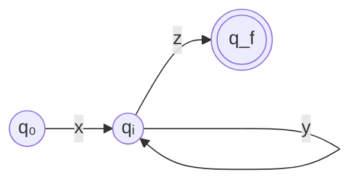

# 3. 정규언어

**정규언어(regular language)** 는 형식 언어 계층에서 가장 단순한 부류다.
단순하다는 것은 표현력이 약하다는 뜻이지만,
동시에 **아주 빠르고 작은 기계로 인식할 수 있다**는 뜻이기도 하다.

컴파일러의 어휘 분석기가 정규언어 위에서 돌아가는 이유가 정확히 이것이다.
식별자·숫자·연산자 같은 토큰은 정규언어로 충분히 기술되고,
그 대가로 우리는 입력 문자당 상수 시간이라는 성능을 얻는다.

---

## 3.1 정규집합의 정의

정규언어는 **귀납적으로** 정의된다.
"이것들은 정규다"라는 기본 규칙 몇 개와,
"정규인 것들을 이렇게 조합해도 정규다"라는 조립 규칙으로 이루어진다.

:::info[정의 — 알파벳 $\Sigma$ 위의 정규집합(regular set)]

**기본**

1. $\emptyset$ 은 정규집합이다.
2. $\{\varepsilon\}$ 은 정규집합이다.
3. 각 $a \in \Sigma$ 에 대해 $\{a\}$ 는 정규집합이다.

**귀납**

$R$ 과 $S$ 가 정규집합이면 다음도 정규집합이다.

4. $R \cup S$ (합집합)
5. $RS$ (접합)
6. $R^*$ (클레이니 클로저)

**폐쇄 조건**

위 규칙을 **유한 번** 적용해 만들 수 있는 것만이 정규집합이다.
:::

정규집합인 언어를 **정규언어**라 부른다. 둘은 같은 말로 쓴다.

:::note[수식 읽는 법 — 이 정의를 소리 내어 읽으면]

**기본 세 줄.** 여기 나오는 것은 전부 **언어**(= 스트링의 집합)다.

| 쓴 것 | 읽는 법 | 원소 |
|---|---|---|
| $\emptyset$ | "공집합" | 아무것도 없다 (0개) |
| $\{\varepsilon\}$ | "공 스트링 하나만 든 언어" | 공 스트링 1개 |
| $\{a\}$ | "기호 $a$ 하나짜리 스트링만 든 언어" | 스트링 `a` 1개 |

**$\{a\}$ 는 기호 $a$ 가 아니다.** 기호를 하나 담은 **상자**다.
이 구별을 놓치면 4번~6번 규칙이 무슨 말인지 알 수 없다.

**귀납 세 줄.** [2장의 언어 연산](/docs/foundations/language-and-grammar#언어-연산)을
그대로 쓴 것이다. 잊었을 수 있으니 다시 적는다.

$$
R \cup S = \{\,w \mid w \in R \ \text{또는}\ w \in S\,\}
$$

$$
RS = \{\,xy \mid x \in R,\ y \in S\,\}
$$

$$
R^* = R^0 \cup R^1 \cup R^2 \cup \cdots \qquad (R^0 = \{\varepsilon\})
$$

- $R \cup S$ — "$R$ 의 스트링 **아니면** $S$ 의 스트링"
- $RS$ — "$R$ 에서 하나 뽑고 $S$ 에서 하나 뽑아 **이어 붙인** 것 전부"
- $R^*$ — "$R$ 에서 뽑아 이어 붙이기를 **0번 이상** 한 것 전부"

$R^0 = \{\varepsilon\}$ 이므로 $R^*$ 에는 **언제나 $\varepsilon$ 이 들어 있다.**
$0$ 번 이어 붙이면 아무것도 안 붙인 것, 즉 공 스트링이기 때문이다.

**예로 확인해 보자.** $R = \{a\}$, $S = \{b, c\}$ 라면

$$
R \cup S = \{a, b, c\}, \qquad RS = \{ab, ac\}, \qquad R^* = \{\varepsilon, a, aa, aaa, \dots\}
$$

$RS$ 가 $\{a, b, c\}$ 가 **아니라** $\{ab, ac\}$ 인 것에 주의하자.
접합은 원소를 모으는 것이 아니라 **붙이는** 것이다.
:::

:::caution["유한 번"이라는 조건이 하는 일]
폐쇄 조건이 왜 필요한지 의아할 수 있다.
이것이 없으면 **어떤 언어든** 정규집합이 되어 버린다.

$L = \{a^n b^n \mid n \geq 0\}$ 을 보자. 원소를 하나씩 나열하면

$$
L = \{\varepsilon\} \cup \{ab\} \cup \{aabb\} \cup \{aaabbb\} \cup \cdots
$$

각 항은 기본 규칙과 접합으로 만들 수 있는 정규집합이고,
합집합은 4번 규칙이다. 그러니 규칙만 보면 만들 수 있어 보인다.

**그런데 합집합을 무한히 많이 해야 한다.**
폐쇄 조건이 그것을 금지한다. 규칙 적용은 **유한 번**만 허용된다.

이 한 줄 덕분에 "정규가 아닌 언어"라는 것이 존재할 수 있다.
[3.4절](#34-정규언어의-한계)에서 $\{a^n b^n\}$ 이 정말로 정규가 아님을 증명한다.
:::

### 왜 이 세 연산인가

합집합·접합·클로저는 각각 프로그래밍의 세 가지 기본 제어 구조에 대응한다.

| 연산 | 의미 | 대응 |
|---|---|---|
| $R \cup S$ | R이거나 S | **선택** (if / switch) |
| $RS$ | R 다음에 S | **순차** (문장 나열) |
| $R^*$ | R을 0번 이상 | **반복** (while) |

"선택·순차·반복만으로 만들 수 있는 패턴"이 곧 정규언어라고 생각해도 좋다.
빠져 있는 것은 **재귀**다. 재귀가 필요한 순간 정규언어를 벗어난다.

### 예제

$\Sigma = \{a, b\}$ 일 때 다음은 모두 정규언어다.

| 언어 | 구성 |
|---|---|
| $\{a, b\}$ | $\{a\} \cup \{b\}$ |
| $\{ab\}$ | $\{a\}\{b\}$ |
| 모든 스트링 $\Sigma^*$ | $(\{a\} \cup \{b\})^*$ |
| $a$로 시작하는 스트링 | $\{a\}\Sigma^*$ |
| $a$가 짝수 개인 스트링 | $(b^* a b^* a b^*)^* b^*$ 형태로 구성 가능 |
| 길이가 3의 배수인 스트링 | $(\Sigma\Sigma\Sigma)^*$ |

---

## 3.2 정규 문법

[2장](/docs/foundations/language-and-grammar)에서 정의한 문법
$G = (V_N, V_T, P, S)$ 에 **생성 규칙의 모양을 제한**하면 정규 문법이 된다.

:::info[정의 — 정규 문법(regular grammar)]

모든 생성 규칙이 다음 형태 중 하나이면 **우선형 문법(right-linear grammar)** 이다.

$$
A \to aB \qquad A \to a \qquad A \to \varepsilon
$$

($A, B \in V_N$, $a \in V_T$)

모든 생성 규칙이 다음 형태 중 하나이면 **좌선형 문법(left-linear grammar)** 이다.

$$
A \to Ba \qquad A \to a \qquad A \to \varepsilon
$$

둘 중 하나이면 **정규 문법**이라 하고, 두 부류는 같은 언어 집합을 생성한다.
:::

핵심 제약은 **우변에 넌터미널이 최대 하나, 그것도 맨 끝(또는 맨 앞)에만**
올 수 있다는 것이다. $A \to aBc$ 나 $A \to BC$ 는 정규 문법이 아니다.

:::caution[한 문법 안에서 좌·우선형을 섞으면 안 된다]
$S \to aB$ 와 $S \to Ba$ 를 함께 쓰면 정규 문법이 아니게 되고,
실제로 정규언어가 아닌 언어를 만들 수 있다. 예를 들어

$$
S \to aB \mid \varepsilon, \qquad B \to Sb
$$

는 규칙 하나하나는 선형 꼴이지만 섞여 있고,
$\{a^n b^n\}$ 을 생성한다 — 정규언어가 아니다.
:::

### 우선형 문법과 오토마타의 대응

우선형 문법은 유한 오토마타의 **글로 쓴 형태**다. 대응은 기계적이다.

$$
A \to aB \quad\Longleftrightarrow\quad \delta(A, a) = B
$$

$$
A \to a \quad\Longleftrightarrow\quad \delta(A, a) = F \ (F \text{는 종결 상태})
$$

$$
A \to \varepsilon \quad\Longleftrightarrow\quad A \text{ 가 종결 상태}
$$

:::note[수식 읽는 법 — 넌터미널이 곧 상태다]
$\Longleftrightarrow$ 는 "양쪽이 같은 말"이라는 뜻이다.
왼쪽은 **문법의 규칙**, 오른쪽은 **오토마타의 전이**인데, 둘이 1:1로 대응한다.

핵심 발상은 하나다.

> **넌터미널 하나 = 상태 하나.**
> "지금 $A$ 를 전개할 차례"와 "지금 상태 $A$ 에 있다"가 같은 상황이다.

세 줄을 말로 옮기면 이렇다.

| 규칙 | 읽는 법 |
|---|---|
| $A \to aB$ | 상태 $A$ 에서 `a` 를 읽고 상태 $B$ 로 간다 |
| $A \to a$ | 상태 $A$ 에서 `a` 를 읽고 **끝낸다** (종결 상태로 간다) |
| $A \to \varepsilon$ | 상태 $A$ 에서 **아무것도 안 읽고** 끝낼 수 있다 |

**왜 우변에 넌터미널이 최대 하나여야 하는지**가 여기서 드러난다.
$A \to aBC$ 를 허용하면 "다음에 갈 상태가 둘"이 되는데,
오토마타는 상태를 하나만 갖는다. 기억할 곳이 없다.

**왜 넌터미널이 맨 오른쪽이어야 하는지**도 같은 이유다.
$A \to Ba$ 는 "$B$ 를 다 처리한 **뒤에** `a` 를 읽는다"인데,
그러려면 "`a` 가 남아 있다"를 기억해 두어야 한다.
(그래서 좌선형은 오토마타를 **거꾸로** 읽는 것에 대응한다 — 다음 절에서 본다.)

**기억할 것이 유한하다**는 오토마타의 제약이 곧
**우변에 넌터미널 하나, 그것도 한쪽 끝에**라는 문법의 제약이다.
:::

**예제.** `a`로 시작해서 `b`로 끝나는 스트링의 문법:

$$
\begin{aligned}
S &\to aA \\
A &\to aA \mid bA \mid b
\end{aligned}
$$

**한 줄씩 읽어 보자.**

| 규칙 | 읽는 법 | 전이 |
|---|---|---|
| $S \to aA$ | 첫 글자는 반드시 `a` | $\delta(S, a) = A$ |
| $A \to aA$ | 가운데에 `a` 가 와도 계속 $A$ | $\delta(A, a) = A$ |
| $A \to bA$ | 가운데에 `b` 가 와도 계속 $A$ | $\delta(A, b) = A$ |
| $A \to b$ | `b` 로 끝내면 수락 | $\delta(A, b) = F$ |

$A \to bA$ 와 $A \to b$ 가 **둘 다 있다**는 점이 중요하다.
`b` 를 봤을 때 "여기서 끝인지, 더 있는지"를 아직 모르기 때문이다.
같은 기호에 갈 곳이 둘 — 이것이 **비결정성**이고,
[5장 NFA](/docs/regular/finite-automata#52-비결정적-유한-오토마타-nfa)에서 정식으로 다룬다.

이것을 상태 전이도로 옮기면 상태 3개짜리 오토마타가 나온다.
[다음 장](/docs/regular/finite-automata)에서 이 대응을 실제로 다룬다.

### 좌선형 문법의 예

$$
\begin{aligned}
S &\to Sa \mid Sb \mid A \\
A &\to a
\end{aligned}
$$

`a`로 **시작**하는 스트링이다. 좌선형에서는 스트링이 오른쪽 끝에서부터
자라 나가므로 직관이 반대로 뒤집힌다는 데 주의하자.

---

## 3.3 정규언어의 폐포 성질

정규언어 부류는 여러 연산에 대해 **닫혀 있다(closed)**.
즉 정규언어에 그 연산을 적용한 결과도 여전히 정규언어다.

| 연산 | 닫힘? | 근거 |
|---|---|---|
| 합집합 $L_1 \cup L_2$ | ✅ | 정의에 포함 |
| 접합 $L_1 L_2$ | ✅ | 정의에 포함 |
| 클로저 $L^*$ | ✅ | 정의에 포함 |
| 여집합 $\overline{L}$ | ✅ | DFA의 종결/비종결 상태를 뒤집는다 |
| 교집합 $L_1 \cap L_2$ | ✅ | 곱 구성(product construction) 또는 드모르간 |
| 차집합 $L_1 - L_2$ | ✅ | $L_1 \cap \overline{L_2}$ |
| 역 $L^R$ | ✅ | 간선 방향을 뒤집고 시작/종결을 교환 |
| 준동형사상 $h(L)$ | ✅ | 기호를 스트링으로 치환 |

### 여집합이 닫혀 있다는 것의 의미

DFA $M$ 이 $L$ 을 인식할 때, **종결 상태 집합을 그 여집합으로 바꾼**
DFA $M'$ 은 $\overline{L}$ 을 인식한다.

:::caution[이 논증은 DFA에서만 통한다]
NFA에서 종결 상태를 뒤집으면 여집합이 나오지 **않는다**.
NFA는 여러 경로를 동시에 탐색하므로,
"모든 경로가 거부"와 "어떤 경로가 수락되지 않음"이 다르기 때문이다.
반드시 DFA로 바꾼 뒤 뒤집어야 한다. 또한 DFA가 **완전(complete)** 해야 한다.
즉 모든 상태에서 모든 기호에 대한 전이가 정의되어 있어야 한다
(없으면 죽은 상태 trap state를 추가한다).
:::

### 교집합 — 곱 구성

$M_1 = (Q_1, \Sigma, \delta_1, q_1, F_1)$, $M_2 = (Q_2, \Sigma, \delta_2, q_2, F_2)$
두 DFA에 대해

$$
M = (Q_1 \times Q_2,\ \Sigma,\ \delta,\ (q_1, q_2),\ F_1 \times F_2)
$$

$$
\delta((p, q), a) = (\delta_1(p, a),\ \delta_2(q, a))
$$

두 오토마타를 **동시에 돌리고**, 둘 다 종결 상태일 때만 수락한다.
합집합이 필요하면 종결 집합을 $(F_1 \times Q_2) \cup (Q_1 \times F_2)$ 로 바꾸면 된다.

:::note[수식 읽는 법 — 5-튜플을 한 성분씩]
$Q_1 \times Q_2$ 는 **곱집합**이다.
$Q_1$ 에서 하나, $Q_2$ 에서 하나 골라 만든 **순서쌍 전부**를 모은 것
([시작하기 전에](/docs/prerequisites#집합) 참고).

$Q_1 = \{p_0, p_1\}$, $Q_2 = \{q_0, q_1\}$ 이면

$$
Q_1 \times Q_2 = \{\,(p_0,q_0),\ (p_0,q_1),\ (p_1,q_0),\ (p_1,q_1)\,\}
$$

**핵심 발상**은 이것이다.

> 상태 $(p, q)$ 는 "$M_1$ 은 지금 $p$ 에 있고, $M_2$ 는 지금 $q$ 에 있다"를 뜻한다.
> 두 기계의 위치를 **한 상태 안에 같이 적어 둔다.**

그러면 나머지는 저절로 따라온다.

| 성분 | 왜 그렇게 되나 |
|---|---|
| 상태 집합 $Q_1 \times Q_2$ | 두 기계의 위치 조합 전부 |
| 시작 상태 $(q_1, q_2)$ | 둘 다 각자의 시작점에서 출발 |
| 전이 $\delta((p,q), a)$ | 기호 하나에 **두 성분이 각자 한 걸음씩** |
| 종결 $F_1 \times F_2$ | **둘 다** 종결일 때만 — 그것이 교집합 |

**전이 식을 말로 읽으면** 이렇다.

> 상태 쌍 $(p, q)$ 에서 `a` 를 읽으면,
> 첫 성분은 $M_1$ 의 규칙대로 $\delta_1(p, a)$ 로,
> 둘째 성분은 $M_2$ 의 규칙대로 $\delta_2(q, a)$ 로 간다.

**종결 집합만 바꾸면 다른 연산이 된다**는 점이 이 구성의 묘미다.
기계 자체는 그대로 두고 "언제 수락하는가"만 손대면 된다.

| 원하는 것 | 종결 집합 |
|---|---|
| $L_1 \cap L_2$ | $F_1 \times F_2$ — 둘 다 |
| $L_1 \cup L_2$ | $(F_1 \times Q_2) \cup (Q_1 \times F_2)$ — 하나라도 |
| $L_1 - L_2$ | $F_1 \times (Q_2 - F_2)$ — 첫째는 맞고 둘째는 틀리고 |

**상태 수는 곱해진다.** $\lvert Q_1 \rvert = m$, $\lvert Q_2 \rvert = n$ 이면 $mn$ 개다.
유한 곱하기 유한은 유한이므로 결과도 여전히 **유한** 오토마타다 —
그래서 정규언어가 이 연산들에 닫혀 있다.
:::

:::tip[실무에서 유용한 지점]
"식별자이면서 예약어가 아닌 것"은 차집합이다.
정규언어는 차집합에 닫혀 있으므로 이런 패턴도 원리적으로는 정규 표현으로 쓸 수 있다.
다만 표현이 폭발적으로 길어지므로, lex에서는
**규칙 순서(예약어 규칙을 먼저 쓴다)** 로 해결하는 것이 관례다.
[LEX 입력 및 파싱](/docs/lex/lex-input-and-parsing) 장에서 다시 다룬다.
:::

---

## 3.4 정규언어의 한계

정규언어로 표현할 수 **없는** 것이 무엇인지 아는 것이,
표현할 수 있는 것을 아는 것만큼 중요하다.
이것이 어휘 분석과 구문 분석을 나누는 이론적 근거이기 때문이다.

### 직관 — 유한 오토마타는 셀 수 없다

유한 오토마타에는 **유한한 개수의 상태**밖에 없다.
상태가 곧 기억의 전부다. 따라서

> 임의로 큰 수를 세어서 기억해 둘 수 없다.

$\{a^n b^n \mid n \geq 0\}$ 을 인식하려면 $a$ 를 몇 개 읽었는지 기억해야 하는데,
$n$ 에 상한이 없으므로 유한한 상태로는 불가능하다.

### 펌핑 보조정리

이 직관을 정확한 증명 도구로 만든 것이 **펌핑 보조정리(pumping lemma)** 다.

:::info[정리 — 정규언어의 펌핑 보조정리]

$L$ 이 정규언어이면, 어떤 상수 $p \geq 1$ (펌핑 길이)이 존재하여
$|w| \geq p$ 인 모든 $w \in L$ 을 $w = xyz$ 로 쪼갤 수 있고, 다음을 만족한다.

1. $|y| \geq 1$  (펌프할 부분이 비어 있지 않다)
2. $|xy| \leq p$  (펌프할 부분이 앞쪽 $p$ 글자 안에 있다)
3. 모든 $i \geq 0$ 에 대해 $xy^i z \in L$
:::

:::note[수식 읽는 법 — "존재한다"와 "모든"이 번갈아 나온다]
이 정리에서 학생들이 막히는 곳은 내용이 아니라 **한정사의 순서**다.
문장을 기호로 옮기면 이렇게 생겼다.

$$
\exists p \ \ \forall w \ \ \exists (x,y,z) \ \ \forall i \ :\ xy^iz \in L
$$

"존재한다 → 모든 → 존재한다 → 모든" 이 **번갈아** 나온다.
순서가 바뀌면 완전히 다른 주장이 되므로, 읽을 때 순서를 지켜야 한다.

| 순서 | 무엇 | 누가 정하나 |
|---|---|---|
| 1 | 펌핑 길이 $p$ | **$L$ 이 정한다** (우리는 값을 모른다) |
| 2 | 길이 $p$ 이상인 스트링 $w$ | **우리가 고른다** |
| 3 | 분할 $w = xyz$ | **$L$ 이 정한다** (조건 1·2만 지키면 아무렇게나) |
| 4 | 반복 횟수 $i$ | **우리가 고른다** |

**"우리"와 "상대"가 번갈아 고르는 게임**이라고 생각하면 정확하다.

:::

:::tip[그래서 증명은 이렇게 흘러간다]
"정규가 아니다"를 보이려면 **정리의 부정**을 쓴다.
부정하면 $\exists$ 와 $\forall$ 이 전부 뒤집힌다.

$$
\forall p \ \ \exists w \ \ \forall (x,y,z) \ \ \exists i \ :\ xy^iz \notin L
$$

말로 풀면 이렇다.

> 상대가 **어떤 $p$ 를 주더라도**,
> 우리는 길이 $p$ 이상인 $w$ 를 **하나 잘 골라서**,
> 상대가 **어떻게 쪼개든**,
> 우리는 $i$ 를 **하나 골라** $L$ 밖으로 밀어낼 수 있다.

그래서 증명은 항상 같은 네 걸음이다.

| 걸음 | 하는 일 | 주의 |
|---|---|---|
| ① | $p$ 를 **받는다** | 구체적 값을 가정하면 안 된다 ("$p=5$ 라 하자" ❌) |
| ② | $w$ 를 **고른다** | 여기가 유일한 창의력. $p$ 를 써서 만든다 |
| ③ | 분할을 **받는다** | 조건 1·2를 만족하는 **모든** 분할을 다뤄야 한다 |
| ④ | $i$ 를 **고른다** | 대개 $i=2$(펌프 업) 또는 $i=0$(펌프 다운) |

**②가 전부다.** 조건 2($\lvert xy \rvert \leq p$)가
$y$ 를 **앞쪽 $p$ 글자 안**에 가두므로,
$w$ 의 앞 $p$ 글자를 같은 기호로 채워 두면
상대의 선택지가 "$a$ 몇 개"뿐으로 줄어든다.
그래서 $\{a^nb^n\}$ 의 증명이 $w = a^pb^p$ 로 시작한다.
:::

**왜 성립하는가.** $L$ 을 인식하는 DFA의 상태가 $p$ 개라고 하자.
길이 $p$ 이상인 스트링을 읽으면 상태를 $p+1$ 번 이상 방문하므로,
비둘기집 원리에 의해 **같은 상태를 두 번 지난다**.

:::note[비둘기집 원리 (pigeonhole principle)]
> 비둘기 $n+1$ 마리를 비둘기집 $n$ 개에 넣으면
> **적어도 한 집에는 두 마리 이상** 들어간다.

너무 당연해 보이지만, "반드시 겹치는 것이 있다"를 보장하는 강력한 도구다.

여기서는
- **비둘기** = 상태 방문 (길이 $p$ 스트링을 읽으면 $p+1$ 번 방문한다)
- **비둘기집** = 상태 ($p$ 개)

$p+1 > p$ 이므로 **어떤 상태는 반드시 두 번 방문된다.**
같은 상태를 두 번 지났다면 그 사이는 **고리**다.
:::



$q_i$ 를 두 번 지났다는 것은 그 사이 구간 $y$ 가 **고리(loop)** 라는 뜻이다.
고리는 몇 번을 돌아도(0번 포함) 같은 상태로 돌아오므로
$xy^0z, xy^1z, xy^2z, \dots$ 가 모두 수락된다.

### 증명 예제 ① — `{aⁿbⁿ}` 은 정규가 아니다 {#proof-anbn}

**귀류법.** $L = \{a^n b^n \mid n \geq 0\}$ 이 정규라고 가정하고
펌핑 길이를 $p$ 라 하자.

$w = a^p b^p$ 를 택한다. $|w| = 2p \geq p$ 이므로 보조정리를 적용할 수 있고,
$w = xyz$ 로 쪼개면 조건 2 $|xy| \leq p$ 에 의해
$x$ 와 $y$ 는 **앞쪽 $a$ 들 안에만** 있다. 즉

$$
x = a^s, \quad y = a^t \ (t \geq 1), \quad z = a^{p-s-t}b^p
$$

이제 $i = 2$ 로 펌프하면

$$
xy^2z = a^{s} a^{2t} a^{p-s-t} b^p = a^{p+t} b^p
$$

$t \geq 1$ 이므로 $a$ 의 개수가 $b$ 보다 많다.
따라서 $xy^2z \notin L$ 이고, 이는 조건 3에 모순이다. $\blacksquare$

### 증명 예제 ② — 짝이 맞는 괄호는 정규가 아니다

$L = \{\ (^n\ )^n \mid n \geq 0\ \}$ 은 위와 똑같은 논증으로 정규가 아니다.

:::danger[이것이 컴파일러 설계를 결정한다]
프로그래밍 언어의 괄호, 중괄호 블록, `begin`/`end`,
중첩된 `if`—이 모두가 "짝 맞추기"다.
따라서 **어떤 어휘 분석기도, 어떤 정규 표현도 프로그램의 중첩 구조를 검사할 수 없다.**

이것이 파서가 따로 필요한 이유이고,
파서가 **스택**(유한 오토마타에 없는 무한 기억 장치)을 갖는 이유다.
[문맥 자유 문법](/docs/parsing/context-free-grammar) 장에서 이 스택이
푸시다운 오토마타로 형식화된다.
:::

### 증명 예제 ③ — 정규인데 정규가 아닌 것처럼 보이는 경우

$L = \{a^n b^m \mid n, m \geq 0\}$ 은 **정규다**. 정규 표현으로 $a^*b^*$.
세는 것처럼 보이지만 $n$ 과 $m$ 사이에 아무 관계가 없으므로 셀 필요가 없다.

$L = \{w \in \{a,b\}^* \mid w \text{ 안의 } a \text{ 개수가 짝수}\}$ 도 **정규다**.
"짝수인지"만 기억하면 되고, 그건 상태 2개로 충분하다.

> **핵심**: 유한 오토마타는 **유한한 정보를 무한히** 기억할 수 있지만,
> **무한한 정보를** 기억할 수는 없다.
> "짝/홀"은 유한하고, "지금까지 본 a의 개수"는 무한하다.

:::caution[펌핑 보조정리는 필요조건일 뿐이다]
"펌핑 보조정리를 만족한다"가 "정규언어다"를 뜻하지는 **않는다**.
보조정리를 만족하지만 정규가 아닌 언어가 존재한다.
따라서 이 도구는 **정규가 아님을 증명할 때만** 쓸 수 있다.
정규임을 증명하려면 DFA/NFA/정규 표현을 실제로 만들어 보여야 한다.
:::

---

## 3.5 컴파일러에서의 정규언어

토큰의 대부분은 정규언어다.

| 토큰 | 정규 표현 |
|---|---|
| 식별자 | `[A-Za-z_][A-Za-z0-9_]*` |
| 십진 정수 | `[0-9]+` |
| 16진 정수 | `0[xX][0-9a-fA-F]+` |
| 부동소수 | `[0-9]+\.[0-9]*([eE][+-]?[0-9]+)?` |
| 한 줄 주석 | `//[^\n]*` |
| 문자열 리터럴 | `"([^"\\\n]|\\.)*"` |

### 정규언어로 안 되는 것들

실제 언어 명세에는 정규언어를 벗어나는 어휘 요소가 몇 개 있다.
어떻게 처리하는지 알아 두자.

**중첩 블록 주석** — C의 `/* */` 은 중첩되지 않으므로 정규다.
그러나 중첩을 허용하는 언어(Rust, Swift, D)의 블록 주석은
괄호 짝 맞추기와 같아서 **정규가 아니다**.
lex에서는 **시작 조건(start condition)** 과 카운터 변수로 처리한다.

```c
%x COMMENT
%%
"/*"            { depth = 1; BEGIN(COMMENT); }
<COMMENT>"/*"   { depth++; }
<COMMENT>"*/"   { if (--depth == 0) BEGIN(INITIAL); }
<COMMENT>.|\n   { /* 버린다 */ }
```

`depth`라는 **정수 변수**를 쓰는 순간 그 스캐너는 더 이상
순수한 유한 오토마타가 아니다. 실용적 타협이다.

**들여쓰기 기반 블록** — Python의 `INDENT`/`DEDENT` 토큰도
들여쓰기 깊이 스택이 필요하므로 정규가 아니다.
스캐너에 스택을 붙여 처리한다.

**타입 이름 vs 변수 이름** — C의 `T * x;` 가 곱셈인지 포인터 선언인지는
`T`가 타입인지에 달렸다. 이는 **의미 정보**이므로 어휘 수준에서 결정할 수 없다.
전통적으로 "lexer hack"이라 불리는, 심볼 테이블을 스캐너가 참조하는 우회가 쓰인다.

:::note[원칙을 다시 확인하면]
**이론이 허용하는 만큼만 도구에 맡기고, 나머지는 명시적으로 코드를 쓴다.**
lex가 정규 표현만 다루도록 두고, 중첩 카운터는 액션 코드에 두는 설계가
"모든 것을 정규 표현으로 우겨넣는" 설계보다 읽기 쉽고 디버깅하기 쉽다.
:::

---

## 요약

- **정규집합**은 $\emptyset$, $\{\varepsilon\}$, $\{a\}$ 에서 시작해
  합집합·접합·클로저를 유한 번 적용해 만든 집합이다.
- **정규 문법**은 우변에 넌터미널이 최대 하나, 한쪽 끝에만 오는 문법이다
  (우선형 $A \to aB$ / 좌선형 $A \to Ba$).
- 정규언어는 합집합·접합·클로저·**여집합·교집합·차집합·역**에 닫혀 있다.
  여집합은 반드시 **완전한 DFA**에서 종결 상태를 뒤집어야 한다.
- **펌핑 보조정리**는 정규언어의 상한을 준다.
  $\{a^n b^n\}$, 짝이 맞는 괄호는 정규가 **아니다**.
- 이 한계가 **어휘 분석기와 파서를 나누는 이론적 근거**다.
- 유한 오토마타는 "짝수/홀수" 같은 **유한한 정보**는 기억하지만
  "지금까지 본 개수" 같은 **무한한 정보**는 기억하지 못한다.

## 확인 문제

1. $\Sigma = \{0, 1\}$ 위에서 다음이 정규언어인지 판정하고 근거를 대라.
   - (a) 1이 홀수 개인 스트링
   - (b) 0의 개수와 1의 개수가 같은 스트링
   - (c) `0101`을 부분 스트링으로 포함하는 스트링
   - (d) 회문(palindrome)인 스트링
   - (e) 길이가 소수인 스트링

<details>
<summary>풀이</summary>

| | 정규? | 근거 |
|---|---|---|
| (a) 1이 홀수 개 | ✅ | 짝/홀만 기억하면 된다 — 상태 2개 |
| (b) 0의 개수 = 1의 개수 | ❌ | 지금까지 본 차이를 세야 한다 — 무한 |
| (c) `0101` 포함 | ✅ | 정규 표현 `(0\|1)*0101(0\|1)*` |
| (d) 회문 | ❌ | 앞부분 전체를 기억해야 한다 |
| (e) 길이가 소수 | ❌ | 소수 판정에 무한한 정보가 필요 |

**(b) 증명.** $w = 0^p1^p$ 를 택한다. $\lvert xy \rvert \leq p$ 이므로 $y = 0^t$ ($t \geq 1$).
$xy^2z = 0^{p+t}1^p$ 는 개수가 다르므로 $L$ 에 없다. 모순. $\blacksquare$

**(d) 증명.** $w = 0^p10^p$ 를 택한다. $y = 0^t$ ($t \geq 1$, 앞쪽 0들 안).
$xy^2z = 0^{p+t}10^p$ 는 앞뒤 0 개수가 달라 회문이 아니다. 모순. $\blacksquare$

**(e) 증명.** 길이가 소수 $p$ 인 스트링 $w$ 를 택한다.
$w = xyz$, $\lvert y \rvert = t \geq 1$ 이라 하자.
$i = p+1$ 로 펌프하면 길이가

$$\lvert x \rvert + (p+1)t + \lvert z \rvert = (\lvert x \rvert+t+\lvert z \rvert) + pt = p + pt = p(1+t)$$

$t \geq 1$ 이므로 $1+t \geq 2$, 따라서 $p(1+t)$ 는 **합성수**다. 모순. $\blacksquare$

:::tip[(a)와 (b)의 차이가 핵심이다]
둘 다 "센다"처럼 보이지만,
(a)는 **짝/홀 두 가지**만 기억하면 되고 (b)는 **차이의 값**을 기억해야 한다.

유한 오토마타는 **유한한 정보를 무한히** 기억하지만
**무한한 정보를** 기억하지는 못한다.
:::

</details>

2. `a`로 시작하고 `b`로 끝나며 길이가 3 이상인 스트링의 **우선형 문법**을 써라.

<details>
<summary>풀이</summary>

$$
\begin{aligned}
S &\to aA \qquad &&\text{첫 글자는 } a \\
A &\to aB \mid bB \qquad &&\text{둘째 글자는 아무거나} \\
B &\to aB \mid bB \mid b \qquad &&\text{셋째 이후. } b \text{ 로 끝날 수 있다}
\end{aligned}
$$

**확인.**

| 스트링 | 유도 | 판정 |
|---|---|---|
| `aab` | $S \Rightarrow aA \Rightarrow aaB \Rightarrow aab$ | ✅ 길이 3 |
| `ab` | $S \Rightarrow aA \Rightarrow ab$? — $A \to b$ 규칙이 없다 | ❌ 거부 |
| `abab` | $S \Rightarrow aA \Rightarrow abB \Rightarrow abaB \Rightarrow abab$ | ✅ |
| `aba` | $B \to a$ 규칙이 없다 | ❌ 거부 |

**설계 요령.** 우선형 문법은 유한 오토마타를 글로 쓴 것이므로,
먼저 오토마타를 머릿속에 그린다.

```
S --a--> A --a,b--> B --a,b--> B
                    B --b--> (종결)
```

"길이 3 이상"은 $S \to A \to B$ 로 **최소 두 번 이동**하게 만들어 보장했다.

</details>

3. 정규언어가 교집합에 닫혀 있음을 곱 구성으로 설명하라.
   상태가 $m$개, $n$개인 두 DFA에서 결과 DFA의 상태 수 상한은?

<details>
<summary>풀이</summary>

**상한은 $m \times n$ 개다.**

곱 구성의 아이디어는 **두 오토마타를 동시에 돌리는 것**이다.
결과 DFA의 상태는 "$M_1$ 은 지금 $p$ 상태, $M_2$ 는 지금 $q$ 상태"라는
정보를 통째로 담은 순서쌍 $(p, q)$ 다.

$$
M = (Q_1 \times Q_2,\ \Sigma,\ \delta,\ (q_1, q_2),\ F_1 \times F_2)
$$
$$
\delta((p,q),\ a) = (\delta_1(p,a),\ \delta_2(q,a))
$$

입력 기호 하나를 읽으면 **두 성분이 각자 한 걸음씩** 옮겨 간다.

**왜 $F_1 \times F_2$ 인가.**
스트링 $w$ 를 다 읽었을 때 $(p, q)$ 에 있다면,
$p$ 는 $M_1$ 이 $w$ 를 읽고 도달한 상태이고 $q$ 는 $M_2$ 의 것이다.
따라서

$$
w \in L_1 \cap L_2 \iff p \in F_1 \text{ 이고 } q \in F_2
$$

**상태 수.** $\lvert Q_1 \times Q_2 \rvert = m \times n$ 이 상한이다.
실제로는 도달 불가능한 쌍이 많아 그보다 적은 경우가 대부분이다.

:::tip[합집합·차집합도 같은 구성이다]
전이 함수는 그대로 두고 **종결 상태 집합만** 바꾸면 된다.

| 연산 | 종결 상태 집합 |
|---|---|
| $L_1 \cap L_2$ | $F_1 \times F_2$ |
| $L_1 \cup L_2$ | $(F_1 \times Q_2) \cup (Q_1 \times F_2)$ |
| $L_1 - L_2$ | $F_1 \times (Q_2 - F_2)$ |
:::

</details>

4. 펌핑 보조정리로 $L = \{a^i b^j \mid i > j\}$ 가 정규가 아님을 증명하라.

<details>
<summary>풀이</summary>

**귀류법.** $L$ 이 정규라 가정하고 펌핑 길이를 $p$ 라 하자.

$w = a^{p+1}b^{p}$ 를 택한다. $i = p+1 > p = j$ 이므로 $w \in L$ 이고
$\lvert w \rvert = 2p+1 \geq p$ 이다.

$w = xyz$ 로 쪼개면 조건 $\lvert xy \rvert \leq p$ 에 의해
$x$ 와 $y$ 는 **앞쪽 $a$ 들 안에만** 있다.

$$x = a^s, \quad y = a^t\ (t \geq 1), \quad z = a^{p+1-s-t}b^p$$

**이번엔 펌프 다운($i = 0$)한다.**

$$xy^0z = a^{s} \cdot a^{p+1-s-t}b^p = a^{p+1-t}b^p$$

$t \geq 1$ 이므로 $p+1-t \leq p$ 다. 즉 $a$ 의 개수가 $b$ 의 개수 이하가 되어
$i > j$ 조건이 깨진다. 따라서 $xy^0z \notin L$ — 조건 3에 모순. $\blacksquare$

:::tip[펌프 업이 아니라 다운을 쓴 이유]
$i = 2$ 로 **늘리면** $a^{p+1+t}b^p$ 가 되는데, 이것은 여전히 $i > j$ 라
**$L$ 안에 있다**. 모순이 안 나온다.

펌핑 보조정리는 "모든 $i \geq 0$ 에 대해"라고 하므로
**$i = 0$ 도 쓸 수 있다**. 조건을 깨는 방향을 고르는 것이 요령이다.

일반 규칙: 언어가 "$\geq$" 나 "$>$" 를 요구하면 **줄이는 쪽**($i=0$),
"$=$" 를 요구하면 **늘리는 쪽**($i=2$)이 대개 통한다.
:::

</details>

5. $L = \{a^n b^n \mid 0 \le n \le 100\}$ 은 정규인가? 그렇다면 왜인가?

<details>
<summary>풀이</summary>

**정규다.** 이유는 하나뿐이다 — **유한집합이기 때문이다.**

$$L = \{\varepsilon,\ ab,\ aabb,\ \dots,\ a^{100}b^{100}\}$$

원소가 **101개**인 유한집합이다.

**모든 유한언어는 정규다.** 원소를 전부 `|` 로 이어 붙이면 되기 때문이다.

$$
r = \varepsilon \mid ab \mid aabb \mid \cdots \mid a^{100}b^{100}
$$

정규 표현이 있으므로 정규언어다. (아주 길지만 **유한**하다.)

:::danger[$n$ 에 상한이 있느냐가 전부다]
| 언어 | 정규? |
|---|---|
| $\{a^nb^n \mid n \geq 0\}$ | ❌ $n$ 에 상한이 없다 |
| $\{a^nb^n \mid 0 \leq n \leq 100\}$ | ✅ 유한집합 |

"세어야 한다"는 겉모습이 같지만, **얼마나 큰 수까지 세는가**가 다르다.
100까지만 세면 되면 상태 100여 개로 충분하다.
상한이 없으면 무한한 상태가 필요해 유한 오토마타로는 불가능하다.

실무적 함의: 어떤 언어 명세가 "중첩 깊이는 최대 256"처럼 상한을 두면
그 부분은 원리적으로 정규언어가 된다.
다만 **DFA가 터무니없이 커지므로** 실제로는 카운터를 쓴다.
:::

</details>

6. 중첩 블록 주석을 처리하려면 왜 카운터가 필요한지,
   중첩되지 않는 C 스타일 주석은 왜 정규 표현만으로 되는지 설명하라.

<details>
<summary>풀이</summary>

**C 스타일 주석(중첩 없음)이 정규인 이유**

`/* … */` 는 **첫 번째 `*/` 에서 무조건 끝난다**.
중간에 `/*` 가 나와도 그냥 평범한 문자다.

따라서 스캐너가 기억할 것은 딱 하나 — **"지금 주석 안인가 밖인가"**.
상태 두 개면 충분하므로 유한 오토마타로 인식할 수 있다.

정규 표현으로도 쓸 수 있다.

```
"/*"([^*]|"*"+[^*/])*"*"+"/"
```

읽기 어렵지만 **유한한 상태**로 표현된다.

**중첩 주석이 정규가 아닌 이유**

```c
/* 바깥 /* 안쪽 */ 아직 바깥 */
```

첫 번째 `*/` 에서 끝나면 안 된다.
**열린 `/*` 가 몇 개인지 세어야** 한다.

이것은 $\{ (^n\ )^n \}$ 즉 **괄호 짝 맞추기**와 같은 문제다.
[3.4절에서 증명했듯이](#34-정규언어의-한계) 정규언어가 아니다.

중첩 깊이에 상한이 없으므로 유한한 상태로는 기억할 수 없다.
그래서 `depth` 라는 **정수 변수**가 필요하다.

```c
<COMMENT>"/*"   { depth++; }
<COMMENT>"*/"   { if (--depth == 0) BEGIN(INITIAL); }
```

:::note[변수 하나가 계층을 바꾼다]
`depth` 를 쓰는 순간 그 스캐너는 **DFA + 카운터**가 된다.
카운터 하나는 스택 하나로 흉내 낼 수 있으므로,
사실상 아주 제한된 **푸시다운 오토마타**를 손으로 만든 셈이다.

이것은 편법이 아니라 lex가 전제한 분업이다 —
**정규 표현으로 되는 것은 표에, 안 되는 것은 액션 코드에.**

실제 구현은 [9장](/docs/lex/writing-lex-files#93-중첩-블록-주석)과
`examples/04-lex-states` 에서 확인할 수 있다.
:::

</details>

7. 다음 두 주장은 다른 말이다. 각각을 우리말로 풀어 쓰고,
   왜 두 번째가 거짓인지 반례로 보여라.

   $$\exists p \ \forall w \ :\ \dots \qquad\text{vs}\qquad \forall w \ \exists p \ :\ \dots$$

<details>
<summary>풀이</summary>

**우리말로 풀면**

| 순서 | 읽는 법 |
|---|---|
| $\exists p\ \forall w$ | **하나의 $p$ 가 있어서**, 그것이 **모든 $w$ 에 통한다** |
| $\forall w\ \exists p$ | **각각의 $w$ 마다**, 그에 맞는 $p$ 를 **따로** 고를 수 있다 |

첫째는 $p$ 를 먼저 정하므로 $w$ 에 **의존할 수 없다**.
둘째는 $w$ 를 본 뒤에 $p$ 를 고르므로 $w$ 마다 다른 값을 써도 된다.

**둘째가 훨씬 약한 주장이다.** 첫째가 참이면 둘째도 참이지만, 반대는 아니다.

**펌핑 보조정리는 첫째 형태다.** 그래서 증명할 때
"$p$ 를 알 수 없는 값으로 두고" 시작하는 것이다.

**반례.** 자연수에서 "$p$ 는 $w$ 보다 크다"를 생각해 보자.

| 주장 | 참/거짓 | 이유 |
|---|---|---|
| $\forall w\ \exists p : p > w$ | **참** | $w$ 를 본 뒤 $p = w+1$ 로 잡으면 된다 |
| $\exists p\ \forall w : p > w$ | **거짓** | 모든 자연수보다 큰 자연수는 없다 |

같은 재료로 순서만 바꿨는데 참·거짓이 갈렸다.

**펌핑 보조정리에서 이 차이가 왜 중요한가.**
증명 ①에서 "$p = 5$ 라 하자"처럼 값을 정하면
$\forall p$ 를 $\exists p$ 로 바꿔 버리는 것이다.
그러면 "$p = 5$ 일 때만 정규가 아니다"를 보인 셈이 되어 증명이 되지 않는다.

</details>

---

다음 장에서는 정규언어를 **간결하게 적는 표기법**인 정규 표현을 다룬다.
