import AutomatonDiagram from '@site/src/components/automata/AutomatonDiagram';
import AutomatonSimulator from '@site/src/components/automata/AutomatonSimulator';
import SubsetConstruction from '@site/src/components/automata/SubsetConstruction';

export const thompsonNfa = {
  start: '0',
  minX: -30,
  minY: 0,
  width: 810,
  height: 326,
  states: [
    {id: '0', x: 40, y: 160},
    {id: '1', x: 130, y: 160},
    {id: '2', x: 215, y: 100},
    {id: '3', x: 300, y: 100},
    {id: '4', x: 215, y: 220},
    {id: '5', x: 300, y: 220},
    {id: '6', x: 385, y: 160},
    {id: '7', x: 470, y: 160},
    {id: '8', x: 555, y: 160},
    {id: '9', x: 640, y: 160},
    {id: '10', x: 725, y: 160, accepting: true},
  ],
  edges: [
    {from: '0', to: '1', label: 'ε'},
    {from: '0', to: '7', label: 'ε', bend: 260},
    {from: '1', to: '2', label: 'ε'},
    {from: '1', to: '4', label: 'ε'},
    {from: '2', to: '3', label: 'a'},
    {from: '4', to: '5', label: 'b'},
    {from: '3', to: '6', label: 'ε'},
    {from: '5', to: '6', label: 'ε'},
    {from: '6', to: '1', label: 'ε', bend: 230},
    {from: '6', to: '7', label: 'ε'},
    {from: '7', to: '8', label: 'a'},
    {from: '8', to: '9', label: 'b'},
    {from: '9', to: '10', label: 'b'},
  ],
};

export const dfaFromSubset = {
  start: 'A',
  width: 560,
  height: 230,
  states: [
    {id: 'A', x: 70, y: 90},
    {id: 'B', x: 230, y: 90},
    {id: 'C', x: 70, y: 220},
    {id: 'D', x: 390, y: 90},
    {id: 'E', x: 390, y: 220, accepting: true},
  ],
  edges: [
    {from: 'A', to: 'B', label: 'a'},
    {from: 'A', to: 'C', label: 'b'},
    {from: 'B', to: 'B', label: 'a'},
    {from: 'B', to: 'D', label: 'b'},
    {from: 'C', to: 'B', label: 'a'},
    {from: 'C', to: 'C', label: 'b'},
    {from: 'D', to: 'B', label: 'a'},
    {from: 'D', to: 'E', label: 'b'},
    {from: 'E', to: 'B', label: 'a'},
    {from: 'E', to: 'C', label: 'b'},
  ],
};

export const redundantDfa = {
  start: 'p0',
  width: 520,
  height: 226,
  states: [
    {id: 'p0', x: 70, y: 90},
    {id: 'p1', x: 230, y: 90},
    {id: 'p2', x: 230, y: 215},
    {id: 'p3', x: 390, y: 90, accepting: true},
    {id: 'p4', x: 390, y: 215, accepting: true},
  ],
  edges: [
    {from: 'p0', to: 'p1', label: 'a'},
    {from: 'p0', to: 'p2', label: 'b'},
    {from: 'p1', to: 'p3', label: 'a'},
    {from: 'p1', to: 'p2', label: 'b'},
    {from: 'p2', to: 'p1', label: 'a'},
    {from: 'p2', to: 'p4', label: 'b'},
    {from: 'p3', to: 'p3', label: 'a'},
    {from: 'p3', to: 'p4', label: 'b'},
    {from: 'p4', to: 'p3', label: 'a'},
    {from: 'p4', to: 'p4', label: 'b'},
  ],
};

# 6. 정규언어의 표현 방법

[5장](/docs/regular/finite-automata) 끝에서 다섯 가지 표현이
모두 같은 표현력을 갖는다고 했다.

$$
\text{정규 표현} \equiv \varepsilon\text{-NFA} \equiv \text{NFA} \equiv \text{DFA} \equiv \text{정규 문법}
$$

이 장에서는 그 사이를 오가는 **알고리즘**을 하나씩 다룬다.
이것이 lex 내부에서 실제로 일어나는 일이다.

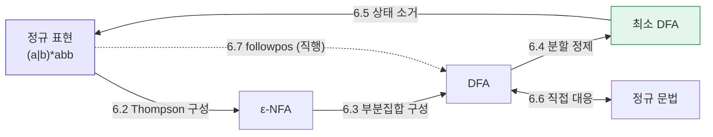

---

## 6.1 왜 변환이 필요한가

**정규 표현**은 사람이 쓰기 좋다. `[A-Za-z_][A-Za-z0-9_]*` 한 줄이면 끝난다.

**DFA**는 기계가 실행하기 좋다. 문자당 배열 접근 한 번이다.

lex가 하는 일은 정확히 그 사이를 잇는 것이다.

```bash
$ flex -v scanner.l
...
  16 NFA states
  11 DFA states (9 core, 2 empty)
```

`flex -v` 출력에 NFA 상태 수와 DFA 상태 수가 함께 나오는 이유가 여기 있다.
내부적으로 **정규 표현 → NFA → DFA → 최소화** 를 전부 거친다.

---

## 6.2 정규 표현 → NFA: Thompson 구성

**Thompson 구성(Thompson's construction)** 은 정규 표현의 구조를 따라
재귀적으로 ε-NFA를 조립한다.

핵심 불변식은 이것이다.

:::info[불변식]
모든 부분 NFA는
- **시작 상태가 정확히 하나**이고 그리로 들어오는 간선이 없다
- **종결 상태가 정확히 하나**이고 거기서 나가는 간선이 없다

따라서 어떤 두 부분 NFA도 ε-전이로 자유롭게 이어 붙일 수 있다.
:::

### 기본 구성

**$\varepsilon$**

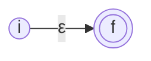

**$a$** (단일 기호)

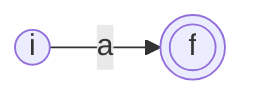

### 귀납 구성

**$r \mid s$ — 합집합**

새 시작 상태에서 두 갈래로 ε 분기하고, 두 종결 상태를 새 종결 상태로 ε 합류시킨다.

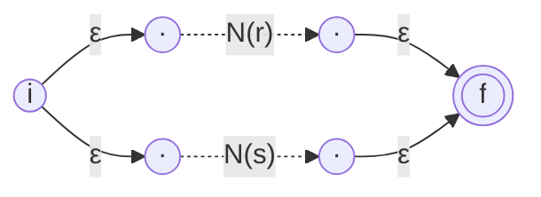

**$rs$ — 접합**

$N(r)$ 의 종결 상태와 $N(s)$ 의 시작 상태를 **하나로 합친다**.

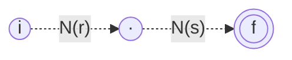

**$r^*$ — 클로저**

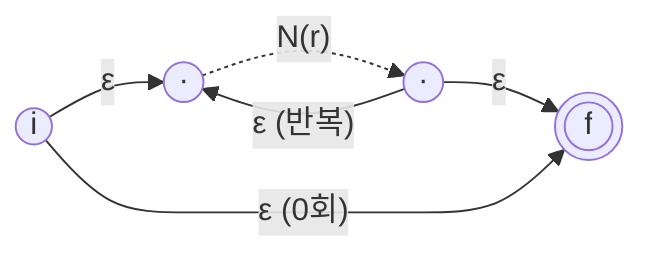

네 개의 ε-전이가 각각 다른 역할을 한다.

| 전이 | 역할 |
|---|---|
| $i \to r_1$ | 루프 진입 |
| $r_2 \to f$ | 루프 탈출 |
| $i \to f$ | **0회 반복** 허용 |
| $r_2 \to r_1$ | **반복** |

### 성질

:::info[정리]
정규 표현 $r$ 에 기호(연산자 포함)가 $n$ 개 있으면,
Thompson 구성이 만드는 NFA는
- 상태가 최대 $2n$ 개
- 상태마다 나가는 간선이 최대 2개
- 시작 상태 1개, 종결 상태 1개

즉 **크기가 정규 표현에 선형**이다.
:::

이 선형성이 중요하다. 정규 표현이 아무리 커도
NFA 생성 단계에서는 폭발하지 않는다.
폭발은 다음 단계(DFA 변환)에서 일어난다.

### 전체 예제 — `(a|b)*abb`

Thompson 구성을 `(a|b)*abb` 에 끝까지 적용하면 11-상태 ε-NFA가 나온다.
(Dragon Book의 고전적인 그림이다.)

<AutomatonDiagram
  spec={thompsonNfa}
  caption="(a|b)*abb 의 Thompson NFA. 0→7 은 (a|b)* 를 0회 통과하는 ε, 6→1 은 반복 ε."
/>

조립 순서를 따라가 보자.

| 부분식 | 상태 | 설명 |
|---|---|---|
| `a` | 2 → 3 | 기본 구성 |
| `b` | 4 → 5 | 기본 구성 |
| `a\|b` | 1 → 6 | 1에서 ε 분기, 3·5에서 ε 합류 |
| `(a\|b)*` | 0 → 7 | 0→7 (0회), 6→1 (반복) |
| `abb` | 7 → 10 | `a`, `b`, `b` 접합 |
| 전체 | 0 → 10 | `(a\|b)*` 와 `abb` 접합 (상태 7을 공유) |

직접 돌려 보자. 활성 상태 집합이 매 단계 크게 요동친다.

<AutomatonSimulator
  spec={thompsonNfa}
  title="Thompson NFA 시뮬레이터 — 활성 상태가 5~7개씩 유지된다"
  defaultInput="aabb"
  samples={['abb', 'aabb', 'babb', 'ab']}
/>

:::caution[이대로 쓰면 느리다]
시뮬레이터에서 보듯 매 단계 활성 상태가 대여섯 개다.
문자 하나당 ε-closure 계산까지 해야 하므로,
어휘 분석기로 쓰기에는 상수가 너무 크다.
그래서 **DFA로 바꾼다.**
:::

---

## 6.3 NFA → DFA: 부분집합 구성

**부분집합 구성(subset construction)** 의 아이디어는 한 줄로 요약된다.

> **NFA의 "활성 상태 집합"을 DFA의 "하나의 상태"로 삼는다.**

NFA 상태가 $n$ 개면 부분집합은 최대 $2^n$ 개이므로,
DFA 상태 수의 상한이 $2^n$ 이 된다.
다행히 실제로 도달 가능한 부분집합은 훨씬 적은 경우가 대부분이다.

### 알고리즘

두 보조 연산을 쓴다.

| 연산 | 정의 |
|---|---|
| $\varepsilon\text{-closure}(T)$ | $T$ 에서 ε-전이만 따라 도달 가능한 모든 상태 |
| $\text{move}(T, a)$ | $T$ 의 상태에서 기호 $a$ 로 갈 수 있는 상태들 |

```
subset_construction(NFA N):
    A ← ε-closure({N.start})
    Dstates ← {A},  worklist ← [A]
    while worklist 가 비어 있지 않은 동안:
        T ← worklist.pop()
        for each 기호 a in Σ:
            U ← ε-closure(move(T, a))
            if U ∉ Dstates:
                Dstates ← Dstates ∪ {U}
                worklist.push(U)
            Dtran[T, a] ← U
    시작 상태 = A
    종결 상태 = N.종결 상태를 하나라도 포함하는 모든 T
```

핵심은 $U = \varepsilon\text{-closure}(\text{move}(T, a))$ 한 줄이다.
[5장](/docs/regular/finite-automata#53-ε-전이)에서 예고한 그 공식이다.

### 손으로 돌려 보기

위 Thompson NFA에 부분집합 구성을 적용해 보자.
"다음 상태 처리" 버튼을 누르면 워크리스트에서 하나씩 꺼내 한 행을 채운다.

<SubsetConstruction
  spec={thompsonNfa}
  alphabet={['a', 'b']}
  title="부분집합 구성 — (a|b)*abb 의 Thompson NFA"
/>

첫 행부터 확인하자.

- $A = \varepsilon\text{-closure}(\{0\}) = \{0, 1, 2, 4, 7\}$
  0에서 ε로 1과 7에 가고, 1에서 다시 2와 4에 간다.
- $\text{move}(A, a) = \{3, 8\}$ — 2에서 `a`로 3, 7에서 `a`로 8.
  $\varepsilon\text{-closure}(\{3,8\}) = \{1,2,3,4,6,7,8\} = B$
- $\text{move}(A, b) = \{5\}$ —
  $\varepsilon\text{-closure}(\{5\}) = \{1,2,4,5,6,7\} = C$

11개 NFA 상태에서 시작해 **DFA 상태는 5개**로 끝났다.
$2^{11} = 2048$ 이 아니라 5개다.

:::tip[종결 상태 판정]
$E = \{1,2,4,5,6,7,10\}$ 만이 NFA의 종결 상태 10을 포함한다.
따라서 $E$ 하나만 DFA의 종결 상태다.
:::

### 결과 DFA

<AutomatonDiagram
  spec={dfaFromSubset}
  caption="부분집합 구성으로 얻은 DFA. A={0,1,2,4,7}, B={1,2,3,4,6,7,8}, C={1,2,4,5,6,7}, D={1,2,4,5,6,7,9}, E={1,2,4,5,6,7,10}"
/>

<AutomatonSimulator
  spec={dfaFromSubset}
  title="변환된 DFA — 활성 상태가 항상 하나뿐이다"
  defaultInput="aabb"
  samples={['abb', 'aabb', 'babb', 'ab', 'abba']}
/>

같은 입력 `aabb`를 Thompson NFA 시뮬레이터와 비교해 보자.
NFA는 활성 상태가 5~7개였는데 DFA는 항상 1개다.
**이것이 어휘 분석기가 얻는 성능 이득의 전부**다.

:::note[5장의 손으로 만든 DFA와 비교]
[5장](/docs/regular/finite-automata#51-결정적-유한-오토마타-dfa)에서
직관으로 그렸던 4-상태 DFA를 기억하는가?
여기서 나온 것은 5-상태다. 하나가 더 많다.

기계적 변환은 최적이 아니다. 다음 절의 **최소화**가 이 차이를 없앤다.
:::

### 상태 폭발은 언제 일어나는가

$L_n = $ "뒤에서 $n$번째 글자가 `a`" 인 언어는
NFA로 $n+1$ 상태지만 **최소 DFA도 $2^n$ 상태**다.

| $n$ | NFA 상태 | DFA 상태 |
|---|---|---|
| 3 | 4 | 8 |
| 10 | 11 | 1,024 |
| 20 | 21 | 1,048,576 |

:::caution[lex 입력에서 조심할 패턴]
- `.*XYZ` 처럼 **긴 후행 문맥**
- `.{20}$` 처럼 **끝에서 몇 번째**
- 아주 많은 대안이 접두사를 공유하지 않는 경우

`flex -v` 로 DFA 상태 수를 늘 확인하자. 수천 개가 나오면 재설계 신호다.
:::

---

## 6.4 DFA 최소화

같은 언어를 인식하는 DFA 중 **상태 수가 최소인 것은 유일하다**(동형을 무시하면).
이 사실은 Myhill–Nerode 정리에서 나온다.

### Myhill–Nerode 관계

두 스트링 $x$ 와 $y$ 가 언어 $L$ 에 대해 **구별 불가능(indistinguishable)** 하다는 것은

$$
\forall z \in \Sigma^*: \quad xz \in L \iff yz \in L
$$

즉 **어떤 꼬리를 붙여도 결과가 같다**는 뜻이다. 이를 $x \equiv_L y$ 로 쓴다.

:::info[정리 (Myhill–Nerode)]
$L$ 이 정규언어인 것과 $\equiv_L$ 의 동치류가 **유한 개**인 것은 동치이며,
이때 최소 DFA의 상태 수 = 동치류의 개수다.
:::

이 정리는 두 가지로 쓰인다.

1. **정규가 아님을 증명** — 동치류가 무한하면 정규가 아니다.
   $\{a^nb^n\}$ 에서 $a^i$ 와 $a^j$ ($i \neq j$)는 꼬리 $b^i$ 로 구별되므로
   동치류가 무한하다 → 정규가 아니다.
2. **최소화의 정당성** — "구별 불가능한 상태를 합친다"가 최적임을 보장한다.

### 분할 정제 알고리즘

```
minimize(DFA M):
    Π ← {F, Q - F}                # 종결/비종결로 초기 분할
    repeat:
        Π' ← Π
        for each 그룹 G in Π:
            G 를, "모든 기호 a 에 대해 δ(q,a) 가 속한 그룹"이
            같은 상태끼리 묶이도록 잘게 쪼갠다
        Π ← 쪼갠 결과
    until Π 가 더 이상 변하지 않음
    각 그룹을 하나의 상태로 삼는다
```

초기 분할이 `{종결, 비종결}` 인 이유는 명확하다.
종결 상태와 비종결 상태는 꼬리 $\varepsilon$ 로 이미 구별되기 때문이다.

### 예제

다음 DFA는 상태가 5개지만 최소가 아니다.

<AutomatonDiagram
  spec={redundantDfa}
  caption="최소가 아닌 DFA — p3와 p4가 구별 불가능하다."
/>

**전이표**

| 상태 | `a` | `b` |
|---|---|---|
| → p0 | p1 | p2 |
| p1 | p3 | p2 |
| p2 | p1 | p4 |
| \* p3 | p3 | p4 |
| \* p4 | p3 | p4 |

**1단계 — 초기 분할**

$$
\Pi_0 = \{\ \underbrace{\{p_3, p_4\}}_{F},\ \underbrace{\{p_0, p_1, p_2\}}_{Q-F}\ \}
$$

**2단계 — $\{p_3, p_4\}$ 를 쪼갤 수 있는가?**

| | `a` | `b` |
|---|---|---|
| p3 | p3 → $F$ 그룹 | p4 → $F$ 그룹 |
| p4 | p3 → $F$ 그룹 | p4 → $F$ 그룹 |

두 상태가 모든 기호에 대해 같은 그룹으로 간다. **쪼갤 수 없다.**

**3단계 — $\{p_0, p_1, p_2\}$ 를 쪼갤 수 있는가?**

| | `a` → 그룹 | `b` → 그룹 |
|---|---|---|
| p0 | p1 → $Q-F$ | p2 → $Q-F$ |
| p1 | p3 → **$F$** | p2 → $Q-F$ |
| p2 | p1 → $Q-F$ | p4 → **$F$** |

셋의 행이 모두 다르다. **셋으로 쪼개진다.**

$$
\Pi_1 = \{\ \{p_3, p_4\},\ \{p_0\},\ \{p_1\},\ \{p_2\}\ \}
$$

**4단계 —** 더 쪼갤 것이 없다. 최소 DFA는 **4상태**다.

$p_3$ 과 $p_4$ 를 합친 것을 $p_{34}$ 라 하면:

| 상태 | `a` | `b` |
|---|---|---|
| → p0 | p1 | p2 |
| p1 | p34 | p2 |
| p2 | p1 | p34 |
| \* p34 | p34 | p34 |

:::note[도달 불가능한 상태를 먼저 지워야 한다]
분할 정제는 "구별 불가능한 상태"만 합친다.
시작 상태에서 **도달할 수 없는** 상태는 따로 제거해야 한다.
보통 최소화 전에 도달 가능성 검사를 먼저 돌린다.
:::

### 복잡도

| 알고리즘 | 시간 |
|---|---|
| 소박한 분할 정제 | $O(n^2 \cdot \lvert \Sigma \rvert)$ |
| **Hopcroft 알고리즘** | $O(n \log n \cdot \lvert \Sigma \rvert)$ |
| Brzozowski (역·결정화 2회) | 최악 지수, 실무에선 종종 빠름 |

Hopcroft 알고리즘은 "항상 **작은 쪽** 그룹으로 쪼갠다"는
영리한 선택으로 로그 인자를 얻는다.

:::tip[flex는 최소화를 한다]
`flex -v` 출력의 마지막 DFA 상태 수는 **최소화 후** 값이다.
`flex --trace` 로 중간 과정을 볼 수 있다.
:::

---

## 6.5 DFA → 정규 표현: 상태 소거법

반대 방향도 가능하다. 이 변환이 존재한다는 사실이
"DFA로 표현되는 언어 = 정규 표현으로 표현되는 언어"를 완성한다.

### 아이디어

간선의 라벨에 **정규 표현**을 허용한 오토마타(GNFA)를 생각하고,
상태를 하나씩 지워 나가며 그 상태를 거치던 경로를
간선 라벨의 정규 표현으로 흡수시킨다.

상태 $q$ 를 지울 때, $p \to q \to r$ 경로는 이렇게 흡수된다.

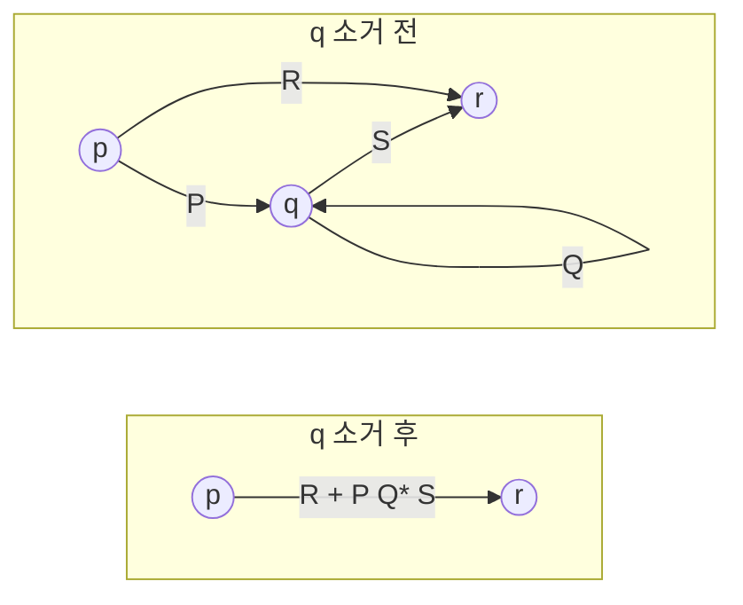

새 라벨은 $R \mid P Q^* S$ 다.

| 조각 | 의미 |
|---|---|
| $R$ | 원래 있던 직행 경로 |
| $P$ | $p$ 에서 $q$ 로 |
| $Q^*$ | $q$ 에서 자기 자신으로 도는 고리를 0회 이상 |
| $S$ | $q$ 에서 $r$ 로 |

### 절차

1. 새 시작 상태 $s$ 를 만들고 원래 시작 상태로 ε 간선을 놓는다.
2. 새 종결 상태 $f$ 를 만들고 모든 원래 종결 상태에서 ε 간선을 놓는다.
3. $s$, $f$ 를 제외한 상태를 **하나씩** 위 규칙으로 소거한다.
4. 남은 $s \to f$ 간선의 라벨이 답이다.

:::caution[소거 순서에 따라 결과가 달라진다]
얻어지는 정규 표현은 **유일하지 않다**.
같은 언어를 나타내지만 길이가 크게 다를 수 있다.
보통 "나가는 간선 × 들어오는 간선"이 적은 상태부터 지우면 짧아진다.

또한 결과 정규 표현의 크기는 최악의 경우 상태 수에 **지수적**이다.
:::

### 짧은 예제

`a`가 짝수 개인 언어의 2-상태 DFA(E 시작·종결, O):

- E: `a`→O, `b`→E
- O: `a`→E, `b`→O

O를 소거한다. $E \to O$ 라벨 `a`, $O \to O$ 라벨 `b`, $O \to E$ 라벨 `a`,
그리고 $E \to E$ 직행 라벨 `b`.

$$
E \to E \;:\; b \;\mid\; a\,b^*\,a
$$

E가 시작이자 종결이므로 전체는 이 고리를 0회 이상 돈 것이다.

$$
(\,b \mid a b^* a\,)^*
$$

---

## 6.6 정규 문법 ↔ 유한 오토마타

[3장](/docs/regular/regular-languages#32-정규-문법)에서 본 대응을 정리한다.

### 우선형 문법 → NFA

| 생성 규칙 | 오토마타 |
|---|---|
| $A \to aB$ | $\delta(A, a) \ni B$ |
| $A \to a$ | $\delta(A, a) \ni F$ (새 종결 상태) |
| $A \to \varepsilon$ | $A$ 를 종결 상태로 |
| 시작 심볼 $S$ | 시작 상태 |

**예제.**

$$
\begin{aligned}
S &\to aA \mid bS \\
A &\to aA \mid bB \\
B &\to aA \mid bC \\
C &\to aA \mid bS \mid \varepsilon
\end{aligned}
$$

이것은 정확히 [5장의 `(a|b)*abb` DFA](/docs/regular/finite-automata)다.
$S, A, B, C$ 가 $q_0, q_1, q_2, q_3$ 에 대응한다.

### NFA → 우선형 문법

역방향도 기계적이다.

| 오토마타 | 생성 규칙 |
|---|---|
| $\delta(q, a) \ni p$ | $Q \to aP$ |
| $q \in F$ | $Q \to \varepsilon$ |

:::note[이 대응이 주는 관점]
정규 문법과 유한 오토마타는 **같은 대상의 두 표기법**이다.
문법 쪽은 "어떻게 생성되는가"를, 오토마타 쪽은 "어떻게 인식하는가"를
강조할 뿐이다.

4부에서 문맥 자유 문법을 다룰 때도 같은 이중성이 나타난다.
CFG(생성) ↔ 푸시다운 오토마타(인식).
:::

---

## 6.7 정규 표현 → DFA 직행: followpos

Thompson NFA를 거치지 않고 정규 표현에서 **곧바로 DFA**를 만드는 방법이 있다.
Dragon Book 3.9절의 알고리즘으로, 실제 lex 구현이 쓰는 방식이기도 하다.

### 준비 — 확장 정규 표현과 구문 트리

정규 표현 끝에 종료 표시 `#` 를 붙이고 구문 트리를 만든다.
`(a|b)*abb` → `(a|b)*abb#`

각 잎(위치)에 번호를 매긴다.

| 위치 | 기호 |
|---|---|
| 1 | a |
| 2 | b |
| 3 | a |
| 4 | b |
| 5 | b |
| 6 | # |

### 네 가지 함수

| 함수 | 의미 |
|---|---|
| $\text{nullable}(n)$ | 노드 $n$ 의 부분식이 $\varepsilon$ 을 생성할 수 있는가 |
| $\text{firstpos}(n)$ | $n$ 의 부분식이 만드는 스트링의 **첫 기호**가 될 수 있는 위치들 |
| $\text{lastpos}(n)$ | 마지막 기호가 될 수 있는 위치들 |
| $\text{followpos}(i)$ | 위치 $i$ 바로 **다음에** 올 수 있는 위치들 |

앞의 셋은 트리를 **상향식**으로 한 번 훑어 계산한다.

| 노드 | nullable | firstpos | lastpos |
|---|---|---|---|
| 잎 $\varepsilon$ | true | $\emptyset$ | $\emptyset$ |
| 잎 위치 $i$ | false | $\{i\}$ | $\{i\}$ |
| $c_1 \mid c_2$ | $n_1 \lor n_2$ | $f_1 \cup f_2$ | $l_1 \cup l_2$ |
| $c_1 c_2$ | $n_1 \land n_2$ | $n_1$ 이면 $f_1 \cup f_2$, 아니면 $f_1$ | $n_2$ 이면 $l_1 \cup l_2$, 아니면 $l_2$ |
| $c^*$ | true | $f_c$ | $l_c$ |

$\text{followpos}$ 는 두 규칙으로 채운다.

1. $n$ 이 접합 $c_1c_2$ 이면, 모든 $i \in \text{lastpos}(c_1)$ 에 대해
   $\text{followpos}(i) \mathrel{{\cup}{=}} \text{firstpos}(c_2)$
2. $n$ 이 $c^*$ 이면, 모든 $i \in \text{lastpos}(n)$ 에 대해
   $\text{followpos}(i) \mathrel{{\cup}{=}} \text{firstpos}(n)$

### 구문 트리 그리기

`(a|b)*abb#` 의 구문 트리다.
접합은 왼쪽으로 접었고, 각 노드에 이름을 붙여 두었다.

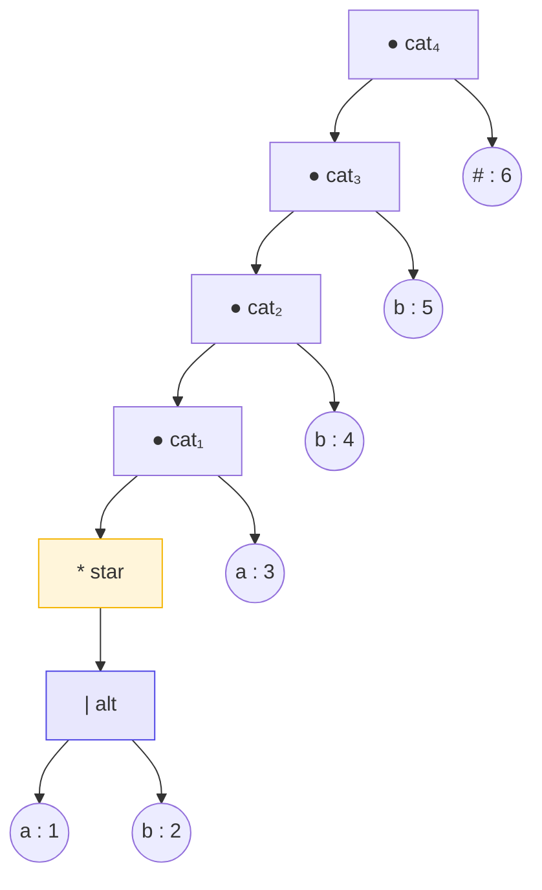

읽는 법: `(a|b)*abb#` 는 `((((a|b)* · a) · b) · b) · #` 이므로
접합 노드가 넷(`cat₁`~`cat₄`) 생긴다.

### nullable / firstpos / lastpos 계산

트리를 **아래에서 위로** 훑으며 채운다.

| 노드 | 부분식 | nullable | firstpos | lastpos | 근거 |
|---|---|---|---|---|---|
| 위치 1 | `a` | false | \{1\} | \{1\} | 잎 |
| 위치 2 | `b` | false | \{2\} | \{2\} | 잎 |
| `alt` | `a\|b` | false ∨ false = **false** | \{1\}∪\{2\} = **\{1,2\}** | **\{1,2\}** | 합집합 규칙 |
| `star` | `(a\|b)*` | **true** | \{1,2\} | \{1,2\} | `*` 는 항상 nullable |
| 위치 3 | `a` | false | \{3\} | \{3\} | 잎 |
| `cat₁` | `(a\|b)*a` | true ∧ false = **false** | ? | ? | 아래 참조 |
| 위치 4 | `b` | false | \{4\} | \{4\} | 잎 |
| `cat₂` | `(a\|b)*ab` | **false** | ? | ? | |
| 위치 5 | `b` | false | \{5\} | \{5\} | 잎 |
| `cat₃` | `(a\|b)*abb` | **false** | ? | ? | |
| 위치 6 | `#` | false | \{6\} | \{6\} | 잎 |
| `cat₄` | 전체 | **false** | ? | ? | |

접합 노드의 firstpos/lastpos는 **자식의 nullable 여부에 달렸다**.

**`cat₁` = `star` · `위치 3`**

- $\text{firstpos}$: 왼쪽 자식 `star` 가 **nullable 이므로**
  왼쪽만으로는 부족하다. 오른쪽도 더한다.
  $$\{1,2\} \cup \{3\} = \{1,2,3\}$$
- $\text{lastpos}$: 오른쪽 자식 `위치 3` 이 **nullable 이 아니므로**
  오른쪽만.
  $$\{3\}$$

**`cat₂` = `cat₁` · `위치 4`**

- $\text{firstpos}$: `cat₁` 이 nullable 이 아니므로 왼쪽만 → $\{1,2,3\}$
- $\text{lastpos}$: 오른쪽만 → $\{4\}$

같은 식으로 `cat₃`, `cat₄` 도 채운다.

| 노드 | nullable | firstpos | lastpos |
|---|---|---|---|
| `cat₁` = `star`·3 | false | **\{1,2,3\}** | \{3\} |
| `cat₂` = `cat₁`·4 | false | \{1,2,3\} | \{4\} |
| `cat₃` = `cat₂`·5 | false | \{1,2,3\} | \{5\} |
| `cat₄` = `cat₃`·6 | false | **\{1,2,3\}** ← 루트 | \{6\} |

:::tip[루트의 firstpos 가 DFA 시작 상태다]
$\text{firstpos}(\text{root}) = \{1,2,3\}$ 이다.

"이 정규 표현이 만드는 스트링의 **첫 글자**가 될 수 있는 위치는 1, 2, 3"
이라는 뜻이고, 그것이 곧 DFA의 시작 상태다.
:::

### followpos 채우기

이제 트리를 다시 훑으며 두 규칙을 적용한다.

**규칙 1 (접합 $c_1 c_2$)** — $\text{lastpos}(c_1)$ 의 각 위치에
$\text{firstpos}(c_2)$ 를 더한다.

| 접합 노드 | $\text{lastpos}(c_1)$ | $\text{firstpos}(c_2)$ | 결과 |
|---|---|---|---|
| `cat₁` = `star`·3 | \{1,2\} | \{3\} | $fp(1) \mathrel{{\cup}{=}} \{3\}$, $fp(2) \mathrel{{\cup}{=}} \{3\}$ |
| `cat₂` = `cat₁`·4 | \{3\} | \{4\} | $fp(3) \mathrel{{\cup}{=}} \{4\}$ |
| `cat₃` = `cat₂`·5 | \{4\} | \{5\} | $fp(4) \mathrel{{\cup}{=}} \{5\}$ |
| `cat₄` = `cat₃`·6 | \{5\} | \{6\} | $fp(5) \mathrel{{\cup}{=}} \{6\}$ |

**규칙 2 (`*` 노드)** — $\text{lastpos}(n)$ 의 각 위치에
$\text{firstpos}(n)$ 를 더한다.

`star` 노드는 $\text{lastpos} = \{1,2\}$, $\text{firstpos} = \{1,2\}$ 이므로

$$
fp(1) \mathrel{{\cup}{=}} \{1,2\}, \qquad fp(2) \mathrel{{\cup}{=}} \{1,2\}
$$

**둘을 합치면**

| 위치 $i$ | 기호 | 규칙 1에서 | 규칙 2에서 | $\text{followpos}(i)$ |
|---|---|---|---|---|
| 1 | a | \{3\} | \{1,2\} | **\{1, 2, 3\}** |
| 2 | b | \{3\} | \{1,2\} | **\{1, 2, 3\}** |
| 3 | a | \{4\} | — | **\{4\}** |
| 4 | b | \{5\} | — | **\{5\}** |
| 5 | b | \{6\} | — | **\{6\}** |
| 6 | # | — | — | $\emptyset$ |

**읽어 보자.**

- 위치 1, 2는 `(a|b)*` 안에 있다. `*` 규칙 때문에 **자기 자신들(1,2)이 다시 올 수 있고**,
  접합 규칙 때문에 **루프를 빠져나가면 3이 온다**
- 위치 3, 4, 5는 `abb` 를 순서대로 이루므로 각각 다음 하나만 온다
- 위치 6은 `#` — 끝이므로 뒤에 올 것이 없다

### DFA 구성

$$
\text{시작 상태} = \text{firstpos}(\text{root}) = \{1, 2, 3\}
$$

상태 $S$ 에서 기호 $a$ 로 가는 곳은

$$
\delta(S, a) = \bigcup_{\substack{i \in S \\ \text{위치 } i \text{의 기호가 } a}} \text{followpos}(i)
$$

계산해 보자.

| 상태 | 집합 | `a` | `b` |
|---|---|---|---|
| A (시작) | \{1,2,3\} | $fp(1) \cup fp(3)$ = \{1,2,3,4\} = B | $fp(2)$ = \{1,2,3\} = A |
| B | \{1,2,3,4\} | \{1,2,3,4\} = B | $fp(2) \cup fp(4)$ = \{1,2,3,5\} = C |
| C | \{1,2,3,5\} | \{1,2,3,4\} = B | $fp(2) \cup fp(5)$ = \{1,2,3,6\} = D |
| \* D | \{1,2,3,6\} | \{1,2,3,4\} = B | \{1,2,3\} = A |

**상태 4개.** 위치 6(`#`)을 포함하는 D가 종결 상태다.

:::tip[부분집합 구성보다 나은 점]
[6.3절](#63-nfa--dfa-부분집합-구성)의 부분집합 구성은 5상태를 만들었고
최소화를 한 번 더 돌려야 4상태가 되었다.
followpos 방식은 **처음부터 4상태**를 만든다.

ε-NFA를 아예 만들지 않으므로 ε-closure 계산도 없다.
실제 lex 구현이 이 방식을 선호하는 이유다.
(그래도 최소 DFA가 보장되는 것은 아니라서 최소화는 여전히 돌린다.)
:::

---

## 요약

| 변환 | 알고리즘 | 비용 |
|---|---|---|
| 정규 표현 → ε-NFA | Thompson 구성 | 상태 수가 식 크기에 **선형** |
| ε-NFA → DFA | 부분집합 구성 | 최악 $2^n$ 상태 |
| DFA → 최소 DFA | 분할 정제 / Hopcroft | $O(n \log n \cdot \lvert \Sigma \rvert)$ |
| DFA → 정규 표현 | 상태 소거 | 결과 크기 최악 지수 |
| 정규 문법 ↔ NFA | 규칙별 1:1 대응 | 선형 |
| 정규 표현 → DFA (직행) | followpos | ε-NFA를 건너뛴다 |

- 부분집합 구성의 핵심 한 줄:
  $U = \varepsilon\text{-closure}(\text{move}(T, a))$
- Myhill–Nerode 정리: **최소 DFA는 유일**하고,
  그 상태 수는 $\equiv_L$ 의 동치류 개수다.
- lex 내부: 정규 표현 → (followpos 또는 Thompson+부분집합) → 최소화 → 압축된 표.
  `flex -v` 로 각 단계의 상태 수를 확인할 수 있다.

## 확인 문제

1. `(a|b)*` 에 Thompson 구성을 적용하고 상태 수를 세어라.
   식의 기호 수와 비교해 $2n$ 상한이 맞는지 확인하라.

<details>
<summary>풀이</summary>

**조립 과정**

| 단계 | 만드는 것 | 추가 상태 | 누적 |
|---|---|---|---|
| 1 | $N(a)$ — 기본 구성 | 2 (상태 2→3) | 2 |
| 2 | $N(b)$ — 기본 구성 | 2 (상태 4→5) | 4 |
| 3 | $N(a \mid b)$ — 새 시작·종결 추가 | 2 (상태 1, 6) | 6 |
| 4 | $N((a \mid b)^*)$ — 새 시작·종결 추가 | 2 (상태 0, 7) | **8** |

**상태 8개.**

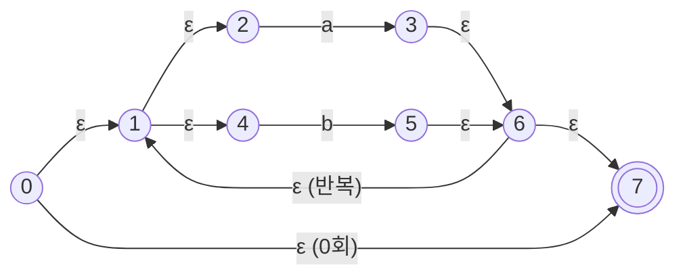

**기호 수와 비교**

`(a|b)*` 의 기호(피연산자 + 연산자)는

$$a,\quad b,\quad |,\quad * \qquad \Rightarrow n = 4$$

(괄호는 그룹을 표시할 뿐 연산자가 아니므로 세지 않는다.)

$$2n = 8$$ ✅ 상한과 정확히 일치

**왜 딱 맞는가.** Thompson 구성은
- 피연산자(기호) 하나마다 상태 2개
- 연산자 하나마다 상태 2개 (접합은 0개 — 상태를 합치므로)

를 더한다. 여기서는 접합이 없어 $2 \times 4 = 8$ 이 정확히 나왔다.
접합이 있으면 그만큼 줄어들어 $2n$ **이하**가 된다.

</details>

2. 다음 NFA에 부분집합 구성을 적용하라. ($\Sigma = \{0,1\}$, 시작 $q_0$, 종결 $q_2$)
   - $\delta(q_0, 0) = \{q_0, q_1\}$, $\delta(q_0, 1) = \{q_0\}$
   - $\delta(q_1, 1) = \{q_2\}$

<details>
<summary>풀이</summary>

ε 전이가 없으므로 ε-closure는 자기 자신이다.

**계산**

$$A = \{q_0\} \quad \text{(시작)}$$

| 상태 | 부분집합 | `0` | `1` |
|---|---|---|---|
| **A** ←시작 | `{q0}` | $\{q_0,q_1\}$ = **B** | $\{q_0\}$ = **A** |
| **B** | `{q0, q1}` | $\{q_0,q_1\}$ = B | $\{q_0\} \cup \{q_2\}$ = `{q0,q2}` = **C** |
| **C** ✓ | `{q0, q2}` | $\{q_0,q_1\}$ = B | $\{q_0\}$ = A |

**종결 상태:** $q_2$ 를 포함하는 **C** 하나.

**결과 DFA**

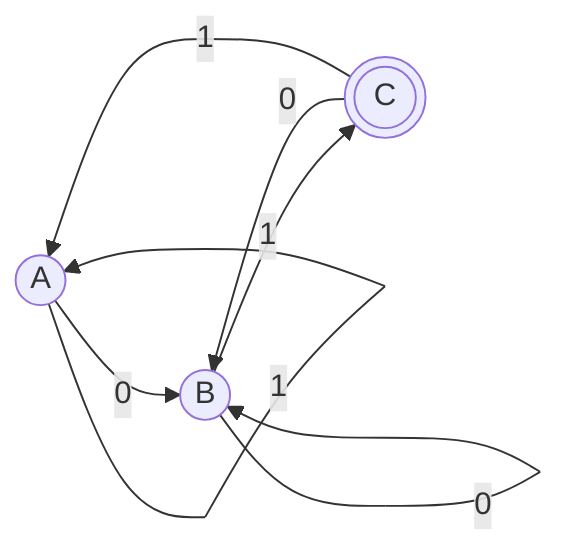

**이 DFA가 인식하는 언어:** `01` 로 **끝나는** 스트링.

확인: `01` → A →0→ B →1→ C ✅ / `010` → … → C →0→ B ❌ / `1101` → A,A,B,C ✅

[5장 확인 문제 1(a)](/docs/regular/finite-automata#확인-문제)에서
손으로 그린 DFA와 같은 것이 나왔다.

**NFA 3상태 → DFA 3상태.** 이번엔 폭발이 없었다.
도달 가능한 부분집합이 $2^3 = 8$ 중 3개뿐이었기 때문이다.

</details>

3. `(a|b)*abb` 의 부분집합 구성 결과(5상태)를 최소화하면
   4상태가 되는가? 어느 두 상태가 합쳐지는가?

<details>
<summary>풀이</summary>

**된다. A와 C가 합쳐진다.**

전이표를 다시 보자.

| 상태 | `a` | `b` |
|---|---|---|
| A | B | C |
| B | B | D |
| C | B | C |
| D | B | E |
| E ✓ | B | C |

**1단계 — 초기 분할** (종결 / 비종결)

$$\Pi_0 = \{\ \{E\},\ \{A,B,C,D\}\ \}$$

**2단계 — `{A,B,C,D}` 를 쪼갠다**

각 상태가 어느 **그룹**으로 가는지 본다. ($F = \{E\}$, $N = \{A,B,C,D\}$)

| | `a` → 그룹 | `b` → 그룹 |
|---|---|---|
| A | B → $N$ | C → $N$ |
| B | B → $N$ | D → $N$ |
| C | B → $N$ | C → $N$ |
| **D** | B → $N$ | E → **$F$** ← 혼자 다르다 |

D가 갈라진다.

$$\Pi_1 = \{\ \{E\},\ \{D\},\ \{A,B,C\}\ \}$$

**3단계 — `{A,B,C}` 를 쪼갠다**

| | `a` → 그룹 | `b` → 그룹 |
|---|---|---|
| A | B → $\{A,B,C\}$ | C → $\{A,B,C\}$ |
| **B** | B → $\{A,B,C\}$ | D → **$\{D\}$** ← 혼자 다르다 |
| C | B → $\{A,B,C\}$ | C → $\{A,B,C\}$ |

B가 갈라진다.

$$\Pi_2 = \{\ \{E\},\ \{D\},\ \{B\},\ \{A,C\}\ \}$$

**4단계 — `{A,C}` 를 쪼갤 수 있는가?**

| | `a` | `b` |
|---|---|---|
| A | B → $\{B\}$ | C → $\{A,C\}$ |
| C | B → $\{B\}$ | C → $\{A,C\}$ |

**행이 같다. 쪼갤 수 없다.**

**결과: 4상태** — $\{A,C\}$, $\{B\}$, $\{D\}$, $\{E\}$

**왜 A와 C가 같은가.** 둘 다 "지금까지 `abb` 를 향해 아무것도 못 맞췄다"는
상태다. A는 시작, C는 `b` 를 봐서 진행이 리셋된 상태인데,
**앞으로의 판정에는 차이가 없다.**

[5장에서 직관으로 그린 4상태 DFA](/docs/regular/finite-automata#51-결정적-유한-오토마타-dfa)와
정확히 같은 결과다.
기계적 변환(5상태)과 사람의 직관(4상태) 사이의 차이를 최소화가 메운다.

</details>

4. `(a|b)*a#` 에 대해 followpos 표를 만들고 DFA를 구성하라.

<details>
<summary>풀이</summary>

**위치 번호**

| 위치 | 기호 |
|---|---|
| 1 | a (`(a\|b)` 안) |
| 2 | b |
| 3 | a (뒤쪽) |
| 4 | # |

**구문 트리:** `cat₂( cat₁( star(alt(1,2)), 3 ), 4 )`

**nullable / firstpos / lastpos**

| 노드 | nullable | firstpos | lastpos |
|---|---|---|---|
| alt(1,2) | false | `{1,2}` | `{1,2}` |
| star | **true** | `{1,2}` | `{1,2}` |
| 위치 3 | false | `{3}` | `{3}` |
| cat₁ = star·3 | false | `{1,2,3}` ← star가 nullable이라 합침 | `{3}` |
| 위치 4 | false | `{4}` | `{4}` |
| cat₂ = cat₁·4 (루트) | false | **`{1,2,3}`** | `{4}` |

**followpos**

| 규칙 | 적용 | 결과 |
|---|---|---|
| cat₁ (접합) | lastpos(star)=`{1,2}` 에 firstpos(3)=`{3}` 추가 | $fp(1) \ni 3$, $fp(2) \ni 3$ |
| cat₂ (접합) | lastpos(cat₁)=`{3}` 에 firstpos(4)=`{4}` 추가 | $fp(3) = \{4\}$ |
| star (`*`) | lastpos(star)=`{1,2}` 에 firstpos(star)=`{1,2}` 추가 | $fp(1) \ni 1,2$, $fp(2) \ni 1,2$ |

| 위치 | 기호 | followpos |
|---|---|---|
| 1 | a | `{1, 2, 3}` |
| 2 | b | `{1, 2, 3}` |
| 3 | a | `{4}` |
| 4 | # | $\emptyset$ |

**DFA 구성**

시작 상태 = firstpos(루트) = `{1,2,3}` = **A**

| 상태 | 집합 | `a` (위치 1, 3) | `b` (위치 2) |
|---|---|---|---|
| **A** ←시작 | `{1,2,3}` | $fp(1)\cup fp(3) = \{1,2,3\}\cup\{4\}$ = `{1,2,3,4}` = **B** | $fp(2)$ = `{1,2,3}` = A |
| **B** ✓ | `{1,2,3,4}` | $fp(1)\cup fp(3)$ = `{1,2,3,4}` = B | $fp(2)$ = `{1,2,3}` = A |

**2상태 DFA.** 위치 4(`#`)를 포함하는 B가 종결 상태다.

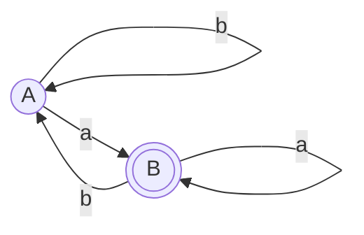

인식하는 언어: **`a` 로 끝나는 스트링**. `(a|b)*a` 가 맞다. ✅

</details>

5. Myhill–Nerode 정리로 $L = \{ww^R \mid w \in \{a,b\}^*\}$ 가
   정규가 아님을 증명하라.

<details>
<summary>풀이</summary>

$L$ 은 **길이가 짝수인 회문**의 집합이다.

**증명.** 무한히 많은 스트링이 서로 **구별 가능**함을 보이면 된다
(동치류가 무한하므로 정규가 아니다).

무한 집합 $S = \{\,a^i \mid i \geq 1\,\}$ 을 택한다.

$i \neq j$ 인 두 원소 $a^i,\ a^j$ 를 고르고, 꼬리로

$$z = b\,b\,a^i$$

를 붙여 보자.

**$a^i$ 에 붙이면:**
$$a^i \cdot b b a^i = (a^i b)(b a^i) = w w^R \quad \text{여기서 } w = a^i b$$
$w^R = (a^ib)^R = b\,a^i$ 이므로 정확히 $ww^R$ 이다. **$\in L$** ✅

**$a^j$ 에 붙이면:**
$$a^j \cdot b b a^i = a^j b b a^i$$
이것이 $L$ 에 있으려면 회문이어야 한다.
그런데 앞에서 읽으면 `a` 가 $j$ 개, 뒤에서 읽으면 `a` 가 $i$ 개다.
$i \neq j$ 이므로 **회문이 아니다**. **$\notin L$** ❌

따라서 $a^i$ 와 $a^j$ 는 $\equiv_L$ 에 대해 **구별 가능**하다.

$S$ 가 무한집합이고 그 원소들이 서로 모두 구별 가능하므로,
$\equiv_L$ 의 동치류가 **무한히 많다**.
Myhill–Nerode 정리에 의해 $L$ 은 정규가 아니다. $\blacksquare$

:::tip[Myhill–Nerode 방식과 펌핑 보조정리의 차이]
| | 펌핑 보조정리 | Myhill–Nerode |
|---|---|---|
| 방식 | 스트링 하나를 골라 펌프해 모순 | 서로 구별되는 무한 집합 제시 |
| 강도 | **필요조건만** — 만족해도 정규가 아닐 수 있다 | **필요충분** |
| 난이도 | 쪼개기 조건을 따져야 함 | 구별 꼬리를 찾으면 끝 |

Myhill–Nerode 쪽이 더 강력하고, 익숙해지면 더 쉽다.
"이 둘을 구별하는 꼬리가 있는가?"만 물으면 되기 때문이다.
:::

</details>

6. 상태 소거법으로 다음 DFA의 정규 표현을 구하라.
   상태 $\{q_0, q_1\}$, 시작·종결 $q_0$, $\delta(q_0,0)=q_1$,
   $\delta(q_1,1)=q_0$, $\delta(q_0,1)=q_0$, $\delta(q_1,0)=q_1$.

<details>
<summary>풀이</summary>

**전이 정리**

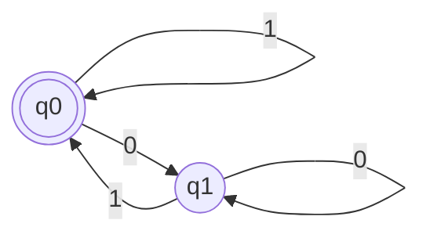

**$q_1$ 을 소거한다.**

$q_1$ 을 거쳐 $q_0$ 에서 $q_0$ 으로 돌아오는 경로를 찾는다.

| 조각 | 정규 표현 | 설명 |
|---|---|---|
| $P$ : $q_0 \to q_1$ | `0` | 들어가는 길 |
| $Q$ : $q_1 \to q_1$ | `0` | 자기 고리 |
| $S$ : $q_1 \to q_0$ | `1` | 나오는 길 |
| $R$ : $q_0 \to q_0$ 직행 | `1` | 원래 있던 길 |

소거 공식 $R \mid P\,Q^*\,S$ 를 적용하면

$$q_0 \to q_0 \ : \ \texttt{1} \mid \texttt{0}\,\texttt{0}^*\,\texttt{1}$$

**$q_0$ 이 시작이자 종결**이므로, 이 고리를 0회 이상 돈 것이 전체 언어다.

$$
\boxed{(\ \texttt{1} \mid \texttt{0}\texttt{0}^*\texttt{1}\ )^*}
$$

**검산**

| 입력 | 경로 | 판정 |
|---|---|---|
| $\varepsilon$ | $q_0$ | ✅ (`*` 가 0회) |
| `1` | $q_0 \to q_0$ | ✅ |
| `001` | $q_0 \to q_1 \to q_1 \to q_0$ | ✅ `00*1` 형태 |
| `0` | $q_0 \to q_1$ (비종결) | ❌ 정규 표현으로도 못 만든다 |
| `01` | $q_0 \to q_1 \to q_0$ | ✅ `00*1` 에서 `0*` 가 0회 |

**의미:** `1` 로 끝나거나 비어 있는, 즉 **`0` 으로 끝나지 않는** 스트링.
$(1 \mid 00^*1)^*$ 를 간단히 하면 $(0 \mid 1)^*1 \mid \varepsilon$ 로도 쓸 수 있다.

:::note[소거 순서에 따라 답이 달라진다]
$q_1$ 대신 다른 순서로 지우거나 다른 표기를 쓰면
겉모습이 다른 정규 표현이 나올 수 있다.
**같은 언어를 나타내면 모두 정답이다.**

[6.5절](#65-dfa--정규-표현-상태-소거법)에서 말한 대로
결과가 유일하지 않다.
:::

</details>

---

2부가 끝났다. 지금까지 세운 이론 —
정규 표현을 쓰면 DFA가 나온다 — 을 **자동으로 해 주는 도구**가
다음 3부의 주제, **LEX**다.
