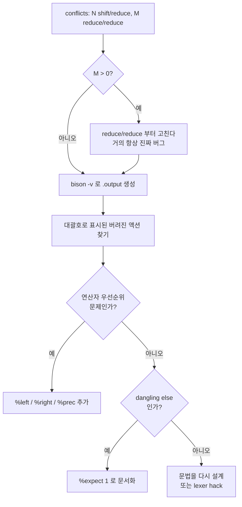
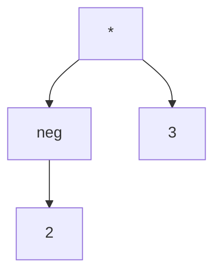
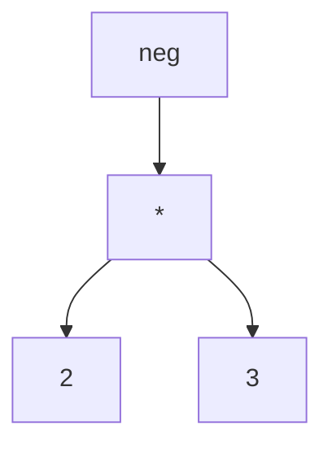

# 20. 충돌과 우선순위

```
calc.y: conflicts: 3 shift/reduce, 1 reduce/reduce
```

yacc를 쓰다 보면 반드시 만나는 메시지다.
이 장은 이 한 줄을 읽고 대응하는 법이다.

**핵심 원칙 하나만 먼저 말해 두자.**

:::danger[충돌을 무시하지 말 것]
bison은 충돌이 있어도 **파서를 만들어 준다**. 기본 규칙으로 해소하고 계속 진행한다.
그래서 "일단 돌아가니까" 하고 넘어가기 쉽다.

그러나 그 기본 규칙이 **당신이 원한 해석이라는 보장은 없다**.
충돌은 "문법이 애매하다"는 신호이고, 대부분 진짜 버그다.
:::

---

## 20.1 충돌이란

[15장에서 정의한](/docs/parsing/lr-parsing#156-충돌) 대로,
ACTION 표의 **한 칸에 액션이 둘 이상** 들어가는 것이다.

| 충돌 | 뜻 | 기본 해결 | 심각도 |
|---|---|---|---|
| **shift/reduce** | 이동할 수도, 축약할 수도 | **이동**을 택한다 | 대개 괜찮다 |
| **reduce/reduce** | 서로 다른 규칙으로 축약 가능 | **먼저 쓴 규칙**을 택한다 | 거의 항상 버그 |

---

## 20.2 충돌 읽기

### 1단계 — `.output` 을 뽑는다

```bash
bison -v -d -o mini.tab.c mini.y
```

`mini.output` 의 맨 위에 충돌 상태가 요약된다.

```
State 71 conflicts: 1 shift/reduce
```

### 2단계 — 그 상태를 찾아간다

```
state 71

   14 stmt: KW_IF '(' expr ')' stmt . opt_else

    KW_ELSE  shift, and go to state 73

    KW_ELSE   [reduce using rule 19 (opt_else)]
    $default  reduce using rule 19 (opt_else)

    opt_else  go to state 74
```

읽는 법:

| 줄 | 의미 |
|---|---|
| `14 stmt: KW_IF '(' expr ')' stmt . opt_else` | 이 상태의 LR(0) 항목. 점 위치까지 그대로 |
| `KW_ELSE shift, and go to state 73` | 채택된 액션 — `else` 를 보면 이동 |
| `KW_ELSE [reduce using rule 19]` | **대괄호 = 버려진 액션** |
| `opt_else go to state 74` | GOTO 표 |

:::tip[대괄호가 충돌의 표시다]
`.output` 에서 대괄호로 감싸인 액션이 **충돌로 인해 버려진 쪽**이다.
충돌을 찾을 때 `grep '\[' mini.output` 하면 빠르다.
:::

이 예가 바로 **dangling else** 다.
`if (a) if (b) S . else T` 에서

- `opt_else → ε` 로 축약하면 → `else` 가 **바깥** if에 붙는다
- `KW_ELSE` 를 이동하면 → `else` 가 **안쪽** if에 붙는다

bison은 이동을 택하므로 안쪽 if에 붙는다. **우리가 원하는 결과다.**

### 3단계 — bison 3.8+ 라면 반례를 뽑는다

```bash
bison -Wcounterexamples -v -d -o mini.tab.c mini.y
```

```
mini.y: warning: shift/reduce conflict on token KW_ELSE [-Wcounterexamples]
  Example: KW_IF '(' expr ')' KW_IF '(' expr ')' stmt . KW_ELSE stmt
  Shift derivation ...
  Reduce derivation ...
```

**실제로 충돌하는 입력 예시를 만들어서 보여 준다.**
`.output` 을 읽는 것보다 훨씬 빠르다.

:::caution[macOS 기본 bison은 2.3이라 이 옵션이 없다]
Homebrew로 bison 3.8+ 을 설치하면 쓸 수 있다.
[실습 환경 구성](/docs/labs/setup#macos) 참고.
:::

---

## 20.3 우선순위와 결합성 선언

shift/reduce 충돌의 대부분은 **연산자 우선순위** 때문이고,
선언 몇 줄로 해소된다.

```c title="examples/07-yacc-calc/calc.y"
%right '='
%left  '+' '-'
%left  '*' '/' '%'
%right UMINUS
%right '^'
```

:::info[규칙]
- **아래로 갈수록 우선순위가 높다**
- 같은 줄의 연산자는 **우선순위가 같다**
- `%left` = 좌결합, `%right` = 우결합, `%nonassoc` = 결합 불가
:::

### 어떻게 충돌을 푸는가

bison은 충돌 시 두 가지를 비교한다.

1. **규칙의 우선순위** — 그 규칙 우변의 **마지막 터미널**의 우선순위
2. **lookahead 토큰의 우선순위**

| 비교 결과 | 선택 |
|---|---|
| 토큰이 더 높다 | **shift** |
| 규칙이 더 높다 | **reduce** |
| 같고 `%left` | **reduce** (좌결합) |
| 같고 `%right` | **shift** (우결합) |
| 같고 `%nonassoc` | **오류** |

**예제로 확인하자.** 스택이 `expr '+' expr` 이고 lookahead가 `*` 일 때:

- 규칙 `expr : expr '+' expr` 의 우선순위 = `'+'` 의 우선순위
- 토큰 `'*'` 의 우선순위가 더 높다 → **shift**
- 결과: `a + (b * c)` ✅

스택이 `expr '+' expr` 이고 lookahead가 `+` 일 때:

- 우선순위가 같고 `%left '+'` → **reduce**
- 결과: `(a + b) + c` ✅ 좌결합

### `%nonassoc` 의 쓰임

```c
%nonassoc '<' '>' OP_LE OP_GE
```

`a < b < c` 를 **구문 오류**로 만든다.
`(a < b) < c` 가 되어 `0 < c` 나 `1 < c` 를 계산하는 것은
거의 언제나 프로그래머의 실수이기 때문이다.

Python은 이를 다르게 해결했다 — `a < b < c` 를 연쇄 비교로 재정의했다.
언어 설계의 선택지다.

### `%prec` — 규칙의 우선순위를 직접 지정

```c
%right UMINUS
...
| '-' expr %prec UMINUS   { $$ = -$2; }
```

`'-' expr` 규칙의 마지막 터미널은 `'-'` 이므로,
`%prec` 이 없으면 **이항 뺄셈과 같은 우선순위**를 갖는다.
그러면 `-2 * 3` 이 `-(2 * 3)` 으로 해석된다 (값은 같지만 트리가 다르다).

`%prec UMINUS` 로 별도의 (더 높은) 우선순위를 준다.

:::tip[07 예제로 확인하기]
```
2 ^ 3 ^ 2   →  512   %right '^' 이므로 2^(3^2)
-2 ^ 2      →  -4    UMINUS 가 '^' 보다 낮으므로 -(2^2)
-2 * 3      →  -6    UMINUS 가 '*' 보다 높으므로 (-2)*3
```

`calc.y` 에서 `%right UMINUS` 와 `%right '^'` 의 **순서를 바꿔** 다시 빌드하면
`-2 ^ 2` 가 `4` 가 된다. 직접 해 보자.
:::

---

## 20.4 dangling else

가장 유명한 shift/reduce 충돌이다. 세 가지 대응이 있다.

### 대응 ① 기본값을 받아들이고 문서화한다 (권장)

```c
%expect 1
```

"이 shift/reduce 충돌 1개는 알고 있다"는 선언이다.

- 충돌이 **정확히 1개**이면 조용히 빌드된다
- 충돌이 **2개 이상**이 되면 bison이 **실패**한다

즉 `%expect` 는 단순한 경고 억제가 아니라 **회귀 방지 장치**다.
문법을 고치다 실수로 충돌을 하나 더 만들면 바로 잡힌다.

`08-mini-compiler` 가 이 방법을 쓴다.

```bash
cd examples/08-mini-compiler
./minic < tests/dangling.in
```

```
  a = 1
  t1 = a > 0
  ifFalse t1 goto L1
  t2 = a > 10
  ifFalse t2 goto L2
  b = 1
  goto L3
L2:
  b = 2
L3:
L1:
  c = b
```

`L2`/`L3` 가 `L1` **안쪽**에 있다 — `else` 가 안쪽 `if` 에 붙었다. ✅

### 대응 ② 문법을 다시 쓴다

[2장에서 본](/docs/foundations/language-and-grammar#모호성-제거---dangling-else)
matched/unmatched 분리다.

$$
\begin{aligned}
S &\to M \mid U \\
M &\to \mathbf{if}\ E\ \mathbf{then}\ M\ \mathbf{else}\ M \mid \mathbf{other} \\
U &\to \mathbf{if}\ E\ \mathbf{then}\ S \mid \mathbf{if}\ E\ \mathbf{then}\ M\ \mathbf{else}\ U
\end{aligned}
$$

충돌이 사라지지만 문법이 길어지고 읽기 어려워진다.
실무에서는 잘 쓰지 않는다.

### 대응 ③ 언어를 바꾼다

```
if cond then ... end if      -- Ada
if cond: ... elif ... :      -- Python (들여쓰기)
if (cond) { ... }            -- 중괄호 필수 (Go, Rust)
```

**모호성 자체를 없애는 것**이 가장 근본적이다.
Go와 Rust가 중괄호를 필수로 만든 이유 중 하나다.

---

## 20.5 reduce/reduce 충돌

**거의 항상 문법의 진짜 버그다.** shift/reduce와 달리 그냥 넘기면 안 된다.

### 전형적 원인 ① 중복된 규칙

```c
expr : ID
     | lvalue
     ;
lvalue : ID
       ;
```

`ID` 를 보고 `expr → ID` 인지 `lvalue → ID` 인지 결정할 수 없다.

**해결:** 하나로 합치고, 구별이 필요하면 나중에(의미 분석에서) 한다.

```c
expr : ID    /* lvalue 인지 여부는 의미 분석에서 판정 */
     ;
```

### 전형적 원인 ② LALR 병합의 부작용

[15장에서 설명한](/docs/parsing/lr-parsing#lalr1) 그대로다.
LR(1)에서는 충돌이 없는데 LALR 병합 후에 생긴다.

**해결:** bison에 완전한 LR(1)을 요청한다.

```c
%define lr.type canonical-lr        /* bison 3.0+ */
```

표가 크게 늘어나므로, 정말 필요할 때만 쓴다.

### 전형적 원인 ③ 문맥이 필요한 구별

```c
stmt : type ID ';'      /* 선언: int x; */
     | expr ';'         /* 식:   x * y; */
     ;
```

C의 `T * x;` 문제다. `T` 가 타입인지 변수인지는 **심볼 테이블**을 봐야 안다.

**해결 — lexer hack:** 스캐너가 심볼 테이블을 참조해
타입 이름이면 `TYPE_NAME` 토큰을, 아니면 `ID` 토큰을 반환한다.

```c
{id}    {
          if (is_typedef_name(yytext)) return TYPE_NAME;
          yylval.name = strdup(yytext);
          return ID;
        }
```

:::caution[lexer hack은 계층을 어긴다]
[11장의 원칙](/docs/parsing/grammar-hierarchy#114-컴파일러-각-단계와의-대응)을
어기는 것이다 — 어휘 분석기가 의미 정보를 참조한다.

그래도 C를 파싱하려면 다른 방법이 마땅치 않다.
**언어 설계 단계에서 이런 모호성을 만들지 않는 것**이 최선이라는 교훈이다.
Go가 `var x int` 처럼 키워드로 선언을 시작하게 만든 이유다.
:::

---

## 20.6 충돌 진단 체크리스트



**실전 순서**

1. `bison -v` 로 `.output` 생성
2. 맨 위의 `State N conflicts:` 목록 확인
3. bison 3.8+ 이면 `-Wcounterexamples` 로 반례 확인
4. 해당 상태의 항목을 읽고 **어떤 두 해석이 가능한지** 파악
5. 우선순위 선언으로 풀 수 있으면 풀고, 아니면 문법을 고친다
6. **의도적으로 남기는 충돌은 `%expect` 로 문서화**

---

## 20.7 오류 복구

문법이 맞아도 입력이 틀릴 수 있다.
좋은 컴파일러는 **첫 오류에서 멈추지 않는다**.

### `error` 토큰

bison이 미리 정의해 둔 특별한 토큰이다.
문법에 쓰면 그 위치에서
[패닉 모드 복구](/docs/parsing/syntax-analysis#126-구문-오류-처리)가 일어난다.

```c title="examples/07-yacc-calc/calc.y"
line
    : EOL                   { lineno++; }
    | expr EOL              { printf("  = %g\n", $1); lineno++; }
    | ID '=' expr EOL       { /* ... */ lineno++; }
    | error EOL             { yyerrok; lineno++; }
    ;
```

동작 순서:

1. 오류 발생 → `yyerror("syntax error")` 호출
2. `error` 를 받아들일 수 있는 상태가 나올 때까지 **스택을 걷어 낸다**
3. `error` 를 이동한 것처럼 처리
4. 그 상태에서 받아들일 수 있는 토큰(`EOL`)이 나올 때까지 **입력을 버린다**
5. `yyerrok` 으로 "복구 완료" 선언 → 다시 정상 모드

```bash
cd examples/07-yacc-calc
./calc < tests/errors.in
```

```
1행: syntax error
2행: 정의되지 않은 변수 'z'
  = 1
3행: 0으로 나눌 수 없다
  = 0
  = 5
5행: syntax error
  = 16
----
오류 4건
```

**첫 오류에서 멈추지 않고 끝까지 처리했다.** 오류 4건을 한 번에 보고한다.

### 동기화 지점 고르기

`error` 규칙은 **다시 동기화되기 쉬운 지점**에 둔다.

| 언어 | 좋은 동기화 토큰 |
|---|---|
| C 계열 | `;`, `}` |
| 줄 단위 언어 | 개행 |
| SQL | `;` |
| 리스트 | `,` |

```c
stmt  : error ';'    { yyerrok; }   /* 문장 단위 */
      ;
```

:::danger[`error` 규칙을 너무 많이 넣지 말 것]
`error` 규칙 자체가 문법을 모호하게 만들어 **새 충돌을 일으킬 수 있다**.
문장 단위 하나, 블록 단위 하나 정도가 적당하다.
:::

### 관련 매크로

| 이름 | 하는 일 |
|---|---|
| `yyerrok` | "복구 완료" — 다시 오류를 보고할 준비를 한다 |
| `yyclearin` | 현재 lookahead 토큰을 버린다 |
| `YYERROR` | 액션 안에서 **의도적으로** 오류를 일으킨다 |
| `YYABORT` | `yyparse()` 를 즉시 1로 종료 |
| `YYACCEPT` | `yyparse()` 를 즉시 0으로 종료 |

:::caution[연쇄 오류를 막는 장치]
bison은 오류 복구 후 **토큰 3개를 성공적으로 이동할 때까지**
새 오류를 보고하지 않는다. 하나의 실수가 수십 개의 오류로
번지는 것을 막기 위해서다.

`yyerrok` 은 이 대기를 즉시 해제한다.
확실히 동기화된 지점(예: `;` 를 막 소비한 뒤)에서만 쓰자.
:::

### 오류 메시지 개선

기본 메시지는 `syntax error` 한 마디뿐이다.

```c
/* bison 3.x */
%define parse.error verbose
/* 또는 detailed (3.8+) — 더 정확하다 */

/* bison 2.x */
%error-verbose
```

```
syntax error, unexpected '*', expecting NUM or ID or '('
```

[16장에서 본](/docs/parsing/lr-parser-implementation#기대-토큰-목록-얻기)
"표의 행에서 기대 토큰 뽑기"를 bison이 해 주는 것이다.

**더 나은 메시지를 원한다면 오류 생성 규칙을 쓴다.**

```c
stmt : KW_IF expr stmt
       { yyerror("if 조건을 괄호로 감싸야 합니다"); }
     ;
```

Rust와 Elm의 친절한 진단은 이런 규칙을 **아주 많이** 넣은 결과다.

---

## 요약

- **충돌 = ACTION 표 한 칸에 액션이 둘 이상.**
  bison은 기본값으로 해소하고 파서를 만들어 주지만,
  그 기본값이 의도와 같다는 보장은 없다.
- **shift/reduce → 이동을 택한다.** 대개 원하는 동작(dangling else).
  **reduce/reduce → 먼저 쓴 규칙.** 거의 항상 진짜 버그.
- 진단은 `bison -v` 의 `.output`.
  **대괄호로 감싸인 액션이 버려진 쪽**이다.
  bison 3.8+ 이면 `-Wcounterexamples` 가 실제 반례를 만들어 준다.
- 우선순위 선언은 **아래로 갈수록 높다**.
  bison은 **규칙의 마지막 터미널**과 **lookahead 토큰**의 우선순위를 비교한다.
  같으면 `%left`→reduce, `%right`→shift, `%nonassoc`→오류.
- **`%prec`** 으로 규칙의 우선순위를 직접 지정한다 (단항 마이너스).
- **`%expect N`** 은 경고 억제가 아니라 **회귀 방지 장치**다.
  충돌이 하나라도 더 생기면 빌드가 실패한다.
- reduce/reduce의 원인: 중복 규칙, LALR 병합, 문맥 의존(C의 `T * x;`).
  마지막은 **lexer hack** 으로 우회하지만 계층을 어기는 것이다.
- **`error` 토큰**으로 패닉 모드 복구. 동기화 지점은 `;`, `}`, 개행.
  `error` 규칙을 남발하면 새 충돌이 생긴다.
- bison은 복구 후 **토큰 3개**를 성공적으로 이동할 때까지 새 오류를 보고하지 않는다.

## 확인 문제

1. 다음 문법의 충돌을 예측하고, 실제로 `bison -v` 로 확인하라.
   ```c
   expr : expr '+' expr | expr '*' expr | NUM ;
   ```
   우선순위 선언 없이 몇 개의 충돌이 나는가?

<details>
<summary>풀이</summary>

**4개의 shift/reduce 충돌이 난다.**

```bash
cat > c1.y <<'EOF'
%token NUM
%%
expr : expr '+' expr | expr '*' expr | NUM ;
%%
EOF
bison -o /dev/null c1.y
```
```
c1.y: conflicts: 4 shift/reduce
```

**왜 4개인가**

충돌은 "식 하나를 축약했는데 연산자가 또 보이는" 두 상태에서 난다.

| 상태 | 항목 | lookahead | 충돌 |
|---|---|---|---|
| `expr '+' expr ·` | 축약 가능 | `+` | 축약 vs 이동 |
| | | `*` | 축약 vs 이동 |
| `expr '*' expr ·` | 축약 가능 | `+` | 축약 vs 이동 |
| | | `*` | 축약 vs 이동 |

**상태 2개 × 연산자 2개 = 4개.**

**각 충돌이 무엇을 결정하는가**

| 충돌 | 이동을 택하면 | 축약을 택하면 |
|---|---|---|
| `expr+expr` · `+` | `a + (b + c)` 우결합 | `(a + b) + c` **좌결합** |
| `expr+expr` · `*` | `a + (b * c)` **올바름** | `(a + b) * c` |
| `expr*expr` · `+` | `a * (b + c)` | `(a * b) + c` **올바름** |
| `expr*expr` · `*` | `a * (b * c)` 우결합 | `(a * b) * c` **좌결합** |

**bison의 기본값(이동)을 그대로 쓰면** 네 경우 모두 이동이므로
전부 **우결합**이 되고 `*` 가 `+` 보다 먼저 묶이지도 않는다.

즉 `2 + 3 * 4` 가 `2 + (3 * 4)` 는 맞지만
`2 - 3 - 4` 는 `2 - (3 - 4) = 3` 이 되어 **틀린다**.

**그래서 우선순위 선언이 필요하다.**

</details>

2. 위에 `%left '+'` 와 `%left '*'` 를 추가하면 충돌이 몇 개가 되는가?

<details>
<summary>풀이</summary>

**0개다.**

```bash
cat > c2.y <<'EOF'
%token NUM
%left '+'
%left '*'
%%
expr : expr '+' expr | expr '*' expr | NUM ;
%%
EOF
bison -o /dev/null c2.y      # 아무 출력도 없다
```

**네 충돌이 각각 어떻게 해소되는가**

| 충돌 | 규칙 우선순위 | 토큰 우선순위 | 비교 | 선택 |
|---|---|---|---|---|
| `expr+expr` · `+` | `+` (1) | `+` (1) | 같음 + `%left` | **reduce** → 좌결합 ✅ |
| `expr+expr` · `*` | `+` (1) | `*` (2) | 토큰이 높음 | **shift** ✅ |
| `expr*expr` · `+` | `*` (2) | `+` (1) | 규칙이 높음 | **reduce** ✅ |
| `expr*expr` · `*` | `*` (2) | `*` (2) | 같음 + `%left` | **reduce** → 좌결합 ✅ |

네 칸이 모두 **하나의 액션**으로 확정되므로 충돌이 사라진다.

**해소 과정을 보려면**

```bash
bison -v --report=solved -o /dev/null c2.y && grep -A2 "Conflict" c2.output
```
```
Conflict between rule 1 and token '+' resolved as reduce ('+' < '+').
Conflict between rule 1 and token '*' resolved as shift ('+' < '*').
Conflict between rule 2 and token '+' resolved as reduce ('+' < '*').
Conflict between rule 2 and token '*' resolved as reduce ('*' < '*').
```

**주의: 문법은 여전히 모호하다.**

`%left` 선언이 한 일은 "모호한 문법의 여러 해석 중 **어느 것을 쓸지**"를
정한 것이지, 문법 자체를 명확하게 만든 것이 아니다.

[15장](/docs/parsing/lr-parsing)에서 손으로 계층화한 $E/T/F$ 문법은
**문법 자체가 명확**하다. 두 접근의 차이가 여기 있다.

</details>

3. `07-yacc-calc` 에서 `%right UMINUS` 와 `%right '^'` 의 순서를 바꾸고
   `-2 ^ 2` 의 결과가 어떻게 달라지는지 확인하라.

<details>
<summary>풀이</summary>

**원래 (UMINUS 가 `^` 보다 위 = 낮은 우선순위)**

```c
%right UMINUS
%right '^'
```

```bash
echo "-2 ^ 2" | ./calc
```
```
  = -4
```

`^` 가 UMINUS 보다 높으므로 스택이 `- expr` 이고 입력이 `^` 일 때
**이동**을 택한다 → `-(2^2) = -4` ✅

**순서를 바꾸면 (UMINUS 가 더 높음)**

```c
%right '^'
%right UMINUS
```

```bash
make clean && make && echo "-2 ^ 2" | ./calc
```
```
  = 4
```

이제 UMINUS 가 더 높으므로 **축약**을 택한다 → `(-2)^2 = 4`

**표로 정리**

| 선언 순서 | UMINUS 우선순위 | `-2 ^ 2` | 해석 |
|---|---|---|---|
| UMINUS, 그 다음 `^` | `^` 보다 **낮음** | **-4** | `-(2^2)` ✅ |
| `^`, 그 다음 UMINUS | `^` 보다 **높음** | **4** | `(-2)^2` |

**어느 쪽이 맞는가**

수학 관례와 파이썬을 따르면 **-4** 다.

```python
>>> -2 ** 2
-4
```

거듭제곱이 단항 마이너스보다 강하게 묶인다.

**다른 언어는?**

| 언어 | `-2^2` 또는 `-2**2` | 결과 |
|---|---|---|
| Python | `-2 ** 2` | -4 |
| Ruby | `-2 ** 2` | -4 |
| Excel | `-2^2` | **4** ← 다르다! |
| Bash | `-2**2` | -4 |

**Excel이 다르다.** 언어마다 선택이 갈리는 지점이므로
**명세에 명시해야** 하고, 그 명세가 곧 `%right` 선언 순서가 된다.

:::tip[한 줄이 의미론을 바꾼다]
선언 두 줄의 **순서**만 바꿨는데 언어의 의미가 달라졌다.

이것이 [20.3절](#203-우선순위와-결합성-선언)에서 말한
"우선순위 선언은 아래로 갈수록 높다"를 정확히 이해해야 하는 이유다.
:::

</details>

4. `%prec` 을 지우면 `-2 * 3` 의 파스 트리가 어떻게 달라지는가?
   값은 같은데 왜 문제인가?

<details>
<summary>풀이</summary>

**`%prec UMINUS` 가 있을 때**

```c
| '-' expr %prec UMINUS   { $$ = -$2; }
```

UMINUS 는 `*` 보다 **높으므로**, 스택이 `- expr` 이고 입력이 `*` 일 때
**축약**을 택한다.

$$(-2) * 3$$



**`%prec` 을 지우면**

규칙 `'-' expr` 의 우선순위는 **우변의 마지막 터미널**인 `'-'` 를 따라간다.
`'-'` 는 이항 뺄셈과 같은 우선순위(`%left '+' '-'`)이므로 `*` 보다 **낮다**.

따라서 **이동**을 택한다.

$$-(2 * 3)$$



**값은 왜 같은가**

$$(-2) \times 3 = -6, \qquad -(2 \times 3) = -6$$

곱셈에 대해 부호가 **분배되므로** 우연히 같다.

**그래도 왜 문제인가**

**① 다른 연산자에서는 값이 달라진다**

$$(-2)^2 = 4 \qquad \text{vs} \qquad -(2^2) = -4$$

거듭제곱은 부호가 분배되지 않는다.

**② 오버플로 동작이 달라진다**

```c
-INT_MIN * 2
```

`(-INT_MIN)` 은 **오버플로**(정의되지 않은 동작)이지만
`-(INT_MIN * 2)` 는 다른 지점에서 오버플로한다.

**③ 부동소수에서 반올림이 달라질 수 있다**

$$(-a) \times b \quad \text{와} \quad -(a \times b)$$

는 IEEE 754에서 **대부분** 같지만, 특수값(NaN, -0.0)에서 차이가 난다.

**④ AST를 소비하는 도구가 다르게 본다**

포매터, 린터, 리팩터링 도구는 **트리 모양**을 본다.
`-2 * 3` 을 `-(2*3)` 으로 이해하면 잘못된 변환을 할 수 있다.

:::danger[값이 같다고 트리가 같은 것이 아니다]
"결과가 같으니 괜찮다"는 판단이 위험한 이유다.

컴파일러는 **값**만 계산하는 것이 아니라 **구조**를 만든다.
그 구조를 여러 단계가 소비하므로, 구조가 틀리면
지금은 안 드러나도 나중에 터진다.
:::

</details>

5. `08-mini-compiler` 에서 `%expect 1` 을 지우고 빌드하라.
   그 다음 `%expect 2` 로 바꿔 보라. 각각 무슨 일이 생기는가?

<details>
<summary>풀이</summary>

**`%expect 1` (원래 상태) — 조용히 빌드된다**

```bash
cd examples/08-mini-compiler
bison -d -o /dev/null mini.y      # 아무 출력 없음
```

충돌이 정확히 1개이고 선언한 값과 같으므로 경고가 없다.

**`%expect` 를 지우면 — 경고가 뜬다**

```bash
sed '/^%expect 1$/d' mini.y > /tmp/no_expect.y
bison -d -o /dev/null /tmp/no_expect.y
```
```
/tmp/no_expect.y: conflicts: 1 shift/reduce
```

빌드는 **성공**한다 (경고일 뿐 오류가 아니다).
파서도 정상 동작한다 — bison이 shift를 택하므로 dangling else가 의도대로 처리된다.

**문제는 이 경고가 "정상"인지 "새 버그"인지 구별할 수 없다는 것이다.**

**`%expect 2` 로 바꾸면 — 실패한다**

```bash
sed 's/^%expect 1$/%expect 2/' mini.y > /tmp/e2.y
bison -d -o /dev/null /tmp/e2.y
```
```
/tmp/e2.y: conflicts: 1 shift/reduce
/tmp/e2.y: expected 2 shift/reduce conflicts
```

"2개를 예상했는데 1개다"라고 알려 준다.
bison 3.x에서는 이것이 **오류**로 취급되어 종료 코드가 0이 아니다.

**세 경우 정리**

| 설정 | 실제 충돌 | 결과 |
|---|---|---|
| `%expect 1` | 1 | ✅ 조용함 |
| 선언 없음 | 1 | ⚠️ 경고 (매번 뜬다) |
| `%expect 2` | 1 | ❌ **실패** |
| `%expect 1` | **2** (문법을 잘못 고침) | ❌ **실패** ← 이것이 핵심 |

**마지막 줄이 `%expect` 의 존재 이유다.**

문법을 고치다 실수로 충돌을 하나 더 만들면 **빌드가 즉시 실패**한다.
경고였다면 로그에 묻혀 지나갔을 것이다.

:::tip[%expect 는 회귀 테스트다]
```c
%expect 1        /* dangling else. 검토 완료. 그 이상은 버그다. */
```

주석과 함께 쓰면 "이 충돌은 알고 있고 의도한 것"이라는
**문서이자 방어선**이 된다.

`%expect-rr N` 은 reduce/reduce 에 대해 같은 일을 한다.
다만 reduce/reduce 는 거의 항상 진짜 버그이므로,
**`%expect-rr` 을 쓰고 싶어지면 문법을 의심하는 편이 낫다.**
:::

</details>

6. `a < b < c` 를 오류로 만들려면 어떤 선언이 필요한가?

<details>
<summary>풀이</summary>

**`%nonassoc` 을 쓴다.**

```c
%nonassoc '<' '>' OP_LE OP_GE OP_EQ OP_NE
```

**동작 원리**

스택이 `expr < expr` 이고 입력이 `<` 일 때,
규칙 우선순위(`<`)와 토큰 우선순위(`<`)가 **같다**.

| 결합성 선언 | 같은 우선순위일 때 |
|---|---|
| `%left` | reduce (좌결합) |
| `%right` | shift (우결합) |
| **`%nonassoc`** | **오류** |

bison은 그 칸에 **error 액션**을 넣는다.

**결과**

```
a < b       ✅ 정상
a < b < c   ❌ syntax error
```

**왜 오류로 만드는가**

C에서 `a < b < c` 는 좌결합이므로 `(a < b) < c` 로 해석된다.
`a < b` 의 결과는 `0` 또는 `1` 이므로

$$0 < c \quad \text{또는} \quad 1 < c$$

를 계산한다. **수학적 의미("a보다 b가 크고 b보다 c가 크다")와 전혀 다르다.**

거의 언제나 프로그래머의 실수이므로, 아예 **문법 오류로 막는** 것이
더 나은 언어 설계다.

**다른 접근**

| 언어 | 방식 |
|---|---|
| Java, C# | `%nonassoc` 상당 — `a < b < c` 는 **타입 오류** (`boolean < int`) |
| **Python** | **연쇄 비교로 재정의** — `a < b < c` 가 `a < b and b < c` |
| Rust | 문법 오류 |
| C, C++ | **허용** (좌결합). 흔한 버그의 원인 |

Python의 선택이 흥미롭다 — 막는 대신 **의도대로 동작하게** 바꿨다.
다만 `a < b < c` 에서 `b` 가 한 번만 평가된다는 미묘함이 생긴다.

:::tip[07-yacc-calc 로 실험해 보기]
`calc.y` 에 관계 연산자를 추가하고 `%nonassoc` 을 붙였다 뗐다 하며
`1 < 2 < 3` 의 결과를 비교해 보자.

- `%left` → `(1<2)<3` = `1<3` = `1`
- `%nonassoc` → `syntax error`
:::

</details>

7. `error` 규칙을 `stmt : error ';'` 대신 `expr : error` 로 두면
   왜 위험한가?

<details>
<summary>풀이</summary>

**세 가지 문제가 있다.**

**① 동기화 토큰이 없다**

```c
expr : error ;      /* ❌ 뒤에 아무것도 없다 */
```

패닉 모드는 "동기화 토큰이 나올 때까지 입력을 버린다"인데,
버릴 기준이 **없다**.

`error` 를 받아들이는 즉시 복구가 끝났다고 판단하고 파싱을 재개한다.
그런데 입력은 여전히 잘못된 상태이므로 **곧바로 또 오류**가 난다.

**② 무한 루프 위험**

```
오류 → error 로 축약 → 입력 소비 안 함 → 같은 자리에서 또 오류 → …
```

[12장에서 본](/docs/parsing/syntax-analysis#126-구문-오류-처리)
"패닉 모드는 반드시 입력을 소비하므로 종료한다"는 보장이 깨진다.

bison에는 안전장치가 있어(복구 후 토큰 3개를 이동해야 새 오류 보고)
완전한 무한 루프는 잘 안 나지만, **오류가 폭주**한다.

**③ 문법이 모호해져 새 충돌이 생긴다**

`expr` 은 문법의 **아주 많은 자리**에 나타난다.

```c
stmt : ID '=' expr ';' ;
expr : expr '+' expr | '(' expr ')' | ID | error ;
```

파서는 이제 "여기서 `expr` 을 기대하는데 오류가 났다"는 상황을
**모든 `expr` 자리**에서 `error` 로 축약할 수 있다.

그 결과 어디서 복구할지 결정할 수 없어 **shift/reduce 충돌**이 무더기로 난다.

**올바른 형태**

```c
stmt : ID '=' expr ';'
     | error ';'         { yyerrok; }    /* ✅ ';' 가 동기화 토큰 */
     ;
```

| 조건 | 이유 |
|---|---|
| **동기화 토큰이 뒤에 있다** | 어디까지 버릴지 명확 |
| **문장 단위** | 복구 후 다음 문장부터 정상 파싱 |
| **`yyerrok`** | 복구 완료를 알려 다음 오류를 보고할 수 있게 |

**동기화 토큰 고르는 기준**

좋은 동기화 토큰은 **문법적 경계**를 나타내는 것이다.

| 언어 | 토큰 |
|---|---|
| C 계열 | `;`, `}` |
| 줄 단위 | 개행 |
| SQL | `;` |
| 리스트 | `,` |

`expr` 처럼 **어디에나 나타나는 넌터미널**에는 붙이지 않는다.

:::caution[error 규칙은 최소한으로]
`error` 규칙 자체가 문법에 대안을 추가하므로,
많이 넣을수록 충돌이 늘고 복구 동작을 예측하기 어려워진다.

**문장 단위 하나 + 블록 단위 하나** 정도가 적당하다.
:::

</details>

---

5부가 끝났다.

이제 소스 텍스트를 받아 토큰으로 자르고, 파스 트리를 만들고,
타입을 검사하고, 중간 코드를 뽑는 **완전한 컴파일러 프론트엔드**를
만들 수 있다.

6부에서는 교과서 바깥, **지금 실제로 쓰이는 기술들**을 본다.
