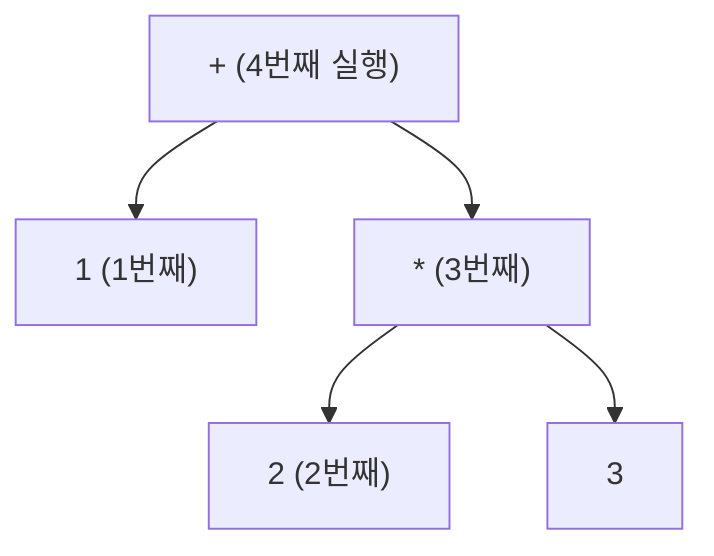
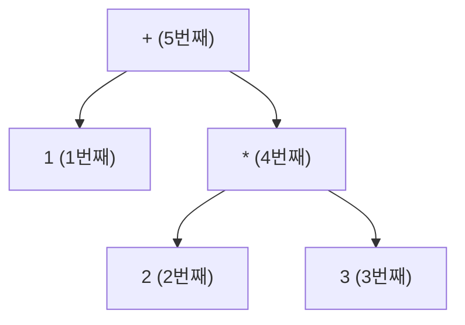

# 19. 문법과 액션

파서는 "문법에 맞는가"만 답하는 것이 아니다.
**축약할 때마다 액션이 실행되고**, 그 액션들이 실제 결과물을 만든다.

이 장에서는 액션으로 무엇을 할 수 있는지 —
계산, AST 구성, 심볼 테이블, 타입 검사, 코드 생성 —
을 `examples/08-mini-compiler` 로 끝까지 따라간다.

---

## 19.1 액션이 실행되는 시점

:::danger[액션은 그 규칙으로 **축약될 때** 실행된다]
우변의 심볼을 읽을 때가 아니다. **전부 읽고 나서** 실행된다.
:::

```c
expr : expr '+' expr    { printf("덧셈!\n"); $$ = $1 + $3; }
```

`1 + 2 + 3` 을 파싱하면 `덧셈!` 이 두 번 출력되는데,
그 시점은 각각 `1 + 2` 를 다 읽은 뒤, 그리고 `(1+2) + 3` 을 다 읽은 뒤다.

[16장의 LR 추적표](/docs/parsing/lr-parser-implementation#164-직접-실행해-보기)를
다시 보면, 액션은 `축약 r1` 이라 적힌 행에서 실행된다.

### 실행 순서 = 후위 순회

액션 실행 순서는 파스 트리의 **후위 순회(post-order)** 다.
자식이 모두 축약된 뒤에 부모가 축약되기 때문이다.



**이것이 상향식 파서로 코드를 생성하기 좋은 이유다.**
피연산자의 코드가 항상 먼저 나온다.

---

## 19.2 세 가지 액션 스타일

같은 파서로 세 가지 일을 할 수 있다.

### 스타일 ① 즉시 계산 — 인터프리터

값을 그 자리에서 계산한다.

```c title="examples/07-yacc-calc/calc.y"
expr : expr '+' expr    { $$ = $1 + $3; }
     | expr '*' expr    { $$ = $1 * $3; }
     | NUM              { $$ = $1; }
     ;
```

- 가장 간단하다
- 메모리를 거의 안 쓴다
- **한 번만 훑으므로 최적화가 불가능**하고, 전방 참조를 다룰 수 없다

계산기, 설정 파일 파서, 데이터 형식 리더에 적합하다.

### 스타일 ② 즉시 코드 생성 — 1-패스 컴파일러

축약할 때마다 목적 코드를 뱉는다.

```c
expr : expr '+' expr    { char *t = new_temp();
                          emit("%s = %s + %s", t, $1, $3);
                          $$ = t; }
     ;
```

- 메모리를 거의 안 쓴다 (초기 Pascal 컴파일러가 이 방식)
- 역시 **최적화가 불가능**하다

### 스타일 ③ AST 구성 — 다중 패스 컴파일러

트리를 만들고, 나중에 여러 번 순회한다.

```c title="examples/08-mini-compiler/mini.y"
expr : expr '+' expr    { $$ = node_binop("+", $1, $3, yylineno); }
     | expr '*' expr    { $$ = node_binop("*", $1, $3, yylineno); }
     | INT_LIT          { $$ = node_int($1, yylineno); }
     | ID               { $$ = node_var($1, yylineno); }
     ;
```

- 타입 검사, 최적화, 여러 백엔드가 가능해진다
- 오류 메시지에 문맥을 담기 쉽다
- **실제 컴파일러는 거의 전부 이 방식이다**

:::tip[액션은 짧게 유지하자]
액션 안에 긴 C 코드를 쓰면 문법이 읽히지 않는다.
**노드를 만드는 함수 하나만 호출**하고 나머지는 별도 파일에 두자.

`08-mini-compiler` 의 구성이 그 예다.
- `mini.y` — 문법과 `node_*()` 호출만
- `mini.c` — 심볼 테이블, 타입 검사, 코드 생성
- `mini.h` — 공용 선언
:::

---

## 19.3 AST 구성

### 노드 타입 설계

```c title="examples/08-mini-compiler/mini.h"
typedef enum {
    /* 식 */
    N_INT_LIT, N_FLOAT_LIT, N_VAR, N_BINOP, N_NEG, N_CONV,
    /* 문장 */
    N_ASSIGN, N_IF, N_WHILE, N_SEQ, N_PRINT, N_EMPTY
} NodeKind;

typedef struct Node {
    NodeKind kind;
    Type     type;        /* 의미 분석이 채운다 */
    int      line;

    long        ival;
    double      fval;
    char       *name;
    const char *op;

    struct Node *a, *b, *c;
} Node;
```

:::tip[`line` 을 모든 노드에 넣자]
나중에 오류 메시지를 낼 때 반드시 필요하다.
파싱이 끝난 뒤에는 소스 위치를 알 방법이 없으므로,
**만들 때 넣어 두지 않으면 되돌릴 수 없다**.
:::

### 문법에서 트리로

```c title="examples/08-mini-compiler/mini.y (발췌)"
%union {
    long    ival;
    double  fval;
    char   *name;
    Node   *node;
    int     type;
}

%type <node> stmt stmt_list block expr opt_else

%%

stmt
    : ID '=' expr ';'               { $$ = node_assign($1, $3, yylineno); }
    | KW_PRINT expr ';'             { $$ = node_print($2, yylineno); }
    | KW_IF '(' expr ')' stmt opt_else
                                    { $$ = node_if($3, $5, $6, yylineno); }
    | KW_WHILE '(' expr ')' stmt    { $$ = node_while($3, $5, yylineno); }
    | block                         { $$ = $1; }
    ;

stmt_list
    : /* 없음 */                    { $$ = NULL; }
    | stmt_list stmt                { $$ = node_seq($1, $2); }
    ;
```

`stmt_list` 가 **좌재귀**라는 점에 주목하자.
[18장에서 말한](/docs/yacc/yacc-overview#반복) 대로 LR에서는 이것이 옳다.

### 확인해 보기

```bash
cd examples/08-mini-compiler
make
printf 'int x;\nfloat y;\nx = 2 + 3 * 4;\ny = x / 2;\n' | ./minic -a
```

```
=== AST ===
  seq
    assign x
      + : int
        int 2
        * : int
          int 3
          int 4
    assign y
      (float)
        / : int
          var x : int
          int 2
```

`2 + 3 * 4` 에서 `*` 가 `+` 보다 **아래**에 있다.
우선순위 선언이 트리의 모양으로 나타난 것이다.

---

## 19.4 심볼 테이블

### 선언 처리의 난점

```c
int a, b, c;
```

타입은 맨 앞에 **한 번만** 나오는데,
LR은 상향식이라 `a`, `b`, `c` 를 축약할 때는 아직 타입을 모른다.

두 가지 해결책이 있다.

**방법 A — 이름을 모아 두었다가 나중에 등록**

```c title="examples/08-mini-compiler/mini.y"
static char *pending[MAXNAMES];
static int   npending;

decl
    : type id_list ';'              { pending_flush((Type)$1); }
    ;

id_list
    : ID                            { pending_add($1, yylineno); }
    | id_list ',' ID                { pending_add($3, yylineno); }
    ;
```

`type` 이 `id_list` **앞**에 있으므로 사실 `$1` 로 읽을 수도 있지만,
`id_list` 의 액션에서는 `$0` 을 써야 해서 위험하다.
전역 버퍼가 더 안전하고 읽기 쉽다.

**방법 B — 문법을 뒤집기**

```c
decl : id_list ':' type ';' ;    /* Pascal 스타일이면 자연스럽다 */
```

언어 설계 단계에서 정할 수 있다면 이쪽이 깔끔하다.

### 스코프

`08-mini-compiler` 는 스코프가 없다(전역 하나).
스코프를 넣으려면 블록 진입/이탈에서 테이블을 밀고 당겨야 한다.

```c
block : '{' { scope_push(); } stmt_list '}' { scope_pop(); $$ = $3; }
      ;
```

:::danger[중간 액션의 대가]
위 코드에는 중간 액션 `{ scope_push(); }` 가 있다.
[18장에서 경고한](/docs/yacc/yacc-overview#중간-액션) 대로

1. `stmt_list` 가 `$2` 가 아니라 **`$3`** 이 된다
2. 없던 충돌이 생길 수 있다

그래서 실무에서는 스코프 처리도 **AST 순회 단계로 미루는** 편이 많다.
파싱 중에는 트리만 만들고, 스코프는 나중에 트리를 돌면서 다룬다.
:::

---

## 19.5 타입 검사

파싱이 끝난 뒤 AST를 순회하며 타입을 채운다.

```c title="examples/08-mini-compiler/mini.c (발췌)"
static void check_expr(Node *n)
{
    switch (n->kind) {
    case N_VAR:
        n->type = sym_lookup(n->name);
        if (n->type == TY_ERROR)
            semantic_error(n->line, "선언되지 않은 변수 '%s'", n->name);
        break;

    case N_BINOP:
        check_expr(n->a);
        check_expr(n->b);
        /* 한쪽이 float 이면 양쪽을 float 으로 올린다 */
        if (n->a->type == TY_FLOAT || n->b->type == TY_FLOAT) {
            n->a = coerce(n->a, TY_FLOAT);
            n->b = coerce(n->b, TY_FLOAT);
            n->type = is_relational(n->op) ? TY_INT : TY_FLOAT;
        } else {
            n->type = TY_INT;
        }
        break;
    ...
    }
}
```

### 형 변환 노드 삽입

[1장에서 본](/docs/foundations/compiler-overview#-의미-분석-semantic-analysis)
`inttofloat` 삽입이 그대로 일어난다.

```c
static Node *coerce(Node *e, Type want)
{
    if (e->type == want || e->type == TY_ERROR) return e;
    if (e->type == TY_INT && want == TY_FLOAT) {
        Node *c = node_new(N_CONV, e->line);
        c->a = e;
        c->type = TY_FLOAT;
        return c;
    }
    return e;
}
```

**트리를 실제로 고친다.** 위 AST 덤프의 `(float)` 노드가 이렇게 생긴 것이다.

### 검사하는 것

```bash
./minic < tests/errors.in
```

```
3행: 'a' 는 이미 1행에서 선언되었다
6행: 선언되지 않은 변수 'c' 에 대입
7행: int 변수 'b' 에 float 값을 대입한다 (암묵적 축소는 허용하지 않는다)
8행: % 연산자는 int 에만 쓸 수 있다 (int % float)
```

:::info[이 넷은 전부 CFG로 표현할 수 없다]
[10장에서 설명한](/docs/parsing/context-free-grammar#cfg로도-안-되는-것) 그대로다.
"선언 후 사용", "타입이 맞아야 함"은 문맥 자유가 아니다.

그래서 파서가 아니라 **의미 분석 패스**가 잡는다.
이론적 한계가 컴파일러의 구조를 결정한 사례다.
:::

---

## 19.6 중간 코드 생성

AST를 다시 순회하며 3-주소 코드를 뱉는다.

### 식

```c
static const char *gen_expr(Node *n)
{
    switch (n->kind) {
    case N_INT_LIT:  return 상수 문자열;
    case N_VAR:      return n->name;

    case N_CONV: {
        const char *a = gen_expr(n->a);
        char *t = new_temp();
        emit("%s = inttofloat %s", t, a);
        return t;
    }

    case N_BINOP: {
        const char *a = gen_expr(n->a);
        char abuf[32];
        snprintf(abuf, sizeof abuf, "%s", a);   /* a 가 덮어써질 수 있다 */
        const char *b = gen_expr(n->b);
        char *t = new_temp();
        emit("%s = %s %s %s", t, abuf, n->op, b);
        return t;
    }
    }
}
```

각 `gen_expr` 은 코드를 뱉고 **결과가 담긴 주소**를 반환한다.
상수면 그 값, 변수면 이름, 계산 결과면 임시변수 이름이다.

### 제어 흐름

```c
case N_WHILE: {
    int l_top  = new_label();
    int l_exit = new_label();
    emit_label(l_top);
    const char *c = gen_expr(n->a);
    emit("ifFalse %s goto L%d", c, l_exit);
    gen(n->b);
    emit("goto L%d", l_top);
    emit_label(l_exit);
    break;
}
```

**조건 검사를 루프 위쪽에 둔다.** 실행할 때마다 조건을 다시 계산해야 하므로
`L_top` 이 조건 계산 **앞**에 있어야 한다.

### 전체 결과

```bash
./minic < tests/basic.in
```

```
=== 심볼 테이블 ===
  n            int    (2행 선언)
  i            int    (2행 선언)
  fact         int    (2행 선언)
  sum          float  (3행 선언)
  avg          float  (3행 선언)
=== 3-주소 코드 ===
  n = 5
  i = 1
  fact = 1
L1:
  t1 = i <= n
  ifFalse t1 goto L2
  t2 = fact * i
  fact = t2
  t3 = i + 1
  i = t3
  goto L1
L2:
  print fact
  t4 = inttofloat 0
  sum = t4
  ...
L4:
  t9 = inttofloat n
  t10 = sum / t9
  avg = t10
  print avg
```

`sum / n` 에서 `n` 이 int라 `inttofloat` 이 삽입되었다.
`sum` 은 이미 float이므로 그대로 쓰인다.

:::caution[숨은 함정 하나]
```
int x;  float y;
y = x / 2;
```
```
  t3 = x / 2          ← 정수 나눗셈!
  t4 = inttofloat t3
  y = t4
```

`x / 2` 는 **양쪽이 int이므로 정수 나눗셈**을 하고,
그 **결과**를 float으로 올린다. `x = 7` 이면 `y = 3.0` 이지 `3.5` 가 아니다.

C와 같은 의미론이고, 실무에서 아주 흔한 버그다.
타입 규칙을 명세에 정확히 적어 두는 것이 중요한 이유다.
:::

---

## 19.7 3-주소 코드의 표현 방식

지금까지 3-주소 코드를 **문자열로 출력**했다.

```
t1 = i <= n
ifFalse t1 goto L2
```

읽기는 좋지만, 최적화 단계에서 다루려면 **자료 구조**여야 한다.
"이 명령의 두 번째 피연산자를 다른 것으로 바꿔라" 같은 조작을
문자열로 하기는 곤란하다.

세 가지 표준 표현이 있다.

### 4중자 (quadruple)

명령 하나를 **네 칸**으로 적는다.

$$
(\ op,\ arg_1,\ arg_2,\ result\ )
$$

`a = b * -c + b * -c` 를 4중자로:

| # | op | arg₁ | arg₂ | result |
|---|---|---|---|---|
| 0 | `minus` | `c` | | `t1` |
| 1 | `*` | `b` | `t1` | `t2` |
| 2 | `minus` | `c` | | `t3` |
| 3 | `*` | `b` | `t3` | `t4` |
| 4 | `+` | `t2` | `t4` | `t5` |
| 5 | `=` | `t5` | | `a` |

```c
typedef struct {
    OpCode op;
    Addr   arg1, arg2, result;
} Quad;

Quad code[MAX_CODE];
int  ncode;
```

**장점 — 명령을 자유롭게 옮길 수 있다.**
결과가 `result` 칸의 **이름**으로 표현되므로,
명령 순서를 바꿔도 참조 관계가 깨지지 않는다.

명령 4를 위로 옮겨도 `t2`, `t4` 라는 이름은 그대로다.
**코드 이동 최적화에 유리하다.**

### 3중자 (triple)

`result` 칸을 없애고, **명령 번호 자체를 결과 이름으로** 쓴다.

| # | op | arg₁ | arg₂ |
|---|---|---|---|
| 0 | `minus` | `c` | |
| 1 | `*` | `b` | `(0)` |
| 2 | `minus` | `c` | |
| 3 | `*` | `b` | `(2)` |
| 4 | `+` | `(1)` | `(3)` |
| 5 | `=` | `a` | `(4)` |

`(0)` 은 "0번 명령의 결과"라는 뜻이다.

**장점** — 임시변수 이름을 만들 필요가 없고 공간을 덜 쓴다.

:::danger[3중자는 명령을 옮길 수 없다]
명령 4가 `(1)` 과 `(3)` 을 참조한다.
명령을 하나라도 삽입·삭제·이동하면 **번호가 전부 밀려 모든 참조가 깨진다.**

최적화는 명령을 옮기는 일이 대부분이므로,
3중자는 최적화하는 컴파일러에 맞지 않는다.
:::

### 간접 3중자 (indirect triple)

3중자 배열은 그대로 두고, **실행 순서를 담은 포인터 배열**을 따로 둔다.

```
순서 배열          3중자 배열
[0] → (0)          (0) minus c
[1] → (1)          (1) *     b  (0)
[2] → (2)          (2) minus c
[3] → (3)          (3) *     b  (2)
[4] → (4)          (4) +     (1) (3)
[5] → (5)          (5) =     a   (4)
```

명령을 옮기려면 **순서 배열만** 바꾸면 된다.
3중자 자체는 제자리에 있으므로 번호 참조가 깨지지 않는다.

| | 4중자 | 3중자 | 간접 3중자 |
|---|---|---|---|
| 공간 | 많이 | 적게 | 중간 |
| 임시변수 이름 | 필요 | 불필요 | 불필요 |
| 명령 이동 | ✅ 쉽다 | ❌ 불가 | ✅ 쉽다 |
| 공통 부분식 공유 | 이름으로 | 번호로 자연스럽게 | 번호로 |

:::tip[현대 컴파일러는 SSA를 쓴다]
지금은 **SSA(Static Single Assignment)** 형식이 표준이다.
"모든 변수에 딱 한 번만 대입한다"는 규칙을 강제하면,
4중자의 장점(이름 기반 참조)과 3중자의 장점(정의-사용 관계가 명시적)을
동시에 얻는다.

LLVM IR이 SSA다. [22장](/docs/modern/toolchain-map)에서 언급한
"다음 단계 주제"에 SSA가 들어 있는 이유다.
:::

---

## 19.8 백패칭 — 단축 평가와 점프 코드

[19.6절](#196-중간-코드-생성)의 조건문 코드 생성에는 한계가 있다.

```c
if (a > 0 && b > 0) ...
```

지금 방식(**값 방식**)은 이렇게 만든다.

```
t1 = a > 0
t2 = b > 0        ← a > 0 이 거짓이어도 b 를 계산한다
t3 = t1 && t2
ifFalse t3 goto L1
```

C의 `&&` 는 **단축 평가**여야 한다. `a > 0` 이 거짓이면 `b > 0` 을
**아예 계산하지 않아야** 한다. `b` 가 함수 호출이거나 배열 접근이면
의미가 달라진다.

```c
if (p != NULL && p->x > 0)     /* 값 방식이면 널 참조로 죽는다 */
```

### 점프 코드

해결책은 조건식을 **값이 아니라 점프의 흐름**으로 번역하는 것이다.

```
        ifFalse a > 0 goto L_false     ← 여기서 바로 빠져나간다
        ifFalse b > 0 goto L_false
        (참일 때의 코드)
        goto L_end
L_false:
        (거짓일 때의 코드)
L_end:
```

`b > 0` 은 `a > 0` 이 참일 때만 실행된다. 단축 평가가 된다.

### 문제 — 점프 대상을 아직 모른다

`ifFalse a > 0 goto L_false` 를 **생성하는 시점**에는
`L_false` 가 어디인지 아직 모른다. 아직 그 코드를 만들지 않았기 때문이다.

한 번에 훑으며 코드를 뱉는 1-패스 방식에서는 이것이 근본적인 문제다.

### 해결 — 백패칭

:::info[백패칭 (backpatching)]
점프 대상을 **비워 둔 채** 명령을 생성하고,
그 명령의 **번호를 목록에 모아 둔다**.

나중에 실제 주소가 확정되면 **목록의 모든 명령을 찾아가 채운다**.
:::

각 넌터미널에 두 개의 **목록 속성**을 붙인다.

| 속성 | 뜻 |
|---|---|
| `B.truelist` | $B$ 가 **참**일 때 갈 곳을 아직 못 채운 명령들의 번호 |
| `B.falselist` | $B$ 가 **거짓**일 때 갈 곳을 아직 못 채운 명령들의 번호 |

세 가지 보조 함수를 쓴다.

```
makelist(i)        → 명령 번호 i 하나만 담은 새 목록
merge(p1, p2)      → 두 목록을 이어 붙인다
backpatch(p, addr) → 목록 p 의 모든 명령의 점프 대상을 addr 로 채운다
```

### `&&` 의 SDT

$$
B \to B_1\ \&\&\ M\ B_2
$$

여기서 $M$ 은 **표시자(marker) 넌터미널**이다.

$$
M \to \varepsilon \quad \{\ M.quad := \text{nextquad}()\ \}
$$

$M$ 은 아무것도 생성하지 않지만, **그 지점의 명령 번호를 기록**한다.
$B_2$ 의 코드가 어디서 시작하는지 알아야 하기 때문이다.

의미 규칙:

$$
\begin{aligned}
&\text{backpatch}(B_1.truelist,\ M.quad) \\
&B.truelist := B_2.truelist \\
&B.falselist := \text{merge}(B_1.falselist,\ B_2.falselist)
\end{aligned}
$$

읽어 보자.

- $B_1$ 이 **참**이면 $B_2$ 를 평가해야 한다 →
  $B_1.truelist$ 를 $M.quad$($B_2$ 의 시작)로 **백패치**
- 전체가 참인 것은 $B_2$ 가 참일 때뿐 → $B.truelist := B_2.truelist$
- 전체가 거짓인 것은 **둘 중 하나라도** 거짓일 때 → 두 falselist를 **merge**

`||` 는 정확히 반대다.

$$
\begin{aligned}
&\text{backpatch}(B_1.falselist,\ M.quad) \\
&B.truelist := \text{merge}(B_1.truelist,\ B_2.truelist) \\
&B.falselist := B_2.falselist
\end{aligned}
$$

:::tip[이것이 17장에서 배운 L-속성의 실전 사례다]
$M \to \varepsilon$ 이라는 **표시자 넌터미널**은
[17장에서 본](/docs/parsing/syntax-directed-translation#l-속성-sdd--sdt)
"L-속성 SDD를 LR로 구현하기 위한 중간 액션"의 표준 기법이다.

yacc에서는 이렇게 쓴다.

```c
B : B OP_AND { $<quad>$ = nextquad(); } B
      {
          backpatch($1.truelist, $<quad>3);   /* ← $3 이 표시자 */
          $$.truelist  = $4.truelist;         /* ← B₂ 는 $4 */
          $$.falselist = merge($1.falselist, $4.falselist);
      }
  ;
```

[18장에서 경고한](/docs/yacc/yacc-overview#중간-액션) 대로
`$n` 번호가 밀려 $B_2$ 가 `$3` 이 아니라 **`$4`** 다.
백패칭 구현에서 가장 흔한 버그가 이 번호를 잘못 세는 것이다.
:::

### 손으로 돌려 보기

```c
if (a > 0 && b > 0) x = 1;
```

생성 과정 (명령 번호는 100부터 시작):

| 단계 | 생성/조작 | 상태 |
|---|---|---|
| `a > 0` 처리 | `100: if a > 0 goto _` <br/> `101: goto _` | $B_1.truelist = \{100\}$ <br/> $B_1.falselist = \{101\}$ |
| $M$ 도달 | (아무것도 생성 안 함) | $M.quad = 102$ |
| `b > 0` 처리 | `102: if b > 0 goto _` <br/> `103: goto _` | $B_2.truelist = \{102\}$ <br/> $B_2.falselist = \{103\}$ |
| `&&` 규칙 | `backpatch({100}, 102)` | `100: if a > 0 goto 102` |
| | $B.truelist = \{102\}$ | |
| | $B.falselist = \{101, 103\}$ | |
| `x = 1` 처리 | `104: x = 1` | |
| `if` 규칙 | `backpatch({102}, 104)` <br/> `backpatch({101,103}, 105)` | |

**최종 코드**

```
100: if a > 0 goto 102
101: goto 105
102: if b > 0 goto 104
103: goto 105
104: x = 1
105: (다음 문장)
```

`a > 0` 이 거짓이면 101 → 105 로 곧장 빠져나간다.
**`b > 0` 은 계산되지 않는다.** 단축 평가가 구현되었다.

:::note[왜 미니 컴파일러는 이걸 안 썼는가]
[통합 프로젝트](/docs/labs/mini-compiler)는 값 방식을 썼다.
이유는 셋이다.

1. **훨씬 단순하다.** 목록 세 개와 표시자 넌터미널이 필요 없다
2. **AST를 만들어 두면 백패칭이 필요 없다.** 트리를 순회할 때는
   `L_false` 가 어디인지 미리 알 수 있으므로 그냥 라벨을 만들면 된다
3. 최적화 단계에서 어차피 정리된다

백패칭은 **1-패스로 코드를 뱉어야 할 때** 빛나는 기법이다.
AST를 만드는 요즘 컴파일러에서는 역사적 기법에 가깝다.

그래도 배워 둘 가치가 있다 — "아직 모르는 값을 나중에 채운다"는 발상은
링커의 재배치(relocation), JIT의 패치, 전방 참조 해결에 그대로 나온다.
:::

**단축 평가를 AST 방식으로 구현하려면**
[통합 프로젝트 확장 과제 7번](/docs/labs/mini-compiler#상급)을 보자.
`gen_cond(node, true_label, false_label)` 처럼
**목표 라벨을 인자로 내려보내면** 된다 —
17장의 용어로는 라벨이 **상속 속성**이 되는 것이다.

---

## 19.9 두 패스로 나눈 이유

`08-mini-compiler` 는 파싱 → 타입 검사 → 코드 생성 세 단계다.
한 번에 할 수도 있는데 왜 나눴을까?

**① 전방 참조**
파싱 중에는 뒤에 나올 선언을 모른다.
함수를 추가하면 상호 재귀 함수를 다룰 수 없게 된다.

**② 타입 정보가 코드 생성에 필요하다**
`a + b` 의 코드를 뽑으려면 정수 덧셈인지 실수 덧셈인지 알아야 한다.
그 정보는 양쪽 자식의 타입이 모두 정해진 뒤에야 확정된다.

**③ 최적화의 여지**
AST가 남아 있으면 상수 접기, 죽은 코드 제거 등을 넣을 수 있다.
한 번 뱉어 버린 코드는 되돌릴 수 없다.

**④ 오류 메시지**
"선언되지 않은 변수"를 파싱 중에 보고하면,
아직 파싱되지 않은 부분의 정보를 쓸 수 없다.

:::note[대가는 메모리다]
AST 전체를 들고 있어야 하므로 소스 크기에 비례하는 메모리를 쓴다.
1970년대에는 이것이 감당하기 어려웠고, 그래서 초기 Pascal 컴파일러가
1-패스로 설계되었다. Pascal이 "모든 것을 사용 전에 선언"하도록
규정한 이유이기도 하다.
:::

---

## 19.10 메모리 관리

액션에서 만든 노드와 문자열은 누가 해제할까?

### `strdup` 한 문자열

```c
{id}    { yylval.name = strdup(yytext); return ID; }
```

파서가 받아 AST 노드에 넣으면 노드가 소유한다.
**규칙이 실패하거나 값을 안 쓰면 샌다.**

```c
| ID '=' expr ';'   { $$ = node_assign($1, $3, yylineno); }   /* $1 을 노드가 소유 */
| error ';'         { $$ = NULL; yyerrok; }                   /* ← 여기서 샌다 */
```

### `%destructor`

bison이 오류 복구로 심볼을 버릴 때 호출할 정리 코드를 지정할 수 있다.

```c
%destructor { free($$); }        <name>
%destructor { node_free($$); }   <node>
```

:::tip[교육용 코드에서는 크게 신경 쓰지 않아도 된다]
컴파일러는 실행이 짧고 끝나면 OS가 전부 회수한다.
그래서 많은 컴파일러가 **일부러 해제하지 않는다** (arena 할당 후 통째로 버리기).

다만 **라이브러리로 쓰일 파서**나 **장시간 도는 서버**의 파서라면
반드시 처리해야 한다. `%destructor` 를 기억해 두자.
:::

---

## 19.11 실습

```bash
cd examples/08-mini-compiler
make && make test

./minic    < tests/basic.in      # 3-주소 코드
./minic -a < tests/ast.in        # AST 도 함께
./minic    < tests/errors.in     # 의미 오류
./minic    < tests/dangling.in   # dangling else
```

### 확장 과제

1. **`for` 문 추가** — 문법, AST 노드, 코드 생성 세 곳을 모두 고쳐야 한다.
2. **상수 접기** — AST를 순회하며 `2 + 3 * 4` 를 `14` 로 접어라.
   타입 검사와 코드 생성 사이에 패스를 하나 넣으면 된다.
3. **단축 평가** — `&&` 와 `||` 를 C처럼 단축 평가하게 만들어라.
   값 방식으로는 안 되고 **점프 코드**가 필요하다.
4. **스코프** — 블록마다 심볼 테이블을 밀고 당겨라.
   중간 액션 대신 AST 순회에서 처리하는 편을 권한다.
5. **가상 기계** — 3-주소 코드를 실제로 실행하는 인터프리터를 만들어라.

---

## 요약

- **액션은 축약될 때 실행된다.** 실행 순서는 파스 트리의 **후위 순회**이고,
  그래서 상향식 파서가 코드 생성에 유리하다.
- 액션 스타일 셋: **즉시 계산**(인터프리터), **즉시 코드 생성**(1-패스),
  **AST 구성**(다중 패스). 실제 컴파일러는 거의 전부 셋째다.
- **액션은 짧게.** 노드 생성 함수 하나만 호출하고 나머지는 별도 파일에.
- 모든 AST 노드에 **`line` 을 넣어 두자.** 나중에는 되돌릴 수 없다.
- 선언 `int a, b, c;` 는 타입이 앞에 한 번만 나오므로
  **이름을 모아 두었다가 나중에 등록**한다.
- **타입 검사는 AST를 순회하며** 하고, 필요하면 **형 변환 노드를 트리에 삽입**한다.
  이것이 1장의 `inttofloat` 삽입이다.
- 선언 검사·타입 검사는 **CFG로 표현할 수 없어서** 별도 패스가 필요하다.
- 패스를 나누는 이유: 전방 참조, 타입 정보 의존, 최적화 여지, 오류 메시지.
- `int / int` 는 정수 나눗셈을 한 뒤 변환된다. 흔한 버그.

## 확인 문제

1. `1 + 2 * 3` 을 파싱할 때 액션 실행 순서를 적어라.

<details>
<summary>풀이</summary>

문법: `expr : expr '+' expr | expr '*' expr | NUM`
(우선순위 선언으로 `*` 가 더 높다고 하자)

**액션 실행 순서**

| # | 축약되는 규칙 | 실행되는 액션 | 그때의 값 |
|---|---|---|---|
| 1 | `expr → NUM` | `$$ = $1` | 1 |
| 2 | `expr → NUM` | `$$ = $1` | 2 |
| 3 | `expr → NUM` | `$$ = $1` | 3 |
| 4 | `expr → expr '*' expr` | `$$ = $1 * $3` | 2 × 3 = **6** |
| 5 | `expr → expr '+' expr` | `$$ = $1 + $3` | 1 + 6 = **7** |

**파스 트리와 대조**



**후위 순회**다 — 자식이 전부 처리된 뒤에 부모가 처리된다.

**왜 `*` 가 `+` 보다 먼저인가.** 스택이 `expr + expr` 이고 입력이 `*` 일 때,
우선순위 선언에 의해 **이동**을 택하기 때문이다
([15장 9행](/docs/parsing/lr-parsing#151-이동-축약-파싱)과 같은 상황).

`+` 를 먼저 축약했다면 `(1+2)*3 = 9` 가 나왔을 것이다.

:::tip[액션 순서가 곧 계산 순서다]
"액션이 언제 실행되는가"는 추상적인 질문이 아니라
**결과값이 무엇이 되는가**를 결정한다.

코드를 뱉는 경우에도 마찬가지다 —
피연산자의 코드가 먼저 나와야 하는데, 후위 순회가 그것을 보장한다.
:::

</details>

2. `int a, b, c;` 에서 `a` 를 축약하는 시점에 타입을 알 수 없는 이유는?
   상향식/하향식 중 어느 쪽에서 더 문제인가?

<details>
<summary>풀이</summary>

**왜 알 수 없는가**

문법이 이렇다고 하자.

$$decl \to type\ id\_list\ \texttt{;}, \qquad id\_list \to id\_list\ \texttt{,}\ ID \mid ID$$

상향식 파서는 `a` 를 만나면 `id_list → ID` 로 **즉시 축약**한다.
그 시점에 스택은

```
type  ID
      ↑ 축약 대상
```

`type` 은 스택에 **있지만**, `id_list → ID` 규칙의 우변에는 `type` 이 없다.
`$n` 은 **자기 우변의 심볼만** 가리킬 수 있으므로 접근할 수 없다.

(`$0` 으로 우변 이전을 볼 수는 있지만,
어느 문맥에서 축약되는지에 따라 그 자리가 달라지므로 위험하다.)

**어느 쪽이 더 문제인가 — 상향식(LR)이다.**

| | 하향식 (LL) | 상향식 (LR) |
|---|---|---|
| 처리 순서 | `type` 을 먼저 **완전히** 처리한 뒤 `id_list` 호출 | 둘 다 스택에 쌓은 뒤 함께 축약 |
| 값 전달 | **함수 인자**로 자연스럽게 내려보냄 | 전달할 자리가 없음 |

**하향식이라면**

```c
void parse_decl(void) {
    Type t = parse_type();        /* 먼저 타입을 얻고 */
    parse_id_list(t);             /* 인자로 내려보낸다 */
}
```

`parse_id_list` 를 **호출하기 전에** `parse_type` 이 끝나 있으므로
값을 넘길 수 있다.

**이것이 상속 속성이다**
([17장](/docs/parsing/syntax-directed-translation#175-s-속성과-l-속성)).

- LL은 상속 속성이 **함수 인자**로 자연스럽다
- LR은 우변을 다 본 뒤에 결정하므로 **중간에 값을 내려보낼 자리가 없다**

**yacc에서의 우회 세 가지**

| 방법 | 설명 |
|---|---|
| **전역 버퍼** | 이름을 모았다가 `type` 이 확정되면 등록 (이 예제) |
| 중간 액션 | `decl : type { 전역에 저장 } id_list ';'` — `$n` 이 밀리고 충돌 위험 |
| AST 후 순회 | 파싱 중에는 트리만 만들고 나중에 처리 (**권장**) |

</details>

3. `y = x / 2` (x는 int, y는 float)가 `3.5` 가 아니라 `3.0` 을 주는 이유를
   생성된 3-주소 코드로 설명하라.

<details>
<summary>풀이</summary>

```bash
cd examples/08-mini-compiler
printf 'int x;\nfloat y;\nx = 7;\ny = x / 2;\n' | ./minic
```

**생성되는 코드**

```
  x = 7
  t1 = x / 2          ← 정수 나눗셈!
  t2 = inttofloat t1
  y = t2
```

**단계별로 왜 이렇게 되는가**

**① 타입 검사가 `x / 2` 를 먼저 본다.**

- `x` 는 `int`
- `2` 는 `int` 리터럴
- **양쪽이 int이므로 결과도 int** → 정수 나눗셈

$7 / 2 = 3$ (소수부 버림)

**② 그 다음 대입을 본다.**

- 왼쪽 `y` 는 `float`
- 오른쪽 `x / 2` 는 `int`
- int → float 은 **확대 변환**이므로 `inttofloat` 노드를 삽입

$3 \to 3.0$

**AST로 보면 더 분명하다**

```bash
printf 'int x;\nfloat y;\nx = 7;\ny = x / 2;\n' | ./minic -a
```
```
    assign y
      (float)          ← 변환 노드가 나눗셈 **위**에 있다
        / : int        ← 나눗셈 자체는 int
          var x : int
          int 2
```

**`(float)` 가 `/` 의 부모다.** 즉 "나눗셈을 먼저 하고 그 결과를 변환"이다.

**3.5를 얻으려면**

```c
y = x / 2.0;      /* 한쪽을 float 으로 */
```

그러면 타입 검사가 `x` 를 float으로 올린다.

```
  t1 = inttofloat x       ← 변환이 나눗셈 **아래**로 내려왔다
  t2 = t1 / 2.0
  y = t2
```

:::danger[C와 같은 의미론, 그리고 같은 함정]
```c
double avg = sum / count;    /* 둘 다 int 면 정수 나눗셈 */
```

실무에서 아주 흔한 버그다.
**타입 변환이 언제 일어나는지**는 언어 명세가 정하고,
그것이 AST의 어느 위치에 변환 노드를 넣느냐로 나타난다.

이 예제가 보여 주는 것은
"타입 규칙을 명세에 정확히 적어 두는 것이 왜 중요한가"다.
:::

</details>

4. `%destructor` 가 필요한 구체적 시나리오를 하나 들어라.

<details>
<summary>풀이</summary>

**시나리오: 오류 복구로 심볼이 버려질 때**

```c
%union { char *str; Node *node; }
%token <str> ID
%type  <node> stmt

%%
stmt : ID '=' expr ';'   { $$ = node_assign($1, $3); }   /* $1 을 노드가 소유 */
     | error ';'         { $$ = NULL; yyerrok; }
     ;
```

입력이 `x = ;` 라면:

1. 스캐너가 `ID` 를 만들며 `strdup("x")` → **힙 할당**
2. 파서가 `ID` 와 `=` 를 스택에 이동
3. `;` 에서 구문 오류 발생
4. **패닉 모드 복구** — 스택을 걷어 내며 `ID` 를 **그냥 버린다**
5. `strdup` 한 메모리가 **누수**된다

액션은 실행되지 않으므로 `free($1)` 할 기회가 없다.

**`%destructor` 로 해결**

```c
%destructor { free($$); }        <str>
%destructor { node_free($$); }   <node>
```

bison이 심볼을 버릴 때 자동으로 호출한다.

**호출되는 경우 셋**

| 상황 | 설명 |
|---|---|
| 오류 복구 | 스택을 걷어 낼 때 각 심볼에 대해 |
| `YYABORT` / `YYACCEPT` | 남은 스택을 정리할 때 |
| 파서 종료 | 스택에 남은 심볼들 |

**또 다른 시나리오: 서버에서 도는 파서**

```
SQL 서버 → 초당 수천 개 쿼리 파싱 → 그중 일부는 구문 오류
```

오류 하나마다 몇 바이트씩 새면, 며칠 뒤 메모리가 고갈된다.
**장시간 실행되는 프로세스**에서는 필수다.

:::tip[언제 신경 쓰지 않아도 되는가]
컴파일러처럼 **한 번 돌고 끝나는** 프로그램은
프로세스 종료 시 OS가 전부 회수한다.

실제로 많은 컴파일러가 **일부러 해제하지 않는다** —
arena에 할당해 두고 통째로 버리거나, 아예 안 버린다.
`free()` 호출 비용조차 아끼는 것이다.

**라이브러리·서버·에디터 통합**이면 반드시 처리해야 한다.
:::

</details>

5. 상수 접기를 어느 단계에 넣어야 하는가? 파싱 액션에서 하면 왜 안 되는가?

<details>
<summary>풀이</summary>

**넣을 자리: 타입 검사 이후, 코드 생성 이전** — AST를 순회하는 별도 패스.

```
파싱 → AST 구성 → 타입 검사 → [상수 접기] → 코드 생성
```

**파싱 액션에서 하면 안 되는 이유 셋**

**① 타입이 아직 정해지지 않았다**

```c
expr : expr '+' expr {
         if (둘 다 상수) $$ = node_int($1->ival + $3->ival, …);   /* ❌ */
       }
```

`2 + 3` 이 int 덧셈인지 float 덧셈인지 **아직 모른다**.
변수의 타입은 심볼 테이블을 봐야 알고, 전방 참조가 있으면
파싱 중에는 확정할 수 없다.

`2 + 3` 을 int 5로 접었는데 나중에 float 문맥이었다면?
`2.0 + 3.0 = 5.0` 과 부동소수 반올림이 달라질 수 있다.

**② 정보를 잃으면 되돌릴 수 없다**

접어 버리면 원래 식이 사라진다.
그런데 나중에 "이 상수가 어디서 왔는지" 오류 메시지에 쓰고 싶을 수 있다.

```
warning: 0으로 나눔  ← 원래 식이 `x / (2 - 2)` 였다면 그것을 보여 줘야 한다
```

**③ 반복 적용이 필요하다**

```c
a = 2 + 3;
b = a * 4;      /* a 를 5로 접은 뒤에야 b 를 20으로 접을 수 있다 */
```

상수 전파(constant propagation)와 상수 접기는 **번갈아 반복**해야
최대 효과가 난다. 파싱은 한 번뿐이므로 이 반복을 할 수 없다.

**AST 패스로 구현하면**

```c
static Node *fold(Node *n)
{
    if (!n) return NULL;
    n->a = fold(n->a);
    n->b = fold(n->b);

    if (n->kind == N_BINOP &&
        n->a->kind == N_INT_LIT && n->b->kind == N_INT_LIT) {
        long v = eval_binop(n->op, n->a->ival, n->b->ival);
        Node *lit = node_int(v, n->line);   /* line 을 보존한다 */
        node_free(n);
        return lit;
    }
    return n;
}
```

**후위 순회**로 자식을 먼저 접고 부모를 본다.
`2 + 3 * 4` 면 `3*4 → 12` 를 먼저 접고, 그 다음 `2+12 → 14` 가 된다.

:::info[일반 원칙]
> **최적화는 정보가 가장 많은 시점에 한다.**

파싱 중에는 구조만 안다. 타입도, 전체 프로그램도 모른다.
그래서 최적화를 하기에 **너무 이른 단계**다.

[19.9절 "두 패스로 나눈 이유"](#199-두-패스로-나눈-이유)의
③ "최적화의 여지"가 이것이다.
:::

</details>

6. `&&` 를 단축 평가로 만들려면 왜 값 방식으로 안 되는지 설명하라.

<details>
<summary>풀이</summary>

**값 방식이 만드는 코드**

```c
if (a > 0 && b > 0) ...
```
```
t1 = a > 0
t2 = b > 0        ← 무조건 계산된다
t3 = t1 && t2
ifFalse t3 goto L1
```

`t3` 를 계산하려면 `t1` 과 `t2` 가 **둘 다 있어야** 한다.
그래서 `b > 0` 이 반드시 실행된다.

**왜 이것이 문제인가**

```c
if (p != NULL && p->x > 0)     /* p 가 NULL 이면 널 역참조 → 크래시 */
if (i < n && arr[i] > 0)       /* i >= n 이면 범위 밖 접근 */
if (x != 0 && y / x > 1)       /* x == 0 이면 0으로 나눔 */
```

C의 `&&` 는 **왼쪽이 거짓이면 오른쪽을 평가하지 않는다**고 표준이 보장한다.
위 관용구들이 전부 그 보장에 의존한다.

**근본 원인: 값 방식은 "값"을 만든다**

값 방식의 전제는 "각 부분식이 **값 하나**를 남긴다"이다.
그런데 단축 평가는 "**어떤 부분식은 아예 실행되지 않는다**"를 요구한다.

값이 없는데 어떻게 `&&` 를 계산하겠는가?

**점프 코드로 바꿔야 한다**

```
        ifFalse a > 0 goto L_false     ← 여기서 바로 빠져나간다
        ifFalse b > 0 goto L_false
        (참일 때의 코드)
        goto L_end
L_false:
        (거짓일 때의 코드)
L_end:
```

`b > 0` 은 첫 줄을 통과했을 때만 실행된다.

**핵심 전환**

| | 값 방식 | 점프 코드 |
|---|---|---|
| 조건식이 남기는 것 | **값**(0/1) | **제어 흐름**(어디로 갈지) |
| `&&` 의 구현 | 두 값의 AND | 첫 조건의 false 분기를 공유 |
| 단축 평가 | ❌ 불가능 | ✅ 자연스럽다 |

**구현 방법 두 가지**

**① 백패칭** ([19.8절](#198-백패칭--단축-평가와-점프-코드))
1-패스로 코드를 뱉으며 점프 대상을 나중에 채운다.

**② 라벨을 인자로 내려보내기** (AST 방식, 더 쉽다)

```c
static void gen_cond(Node *n, int true_label, int false_label)
{
    if (n->kind == N_BINOP && strcmp(n->op, "&&") == 0) {
        int mid = new_label();
        gen_cond(n->a, mid, false_label);    /* 왼쪽이 거짓이면 곧장 false 로 */
        emit_label(mid);
        gen_cond(n->b, true_label, false_label);
        return;
    }
    /* 단순 비교 */
    const char *v = gen_expr(n);
    emit("ifFalse %s goto L%d", v, false_label);
    emit("goto L%d", true_label);
}
```

**`true_label` 과 `false_label` 이 상속 속성이다**
([17장](/docs/parsing/syntax-directed-translation#l-속성-문법)).
부모가 자식에게 "네가 참이면 여기로, 거짓이면 저기로"를 내려보낸다.

AST가 있으면 백패칭 없이 이렇게 간단히 된다 —
[통합 프로젝트 확장 과제 7번](/docs/labs/mini-compiler#상급)이 이것이다.

</details>

---

다음 장에서는 **충돌**을 다룬다.
`conflicts: 3 shift/reduce` 를 만났을 때 무엇을 해야 하는가.
