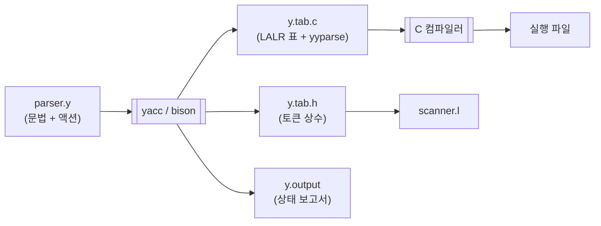

# 18. YACC 개요

4부에서 LR 표를 손으로 만들어 보았다.
식 문법 하나에 상태가 12개였다. 실제 언어라면 수백 개다.

**yacc**는 그 표를 자동으로 만들어 준다.
문법과 액션을 적어 주면 파서 C 코드를 뽑아 준다.

---

## 18.1 yacc란 무엇인가



### 계보

| 이름 | 유래 |
|---|---|
| **yacc** | *Yet Another Compiler Compiler*. 1975년 Bell Labs의 Stephen C. Johnson |
| **bison** | GNU 구현. yacc의 상위 호환. GLR, LR(1) 등 확장 |
| **byacc** | Berkeley yacc. BSD 라이선스 구현 |

이 교안에서 "yacc"는 도구 일반을, "bison"은 실제 구현을 가리킨다.

### yacc가 대신해 주는 일

[16장의 파이프라인](/docs/parsing/lr-parser-implementation#167-파서-생성기가-하는-일)
전부다.

1. 문법 파일 파싱, 증강 문법 구성
2. FIRST/FOLLOW 계산
3. 정준 LR(0) 항목 집합 구성
4. LALR(1) lookahead 계산과 상태 병합
5. ACTION/GOTO 표 채우기
6. 우선순위 선언으로 충돌 해결, 남은 충돌 보고
7. 표 압축
8. `yyparse()` 와 액션 코드 출력

우리는 **문법과 액션**만 쓰면 된다.

---

## 18.2 yacc 입력 파일의 구조

lex와 마찬가지로 `%%` 로 나뉘는 **세 부분**이다.

```
선언부 (declarations)
%%
규칙부 (rules)
%%
사용자 코드부 (user code)
```

### 가장 작은 완전한 예

```c title="minimal.y"
%{
#include <stdio.h>
int yylex(void);
void yyerror(const char *s) { fprintf(stderr, "%s\n", s); }
%}

%token NUM

%%
expr : NUM            { printf("숫자 하나: %d\n", $1); }
     ;
%%

int main(void) { return yyparse(); }
```

---

## 18.3 선언부

네 가지가 들어간다.

### ① `%{ ... %}` C 블록

생성된 파일 위쪽에 그대로 복사된다. `#include`, 전역 변수, 함수 선언.

```c
%{
#include <stdio.h>
#include <stdlib.h>
#include <string.h>
#include "mini.h"

int  yylex(void);
void yyerror(const char *s);
%}
```

### ② `%union` — 의미 값의 타입

[16장에서 본](/docs/parsing/lr-parser-implementation#163-의미-값-스택)
**값 스택의 원소 타입**을 정의한다.

```c title="examples/07-yacc-calc/calc.y"
%union {
    double  num;
    char   *str;
}
```

이것이 생성 코드의 `YYSTYPE` 이 되고, `yylval` 의 타입이 된다.

:::caution[`%union` 을 쓰지 않으면 `int` 다]
선언하지 않으면 `YYSTYPE` 이 `int` 로 정의된다.
포인터를 넣으려다 잘리는 사고가 난다.
:::

### ③ 토큰 선언

```c
%token <num> NUM        /* 값이 num 멤버에 담긴다 */
%token <str> ID
%token       EOL        /* 값이 없는 토큰 */
%type  <num> expr       /* 넌터미널의 값 타입 */
```

| 선언 | 대상 |
|---|---|
| `%token` | 터미널 (스캐너가 만드는 것) |
| `%type` | 넌터미널 (규칙이 만드는 것) |
| `<멤버>` | `%union` 의 어느 멤버를 쓰는지 |

:::danger[`%type` 을 빼먹으면 조용히 깨진다]
넌터미널에 `%type` 을 선언하지 않으면 `$$` 의 타입을 알 수 없어
bison이 오류를 낸다 — 다행이다.

하지만 **잘못된 멤버**를 지정하면 아무 경고 없이
공용체의 다른 멤버를 읽어 쓰레기 값이 나온다.
`%union` 을 쓸 때 가장 흔한 버그다.
:::

### ④ 우선순위와 결합성

```c
%right '='
%left  '+' '-'
%left  '*' '/' '%'
%right UMINUS
%right '^'
```

**아래로 갈수록 우선순위가 높다.**
[다음 장](/docs/yacc/conflicts-and-precedence)에서 자세히 다룬다.

### 그 밖의 유용한 선언

| 선언 | 하는 일 |
|---|---|
| `%start 심볼` | 시작 심볼 지정 (기본값은 첫 규칙의 좌변) |
| `%expect N` | "shift/reduce 충돌 N개는 알고 있다" |
| `%expect-rr N` | reduce/reduce 충돌에 대해 같은 것 |
| `%locations` | `@$`, `@1` 위치 추적 활성화 |
| `%glr-parser` | GLR 파서 생성 |
| `%define parse.error verbose` | 상세한 오류 메시지 (bison 3+) |
| `%error-verbose` | 위와 같음 (bison 2.x 표기, 3.x에서 deprecated) |

---

## 18.4 규칙부

```
넌터미널
    : 대안1   { 액션1 }
    | 대안2   { 액션2 }
    ;
```

BNF를 그대로 옮긴 모양이다.

```c title="examples/07-yacc-calc/calc.y (발췌)"
expr
    : NUM                   { $$ = $1; }
    | expr '+' expr         { $$ = $1 + $3; }
    | expr '-' expr         { $$ = $1 - $3; }
    | expr '*' expr         { $$ = $1 * $3; }
    | '-' expr %prec UMINUS { $$ = -$2; }
    | '(' expr ')'          { $$ = $2; }
    ;
```

### 문자 하나짜리 토큰

`'+'`, `'('` 처럼 작은따옴표로 감싸면 **그 문자의 ASCII 코드**가 토큰 코드다.
`%token` 선언이 필요 없다.

스캐너에서는 그냥 그 문자를 반환하면 된다.

```c
[-+*/%^()=]     { return yytext[0]; }
```

:::info[토큰 코드가 258부터 시작하는 이유]
0~255는 문자 하나짜리 토큰을 위해 비워 둔다.
256, 257은 bison이 내부적으로 쓴다 (`$end`, `error`).
`%token` 으로 선언한 토큰은 **258번부터** 배정된다.
:::

### ε 생성 규칙

빈 우변으로 쓴다. 주석으로 표시해 두는 것이 관례다.

```c
opt_else
    : /* 없음 */        { $$ = NULL; }
    | KW_ELSE stmt      { $$ = $2; }
    ;
```

### 반복

LR은 **좌재귀를 선호한다**.

```c
/* ✅ 좌재귀 — 스택이 자라지 않는다 */
stmt_list : /* 없음 */          { $$ = NULL; }
          | stmt_list stmt      { $$ = node_seq($1, $2); }
          ;

/* ⚠️ 우재귀 — 리스트 전체가 스택에 쌓인 뒤에야 축약된다 */
stmt_list : /* 없음 */
          | stmt stmt_list
          ;
```

:::tip[LL과 정반대다]
[13장](/docs/parsing/ll-parsing)에서 LL은 좌재귀를 못 쓴다고 했다.
LR은 **좌재귀를 써야 한다**. 우재귀를 쓰면 항목 $n$ 개짜리 리스트가
전부 스택에 쌓인 뒤에야 축약이 시작되어 스택이 $O(n)$ 으로 커진다.

같은 문법이라도 어느 파서를 쓰느냐에 따라 권장 형태가 정반대다.
:::

---

## 18.5 액션과 `$` 기호

| 기호 | 의미 |
|---|---|
| `$$` | 이 규칙의 결과값 (좌변의 값) |
| `$1`, `$2`, … | 우변의 $n$번째 심볼의 값 |
| `$<멤버>n` | 타입을 명시적으로 지정 |
| `@$`, `@1` | 위치 정보 (`%locations` 필요) |

[16장에서 본 대로](/docs/parsing/lr-parser-implementation#yacc의--1-2-의-정체)
이들은 전부 **값 스택의 인덱스**다.

### 기본 액션

액션을 생략하면 `{ $$ = $1; }` 이 자동으로 들어간다.

```c
block : '{' stmt_list '}'   { $$ = $2; }    /* 명시 필요 */
      ;
stmt  : block                               /* $$ = $1 이 자동 */
      ;
```

:::caution[기본 액션이 틀릴 때가 있다]
`block : '{' stmt_list '}'` 에서 기본 액션은 `$$ = $1` 즉 `'{'` 의 값이다.
원하는 것은 `$2` 이므로 반드시 명시해야 한다.

우변의 첫 심볼이 원하는 값이 아닌 모든 규칙에서 같은 문제가 생긴다.
:::

### 중간 액션

우변 중간에도 액션을 쓸 수 있다.

```c
stmt : IF '(' expr ')' { /* 여기서 코드를 뱉는다 */ } stmt
     ;
```

:::danger[중간 액션은 규칙 번호를 바꾸고 충돌을 만든다]
bison은 중간 액션을 **익명 넌터미널 하나**로 바꾼다.

```c
stmt : IF '(' expr ')' @1 stmt ;
@1   : /* 빈 규칙 */  { ... } ;
```

그 결과
1. 뒤따르는 `$n` 의 번호가 하나씩 밀린다 (위에서 `stmt` 는 `$6`)
2. **없던 충돌이 생길 수 있다** — 빈 규칙 축약 시점을 결정해야 하므로

가능하면 AST를 만들고 나중에 순회하는 편이 안전하다.
`08-mini-compiler` 가 그렇게 한다.
:::

---

## 18.6 lex와 결합하기

[8장에서 예고한](/docs/lex/lex-input-and-parsing#86-파서와-결합하기)
세 가지 계약을 실제 코드로 보자.

### 스캐너 쪽

```c title="examples/07-yacc-calc/calc.l"
%{
#include "calc.tab.h"     /* ① 토큰 코드 */
%}

%%
{number}    { yylval.num = atof(yytext);   return NUM; }   /* ② 의미 값 */
{id}        { yylval.str = strdup(yytext); return ID;  }
"\n"        { return EOL; }
[ \t\r]+    { /* 버린다 */ }
[-+*/%^()=] { return yytext[0]; }
%%
                                                            /* ③ EOF → 0 */
```

### 파서 쪽

```c
%union { double num; char *str; }
%token <num> NUM
%token <str> ID
```

`bison -d` 가 `calc.tab.h` 에 다음을 써 준다.

```c
#define NUM 258
#define ID  259
#define EOL 260

typedef union { double num; char *str; } YYSTYPE;
extern YYSTYPE yylval;
```

### 빌드 순서

**`calc.tab.h` 가 먼저 있어야 `calc.l` 이 컴파일된다.**

```make title="examples/07-yacc-calc/Makefile"
calc.tab.c calc.tab.h: calc.y
	bison -d -v -o calc.tab.c calc.y

lex.yy.c: calc.l calc.tab.h        # ← 의존 관계가 핵심
	flex -o $@ calc.l

calc: calc.tab.c lex.yy.c
	cc -o $@ calc.tab.c lex.yy.c -lm
```

의존 관계를 빼먹으면 병렬 빌드(`make -j`)에서 간헐적으로
`calc.tab.h: No such file or directory` 가 난다. 재현이 어려운 버그다.

---

## 18.7 첫 번째 파서 — 계산기

`examples/07-yacc-calc` 를 돌려 보자.

```bash
cd examples/07-yacc-calc
make && make test
./calc < tests/basic.in
```

```
  x = 3
  y = 4
  = 13
  = 14
  = 512
  = -4
  = -6
  = 1
  = 3.5
  x = 13
  = 13
----
오류 없음
```

### 문법이 모호하다는 데 주목

```c
expr : expr '+' expr
     | expr '*' expr
     | ...
```

[15장에서](/docs/parsing/lr-parsing) 손으로 $E/T/F$ 로 계층화했던 것과 정반대다.
이 문법은 **모호하다**. `id + id * id` 에 파스 트리가 둘 이상이다.

그런데도 bison은 **충돌 0개**를 보고한다.

```bash
bison -d -v -o calc.tab.c calc.y     # 아무 경고도 안 나온다
```

`%left`, `%right` 선언이 모든 shift/reduce 충돌을 해소했기 때문이다.

:::tip[실무에서는 이쪽이 더 흔하다]
| | 계층화 문법 ($E/T/F$) | 모호 문법 + 우선순위 |
|---|---|---|
| 문법 길이 | 길다 | 짧다 |
| 우선순위 추가 | 넌터미널을 하나 더 | 한 줄 추가 |
| 파스 트리 | 깊다 ($E \to T \to F$) | 얕다 |
| 축약 횟수 | 많다 | 적다 |
| 의도의 명확성 | 문법에 새겨짐 | 선언에 분리됨 |

연산자가 10단계쯤 되는 실제 언어에서 계층화 문법은
넌터미널이 10개 필요하다. 대부분의 언어 명세가 후자를 택한다.
:::

---

## 18.8 생성된 코드 들여다보기

```bash
bison -d -v -o calc.tab.c calc.y
ls -la calc.tab.c calc.tab.h calc.output
grep -n "yypact\lvert yytable \rvertyycheck\|yydefact" calc.tab.c | head
```

| 배열 | 역할 |
|---|---|
| `yypact` | 상태별 행 오프셋 |
| `yytable` | 압축된 액션 값 |
| `yycheck` | 이 칸이 정말 이 행의 것인지 검증 |
| `yydefact` | 기본 축약 |
| `yypgoto`, `yydefgoto` | GOTO 표 |
| `yyr1`, `yyr2` | 규칙의 좌변과 우변 길이 |

[16장 표 압축](/docs/parsing/lr-parser-implementation#166-표-압축)에서 본 그대로다.

### `.output` 읽기

`bison -v` 가 만드는 `calc.output` 이 가장 유용하다.

```
state 22

   14 expr: expr '^' . expr

    NUM  shift, and go to state 4
    ID   shift, and go to state 13
    '-'  shift, and go to state 7
    '('  shift, and go to state 8

    expr  go to state 30
```

- `14 expr: expr '^' . expr` — **LR(0) 항목** 그 자체다. 점의 위치까지 그대로다
- `NUM shift, and go to state 4` — ACTION 표의 한 칸
- `expr go to state 30` — GOTO 표의 한 칸

[15장에서 손으로 만든 $I_0 \sim I_{11}$](/docs/parsing/lr-parsing#정준-집합-만들기)과
같은 것을 bison이 계산해 적어 놓은 것이다.

:::tip[`.output` 은 디버깅의 출발점이다]
충돌이 났을 때 가장 먼저 볼 파일이다.
어느 상태에서, 어떤 항목들 사이에서, 어떤 토큰에 대해 났는지 전부 적혀 있다.
:::

---

## 요약

- **yacc**는 문법으로부터 LALR(1) 파서 C 코드를 생성한다.
  16장의 8단계 파이프라인 전부를 대신 해 준다.
- 입력 파일은 **선언부 `%%` 규칙부 `%%` 사용자 코드부**.
- `%union` 이 **값 스택의 원소 타입**을 정한다.
  `%token <멤버>` / `%type <멤버>` 로 각 심볼의 타입을 지정한다.
  **`%type` 을 잘못 쓰면 조용히 깨진다.**
- **문자 하나짜리 토큰**은 `'+'` 처럼 쓰고, 스캐너는 그 문자를 반환한다.
  `%token` 으로 선언한 토큰은 258번부터 배정된다.
- **LR은 좌재귀를 선호한다.** LL과 정반대다.
  우재귀 리스트는 스택을 $O(n)$ 으로 키운다.
- **기본 액션은 `$$ = $1`.** `'{' list '}'` 처럼 첫 심볼이
  원하는 값이 아니면 반드시 명시한다.
- **중간 액션**은 익명 넌터미널이 되어 `$n` 번호를 밀고 충돌을 만들 수 있다.
- lex와의 계약: **토큰 코드**(`calc.tab.h`), **의미 값**(`yylval`), **EOF → 0**.
  Makefile에서 **`.tab.h` → `.l`** 의존 관계를 반드시 적는다.
- **모호한 문법 + 우선순위 선언**이 실무의 표준적 접근이다.
- `bison -v` 의 `.output` 에 **모든 상태의 LR(0) 항목**이 그대로 적혀 있다.

## 확인 문제

1. `%union` 을 선언하지 않고 `$$ = strdup(yytext)` 를 쓰면
   어떤 일이 벌어지는가?

<details>
<summary>풀이</summary>

`%union` 이 없으면 bison은 `YYSTYPE` 을 **`int`** 로 정의한다.

```c
#ifndef YYSTYPE
# define YYSTYPE int
#endif
```

따라서 값 스택이 `int` 배열이 되고, `strdup()` 이 반환한
**포인터가 `int` 에 대입**된다.

**64비트 시스템에서는 포인터가 8바이트, `int` 가 4바이트**이므로
주소의 상위 32비트가 **잘린다**.

```c
char *p = strdup("hello");   /* 예: 0x00007f8e_4c003a10 */
int  v  = (int)p;            /*     0x4c003a10 만 남는다 */
char *q = (char *)v;         /* 완전히 다른 주소 */
```

**증상**

| 상황 | 결과 |
|---|---|
| 운이 좋으면 | 컴파일 경고 (`cast to pointer from integer of different size`) |
| 운이 나쁘면 | 경고 없이 통과 → **실행 중 세그폴트** |
| 더 나쁘면 | 잘린 주소가 우연히 유효한 메모리 → **쓰레기 문자열** |

마지막 경우가 가장 고약하다. 크래시하지 않고 이상한 값만 나온다.

**올바른 코드**

```c
%union {
    long   num;
    char  *str;
}
%token <str> ID
%type  <str> name
```

:::caution[경고를 켜 두자]
```bash
cc -Wall -Wextra ...
```
`-Wint-conversion` 이나 `-Wpointer-to-int-cast` 경고가 나오면
`%union` 선언을 빠뜨렸는지 먼저 의심하자.

C99 이후로는 이런 변환이 **제약 위반**이라 컴파일러가 대개 잡아 준다.
그래도 명시적 캐스트를 넣어 두면 경고가 사라져 버리므로,
"경고를 없애려고 캐스트를 넣는" 습관은 위험하다.
:::

</details>

2. 다음 규칙의 기본 액션이 왜 틀렸는지 설명하고 고쳐라.
   ```c
   paren_expr : '(' expr ')' ;
   ```

<details>
<summary>풀이</summary>

**기본 액션은 `{ $$ = $1; }` 이다.**

액션을 생략하면 bison이 자동으로 이것을 넣는다.

여기서 `$1` 은 우변의 **첫째 심볼**, 즉 `'('` 의 값이다.

`'('` 는 스캐너가 `return yytext[0];` 로 반환하는 문자 토큰이고,
그 `yylval` 은 **설정된 적이 없다**. 즉 쓰레기 값이거나 0이다.

**따라서 `paren_expr` 의 값이 괄호 안의 식이 아니라 쓰레기가 된다.**

**고침**

```c
paren_expr : '(' expr ')'   { $$ = $2; }
           ;
```

`$2` 가 `expr` 이다.

**이 실수가 위험한 이유**

| 특징 | 설명 |
|---|---|
| **컴파일 오류가 안 난다** | 타입만 맞으면 통과한다 |
| 조용히 틀린 값 | `(1+2)*3` 이 이상한 값을 낸다 |
| 괄호 없는 식은 정상 | 테스트를 대충 하면 못 잡는다 |

**일반 규칙**

> **우변의 첫 심볼이 원하는 값이 아니면 액션을 반드시 명시한다.**

특히 다음 패턴들이 위험하다.

```c
block  : '{' stmt_list '}'      { $$ = $2; }   /* 필수 */
call   : ID '(' args ')'        { $$ = make_call($1, $3); }
if_st  : IF '(' cond ')' stmt   { $$ = make_if($3, $5); }
```

:::tip[타입 검사가 일부 잡아 준다]
`%type <node> paren_expr` 을 선언했는데 `'('` 에 타입이 없으면
bison이 오류를 낸다.

```
$1 of 'paren_expr' has no declared type
```

그래서 `%union` 과 `%type` 을 꼼꼼히 선언하는 것이
이 버그를 막는 좋은 습관이다.
:::

</details>

3. `%token FOO` 로 선언한 토큰의 코드는 몇 번인가? 왜 그 번호부터인가?

<details>
<summary>풀이</summary>

**258번부터 시작한다.** (선언 순서대로 258, 259, 260, …)

**왜 258인가**

| 범위 | 용도 |
|---|---|
| 0 | **입력 끝** (`yylex()` 가 0을 반환하면 EOF) |
| 1 ~ 255 | **문자 하나짜리 토큰** — `'+'`, `'('`, `';'` 등의 ASCII 코드 |
| 256 | `$end` (bison 내부용 EOF 심볼) |
| 257 | `error` (오류 복구용 특별 토큰) |
| **258 ~** | `%token` 으로 선언한 토큰 |

**1~255를 비워 두는 이유**

문법에서 `'+'` 라고 쓰면 bison은 그것을 **토큰 코드 43**(`'+'` 의 ASCII)으로 다룬다.
그래서 스캐너가 이렇게 쓸 수 있다.

```c
[-+*/%^()=]     { return yytext[0]; }   /* 문자를 그대로 반환 */
```

`%token PLUS` 같은 선언 없이도 동작한다.

만약 사용자 토큰이 1번부터 배정된다면 `%token FOO` 의 FOO가
우연히 43번이 되어 `'+'` 와 **충돌**할 수 있다.

**직접 확인해 보기**

```bash
cd examples/07-yacc-calc
bison -d -o calc.tab.c calc.y
grep -E "NUM|ID|EOL" calc.tab.h
```
```c
    NUM = 258,
    ID = 259,
    EOL = 260
```

:::caution[0을 토큰 코드로 쓰면 안 된다]
`yylex()` 가 0을 반환하면 파서는 **입력이 끝났다**고 판단한다.

```c
"end"   { return 0; }     /* ❌ 파서가 여기서 파싱을 끝내 버린다 */
"end"   { return END; }   /* ✅ */
```

음수를 반환하는 것도 정의되지 않은 동작이다.
:::

</details>

4. 좌재귀 리스트와 우재귀 리스트로 항목 1000개를 파싱할 때
   스택 깊이가 어떻게 다른가?

<details>
<summary>풀이</summary>

**좌재귀 — 스택 깊이 $O(1)$ (상수)**

```c
list : /* 없음 */
     | list item
     ;
```

파싱 과정:

| 단계 | 스택 | 동작 |
|---|---|---|
| 1 | `list` | 빈 규칙으로 축약 |
| 2 | `list item` | item 하나 이동 |
| 3 | `list` | **즉시 축약** |
| 4 | `list item` | 다음 item |
| 5 | `list` | 즉시 축약 |
| … | | |

**항목 하나를 읽을 때마다 바로 축약**하므로 스택이 2칸을 넘지 않는다.
1000개든 100만 개든 같다.

**우재귀 — 스택 깊이 $O(n)$**

```c
list : /* 없음 */
     | item list
     ;
```

파싱 과정:

| 단계 | 스택 |
|---|---|
| 1 | `item` |
| 2 | `item item` |
| 3 | `item item item` |
| … | |
| 1000 | `item × 1000` ← **전부 쌓인 상태** |
| 1001 | 빈 `list` 로 축약 시작 |
| 1002~ | 뒤에서부터 하나씩 축약 |

**항목 1000개가 전부 스택에 쌓인 뒤에야** 축약이 시작된다.

**왜 그런가.** `item list` 를 축약하려면 우변의 **마지막 심볼 `list`** 가
완성되어야 한다. 그런데 그 `list` 도 같은 이유로 기다려야 한다.
결국 맨 끝에 도달해서 빈 `list` 를 만들 때까지 아무것도 축약할 수 없다.

**실제 영향**

| | 좌재귀 | 우재귀 |
|---|---|---|
| 스택 깊이 | 2 | **1000** |
| 메모리 | 상수 | $O(n)$ |
| 아주 큰 입력 | 문제없음 | **스택 오버플로 위험** |

bison의 기본 스택 크기는 `YYINITDEPTH` (보통 200)이고
`YYMAXDEPTH`(보통 10000)까지 자동 확장된다.
항목이 수만 개인 파일이면 **파서가 죽는다**.

```
memory exhausted
```

:::info[LL과 정반대다]
| | 권장 | 이유 |
|---|---|---|
| **LR (yacc)** | **좌재귀** | 즉시 축약 → 스택이 안 자란다 |
| **LL (재귀 하강)** | **우재귀** 또는 반복 | 좌재귀는 무한 재귀 |

같은 문법이라도 어느 파서를 쓰느냐에 따라 권장 형태가 반대다.
[13장](/docs/parsing/ll-parsing#131-재귀-하강-파싱)과
[18.4절](#반복)을 나란히 보자.
:::

</details>

5. `examples/07-yacc-calc` 의 `calc.output` 에서
   `expr '+' expr` 항목이 들어 있는 상태를 찾아라.

<details>
<summary>풀이</summary>

```bash
cd examples/07-yacc-calc
bison -d -v -o calc.tab.c calc.y
grep -n "expr . '+' expr\lvert expr '+' . expr \rvertexpr '+' expr ." calc.output
```

**세 종류의 항목을 찾을 수 있다** — 점의 위치가 다르다.

| 항목 | 뜻 | 어느 상태에 |
|---|---|---|
| `expr: . expr '+' expr` | 아직 아무것도 안 읽음 | 상태 0, 그리고 `(` 를 읽은 상태 |
| `expr: expr . '+' expr` | 왼쪽 피연산자를 읽음 | 식 하나를 축약한 뒤의 상태들 |
| `expr: expr '+' . expr` | `+` 까지 읽음 | `+` 를 이동한 직후 |
| `expr: expr '+' expr .` | 전부 읽음 → **축약 가능** | 오른쪽 피연산자까지 읽은 상태 |

**가장 흥미로운 상태**를 보자 — `expr '+' expr .` 이 있는 상태다.

```
state 23

    5 expr: expr . '+' expr
    5     | expr '+' expr .
    6     | expr . '-' expr
    7     | expr . '*' expr
    ...

    '*'  shift, and go to state 20
    '^'  shift, and go to state 22

    $default  reduce using rule 5 (expr)
```

**여기서 우선순위 선언이 작동한다.**

- `*` 나 `^` 를 보면 → **이동** (더 세므로 먼저 묶는다)
- `+`, `-` 나 그 밖을 보면 → **축약** (`%left '+'` — 좌결합)

`%left` 선언이 없었다면 이 상태에서
`'+'` 열에 shift와 reduce가 **둘 다** 들어가 충돌이 났을 것이다.

**충돌이 어떻게 해소되었는지 확인하려면**

```bash
bison -v --report=solved -o /dev/null calc.y
```

`.output` 에 "Conflict resolved" 항목이 추가되어,
어느 충돌이 어느 우선순위 규칙으로 해소되었는지 보여 준다.

```
Conflict between rule 5 and token '+' resolved as reduce ('+' < '+').
Conflict between rule 5 and token '*' resolved as shift ('+' < '*').
```

**이 두 줄이 [20장의 우선순위 규칙](/docs/yacc/conflicts-and-precedence#203-우선순위와-결합성-선언)이
실제로 적용된 기록이다.**

</details>

6. Makefile에서 `lex.yy.c: calc.l calc.tab.h` 의 `calc.tab.h` 의존을
   지우고 `make -j8 clean all` 을 반복 실행해 보라. 무슨 일이 생기는가?

<details>
<summary>풀이</summary>

**간헐적으로 빌드가 실패한다.**

```
calc.l:12:10: fatal error: 'calc.tab.h' file not found
```

**왜 간헐적인가 — 경쟁 조건(race condition)**

의존 관계를 지우면 make는 `lex.yy.c` 와 `calc.tab.c` 를
**순서에 상관없이** 만들어도 된다고 판단한다.
`-j8` 은 최대 8개를 **동시에** 실행하므로:

| 실행 순서 | 결과 |
|---|---|
| bison 먼저 → flex | ✅ 성공 (`calc.tab.h` 가 이미 있다) |
| flex 먼저 → bison | ❌ **실패** (`calc.tab.h` 가 아직 없다) |
| 동시에 시작 | ❌ 대개 실패 |

어느 쪽이 먼저 시작할지는 OS 스케줄러가 정하므로 **매번 다르다**.

**이 버그의 고약한 점**

| 특징 | 설명 |
|---|---|
| 재현이 어렵다 | 10번 중 3번만 실패하는 식 |
| `-j1` 로는 안 난다 | 순차 빌드에서는 우연히 순서가 맞을 수 있다 |
| "다시 해 보니 되던데요" | 팀에서 가장 짜증나는 버그 유형 |
| CI에서만 터진다 | CI 머신이 코어가 많아 병렬도가 높다 |

**올바른 Makefile**

```make
calc.tab.c calc.tab.h: calc.y
	$(YACC) -d -v -o calc.tab.c calc.y

lex.yy.c: calc.l calc.tab.h        # ← 이 의존이 순서를 강제한다
	$(LEX) -o $@ calc.l
```

`calc.tab.h` 를 의존에 넣으면 make가
"`lex.yy.c` 를 만들기 전에 `calc.tab.h` 가 최신이어야 한다"를 보장한다.

:::caution[생성 파일이 여러 개일 때]
```make
calc.tab.c calc.tab.h: calc.y      # 한 규칙이 파일 둘을 만든다
```

GNU make에서 이 표기는 사실 **"각각에 대해 규칙을 한 번씩 실행"** 으로
해석되어 병렬 빌드에서 bison이 두 번 돌 수 있다.
엄밀하게 하려면 패턴 규칙이나 스탬프 파일을 쓴다.

```make
calc.tab.h: calc.tab.c
	@:                              # 이미 만들어졌음을 알린다
calc.tab.c: calc.y
	$(YACC) -d -o $@ $<
```

교육용 예제에서는 여기까지 하지 않았지만,
실무 Makefile에서는 알아 둘 함정이다.
:::

</details>

---

다음 장에서는 액션 코드로 **AST를 만들고 의미를 처리하는 법**을 다룬다.
